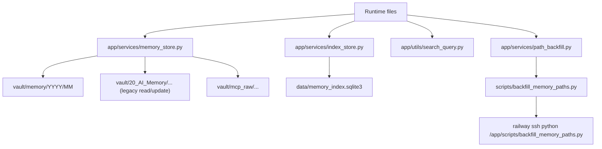
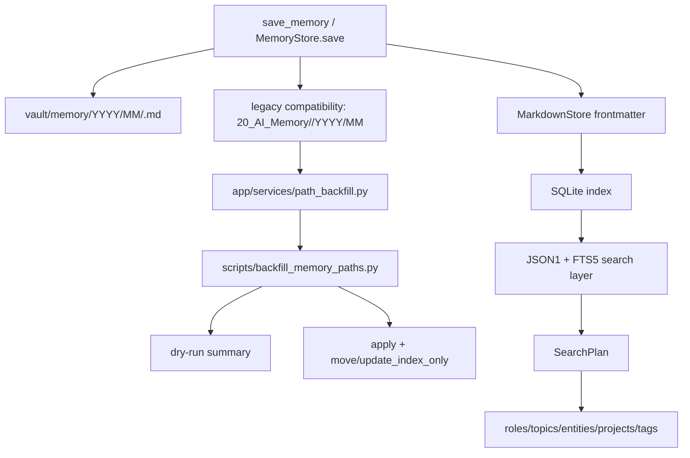

# LAYOUT.md

이 문서는 저장소 루트의 구조와 편집 책임을 빠르게 찾기 위한 안내서다.  
기준은 `AGENTS.md`의 계약을 따른다: 마크다운이 SSOT이고, SQLite는 검색용 파생 인덱스이며, write는 read-first / write-with-intent로 유지한다.

## 루트 개요

- `README.md`: 운영 허브. 설치, 실행, MCP 연결, 현재 상태 요약.
- `changelog.md`: 변경 이력. 작업 단위의 사실 기록.
- `SYSTEM_ARCHITECTURE.md`: 런타임 구조와 계약 설명.
- `LAYOUT.md`: 저장소 구조와 편집 위치 안내.
- `AGENTS.md`, `CLAUDE.md`: 상위 작업 계약과 편집 가드레일.
- `pyproject.toml`: 패키지/테스트/린트 설정.
- `Dockerfile`, `.dockerignore`: Railway hosted preview 런타임 준비물.
- `app/`: 실제 서버 런타임 코드.
- `schemas/`: raw/memory shared JSON Schema.
- `obsidian-memory-plugin/`: local curator plugin subproject.
- `tests/`: 자동 검증.
- `.cursor/`: Cursor rules, skills, subagents, hooks, sample MCP 설정.
- `docs/`: 설치와 작업 보조 문서.
- `docs/reference/`: 제안/참고 문서 아카이브.
- `docs/history/`: 감사/시점 기록 아카이브.
- `examples/`: 비런타임 예시 클라이언트.
- `scripts/`: 로컬 실행, preview seed, live verification 스크립트.
- `obsidian_mcp_delivery_20260328/`: 병합 소스였던 delivery 아카이브.

## 상태 분류

| 경로 | 성격 | 설명 |
| --- | --- | --- |
| `app/` | `runtime` | FastAPI, MCP, 저장소 계층, 유틸의 실제 실행 코드 |
| `schemas/` | `shared-contract` | raw/memory note schema의 단일 기준선 |
| `obsidian-memory-plugin/` | `subproject` | Obsidian local curator plugin scaffold |
| `tests/` | `verification` | 저장/검색/패치/계약 유지 확인 |
| `.cursor/` | `workspace` | Cursor 작업 규칙과 sample MCP 설정 |
| `docs/` | `documentation` | 설치, 작업 방식, 운영 참고 |
| `docs/reference/` | `reference-archive` | 비기준 설계/제안 문서 보관 |
| `docs/history/` | `history-archive` | 시점성 감사/노트 문서 보관 |
| `examples/` | `supporting` | OpenAI / Anthropic 연동 예시 |
| `scripts/` | `runtime-support` | Windows 로컬 설치, 실행, Railway preview seed/verify 스크립트 |
| `Dockerfile`, `.dockerignore` | `deployment-runtime` | Railway hosted preview 컨테이너 정의 |
| `vault/` | `generated/runtime-data` | 로컬 Obsidian vault. 실제 메모 저장소 |
| `data/` | `generated/runtime-data` | SQLite 인덱스와 실행 중 생성 데이터 |
| `.pytest_cache/`, `.ruff_cache/`, `__pycache__/` | `generated` | 테스트/린트/파이썬 캐시 |
| `obsidian_mcp_delivery_20260328/` | `archive` | safe-selective merge의 출처였던 배달 스냅샷 |

## Active / Archive Boundary

활성 작업 대상은 루트의 `app/`, `tests/`, `.cursor/`, `docs/`, `examples/`, `scripts/`, 그리고 핵심 루트 문서다.  
Hybrid redesign 이후에는 `schemas/`와 `obsidian-memory-plugin/`도 active 대상이다.  
`docs/reference/`와 `docs/history/`는 보관 문서 영역이며 canonical root docs를 대체하지 않는다.  
`obsidian_mcp_delivery_20260328/`는 보관용 아카이브로 유지하며, active runtime의 기준으로는 삼지 않는다.  
아카이브 내부에는 중복 사본과 생성 산출물이 섞여 있을 수 있으므로, 새 기능이나 수정의 기준점으로 재사용할 때는 반드시 현재 루트와 대조한다.

## Where To Edit What

| 변경 대상 | 편집 위치 | 비고 |
| --- | --- | --- |
| 사용자 첫 진입 문서 | `README.md` | 운영 허브, 링크 모음, 빠른 시작 |
| 변경 이력 | `changelog.md` | 날짜별 사실 기록 |
| 런타임 구조와 계약 | `SYSTEM_ARCHITECTURE.md` | `/mcp`, `/healthz`, tool contract, data flow |
| 저장소 구조와 역할 | `LAYOUT.md` | 이 문서 |
| 서버 코드 | `app/` | route, MCP, storage, validation |
| shared schema | `schemas/` | raw/memory note contract |
| Obsidian plugin | `obsidian-memory-plugin/` | raw 저장, memory note 저장, index rebuild |
| 검증 | `tests/` | contract regression, storage behavior |
| Cursor 설정 | `.cursor/` | rules, skills, agents, hooks, MCP config |
| 설치/실행 | `scripts/` | Windows bootstrap, local start, ChatGPT/Claude specialist start, sync helpers |
| Railway preview 배포/검증 | `Dockerfile`, `scripts/seed_preview_data.py`, `scripts/verify_mcp_readonly.py`, `docs/RAILWAY_PREVIEW_RUNBOOK.md` | hosted preview 운영 경로 |
| Railway production 배포 | `docs/PRODUCTION_RAILWAY_RUNBOOK.md`, `.env.railway.production.example`, `docs/CHATGPT_MCP.md`, `docs/CLAUDE_MCP.md` | Railway 기준 production 운영 경로와 specialist read-only / authenticated write sibling routes |
| VPS production 배포 | `docs/PRODUCTION_VPS_RUNBOOK.md`, `docs/VPS_EXECUTION_CHECKLIST.md`, `docs/VPS_COMMAND_SHEET.md`, `.env.production.example`, `deploy/` | self-managed alternate 운영 경로 |
| 예시 연동 | `examples/` | OpenAI / Anthropic sample clients |
| 아카이브 참조 | `obsidian_mcp_delivery_20260328/` | 참고용, active target 아님 |

## Repository Layout Diagram

```mermaid
flowchart TD
  Root["Repo root · mcp_obsidian"]

  Root --> App["app/ · runtime"]
  Root --> Schemas["schemas/ · shared contracts"]
  Root --> Plugin["obsidian-memory-plugin/ · local curator"]
  Root --> Tests["tests/ · verification"]
  Root --> Cursor[".cursor/ · workspace config"]
  Root --> Docs["docs/ · support docs"]
  Root --> Ref["docs/reference/ · archived reference docs"]
  Root --> History["docs/history/ · archived history docs"]
  Root --> Examples["examples/ · non-runtime clients"]
  Root --> Scripts["scripts/ · install and start"]
  Root --> Deploy["Dockerfile + .dockerignore · hosted preview runtime"]
  Root --> Vault["vault/ · Markdown SSOT data"]
  Root --> Data["data/ · SQLite index"]
  Root --> Archive["obsidian_mcp_delivery_20260328/ · archive"]

  App --> API["FastAPI + MCP tools"]
  App --> Store["Markdown + SQLite stores"]
  Plugin --> PluginOps["Raw save + memory save + index rebuild"]
  Scripts --> PreviewOps["Seed + verify preview + specialist read/write verify + sync"]
  Deploy --> Railway["Railway container runtime"]
  Ref --> ReferenceDocs["Design / proposal records"]
  History --> HistoryDocs["Audit / dated notes"]
  Archive --> Snapshot["Delivery snapshot only"]
```

## 운영 메모

- 루트 문서는 역할이 겹치지 않게 유지한다.
- 코드 계약이 바뀌면 먼저 `AGENTS.md`와 `SYSTEM_ARCHITECTURE.md`를 갱신하고, 그 다음 `README.md`와 `changelog.md`를 맞춘다.
- `obsidian_mcp_delivery_20260328/`는 보관 상태를 유지한다. active 편집 대상이 아니라서 새 작업의 기준으로 승격하지 않는다.
- Railway preview는 repo 밖의 hosted runtime이지만, 이 저장소 안에서는 `Dockerfile`, `scripts/`, `docs/RAILWAY_PREVIEW_RUNBOOK.md`가 그 운영 지점을 정의한다.
- 현재 active Cursor MCP config는 repo 밖 `C:\Users\jichu\.cursor\mcp.json`에 있다. repo 안 `.cursor/mcp.sample.json`은 예시 보관용이다.

## 2026-03-28 Detailed Runtime Additions

기존 layout 설명을 유지한 채, 최신 구현으로 늘어난 책임만 추가 기록한다.

### 추가된 핵심 runtime 포인트

- `app/services/index_store.py`
  - SQLite `JSON1 + FTS5` 검색 계층
  - metadata array filter + full-text scoring 결합
- `app/utils/search_query.py`
  - `SearchPlan` parser
  - single query string에서 structured filter 추출
- `app/services/path_backfill.py`
  - legacy `20_AI_Memory/...` -> `memory/YYYY/MM/...` migration planner / applier
- `scripts/backfill_memory_paths.py`
  - operator dry-run / apply CLI

### 현재 저장 경로 역할

- current write target:
  - `vault/memory/YYYY/MM/<MEM-ID>.md`
- legacy compatibility:
  - `vault/20_AI_Memory/<memory_type>/YYYY/MM/<MEM-ID>.md`
- raw archive:
  - `vault/mcp_raw/<source>/<YYYY-MM-DD>/<mcp_id>.md`
- derived index:
  - `data/memory_index.sqlite3` 또는 Railway `/data/state/memory_index.sqlite3`

### 운영자 기준 추가 편집 포인트

- path migration 관련 로직:
  - `app/services/path_backfill.py`
  - `scripts/backfill_memory_paths.py`
- hyphenated search regression:
  - `app/services/index_store.py`
  - `tests/test_search_v2.py`
- production migration evidence:
  - `docs/MCP_RUNTIME_EVIDENCE.md`
  - `docs/PRODUCTION_RAILWAY_RUNBOOK.md`
  - `changelog.md`

## v2 Storage and Runtime Layout

v2 migration 이후의 현재 저장/검색/백필 레이아웃은 시간축 경로와 호환 레이어를 함께 유지하는 형태다.  
새 메모리는 `vault/memory/YYYY/MM/<MEM-...>.md` 계열로 취급하고, 기존 `20_AI_Memory/...` 경로는 legacy compatibility/read support 대상으로 남긴다.  
`app/services/path_backfill.py`는 이 legacy 경로를 새 경로로 옮길 후보를 계획하고 적용하는 서비스이며, `scripts/backfill_memory_paths.py`는 운영자가 dry-run/apply를 선택해서 실행하는 오퍼레이터 스크립트다.

### Storage Paths

- current time-axis write target: `memory/YYYY/MM`
- legacy compatibility path: `20_AI_Memory/<memory_type>/YYYY/MM`
- raw archive path: `mcp_raw/YYYY/MM`
- SQLite index path: `vault/system/` 또는 configured `INDEX_DB_PATH`

### Search Layer

검색은 단순 문자열 비교가 아니라 JSON1 + FTS5 기반 인덱스 계층 위에서 동작한다.  
`app/services/index_store.py`는 SQLite JSON1 support와 FTS5 support를 전제로 하며, full-text search와 metadata facet filtering을 같이 처리한다.

- full-text input: title/content
- metadata facets: `roles[]`, `topics[]`, `entities[]`, `projects[]`, `tags[]`
- query planning: `SearchPlan`
- parser entrypoint: `app/utils/search_query.py`

`SearchPlan`은 raw query를 정규화한 뒤 `text_terms`, `roles`, `topics`, `entities`, `projects`, `tags`, `status`, `after`, `before`, `limit`으로 분해한다.  
이렇게 분해된 계획은 wrapper compatibility를 유지하면서도 구조화된 v2 검색 필터로 전달된다.

### Path Backfill

`path_backfill` 계층은 legacy note path를 새 time-axis path로 옮기거나, 파일 이동 없이 index path만 갱신해야 하는 경우를 구분한다.

- `plan_memory_path_backfill(vault_path, db_path, memory_ids=None)`:
  - legacy row를 스캔하고 `move`, `update_index_only`, `conflict`, `missing` 후보를 계산한다.
- `apply_memory_path_backfill(vault_path, db_path, apply=False, memory_ids=None)`:
  - dry-run summary 또는 실제 이동 + index update를 수행한다.
- `scripts/backfill_memory_paths.py`:
  - `--apply` 없으면 dry-run
  - `--memory-id` 반복 지정 가능
  - `--vault-path`, `--db-path` override 가능

### Mermaid Overview

### Current Production Migration Status

- production path migration has been applied on the live Railway deployment referenced in the runtime evidence
- backfill summary after apply reported `moved: 18` and then a dry run returned `candidate_count: 0`
- specialist read/write rechecks passed after the path migration
- legacy `20_AI_Memory/...` remains supported for compatibility while the runtime continues to resolve migrated records through `memory/YYYY/MM`
- current status is therefore: cutover active for migrated production records, with legacy compatibility retained and no remaining backfill candidates in the recorded production run
