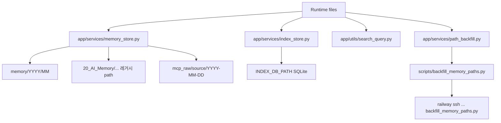
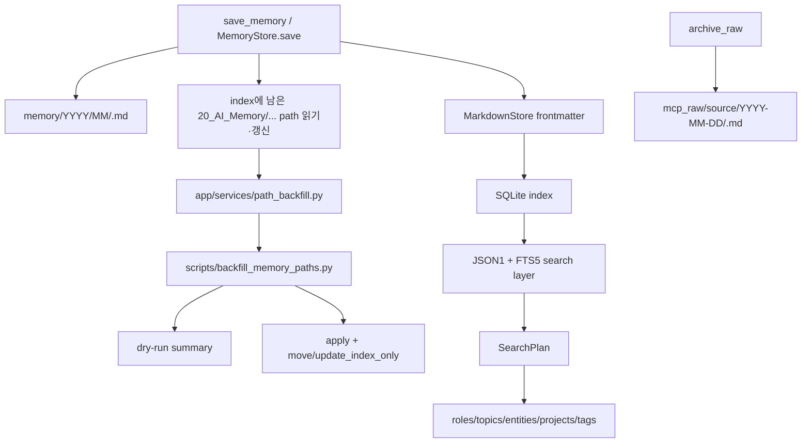
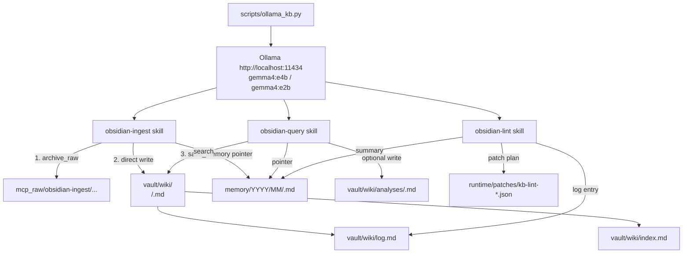
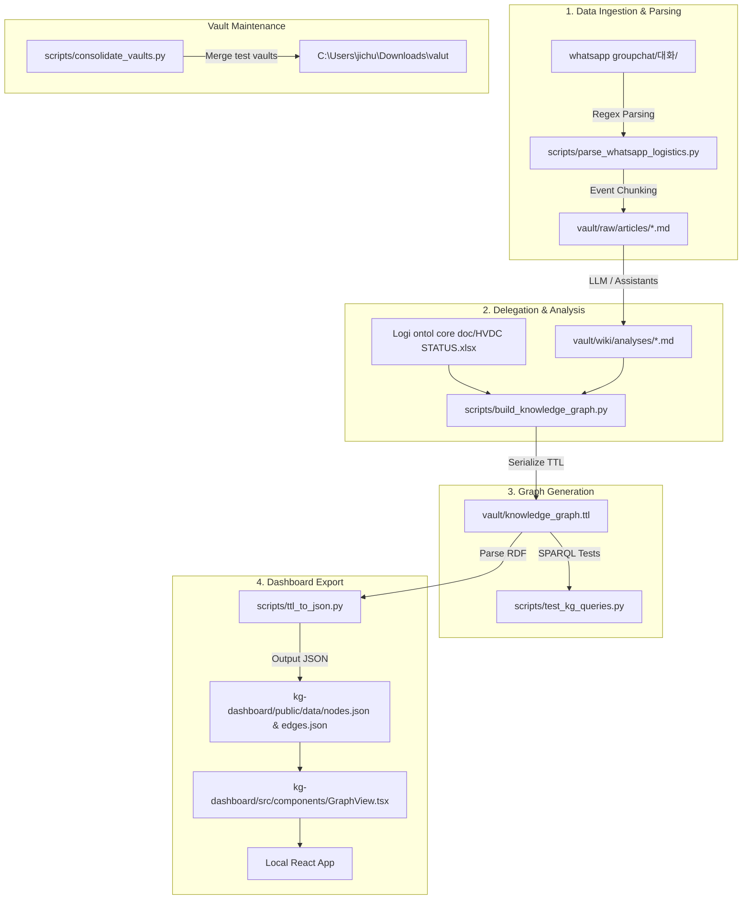

# LAYOUT.md

> ⚠️ **CRITICAL WARNING / 중요 경고** ⚠️
> **모든 작업 및 데이터는 반드시 아래 Vault 경로를 사용해야 합니다:**
> `C:\Users\jichu\Downloads\valut`

이 문서는 저장소 루트의 구조와 편집 책임을 빠르게 찾기 위한 안내서다.  
기준은 `AGENTS.md`의 계약을 따른다: 마크다운이 SSOT이고, SQLite는 검색용 파생 인덱스이며, write는 read-first / write-with-intent로 유지한다.

## 루트 개요

## Root Overview (English)

This repository contains a hybrid memory system for coding agents with the following structure:
- `app/` — FastAPI + FastMCP MCP server runtime
- `local-rag/` — Workspace-local companion retrieval/generation copy used for verification, not owned by this repo
- `myagent-copilot-kit/standalone-package/` — Workspace-local companion app copy used for verification, not owned by this repo
- `kg-dashboard/` — Vite + React Knowledge Graph visualization
- `vault/wiki/` — Compiled wiki overlay and direct file writes for durable KB notes
- `vault/memory/` — MCP-managed memory pointers
- `vault/mcp_raw/` — Immutable raw conversation archives
- `vault/raw/` — Immutable source copies (articles, PDFs, notes)

The root-level docs (`README.md`, `changelog.md`, `Spec.md`, `SYSTEM_ARCHITECTURE.md`, `LAYOUT.md`, `AGENTS.md`, `CLAUDE.md`) define contracts and operations. Markdown is the source of truth; SQLite is a rebuildable search index.

- `README.md`: 운영 허브. 설치, 실행, MCP 연결, 현재 상태 요약.
- `changelog.md`: 변경 이력. 작업 단위의 사실 기록.
- `Spec.md`: 현재 승인된 운영 계약과 companion boundary.
- `SYSTEM_ARCHITECTURE.md`: 런타임 구조와 계약 설명.
- `LAYOUT.md`: 저장소 구조와 편집 위치 안내.
- `AGENTS.md`, `CLAUDE.md`: 상위 작업 계약과 편집 가드레일.
- `pyproject.toml`: 패키지/테스트/린트 설정. `requests>=2.32` 포함 (Ollama KB adapter 의존성).
- `Dockerfile`, `.dockerignore`: Railway hosted preview 런타임 준비물.
- `app/`: 실제 서버 런타임 코드.
- `schemas/`: raw/memory shared JSON Schema.
- `obsidian-memory-plugin/`: local curator plugin subproject.
- `tests/`: 자동 검증.
- `.cursor/`: Cursor rules, skills, subagents, hooks, sample MCP 설정.
- `docs/`: 설치와 작업 보조 문서.
- `docs/LOCAL_RAG_STANDALONE_GUIDE.md`: Windows 로컬 스택 기동, 브라우저 확인, 복구 순서.
- `docs/superpowers/specs/`: 승인된 설계/implementation-ready spec 보관. 현재는 sibling `local-rag` cache/guard spec 포함.
- `docs/reference/`: 제안/참고 문서 아카이브.
- `docs/history/`: 감사/시점 기록 아카이브.
- `examples/`: 비런타임 예시 클라이언트.
- `scripts/`: 로컬 실행, preview seed, live verification, Ollama KB adapter 스크립트.
- `local-rag/`: workspace-local companion retrieval/generation verification copy. 이 repo가 소유하는 runtime code로 가정하지 않음.
- `myagent-copilot-kit/standalone-package/`: workspace-local companion app verification copy. 이 repo가 소유하는 runtime code로 가정하지 않음.
- `vault/wiki/`: compiled wiki overlay와 direct file writes 대상. MCP tool 경유 아님.
- `runtime/`: 운영 산출물(패치 플랜, 감사 로그). vault 바깥.
- `obsidian_mcp_delivery_20260328/`: 병합 소스였던 delivery 아카이브.

## 상태 분류

## State Classification (English)

This section classifies all paths in the repository by their character and role.

| Path | Character | Description |
| --- | --- | --- |
| `app/` | `runtime` | FastAPI, MCP, storage, utilities — actual execution code |
| `schemas/` | `shared-contract` | Single source of truth for raw/memory note schemas |
| `obsidian-memory-plugin/` | `subproject` | Obsidian local curator plugin scaffold |
| `tests/` | `verification` | Contract regression and storage behavior tests |
| `.cursor/` | `workspace` | Cursor rules, skills, agents, hooks, and sample MCP config |
| `docs/` | `documentation` | Installation, operations, and reference docs |
| `local-rag/` | `companion-runtime-reference` | Workspace-local companion retrieval/generation copy for verification only; not repo-owned runtime code |
| `myagent-copilot-kit/standalone-package/` | `companion-runtime-reference` | Workspace-local companion app copy for verification only; not repo-owned runtime code |
| `kg-dashboard/` | `subproject` | Vite + React app for Knowledge Graph visualization |
| `scripts/build_dashboard_graph_data.py` | `runtime-support` | Canonical dashboard export entrypoint for graph data and audit generation |
| `scripts/build_knowledge_graph.py` | `runtime-support` | Legacy wrapper that delegates to the canonical dashboard export path |
| `vault/` | `generated/runtime-data` | Local Obsidian vault — actual memory storage |
| `vault/knowledge_graph.ttl` | `generated/runtime-data` | Turtle (TTL) output of the generated knowledge graph |
| `vault/wiki/` | `kb-canonical` | Compiled wiki overlay / KB canonical surface with `sources/`, `concepts/`, `entities/`, `analyses/` |
| `vault/wiki/analyses/` | `kb-canonical` | KB canonical notes for analyses and query outputs |
| `vault/raw/` | `immutable-source` | Immutable source layer — `articles/`, `pdf/`, `notes/`, never modified |
| `runtime/` | `generated/operational` | Operational byproducts (patch plans, audit logs) outside vault |
| `data/` | `generated/runtime-data` | SQLite index and runtime-generated data |

| 경로 | 성격 | 설명 |
| --- | --- | --- |
| `app/` | `runtime` | FastAPI, MCP, 저장소 계층, 유틸의 실제 실행 코드 |
| `schemas/` | `shared-contract` | raw/memory note schema의 단일 기준선 |
| `obsidian-memory-plugin/` | `subproject` | Obsidian local curator plugin scaffold |
| `tests/` | `verification` | 저장/검색/패치/계약 유지 확인 |
| `.cursor/` | `workspace` | Cursor 작업 규칙과 sample MCP 설정 |
| `docs/` | `documentation` | 설치, 작업 방식, 운영 참고 |
| `docs/LOCAL_RAG_STANDALONE_GUIDE.md` | `documentation` | Windows 로컬 스택 실행, health 확인, 브라우저 사용, 복구 순서 |
| `docs/reference/` | `reference-archive` | 비기준 설계/제안 문서 보관 |
| `docs/history/` | `history-archive` | 시점성 감사/노트 문서 보관 |
| `docs/superpowers/specs/2026-04-08-local-rag-retrieval-benchmark.md` | `documentation` | local-rag lexical retrieval benchmark와 rerank 보류 판단 근거 |
| `docs/storage-routing.md` | `documentation` | KB 4계층 라우팅 규칙 + Mermaid 다이어그램 + 포인터 템플릿 |
| `docs/web-clipping-setup.md` | `documentation` | Obsidian Web Clipper 설정, YouTube 대본, PDF 처리 가이드 |
| `examples/` | `supporting` | OpenAI / Anthropic 연동 예시 |
| `scripts/` | `runtime-support` | Windows 로컬 설치, 실행, Railway preview seed/verify 스크립트, Ollama KB 어댑터, e2e 테스트 스크립트 (`test_phase2_ingest.py`, `test_phase3_query.py`, `test_phase4_lint.py`) |
| `local-rag/` | `companion-runtime-reference` | 현재 작업 트리에 존재하는 local retrieval/generation 검증용 사본. 이 repo가 소유하는 runtime code로 보지 않음 |
| `myagent-copilot-kit/standalone-package/` | `companion-runtime-reference` | 현재 작업 트리에 존재하는 standalone app 검증용 사본. 이 repo가 소유하는 runtime code로 보지 않음 |
| `kg-dashboard/` | `subproject` | Knowledge Graph 시각화를 위한 Vite + React 앱 |
| `scripts/build_dashboard_graph_data.py` | `runtime-support` | 그래프 데이터와 audit를 생성하는 canonical dashboard export 진입점 |
| `scripts/build_knowledge_graph.py` | `runtime-support` | canonical dashboard export를 호출하는 legacy wrapper |
| `Dockerfile`, `.dockerignore` | `deployment-runtime` | Railway hosted preview 컨테이너 정의 |
| `vault/` | `generated/runtime-data` | 로컬 Obsidian vault. 실제 메모 저장소 |
| `vault/knowledge_graph.ttl` | `generated/runtime-data` | 생성된 지식 그래프의 Turtle (TTL) 출력 결과물 |
| `vault/wiki/` | `kb-canonical` | Compiled wiki overlay / KB canonical surface (직접 파일 쓰기). `sources/`, `concepts/`, `entities/`, `analyses/` 포함 |
| `vault/wiki/analyses/` | `kb-canonical` | 쿼리 출력과 분석을 위한 KB canonical 노트 |
| `vault/raw/` | `immutable-source` | 불변 원본 레이어. `articles/`, `pdf/`, `notes/`. `obsidian-ingest`가 복사, 수정 금지 |
| `runtime/` | `generated/operational` | 운영 산출물. `patches/` (lint 패치 플랜), `audits/` (감사 로그). vault 바깥 |
| `data/` | `generated/runtime-data` | SQLite 인덱스와 실행 중 생성 데이터 |
| `.pytest_cache/`, `.ruff_cache/`, `__pycache__/` | `generated` | 테스트/린트/파이썬 캐시 |
| `obsidian_mcp_delivery_20260328/` | `archive` | safe-selective merge의 출처였던 배달 스냅샷 |
| `.venv/` | `generated` | Python 가상환경 (2026-04-07 로컬 생성, fastmcp/uvicorn/fastapi 포함) |

## Active / Archive Boundary

## Active / Archive Boundary (English)

Active work targets the root-level `app/`, `tests/`, `.cursor/`, `docs/`, `examples/`, `scripts/`, `schemas/`, `obsidian-memory-plugin/`, and core root documents.

`docs/reference/` and `docs/history/` are archive areas and do not supersede canonical root docs.  
`obsidian_mcp_delivery_20260328/` remains as a keep archive and is not treated as the active runtime baseline.

활성 작업 대상은 루트의 `app/`, `tests/`, `.cursor/`, `docs/`, `examples/`, `scripts/`, `schemas/`, `obsidian-memory-plugin/`, 그리고 핵심 루트 문서다.
현재 기준에서도 `schemas/`와 `obsidian-memory-plugin/`은 active 대상이다.
`docs/reference/`와 `docs/history/`는 보관 문서 영역이며 canonical root docs를 대체하지 않는다.  
`obsidian_mcp_delivery_20260328/`는 보관용 아카이브로 유지하며, active runtime의 기준으로는 삼지 않는다.  
아카이브 내부에는 중복 사본과 생성 산출물이 섞여 있을 수 있으므로, 새 기능이나 수정의 기준점으로 재사용할 때는 반드시 현재 루트와 대조한다.

## Where To Edit What

## Where To Edit What (English)

| Target | Location | Notes |
| --- | --- | --- |
| User first-read | `README.md` | Operations hub, links, quick start |
| Changelog | `changelog.md` | Dated fact log |
| Runtime architecture | `SYSTEM_ARCHITECTURE.md` | `/mcp`, `/healthz`, tool contract, data flow |
| Repository structure | `LAYOUT.md` | This file |
| Server code | `app/` | Routes, MCP, storage, validation |
| Shared schema | `schemas/` | raw/memory note contract |
| Obsidian plugin | `obsidian-memory-plugin/` | Raw save, memory save, index rebuild |
| Verification | `tests/` | Contract regression, storage behavior |
| Cursor config | `.cursor/` | Rules, skills, agents, hooks, MCP config |
| Installation/run | `scripts/` | Windows bootstrap, local start, specialist start, verification round, sync helpers |
| WhatsApp Parsing | `scripts/parse_whatsapp_logistics.py` | Batch processing chat logs into `vault/raw/articles/` |
| Knowledge Graph UI | `kg-dashboard/` | Vite + React components and styling |
| Knowledge Graph Build | `scripts/build_dashboard_graph_data.py` | Canonical graph extraction, JSON export, and audit generation |
| Legacy graph wrappers | `scripts/build_knowledge_graph.py`, `scripts/ttl_to_json.py` | Compatibility wrappers around the canonical export path |
| KG SPARQL Tests | `scripts/test_kg_queries.py` | SPARQL validations on generated Knowledge Graph |
| Vault Consolidation | `scripts/consolidate_vaults.py` | Merges multiple test vaults |
| KB canonical writes | `vault/wiki/` | Direct file writes, not via MCP tools |
| Wiki overlay runtime surface | `app/services/wiki_search_service.py`, `app/resources_server.py`, `app/prompts_server.py`, `app/wiki_tools.py`, `app/services/wiki_store.py`, `app/services/wiki_index_service.py`, `app/services/wiki_log_service.py`, `app/services/conflict_service.py`, `app/services/lint_service.py` | Compiled wiki overlay read/search resources, prompts, and write tools |
| Specialist readonly verification | `scripts/verify_chatgpt_mcp_readonly.py`, `scripts/verify_claude_mcp_readonly.py`, `scripts/mcp_local_tool_smoke.py` | Live read-only tool-surface verification for ChatGPT/Claude mounts |
| Specialist write verification | `scripts/verify_specialist_mcp_write.py`, `scripts/run_mcp_verification_round.ps1` | Live write-capable tool-surface verification for specialist sibling routes |
| KB operational byproducts | `runtime/patches/`, `runtime/audits/` | Lint patch plan JSON, audit logs, outside vault |
| KB Cursor rules | `.cursor/rules/kb-core.mdc` | KB routing + LLM runtime policy |
| KB Cursor skills | `.cursor/skills/obsidian-ingest/`, `obsidian-query/`, `obsidian-lint/` | Gemma 4-based KB workflows |
| Companion runtime boundary | `Spec.md`, `SYSTEM_ARCHITECTURE.md`, `docs/superpowers/specs/` | `local-rag` and `standalone-package` are workspace-local verification copies with separate ownership; this repo records integration facts only |
| local-rag reference | `local-rag/` | Workspace-local companion copy for health and retrieval verification only |
| standalone reference | `myagent-copilot-kit/standalone-package/` | Workspace-local companion copy for `docs-browser.ts`, `server.ts`, and memory bridge verification only |

| 변경 대상 | 편집 위치 | 비고 |
| --- | --- | --- |
| 사용자 첫 진입 문서 | `README.md` | 운영 허브, 링크 모음, 빠른 시작 |
| 변경 이력 | `changelog.md` | 날짜별 사실 기록 |
| 런타임 구조와 계약 | `SYSTEM_ARCHITECTURE.md` | `/mcp`, `/healthz`, tool contract, data flow |
| 저장소 구조와 역할 | `LAYOUT.md` | 이 문서 |
| 서버 코드 | `app/` | route, MCP, storage, validation |
| shared schema | `schemas/` | raw/memory note contract |
| Obsidian plugin | `obsidian-memory-plugin/` | raw 저장, memory note 저장, index rebuild |
| 검증 | `tests/` | contract regression, storage behavior |
| Cursor 설정 | `.cursor/` | rules, skills, agents, hooks, MCP config |
| 설치/실행 | `scripts/` | Windows bootstrap, local start, ChatGPT/Claude specialist start, verification rounds, sync helpers |
| local stack quickstart guide | `docs/LOCAL_RAG_STANDALONE_GUIDE.md` | 4개 서비스 기동, health, 브라우저 사용, 복구 순서 |
| Ollama KB adapter | `scripts/ollama_kb.py` | 3개 KB 스킬 공용 Ollama 호출 모듈 |
| WhatsApp Parsing | `scripts/parse_whatsapp_logistics.py` | WhatsApp 대화 로그를 일괄 추출하여 `vault/raw/articles/`로 저장 |
| Knowledge Graph UI | `kg-dashboard/` | Vite + React 컴포넌트 및 스타일링 |
| Knowledge Graph Build | `scripts/build_dashboard_graph_data.py` | canonical 그래프 추출, JSON export, audit 생성 |
| Legacy graph wrappers | `scripts/build_knowledge_graph.py`, `scripts/ttl_to_json.py` | canonical export를 감싸는 호환 wrapper |
| KG SPARQL Tests | `scripts/test_kg_queries.py` | 생성된 지식 그래프에 대한 SPARQL 쿼리 검증 |
| Vault Consolidation | `scripts/consolidate_vaults.py` | 여러 테스트/소스 vault 병합 |
| companion runtime boundary | `Spec.md`, `README.md`, `SYSTEM_ARCHITECTURE.md`, `docs/superpowers/specs/2026-04-08-local-rag-cache-and-guard-design.md` | sibling `local-rag`, `standalone-package`는 이 저장소 밖에서 운영. 여기서는 guarded readiness, local route 기본 모델, MCP bridge fact만 추적 |
| local-rag runtime reference | `local-rag/` | workspace-local companion 사본. health, retrieval, cache behavior 확인용 |
| standalone runtime reference | `myagent-copilot-kit/standalone-package/` | workspace-local companion 사본. `docs-browser.ts`, `server.ts`, memory bridge, local route 확인용 |
| KB canonical 쓰기 | `vault/wiki/` | 직접 파일 쓰기. MCP tool 미경유. `obsidian-ingest` 스킬이 관리 |
| Wiki overlay runtime surface | `app/services/wiki_search_service.py`, `app/resources_server.py`, `app/prompts_server.py`, `app/wiki_tools.py`, `app/services/wiki_store.py`, `app/services/wiki_index_service.py`, `app/services/wiki_log_service.py`, `app/services/conflict_service.py`, `app/services/lint_service.py` | compiled wiki overlay read/search resources, prompts, and tools |
| Specialist readonly verification | `scripts/verify_chatgpt_mcp_readonly.py`, `scripts/verify_claude_mcp_readonly.py`, `scripts/mcp_local_tool_smoke.py` | ChatGPT/Claude read-only MCP verification and smoke checks |
| Specialist write verification | `scripts/verify_specialist_mcp_write.py`, `scripts/run_mcp_verification_round.ps1` | main/specialist MCP write verification |
| KB 운영 산출물 | `runtime/patches/`, `runtime/audits/` | lint 패치 플랜 JSON, 감사 로그. vault 바깥 |
| KB Cursor 규칙 | `.cursor/rules/kb-core.mdc` | KB 라우팅 + LLM 런타임 정책 |
| KB Cursor 스킬 | `.cursor/skills/obsidian-ingest/`, `obsidian-query/`, `obsidian-lint/` | Gemma 4 기반 KB ingest / query / lint 워크플로우 |
| Railway preview 배포/검증 | `Dockerfile`, `scripts/seed_preview_data.py`, `scripts/verify_mcp_readonly.py`, `docs/RAILWAY_PREVIEW_RUNBOOK.md` | hosted preview 운영 경로 |
| Railway production 배포 | `docs/PRODUCTION_RAILWAY_RUNBOOK.md`, `.env.railway.production.example`, `docs/CHATGPT_MCP.md`, `docs/CLAUDE_MCP.md` | Railway 기준 production 운영 경로와 specialist read-only / authenticated write sibling routes |
| VPS production 배포 | `docs/PRODUCTION_VPS_RUNBOOK.md`, `docs/VPS_EXECUTION_CHECKLIST.md`, `docs/VPS_COMMAND_SHEET.md`, `.env.production.example`, `deploy/` | self-managed alternate 운영 경로 |
| 예시 연동 | `examples/` | OpenAI / Anthropic sample clients |
| 아카이브 참조 | `obsidian_mcp_delivery_20260328/` | 참고용, active target 아님 |

## Repository Layout Diagram

```mermaid
flowchart TD
  Root["Repo root · mcp_obsidian"]

  Root --> App["app/ · runtime"]
  Root --> Schemas["schemas/ · shared contracts"]
  Root --> Plugin["obsidian-memory-plugin/ · local curator"]
  Root --> Tests["tests/ · verification"]
  Root --> Cursor[".cursor/ · workspace config"]
  Root --> Docs["docs/ · support docs"]
  Root --> Ref["docs/reference/ · archived reference docs"]
  Root --> History["docs/history/ · archived history docs"]
  Root --> Examples["examples/ · non-runtime clients"]
  Root --> Scripts["scripts/ · install, run, verify"]
  Root --> KGDashboard["kg-dashboard/ · Vite+React visualization"]
  Root --> Deploy["Dockerfile + .dockerignore · hosted preview runtime"]
  Root --> Vault["vault/ · Markdown SSOT data"]
  Root --> Wiki["vault/wiki/ · compiled wiki overlay / KB canonical surface"]
  Root --> Runtime["runtime/ · operational byproducts"]
  Root --> Data["data/ · SQLite index"]
  Root --> Archive["obsidian_mcp_delivery_20260328/ · archive"]

  App --> API["FastAPI + MCP tools"]
  App --> Store["Markdown + SQLite stores"]
  Plugin --> PluginOps["Raw save + memory save + index rebuild"]
  Scripts --> PreviewOps["Seed + verify preview + specialist read/write verify + sync"]
  Deploy --> Railway["Railway container runtime"]
  Ref --> ReferenceDocs["Design / proposal records"]
  History --> HistoryDocs["Audit / dated notes"]
  Archive --> Snapshot["Delivery snapshot only"]
```



## Repository Layout Diagram (English)

The mermaid diagram above shows the top-level repository structure:
- **Root**: `mcp_obsidian` repo root
- **Runtime layer**: `app/` (FastAPI + MCP), `schemas/` (contracts), `tests/`, `scripts/`
- **Workspace config**: `.cursor/` (rules, skills, agents, MCP config)
- **Documentation**: `docs/`, `docs/reference/`, `docs/history/`
- **Deployment**: `Dockerfile` + `.dockerignore` for Railway preview container
- **Data layer**: `vault/` (Markdown SSOT), `data/` (SQLite index), `runtime/` (operational byproducts)
- **Companion runtimes**: `local-rag/` and `myagent-copilot-kit/standalone-package/` are workspace-local copies only

## 운영 메모

## Operating Notes (English)

- Keep root documents with non-overlapping roles.
- When code contracts change, update `AGENTS.md` and `SYSTEM_ARCHITECTURE.md` first, then align `README.md` and `changelog.md`.
- `obsidian_mcp_delivery_20260328/` remains as an archive; do not promote it to active work baseline.
- Railway preview is hosted runtime outside the repo, but `Dockerfile`, `scripts/`, and `docs/RAILWAY_PREVIEW_RUNBOOK.md` define its operations from within this repo.
- The recommended active Cursor MCP config is `.cursor/mcp.json`. `.cursor/mcp.sample.json` is an installer seed example.
- `vault/wiki/` is exclusively for long-term KB canonical content. Do not mix roles with `memory/` or `mcp_raw/`.
- `runtime/` is exclusively for operational byproducts outside the vault. Do not expose this path in vault-based MCP contracts.
- `/chatgpt-mcp` and `/claude-mcp` read-only mounts have no bearer auth. In production, restrict at the network/proxy layer or add a dedicated read token (auth changes require `AGENTS.md` approval gate).
- current production PASS evidence for readonly/write parity belongs in `docs/MCP_RUNTIME_EVIDENCE.md`. Root docs should summarize that result, not restate pre-redeploy failure as the current state.
- `local-rag` and `standalone-package` are workspace-local verification copies. They are useful for local verification but are NOT owned by this repo.
- The `local-rag/` and `myagent-copilot-kit/standalone-package/` copies exist in the current local workspace. Treat them as reference runtimes, not as tracked repo ownership.
- companion route defaults and bridge mounts belong in the companion project docs and verification scripts; this layout file only records the integration boundary.
- The compiled wiki overlay root is controlled by `WIKI_OVERLAY_DIRNAME` in `app/config.py`. The current default is `wiki`.
- Companion facts include guarded `chat-local` readiness, `MYAGENT_LOCAL_RAG_TOKEN` propagation, non-loopback auth fail-fast, and local route default model `gemma4:e4b` auto-mapping.

- 루트 문서는 역할이 겹치지 않게 유지한다.
- 코드 계약이 바뀌면 먼저 `AGENTS.md`와 `SYSTEM_ARCHITECTURE.md`를 갱신하고, 그 다음 `README.md`와 `changelog.md`를 맞춘다.
- `obsidian_mcp_delivery_20260328/`는 보관 상태를 유지한다. active 편집 대상이 아니라서 새 작업의 기준으로 승격하지 않는다.
- Railway preview는 repo 밖의 hosted runtime이지만, 이 저장소 안에서는 `Dockerfile`, `scripts/`, `docs/RAILWAY_PREVIEW_RUNBOOK.md`가 그 운영 지점을 정의한다.
- 현재 권장 active Cursor MCP config는 repo 안 `.cursor/mcp.json`이다. `.cursor/mcp.sample.json`은 installer seed용 예시 보관본이다.
- `vault/wiki/`는 장기 KB canonical 전용이다. `memory/`나 `mcp_raw/`와 역할을 섞지 않는다.
- `runtime/`은 vault 바깥의 운영 산출물 전용이다. 이 경로를 vault 기반 MCP 계약에 노출하지 않는다.
- `/chatgpt-mcp`, `/claude-mcp` read-only 마운트는 bearer 인증 없음. 프로덕션에서 Railway 네트워크 레이어나 프록시로 차단하거나, 전용 read token을 추가할 것 (인증 변경은 `AGENTS.md` 승인 게이트 적용).
- sibling `local-rag` / `standalone-package`는 이 repo가 소유하는 runtime code가 아니므로, 현재 루트 문서에서는 **boundary와 integration fact만** 기록하고 runtime 구현은 companion project 기준으로 확인한다.
- current local workspace에는 `local-rag/`와 `myagent-copilot-kit/standalone-package/` 사본이 함께 존재한다. 이 사본은 로컬 검증에는 쓸 수 있지만, tracked repo ownership과 동일하다고 단정하지 않는다.
- companion route defaults and bridge mounts are verified in the companion project docs and verification scripts, not duplicated here.
- compiled wiki overlay root는 `app/config.py`의 `WIKI_OVERLAY_DIRNAME`으로 바뀔 수 있고, 현재 기본값은 `wiki`다.
- 현재 companion fact에는 guarded `chat-local` readiness, `MYAGENT_LOCAL_RAG_TOKEN` 전달, non-loopback auth fail-fast, local route 기본 모델 `gemma4:e4b` 자동 매핑이 포함된다.

## 2026-03-28 Detailed Runtime Additions

## 2026-03-28 Detailed Runtime Additions (English)

Keeping existing layout description, only newly added responsibilities from the latest implementation are recorded here.

### Core Runtime Points Added

- `app/services/index_store.py` — SQLite `JSON1 + FTS5` search layer combining metadata array filters with full-text scoring
- `app/utils/search_query.py` — `SearchPlan` parser extracting structured filters from single query strings
- `app/services/path_backfill.py` — Legacy `20_AI_Memory/...` → `memory/<YYYY>/<MM>/...` migration planner and applier
- `scripts/backfill_memory_paths.py` — Operator dry-run / apply CLI
- `app/mcp_server.py` — Unified MCP with `archive_raw` (raw transcript → `mcp_raw/...`)
- `app/services/wiki_store.py`, `app/services/wiki_index_service.py`, `app/services/wiki_log_service.py` — compiled wiki overlay storage, index, and log helpers
- `app/resources_server.py`, `app/prompts_server.py` — wiki overlay resources and prompts
- `app/wiki_tools.py`, `app/services/conflict_service.py`, `app/services/lint_service.py` — wiki overlay write tools and report generation
- `scripts/verify_specialist_mcp_write.py`, `scripts/run_mcp_verification_round.ps1`, `scripts/mcp_local_tool_smoke.py` — specialist write verification and smoke checks

기존 layout 설명을 유지한 채, 최신 구현으로 늘어난 책임만 추가 기록한다.

### 추가된 핵심 runtime 포인트

- `app/services/index_store.py`
  - SQLite `JSON1 + FTS5` 검색 계층
  - metadata array filter + full-text scoring 결합
- `app/utils/search_query.py`
  - `SearchPlan` parser
  - single query string에서 structured filter 추출
- `app/services/wiki_store.py`, `app/services/wiki_index_service.py`, `app/services/wiki_log_service.py`
  - compiled wiki overlay storage, index, and log helpers
- `app/services/wiki_search_service.py`
  - `wiki/analyses` 전용 read-only search/fetch surface
- `app/resources_server.py`, `app/prompts_server.py`
  - wiki overlay resources and prompts
- `app/wiki_tools.py`, `app/services/conflict_service.py`, `app/services/lint_service.py`
  - wiki overlay write tools and report generation
- `scripts/verify_chatgpt_mcp_readonly.py`, `scripts/verify_claude_mcp_readonly.py`, `scripts/mcp_local_tool_smoke.py`
  - specialist read-only verification and smoke checks
- `scripts/verify_specialist_mcp_write.py`, `scripts/run_mcp_verification_round.ps1`
  - specialist write verification
- `app/services/path_backfill.py`
  - legacy `20_AI_Memory/...` -> `memory/<YYYY>/<MM>/...` migration planner / applier
- `scripts/backfill_memory_paths.py`
  - operator dry-run / apply CLI
- `app/mcp_server.py`
  - 통합 MCP: `archive_raw` (raw transcript → `mcp_raw/...`)

### 현재 저장 경로 역할 (`AGENTS.md` · 코드 기준)

- **memory 쓰기:** `memory/<YYYY>/<MM>/<MEM-ID>.md` (`MemoryStore._memory_rel_path`)
- **memory 레거시:** 인덱스에 남아 있으면 `20_AI_Memory/...` 경로도 읽기·갱신 가능 (`path_backfill`으로 `memory/...`로 이전 가능)
- **raw 아카이브:** `mcp_raw/<source>/<YYYY-MM-DD>/<mcp_id>.md` (`RawArchiveStore`; MCP `archive_raw`)
- **데일리:** `10_Daily/<YYYY-MM-DD>.md` (선택 append)
- **인덱스:** 환경 `INDEX_DB_PATH` (예: 로컬 `data/memory_index.sqlite3`, Railway `/data/state/memory_index.sqlite3`). vault의 `90_System/`과 혼동 금지.
- later runtime updates in this repo added the wiki overlay surface in `app/` and the specialist verification scripts in `scripts/`; treat the paragraph above as the memory path migration snapshot, not the full current runtime surface



### 운영자 기준 추가 편집 포인트

- path migration 관련 로직:
  - `app/services/path_backfill.py`
  - `scripts/backfill_memory_paths.py`
- hyphenated search regression:
  - `app/services/index_store.py`
  - `tests/test_search_v2.py`
- production migration evidence:
  - `docs/MCP_RUNTIME_EVIDENCE.md`
  - `docs/PRODUCTION_RAILWAY_RUNBOOK.md`
  - `changelog.md`

## v2 Storage and Runtime Layout

## v2 Storage and Runtime Layout (English)

v2 layout: **new memory writes** go to `memory/<YYYY>/<MM>/<MEM-...>.md`. Legacy `20_AI_Memory/...` paths remaining in the DB/index continue to be readable and updatable.  
`app/services/path_backfill.py` + `scripts/backfill_memory_paths.py` are the operators for moving legacy paths to the new time-axis layout.

v2 이후 레이아웃: **신규 memory 쓰기**는 `memory/<YYYY>/<MM>/<MEM-...>.md`이며, DB·인덱스에 남은 **레거시 `20_AI_Memory/...` path**는 계속 읽기·갱신된다.  
`app/services/path_backfill.py` + `scripts/backfill_memory_paths.py`는 레거시 path를 `memory/...`로 옮기는 운영 도구다.

### Storage Paths

- current time-axis write target: `memory/<YYYY>/<MM>`
- legacy compatibility path (stored in index): `20_AI_Memory/<memory_type>/<YYYY>/<MM>` (백필 이전분)
- raw archive path: `mcp_raw/<source>/<YYYY-MM-DD>/<mcp_id>.md`
- SQLite index: `INDEX_DB_PATH` (not `vault/system/` 고정)

### Search Layer

검색은 단순 문자열 비교가 아니라 JSON1 + FTS5 기반 인덱스 계층 위에서 동작한다.  
`app/services/index_store.py`는 SQLite JSON1 support와 FTS5 support를 전제로 하며, full-text search와 metadata facet filtering을 같이 처리한다.

- full-text input: title/content
- metadata facets: `roles[]`, `topics[]`, `entities[]`, `projects[]`, `tags[]`
- query planning: `SearchPlan`
- parser entrypoint: `app/utils/search_query.py`

`SearchPlan`은 raw query를 정규화한 뒤 `text_terms`, `roles`, `topics`, `entities`, `projects`, `tags`, `status`, `after`, `before`, `limit`으로 분해한다.  
이렇게 분해된 계획은 wrapper compatibility를 유지하면서도 구조화된 v2 검색 필터로 전달된다.

### Path Backfill

`path_backfill` 계층은 legacy note path를 새 time-axis path로 옮기거나, 파일 이동 없이 index path만 갱신해야 하는 경우를 구분한다.

- `plan_memory_path_backfill(vault_path, db_path, memory_ids=None)`:
  - legacy row를 스캔하고 `move`, `update_index_only`, `conflict`, `missing` 후보를 계산한다.
- `apply_memory_path_backfill(vault_path, db_path, apply=False, memory_ids=None)`:
  - dry-run summary 또는 실제 이동 + index update를 수행한다.
- `scripts/backfill_memory_paths.py`:
  - `--apply` 없으면 dry-run
  - `--memory-id` 반복 지정 가능
  - `--vault-path`, `--db-path` override 가능

### Mermaid Overview



### Current Production Migration Status

- production path migration has been applied on the live Railway deployment referenced in the runtime evidence
- backfill summary after apply reported `moved: 18` and then a dry run returned `candidate_count: 0`
- specialist read/write rechecks passed after the path migration
- **신규 쓰기**는 `memory/<YYYY>/<MM>/...`이며, 레거시 path 레코드는 인덱스·`get`·`update`로 계속 처리된다
- 위 production run 기준 백필 후보는 0으로 기록됨 (이후 배포는 별도 evidence로 확인)

## 2026-04-07 KB Layer Additions

## 2026-04-07 KB Layer Additions (English)

A local KB layer based on Gemma 4 + Ollama was added. At that snapshot `app/` server code was unmodified; later updates in this repo added the wiki overlay services, resources, prompts, and tools under `app/`.

Gemma 4 + Ollama 기반 로컬 KB 계층이 추가됐다. 해당 시점 기준으로는 `app/` 서버 코드가 무수정이었고, 이후 업데이트에서 wiki overlay 서비스, resources, prompts, tools가 `app/`에 추가되었다.

### 새 경로

| 경로 | 역할 |
|---|---|
| `vault/wiki/` | KB canonical notes. 직접 파일 쓰기 전용. `sources/`, `concepts/`, `entities/`, `analyses/`, `index.md`, `log.md` |
| `vault/raw/` | 불변 원본 레이어. `articles/`, `pdf/`, `notes/`. `obsidian-ingest`가 복사 — 수정 금지 |
| `runtime/patches/` | `obsidian-lint` 패치 플랜 JSON 저장소 |
| `runtime/audits/` | 감사 로그 저장소 |
| `scripts/ollama_kb.py` | 3개 KB 스킬 공용 Ollama adapter. `generate()`, `health_check()`, `available_models()` |
| `app/resources_server.py` | wiki overlay resources surface. `resource://wiki/index`, `resource://wiki/log/recent`, `resource://schema/memory`, `resource://ops/verification/latest`, `resource://ops/routes/profile-matrix` |
| `app/prompts_server.py` | wiki overlay prompts surface. `ingest_memory_to_wiki`, `reconcile_conflict`, `weekly_lint_report`, `summarize_recent_project_state` |
| `app/wiki_tools.py` | wiki overlay write tools. `sync_wiki_index`, `append_wiki_log`, `write_wiki_page`, `lint_wiki`, `reconcile_conflict` |
| `app/services/wiki_store.py`, `app/services/wiki_index_service.py`, `app/services/wiki_log_service.py` | compiled wiki overlay storage, index, and log helpers |

### 새 Cursor 컴포넌트

| 경로 | 역할 |
|---|---|
| `.cursor/rules/kb-core.mdc` | KB 스토리지 라우팅 + LLM 런타임 정책. 항상 적용 규칙 |
| `.cursor/skills/obsidian-ingest/SKILL.md` | 소스 → `vault/wiki/` 변환 + `archive_raw` + `save_memory` 포인터. YAML frontmatter `triggers:` 수정 완료 (2026-04-07) |
| `.cursor/skills/obsidian-query/SKILL.md` | wiki 검색 + Ollama 합성 + `analyses/` 저장 옵션 + `save_memory` 포인터. YAML frontmatter + `candidates` 버그 수정 완료 (2026-04-07) |
| `.cursor/skills/obsidian-lint/SKILL.md` | wiki 감사 + 패치 플랜 + `save_memory` 결과 요약. YAML frontmatter `triggers:` 수정 완료 (2026-04-07) |

### 스토리지 분리 원칙

```
vault/
  memory/      ← 대화 이력, 포인터, daily append (변경 없음)
  mcp_raw/     ← 원문 아카이브 (변경 없음)
  wiki/        ← compiled wiki overlay / KB canonical surface (신규) — memory와 역할 미공유
runtime/       ← 운영 산출물 (vault 바깥)
```

### Mermaid




## 2026-04-10 WhatsApp Pipeline & Knowledge Graph Additions

## 2026-04-10 WhatsApp Pipeline & Knowledge Graph Additions (English)

A comprehensive pipeline has been added to extract logistics events from WhatsApp chats, build a Knowledge Graph (RDF/TTL) combined with Excel tracking data, and serve it via a local React dashboard.

최근 WhatsApp 물류 대화에서 이벤트를 추출하고, Excel 트래킹 데이터와 결합하여 지식 그래프(RDF/TTL)를 빌드한 뒤, 이를 로컬 React 대시보드로 시각화하는 전체 파이프라인이 추가되었다.

### 새 경로 및 파일 상세 (Detailed New Paths & Files)

| Path / File | Character | Role |
|---|---|---|
| `whatsapp groupchat/` | `immutable-source` | Raw WhatsApp chat log exports (`.txt` files). |
| `scripts/parse_whatsapp_logistics.py` | `runtime-support` | Extracts time-bound logistics events from WhatsApp logs and outputs markdown to `vault/raw/articles/`. |
| `vault/raw/articles/*.md` | `immutable-source` | Raw event block archives mapped from WhatsApp chunks. |
| `scripts/build_dashboard_graph_data.py` | `runtime-support` | Canonical exporter. Reads the four HVDC workbooks plus analyses notes, writes dashboard JSON and audit outputs, and optionally emits TTL when requested explicitly. |
| `scripts/build_knowledge_graph.py` | `runtime-support` | Legacy wrapper that forwards to the canonical exporter. |
| `vault/knowledge_graph.ttl` | `generated/runtime-data` | Output Turtle (TTL) file representing the generated Knowledge Graph (ontology). |
| `scripts/test_kg_queries.py` | `runtime-support` | Executes SPARQL validations against the generated `knowledge_graph.ttl`. |
| `scripts/ttl_to_json.py` | `runtime-support` | Legacy wrapper used only when an existing TTL must be rendered again as JSON. |
| `scripts/consolidate_vaults.py` | `runtime-support` | Merges multiple test/source vaults into the canonical target directory. |
| `kg-dashboard/` | `subproject` | Vite + React app for Knowledge Graph visualization. |
| `kg-dashboard/public/data/` | `generated/runtime-data` | Target destination for `nodes.json` and `edges.json` used by the dashboard. Current export also carries `analysisPath` and `analysisVault` metadata for issue/lesson drilldown. |
| `kg-dashboard/src/components/GraphView.tsx` | `runtime` | React Cytoscape graph surface for search-first navigation, ego view focus, and summary-driven selection. |
| `kg-dashboard/src/components/GraphSidebar.tsx` | `runtime` | React sidebar for summary cards, hidden-card counts, and hub/site/warehouse filtering. |
| `kg-dashboard/src/components/NodeInspector.tsx` | `runtime` | React inspector for selected node details and metadata-driven issue/lesson Obsidian note links. |
| `kg-dashboard/src/types/graph.ts` | `shared-contract` | TypeScript definitions for the graph data structures. |
| `kg-dashboard/src/utils/graph-model.ts` | `runtime-support` | Graph data modeling, summary counts, and derived view state including issue-context lesson visibility in `summary`/`issues` and direct lesson retention in `ego`. |

### Dashboard 디렉토리 구조 (Dashboard Directory Structure)

```text
kg-dashboard/src/
├── components/
│   ├── GraphView.tsx      # Core rendering & layout (Cytoscape)
│   ├── GraphSidebar.tsx   # UI controls & filtering panel
│   └── NodeInspector.tsx  # Metadata inspector for selected nodes
├── types/
│   └── graph.ts           # Shared TypeScript interfaces (nodes, edges, state)
└── utils/
    ├── graph-model.ts     # Data transformation & layout logic
    └── graph-model.test.ts# Unit tests for graph logic
```

### 스토리지 분리 (Storage Separation)

- **`whatsapp groupchat/`**: Directory for the original text exports of the chat. Immutable source.
- **`vault/raw/articles/`**: Processed and chunked chat logs as markdown.
- **`vault/wiki/analyses/`**: Repo-local analyses fallback path. Current canonical exporter prefers `C:\Users\jichu\Downloads\valut\wiki\analyses` when present.
- **`vault/knowledge_graph.ttl`**: Optional RDF graph schema and instance data. Current `scripts/build_dashboard_graph_data.py` CLI defaults to JSON/audit regeneration without TTL emission unless `ttl_path` is passed explicitly.
- **`kg-dashboard/public/data/`**: Static JSON representations (`nodes.json`, `edges.json`) for the React frontend, generated by `scripts/build_dashboard_graph_data.py`.
- **`kg-dashboard/src/`**: Application logic for the visualization layer, running locally.

### 2026-04-12 Dashboard Visibility Alignment Addendum

이 섹션은 기존 layout 설명을 지우지 않고, 현재 코드 기준의 dashboard export / visibility 변화만 덧붙인다.

- canonical dashboard export는 `scripts/build_dashboard_graph_data.py`가 맡는다.
- 현재 CLI 기본 실행은 `ttl_path=None`으로 동작해 JSON + audit 재생성에 집중한다.
- analyses source 선택 순서는 아래와 같다.
  1. `C:\Users\jichu\Downloads\valut\wiki\analyses`
  2. `vault/wiki/analyses`
- source audit은 `runtime/audits/hvdc_ttl_source_audit.json`에 실제 사용 경로를 남긴다.
- 현재 session 검증 기준 source audit 값:
  - `selected_analyses_dir = C:\Users\jichu\Downloads\valut\wiki\analyses`
  - `analyses_dir_fallback_used = false`
  - `loaded_notes = 115`
- dashboard JSON의 `LogisticsIssue` 및 `IncidentLesson` 노드는 `analysisPath`, `analysisVault`를 포함한다.
- `NodeInspector.tsx`는 이 metadata를 사용해 issue/lesson 노드에서 올바른 Obsidian vault/file 링크를 연다.
- `graph-model.ts`는 모든 lesson을 기본 화면에 풀지 않는다.
  - `summary` / `issues`: issue-context infra anchor에 붙은 lesson만 유지
  - `ego`: 선택 노드에 직접 연결된 lesson만 유지

### WhatsApp Pipeline & Knowledge Graph Diagram


