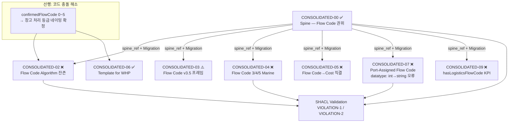

`p5.md` 감사 결과를 읽었습니다. 아직 publication 미달 파일 6개에 대한 semantic migration 계획이 필요합니다.

---

## Phase 1 — Business Review

### 1.1 문제 정의

**현재 상태**: CONSOLIDATED-00 spine은 승인되었으나, extension 6개(`02`, `03`, `04`, `05`, `07`, `09`)가 "Flow Code = 창고 내부 코드" 규칙을 위반하는 cross-domain 의미론을 여전히 보유. 동일한 0~5 코드 범위가 창고 핸들링 분류와 end-to-end 라우팅에서 **동시에** 사용되는 hard publish blocker 존재.

**목표 상태**: 전체 corpus에서 `Flow Code` 언급이 `WarehouseHandlingProfile` 외부에 존재하지 않으며, SHACL VIOLATION-1/2 자동 검증이 clean pass.

**영향 범위**: 파일 6개 × 평균 ~600줄 = ~3,600줄 패치 대상. 운영 중인 SPARQL 쿼리 및 KPI 대시보드 의미 변경 필요.

---

### 1.2 제안 옵션

| 옵션 | 설명 | 공수(일) | 리스크 | 비고 |
|------|------|---------|--------|------|
| **A. 전면 일괄 마이그레이션** | 6개 파일 동시 재작성 (병렬 subagent 3팀) | 1일 | 파일 간 용어 불일치 발생 가능 | 속도 최우선 |
| **B. 우선순위 순차 패치** | blocker 순서(`02→07→04→05→03→09`) 단계 패치 | 3일 | 지연 위험 낮음, 각 단계 검증 가능 | 품질 최우선 |
| **C. 코드 충돌 해소 선행 → 마이그레이션** | 먼저 `confirmedFlowCode` 0~5 네이밍 정책 확정 후 6개 파일 패치 | 2일 | 정책 결정 후 일관성 보장 | 추천 ⭐ |

---

### 1.3 추천 & 근거

**옵션 C 추천**: numeric code collision(`0~5` 이중 의미)이 먼저 해결되지 않으면 옵션 A/B 패치 후에도 모호성이 남습니다. `confirmedFlowCode` 값을 `WH_STANDARD_INDOOR` 같은 명칭 열거형으로 전환하거나 기존 0~5 숫자를 유지하되 "창고 전용 처리 등급"으로 명칭 고정한 뒤 6개 파일을 병렬 패치합니다.

**롤백**: 각 파일에 `.bak.md` 백업 보존 (CONSOLIDATED-06에서 검증됨). git revert 1 커밋으로 복원 가능.

- [ ] **Phase 1 승인**

---

## Phase 2 — Engineering Review

### 2.1 아키텍처 다이어그램



---

### 2.2 파일 변경 목록

| 파일 | 변경 유형 | 핵심 패치 내용 |
|------|----------|------|
| `CONSOLIDATED-00-master-ontology.md` | **modify** | `confirmedFlowCode` 코드셋 네이밍 정책 §1.1에 추가 확정 |
| `CONSOLIDATED-02-warehouse-flow.md` | **modify** | Flow Code Algorithm Ontology(6-step route/KPI) 제거 → `WarehouseHandlingProfile` 중심 재구성, KPI는 `routeType` 기반으로 |
| `CONSOLIDATED-03-document-ocr.md` | **modify** | 파일 제목/섹션 헤더에서 "Flow Code v3.5" 제거 → `routeEvidence` / `destinationEvidence` / `mosbLegIndicator` 프레임으로 전환 |
| `CONSOLIDATED-04-barge-bulk-cargo.md` | **modify** | "Flow Code 3/4/5" Marine 용법 제거 → `MarineRoutingPattern`, `offshoreDeliveryPattern` 대체; MOSB = OffshoreStaging (Flow Code anchor 아님) |
| `CONSOLIDATED-05-invoice-cost.md` | **modify** | "Flow Code directly impacts logistics costs" 제거 → `routeBasedCostDriver`, `WarehouseHandlingProfile.wh_handling_cnt` 으로 대체 |
| `CONSOLIDATED-07-port-operations.md` | **modify** | "Port-Assigned Flow Code" 제거; `plannedRoutingPattern` 타입 `integer` → `string enum` (SKOS Concept) 수정 |
| `CONSOLIDATED-09-operations.md` | **modify** | `hasLogisticsFlowCode` 속성 제거; KPI 섹션 Flow Code analytics → `routeType` analytics 전환 |

---

### 2.3 의존성 & 순서

```
[Step 0] CONSOLIDATED-00 §1.1 네이밍 확정
         → confirmedFlowCode 값: 0~5 숫자 유지 또는 WH_CLASS_A~F 명칭 변경 결정

[Step 1 — 병렬 A팀]
   CONSOLIDATED-02: WHP 중심 재구성
   CONSOLIDATED-07: Port Flow Code 제거 + datatype fix

[Step 1 — 병렬 B팀]
   CONSOLIDATED-04: Marine Flow Code 제거
   CONSOLIDATED-05: Cost Flow Code 제거

[Step 2 — 병렬]
   CONSOLIDATED-03: 프레임 전환
   CONSOLIDATED-09: KPI analytics 전환

[Step 3] SHACL 재검증 — VIOLATION-1/2 clean pass 확인
```

Step 0 완료 전까지 Step 1 시작 불가. Step 1 A/B팀은 독립적으로 병렬 실행 가능.

---

### 2.4 테스트 전략

| 검증 항목 | 방법 | 기준 |
|---|---|---|
| `confirmedFlowCode` WHP 외 잔존 여부 | `rg "assignedFlowCode\|extractedFlowCode\|costByFlowCode\|Flow Code [0-9]"` 전체 corpus grep | **0건** |
| datatype 오류 (`integer` → string) | `rg "minInclusive\|maxInclusive"` in 07/04 | **0건** |
| SHACL VIOLATION-1 | `FlowCodeBoundaryShape` 실행 | VIOLATION 0건 |
| SHACL VIOLATION-2 | `AGIDASStagingShape` 실행 | VIOLATION 0건 |
| `spine_ref` 전 파일 존재 | grep `spine_ref` 7개 파일 | **7/7 OK** |

---

### 2.5 리스크 & 완화

| 리스크 | 영역 | 완화 |
|---|---|---|
| `confirmedFlowCode` 0~5 숫자 유지 시 다른 도메인에서 혼용 재발 | 의미론 | §1.1에 "숫자 코드는 WHP 내부 전용" 명시 + VIOLATION-1 SHACL 자동 차단 |
| CONSOLIDATED-02 대규모 재구성 중 KPI 로직 의도치 않게 손실 | 호환성 | `.bak.md` 백업 선행 + `wh_handling_cnt`, `storageClass` 필드 보존 체크 |
| CONSOLIDATED-07 datatype 변경 시 기존 SPARQL 쿼리 깨짐 | 성능 | SPARQL Template 4개(CONSOLIDATED-00 §5.3) 대조 검증 |
| CONSOLIDATED-09 `hasLogisticsFlowCode` 제거 후 KPI 대시보드 공백 | 운영 | `routeType` 기반 동등 쿼리 선 작성 후 속성 제거 |

---

**다음 단계**: Phase 1 승인 후 `confirmedFlowCode` 네이밍 정책(0~5 숫자 유지 vs 명칭 변경)을 먼저 결정해 주시면 Step 1 병렬 패치를 즉시 시작합니다.
