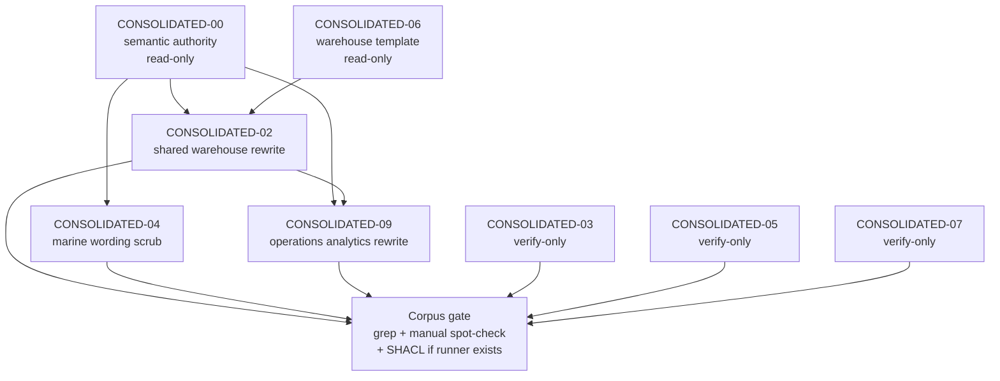

# Semantic Migration Plan

Derived from `p6.md` and a current corpus scan on 2026-04-11.

`p6.md` is no longer fully current. It still treats the `confirmedFlowCode` naming decision and all six extension files as open blockers. The naming policy is already fixed in `CONSOLIDATED-00`, and the current draft scan shows `CONSOLIDATED-03`, `CONSOLIDATED-05`, and `CONSOLIDATED-07` are now mostly in verify-only territory.

---

## Phase 1 — Business Review

### 1.1 문제 정의

**현재 상태**: `CONSOLIDATED-00` and `CONSOLIDATED-06` now define the right boundary. `confirmedFlowCode` stays inside `WarehouseHandlingProfile`, and the master spine already freezes the 0~5 numeric warehouse-only policy. The remaining hard blockers are concentrated in `CONSOLIDATED-02`, `CONSOLIDATED-04`, and `CONSOLIDATED-09`. `CONSOLIDATED-03`, `CONSOLIDATED-05`, and `CONSOLIDATED-07` now read mostly as boundary-compliant documents and should be handled as regression checks unless a new leak is found.

**목표 상태**: Non-warehouse extensions use `ShipmentRoutingPattern`, `routeEvidence`, `destinationEvidence`, `MarineRoutingPattern`, `offshoreDeliveryPattern`, and `route_type` language only. `confirmedFlowCode` remains warehouse-local only, and the corpus is ready for a final publication gate.

**영향 범위**: Current text scan found `132` `Flow Code` mentions across the six extension docs, but most are now governance-banner references. Manual spot-check shows the active rewrite scope is `3` files (`02`, `04`, `09`), while `03`, `05`, `07` stay in scope for verification only.

### 1.2 제안 옵션

가정: 아래 비용은 외부 구매비 기준이며, 이번 작업은 문서 수정만 포함하므로 외부 비용은 없습니다.

| 옵션 | 설명 | 공수(일) | 리스크 | 비용(AED) |
|------|------|---------|--------|----------|
| A | `p6.md` 초안대로 6개 파일을 모두 다시 패치한다 | 2.0 | 이미 정리된 `03`/`05`/`07`까지 다시 흔들어 불필요한 문서 churn이 생길 수 있다 | 0 |
| B | 현재 blocker 3개(`02`,`04`,`09`)만 먼저 고치고 `03`/`05`/`07`은 마지막에 점검한다 | 1.0 | 초반 스캔에서 놓친 잔여 표현이 있으면 재작업이 생길 수 있다 | 0 |
| C | 현재 상태를 다시 한 번 corpus gate로 고정한 뒤 blocker 3개를 고치고, 마지막에 `03`/`05`/`07`까지 포함해 전체 검증을 돌린다 | 1.5 | 옵션 B보다 느리지만, 재작업과 과수정을 줄이기 쉽다 | 0 |

### 1.3 추천 & 근거

**옵션 C 추천**: 정책 결정은 이미 끝났고, 지금 남은 문제는 blanket rewrite가 아니라 잔여 semantic leakage 정리입니다. 먼저 현재 blocker를 `02/04/09`로 고정한 뒤 해당 문서만 수정하고, `03/05/07`은 회귀 점검으로 닫는 편이 가장 일관되고 변경량도 작습니다.

**롤백**: 문서 수정은 blocker 3개만 순차 커밋하고, 최종 검증 전에 문제가 보이면 마지막 커밋 1개로 되돌립니다.

- [x] **Phase 1 승인** (2026-04-11)

---

## Phase 2 — Engineering Review

### 2.1 Mermaid 다이어그램

### 2.2 파일 변경 목록

| 파일 | 변경 유형 | 설명 |
|------|----------|------|
| `CONSOLIDATED-02-warehouse-flow.md` | modify | `### Flow Code 계산 알고리즘`, `### Flow Code 활용 사례`, 운영 KPI 문단에서 route algorithm 잔재를 제거하고 `WarehouseHandlingProfile.confirmedFlowCode` 전용 설명으로 재작성 |
| `CONSOLIDATED-04-barge-bulk-cargo.md` | modify | `#### LCT Transport Model` 주변에 남아 있는 `Flow Code characteristics` 표현을 `MarineRoutingPattern` / `offshoreDeliveryPattern` 중심 설명으로 치환 |
| `CONSOLIDATED-09-operations.md` | modify | `Operations-Specific Flow Code Patterns`, `Flow Code Calculation Logic`, `hasLogisticsFlowCode` 잔재, integer Flow Code 예시를 `hasRoutingPattern` 기반 KPI/질의로 전환 |
| `CONSOLIDATED-03-document-ocr.md` | verify-only | 현재 스캔 기준 본문은 정리되어 있으므로 수정하지 않는다. 단, 배너 외부에서 Flow Code 소유/할당 문장이 발견되면 그때만 최소 수정 |
| `CONSOLIDATED-05-invoice-cost.md` | verify-only | `routeBasedCostDriver` 중심 설명을 유지한다. 비용 도메인이 `confirmedFlowCode`를 소유하는 문장이 다시 보일 때만 수정 |
| `CONSOLIDATED-07-port-operations.md` | verify-only | `plannedRoutingPattern` string enum 구조를 유지한다. Port가 `confirmedFlowCode`를 할당하는 표현이 다시 보일 때만 수정 |

`create` 파일은 계획하지 않는다. 이번 단계는 기존 문서 정리만 수행한다.

### 2.3 의존성 & 순서

1. **Step 0 — Authority freeze**
   - `CONSOLIDATED-00` / `CONSOLIDATED-06`은 read-only 기준 문서로 둔다.
   - 실행 중 새 정의를 이 두 문서에 추가하지 않는다.

2. **Step 1 — Shared warehouse cleanup**
   - `CONSOLIDATED-02`를 먼저 정리한다.
   - 이유: `CONSOLIDATED-09`가 참조할 warehouse-local vocabulary를 여기서 먼저 고정해야 한다.

3. **Step 2 — Parallel path**
   - `CONSOLIDATED-04`는 `CONSOLIDATED-02`와 독립적으로 바로 수정 가능하다.
   - `CONSOLIDATED-03`, `CONSOLIDATED-05`, `CONSOLIDATED-07`은 이 단계에서 verify-only 점검을 병행한다.

4. **Step 3 — Operations rewrite**
   - `CONSOLIDATED-09`는 `CONSOLIDATED-02` 정리 후 수정한다.
   - 이유: operations KPI 문구가 route analytics와 warehouse metrics를 다시 섞지 않도록 하기 위해서다.

5. **Step 4 — Corpus gate**
   - 전체 extension 문서에 대해 금지 패턴 scan을 돌린다.
   - `.venv\Scripts\python.exe scripts\validate_logi_ontology_docs.py` 를 `02/04/09` 표준 validation gate로 실행한다.
   - grep/manual gate와 SHACL gate 결과를 분리해서 기록한다.

### 2.4 테스트 전략

- **단위 점검(문서 단위 grep)**
  - `CONSOLIDATED-02`, `CONSOLIDATED-09`에서 `Flow Code 계산 알고리즘`, `FLOW_CODE`, `FLOW_CODE_ORIG`, `FLOW_OVERRIDE_REASON`, `hasLogisticsFlowCode` 잔존 여부를 확인한다.
  - `CONSOLIDATED-04`에서 `Flow Code characteristics` 잔존 여부를 확인한다.
  - `CONSOLIDATED-03`, `CONSOLIDATED-05`, `CONSOLIDATED-07`은 금지 패턴이 새로 생기지 않았는지 확인한다.

- **통합 점검(코퍼스 단위)**
  - `rg`로 `assignedFlowCode|extractedFlowCode|costByFlowCode|hasLogisticsFlowCode|FLOW_CODE_ORIG|FLOW_OVERRIDE_REASON`를 `CONSOLIDATED-02..09` 전체에 대해 검색한다.
  - 허용된 governance banner 문구를 제외하고 cross-domain Flow Code 소유/할당 문장이 0건인지 확인한다.
  - `plannedRoutingPattern`, `routeEvidence`, `routeBasedCostDriver`, `MarineRoutingPattern`, `hasRoutingPattern`이 각 대상 문서에 남아 있는지 확인한다.

- **수동 검토**
  - 수정한 파일의 헤더, TOC, 앵커, 예시 코드 블록이 새 용어와 충돌하지 않는지 읽어 본다.
  - `CONSOLIDATED-09`는 RDF/OWL 예시와 KPI 표가 같은 vocabulary를 쓰는지 수동으로 맞춘다.

- **SHACL / schema 검증**
  - 목표: `CONSOLIDATED-00`의 VIOLATION-1 boundary와 충돌하는 예시가 없어야 한다.
  - 표준 명령: `.venv\Scripts\python.exe scripts\validate_logi_ontology_docs.py`
  - 이 명령이 `02`, `04`, `09` 모두 `PASS`를 반환해야 consolidated subset SHACL gate를 통과한 것으로 본다.

### 2.5 리스크 & 완화

| 리스크 | 영역 | 완화 |
|---|---|---|
| `CONSOLIDATED-02`에서 route 예시를 지우다가 warehouse-only 설명도 같이 약해질 수 있다 | 호환성 | `CONSOLIDATED-06` 표현을 기준으로 가져오고, `WarehouseHandlingProfile.confirmedFlowCode` 설명은 유지한다 |
| `CONSOLIDATED-09`가 `hasRoutingPattern` KPI와 warehouse metrics를 다시 한 문단에서 섞을 수 있다 | 의미 일관성 | `CONSOLIDATED-02`를 먼저 고친 뒤 `09`를 수정하고, KPI 표와 RDF 예시를 같은 용어 집합으로 맞춘다 |
| `CONSOLIDATED-03`, `05`, `07`은 이미 많이 정리돼 있어 괜히 손대면 valid boundary 문장까지 사라질 수 있다 | 과수정 | 세 파일은 기본값을 verify-only로 두고, 금지 표현이 새로 발견될 때만 최소 수정한다 |
| grep만 통과하고 SHACL gate를 생략하면 완료처럼 보일 수 있다 | 검증 정확성 | grep/manual 결과와 `.venv\Scripts\python.exe scripts\validate_logi_ontology_docs.py` 결과를 항상 분리해서 보고한다 |
| 큰 섹션 제목을 바꾸면 TOC 앵커가 깨질 수 있다 | 문서 구조 | 제목을 바꿀 때는 같은 턴에 TOC와 내부 anchor를 같이 갱신한다 |
