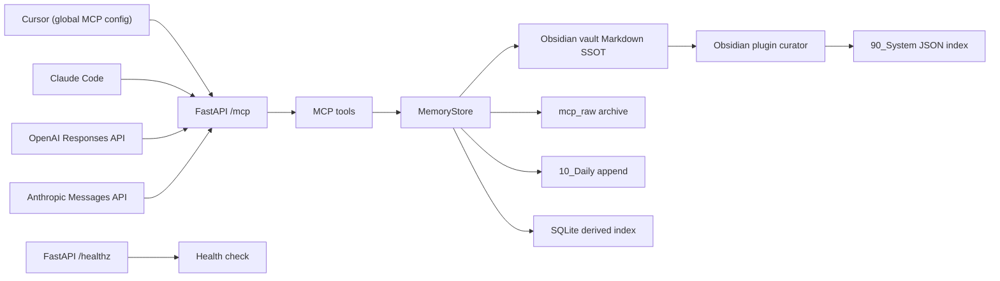
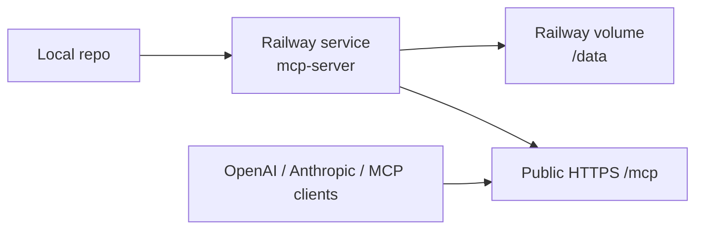
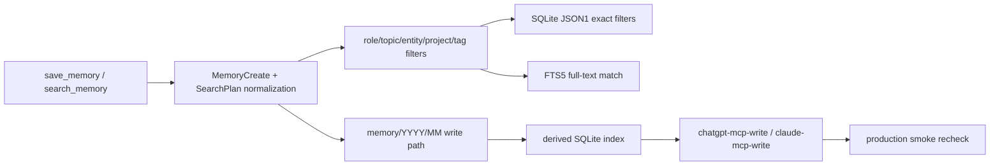
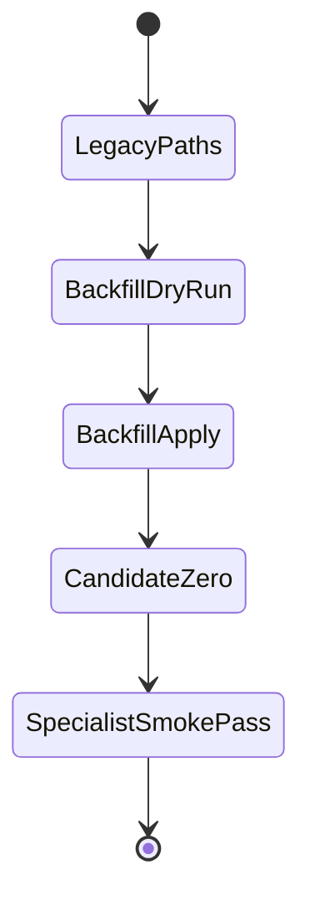

# mcp_obsidian

Obsidian-backed shared memory MCP server with a local Obsidian curator plugin, shared schemas, and a verified Railway preview runtime.

이 저장소의 현재 기준선은 다음이다.

- Markdown SSOT
- SQLite derived index
- read-first, write-with-intent
- global Cursor MCP + hosted specialist profiles
- delivery archive 유지, runtime 비채택
- hybrid architecture 시작

## Document Map

- [README.md](README.md): 운영 허브, 설치/실행/MCP 연결, 현재 상태
- [changelog.md](changelog.md): 작업 이력과 검증 기록
- [SYSTEM_ARCHITECTURE.md](SYSTEM_ARCHITECTURE.md): 런타임 구조와 보호 계약
- [LAYOUT.md](LAYOUT.md): 저장소 구조, active/archive 구분, 편집 위치
- [AGENTS.md](AGENTS.md): 저장소 공통 작업 계약
- [CLAUDE.md](CLAUDE.md): Claude-specific delta
- [plan.md](plan.md): 현재 실행 로드맵
- [docs/INSTALL_WINDOWS.md](docs/INSTALL_WINDOWS.md): Windows 설치와 Cursor MCP 연결
- [docs/MASKING_POLICY.md](docs/MASKING_POLICY.md): 저장 전 mask/reject 기준
- [docs/MCP_RUNTIME_EVIDENCE.md](docs/MCP_RUNTIME_EVIDENCE.md): live read-first MCP 검증 증거
- [docs/CHATGPT_MCP.md](docs/CHATGPT_MCP.md): ChatGPT용 read-only route와 authenticated write-capable sibling route
- [docs/CLAUDE_MCP.md](docs/CLAUDE_MCP.md): Claude용 read-only route와 authenticated write-capable sibling route
- [docs/REMOTE_DEPLOYMENT_MATRIX.md](docs/REMOTE_DEPLOYMENT_MATRIX.md): preview-first 배포 후보 비교
- [docs/RAILWAY_PREVIEW_RUNBOOK.md](docs/RAILWAY_PREVIEW_RUNBOOK.md): Railway hosted preview 실행 절차와 현재 선택안
- [docs/PRODUCTION_RAILWAY_RUNBOOK.md](docs/PRODUCTION_RAILWAY_RUNBOOK.md): Railway 기준 production rollout runbook
- [docs/PROBE_DATA_POLICY.md](docs/PROBE_DATA_POLICY.md): verification probe data 라벨링과 정리 정책
- [docs/VERIFICATION_PURGE_RUNBOOK.md](docs/VERIFICATION_PURGE_RUNBOOK.md): archived verification records 수동 정리 절차
- [docs/HMAC_PHASE_2.md](docs/HMAC_PHASE_2.md): optional HMAC phase-2 contract for signed writes
- [docs/PRODUCTION_VPS_RUNBOOK.md](docs/PRODUCTION_VPS_RUNBOOK.md): Caddy + systemd 기준 production rollout runbook
- [docs/VPS_EXECUTION_CHECKLIST.md](docs/VPS_EXECUTION_CHECKLIST.md): VPS host 실행 체크리스트
- [docs/VPS_COMMAND_SHEET.md](docs/VPS_COMMAND_SHEET.md): VPS에서 복붙 가능한 실행 명령 시트
- [docs/WRITE_TOOL_GATE.md](docs/WRITE_TOOL_GATE.md): preview write gate와 rollback 기준
- [docs/reference/](docs/reference): 제안/참고 문서 보관 영역
- [docs/history/](docs/history): 점검/시점 기록 보관 영역

## Current State

- 루트 프로젝트가 정식 실행 대상이다.
- `obsidian_mcp_delivery_20260328/`는 참고용 archive이며, safe-selective merge만 반영됐다.
- delivery snapshot에서 채택한 것은 내부 helper, 문서 내용 일부, examples 일부다.
- delivery snapshot에서 채택하지 않은 것은 alternate auth module, alternate host/port defaults, wrapper shape 변경, snapshot replacement다.
- `obsidian-memory-plugin/` subproject가 추가됐다.
- `schemas/`는 raw conversation과 normalized memory의 shared contract를 담는다.
- vault는 `mcp_raw/`, `memory/`, `10_Daily/`, `90_System/`를 현재 기준으로 쓰고, legacy `20_AI_Memory/` read support를 유지한다.
- Railway hosted preview가 read-only MCP 검증까지 완료된 상태다.
- Railway hosted preview에서 `save_memory` / `update_memory` 1회 검증과 archived rollback까지 완료된 상태다.
- mixed-secret mask / secret-only reject의 live preview verification도 완료된 상태다.
- Railway production split dry run도 완료된 상태다.
- Railway production volume backup/restore drill도 완료된 상태다.
- Railway generated production domain이 현재 공식 interim production endpoint로 채택된 상태다.
- Railway production에 HMAC phase-2가 적용되고 signed memory/raw verification까지 완료된 상태다.
- local direct save와 `production -> local vault` pull sync를 병행할 수 있게 정리한 상태다.
- ChatGPT용 hosted read-only route `https://mcp-server-production-90cb.up.railway.app/chatgpt-mcp`와 authenticated write sibling `https://mcp-server-production-90cb.up.railway.app/chatgpt-mcp-write`가 배포된 상태다.
- Claude용 hosted read-only route `https://mcp-server-production-90cb.up.railway.app/claude-mcp`와 authenticated write sibling `https://mcp-server-production-90cb.up.railway.app/claude-mcp-write`가 배포된 상태다.
- Cursor는 이제 project-level이 아니라 global `C:\Users\jichu\.cursor\mcp.json` 기준으로 local/production을 함께 사용한다.
- 현재 운영 결정은 `Railway = production path`, `VPS + reverse proxy = alternate self-managed reference`다.
- proposal/reference 성격의 루트 문서는 `docs/reference/`와 `docs/history/`로 정리된 상태를 기준으로 삼는다.

## Directly Confirmed Snapshot

2026-03-28 기준 직접 확인한 현재 상태:

- code
  - `app/config.py`: local + Railway env shape, MCP host/origin allowlist 지원
  - `app/main.py`: FastAPI app factory, `/healthz`, `/mcp`, bearer auth middleware
  - `app/mcp_server.py`: 7개 MCP tools, wrapper compatibility, transport security injection
  - `app/services/memory_store.py`: Markdown first, SQLite second, raw archive + daily append + schema validation
- docs
  - root docs 4종과 `docs/MASKING_POLICY.md`, `docs/MCP_RUNTIME_EVIDENCE.md`, `docs/REMOTE_DEPLOYMENT_MATRIX.md`, `docs/RAILWAY_PREVIEW_RUNBOOK.md` 존재
- execution
  - `pytest -q` -> pass
  - `ruff check .` -> pass
  - `ruff format --check .` -> pass
  - `npm run check` -> pass
  - `npm run build` -> pass
- Railway preview `/healthz` -> `200`
- Railway preview `/mcp` -> `307`
- Railway preview read-only MCP verification -> pass
- Railway preview write-once verification -> pass
- Railway preview secret-path verification -> pass
- Railway production dry run -> pass
- Railway production backup/restore drill -> pass
- ChatGPT hosted route `/chatgpt-mcp` -> pass
- ChatGPT authenticated write route `/chatgpt-mcp-write` -> pass
- Claude hosted route `/claude-mcp` -> pass
- Claude authenticated write route `/claude-mcp-write` -> pass

## Hybrid Layers

- Python/FastAPI MCP server
  - remote bridge
  - current tool surface 유지
  - normalized memory search 중심
- Obsidian plugin
  - raw conversation 저장
  - memory item 생성/검수
  - frontmatter 정규화
  - `90_System/memory_index.json` 재생성
- Shared schemas
  - `schemas/raw-conversation.schema.json`
  - `schemas/memory-item.schema.json`

## Runtime Overview



## Deployment Snapshot

현재 외부 preview는 Railway hosted runtime으로 확인했다.

- Railway project: `mcp-obsidian-preview`
- Railway service: `mcp-server`
- public preview URL: `https://mcp-server-production-1454.up.railway.app`
- mounted volume: `/data`
- preview vault path: `/data/vault`
- preview SQLite path: `/data/state/memory_index.sqlite3`



## Cursor MCP

현재 active Cursor 설정은 repo 안이 아니라 global config에 있다.

- active config:
  - `C:\Users\jichu\.cursor\mcp.json`
- configured servers:
  - `obsidian-memory-local`
  - `obsidian-memory-production`

사용 방식:

1. `.env.example`을 기반으로 `.env`를 준비한다.
2. `MCP_API_TOKEN`을 Windows user env에 넣는다.
3. `MCP_PRODUCTION_BEARER_TOKEN`을 Windows user env에 넣는다.
4. local direct save를 원하면 `OBSIDIAN_LOCAL_VAULT_PATH`를 네 실제 Obsidian vault 폴더로 맞춘다.
5. Cursor를 재시작하거나 reload한다.
6. Cursor의 **Settings -> MCP**에서 `obsidian-memory-local`, `obsidian-memory-production`를 확인한다.

repo 안의 `.cursor/mcp.sample.json`은 예시 보관용이다. Streamable HTTP is the preferred transport for this pack. SSE는 호환용으로만 취급한다.

현재 workspace에서는 2026-03-28 기준으로 Cursor의 **Settings -> MCP**에서 `obsidian-memory-local`, `obsidian-memory-production`가 둘 다 수동 확인됐다.

## Client Matrix

| Client | Localhost works | Public HTTPS required | Notes |
| --- | --- | --- | --- |
| Cursor | Yes | No | global MCP config에서 local + production을 함께 사용한다. |
| Claude Code | Yes | No | local 또는 remote MCP 모두 가능하다. |
| OpenAI Responses API | No | Yes | public HTTPS MCP endpoint가 필요하다. |
| Anthropic Messages API | No | Yes | tool-call oriented MCP connector 기준이다. |

## Quick Start

Windows 기준:

```powershell
cd C:\Users\jichu\Downloads\mcp_obsidian
powershell -ExecutionPolicy Bypass -File .\install_cursor_fullsetup.ps1
```

앱 실행:

```powershell
powershell -ExecutionPolicy Bypass -File .\scripts\start-mcp-dev.ps1
```

또는:

```powershell
.\.venv\Scripts\Activate.ps1
uvicorn app.main:app --reload --host 127.0.0.1 --port 8000
```

## Optional Examples

- `examples/openai_responses_client.py`
- `examples/anthropic_messages_client.py`

이 예제들은 non-authoritative helper다. `MCP_SERVER_URL`, `MCP_BEARER_TOKEN` 환경 변수를 사용하며, 관련 SDK는 별도 설치가 필요하다.

## Parallel Documentation Lanes

문서 세트는 아래 역할로 병렬 작성되도록 정리했다.

- Lane A: `README.md`
  운영 허브, 문서 링크, quick start, client flow
- Lane B: `changelog.md`
  작업 이력, 검증 결과, unchanged contract 기록
- Lane C: `SYSTEM_ARCHITECTURE.md`
  런타임 구조, data flow, 보호 계약, non-adopted snapshot notes
- Lane D: `LAYOUT.md`
  저장소 구조, active/archive 구분, where-to-edit-what

최종 통합 패스에서는 공통 용어를 고정한다.

- Markdown SSOT
- SQLite derived index
- read-first, write-with-intent
- global Cursor MCP
- delivery archive

## Basic Checks

```powershell
pytest -q
ruff check .
ruff format --check .
```

현재 추가로 직접 확인한 명령:

```powershell
cd .\obsidian-memory-plugin
npm run check
npm run build

cd ..
Invoke-WebRequest https://mcp-server-production-1454.up.railway.app/healthz -UseBasicParsing
python scripts\verify_mcp_readonly.py --server-url https://mcp-server-production-1454.up.railway.app/mcp/ --token <TOKEN>
python scripts\verify_mcp_write_once.py --server-url https://mcp-server-production-1454.up.railway.app/mcp/ --token <TOKEN> --confirm preview-write-once
python scripts\verify_mcp_secret_paths.py --server-url https://mcp-server-production-1454.up.railway.app/mcp/ --token <TOKEN> --confirm preview-secret-paths
```

## Remaining Manual Checks

- optional MCP dependency가 없을 때 `/mcp`가 503 개발자 메시지로 응답하는지 확인

## 2026-03-28 Detailed Runtime Delta

이 섹션은 기존 요약을 지우지 않고, 현재 구현의 추가 사실만 보강한다.

- `save_memory`는 현재 additive v2 metadata를 받는다.
  - `roles[]`
  - `topics[]`
  - `entities[]`
  - `projects[]`
  - `raw_refs[]`
  - `relations[]`
- query 해석은 `SearchPlan` 기반으로 확장됐다.
  - `role:`
  - `topic:`
  - `entity:`
  - `project:`
  - `tag:`
  - `after:`
  - `before:`
  - `limit:`
- `IndexStore`는 이제 SQLite `JSON1 + FTS5`를 함께 사용한다.
  - metadata exact filter는 `json_each(...)`
  - full-text는 `memories_fts`
  - hyphenated title 검색 회귀를 막기 위한 FTS quoting fix가 반영됐다
- current write path는 `memory/YYYY/MM/...`이다.
- legacy `20_AI_Memory/...`는 read/update compatibility로 남는다.
- operator migration path도 추가됐다.
  - planner/service: `app/services/path_backfill.py`
  - CLI: `scripts/backfill_memory_paths.py`
  - dry-run 기본, `--apply`에서만 실제 이동



## 2026-03-28 Production Migration Snapshot

- production deploy after FTS fix:
  - deployment: `7f706b9c-9d3d-429d-abb7-ca8519c225c7`
  - status: `SUCCESS`
- production backfill apply:
  - moved legacy notes: `18`
  - `conflicts = 0`
  - `missing = 0`
  - post-apply dry run: `candidate_count = 0`
- production specialist smoke recheck:
  - ChatGPT read-only route -> pass
  - Claude read-only route -> pass
  - ChatGPT write sibling -> pass
    - sample id: `MEM-20260328-234330-5D6BA3`
  - Claude write sibling -> pass
    - sample id: `MEM-20260328-234330-2D7741`


