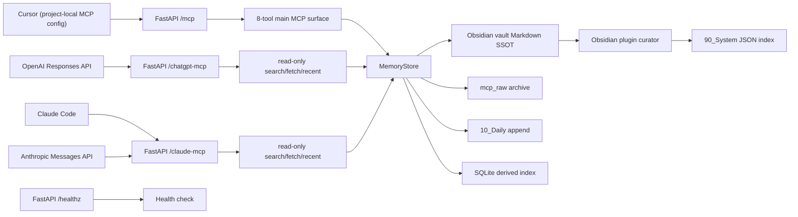
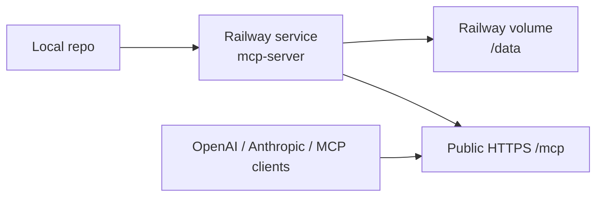
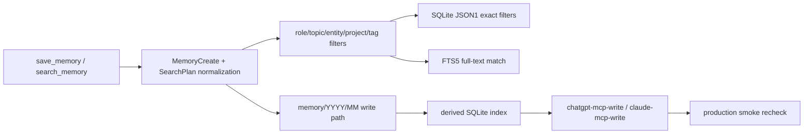
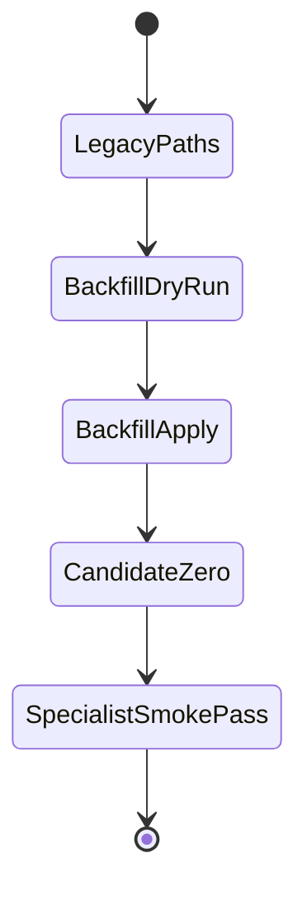

# mcp_obsidian

Obsidian-backed shared-memory MCP server with a FastAPI/FastMCP runtime, Markdown SSOT storage, SQLite JSON1+FTS5 search, and Railway-verified hosted profiles for Cursor, ChatGPT, and Claude.

현재 이 저장소의 핵심은 다음이다.

- Markdown SSOT
- SQLite derived index
- metadata-first memory contract
- SearchPlan query DSL
- `memory/YYYY/MM` write path + legacy compatibility
- read-first, write-with-intent specialist profiles
- Railway production recheck 완료

## Document Map

- [README.md](README.md): 운영 허브, 설치/실행/MCP 연결, 현재 상태
- [changelog.md](changelog.md): 작업 이력과 검증 기록
- [Spec.md](Spec.md): 현재 승인된 운영/통합 계약과 3-layer boundary
- [SYSTEM_ARCHITECTURE.md](SYSTEM_ARCHITECTURE.md): 런타임 구조와 보호 계약
- [LAYOUT.md](LAYOUT.md): 저장소 구조, active/archive 구분, 편집 위치 (`AGENTS.md` 저장 레이아웃과 함께 유지)
- [AGENTS.md](AGENTS.md): 저장소 공통 작업 계약
- [CLAUDE.md](CLAUDE.md): Claude-specific delta
- [plan.md](plan.md): 현재 실행 로드맵
- [docs/INSTALL_WINDOWS.md](docs/INSTALL_WINDOWS.md): Windows 설치와 Cursor MCP 연결
- [docs/LOCAL_MCP.md](docs/LOCAL_MCP.md): 로컬 MCP 허브(uvicorn, `obsidian-memory-local`, 토큰·헬스·트러블슈팅)
- [docs/LOCAL_RAG_STANDALONE_GUIDE.md](docs/LOCAL_RAG_STANDALONE_GUIDE.md): Windows 로컬 스택 기동, 브라우저 확인, 복구 순서
- [docs/MASKING_POLICY.md](docs/MASKING_POLICY.md): 저장 전 mask/reject 기준
- [docs/MCP_RUNTIME_EVIDENCE.md](docs/MCP_RUNTIME_EVIDENCE.md): live read-first MCP 검증 증거
- [docs/CHATGPT_MCP.md](docs/CHATGPT_MCP.md): ChatGPT용 read-only route와 authenticated write-capable sibling route
- [docs/CLAUDE_MCP.md](docs/CLAUDE_MCP.md): Claude용 read-only route와 authenticated write-capable sibling route
- [docs/REMOTE_DEPLOYMENT_MATRIX.md](docs/REMOTE_DEPLOYMENT_MATRIX.md): preview-first 배포 후보 비교
- [docs/RAILWAY_PREVIEW_RUNBOOK.md](docs/RAILWAY_PREVIEW_RUNBOOK.md): Railway hosted preview 실행 절차와 현재 선택안
- [docs/PRODUCTION_RAILWAY_RUNBOOK.md](docs/PRODUCTION_RAILWAY_RUNBOOK.md): Railway 기준 production rollout runbook
- [docs/PROBE_DATA_POLICY.md](docs/PROBE_DATA_POLICY.md): verification probe data 라벨링과 정리 정책
- [docs/VERIFICATION_PURGE_RUNBOOK.md](docs/VERIFICATION_PURGE_RUNBOOK.md): archived verification records 수동 정리 절차
- [docs/HMAC_PHASE_2.md](docs/HMAC_PHASE_2.md): optional HMAC phase-2 contract for signed writes
- [docs/PRODUCTION_VPS_RUNBOOK.md](docs/PRODUCTION_VPS_RUNBOOK.md): Caddy + systemd 기준 production rollout runbook
- [docs/VPS_EXECUTION_CHECKLIST.md](docs/VPS_EXECUTION_CHECKLIST.md): VPS host 실행 체크리스트
- [docs/VPS_COMMAND_SHEET.md](docs/VPS_COMMAND_SHEET.md): VPS에서 복붙 가능한 실행 명령 시트
- [docs/superpowers/specs/2026-04-08-local-rag-cache-and-guard-design.md](docs/superpowers/specs/2026-04-08-local-rag-cache-and-guard-design.md): sibling `local-rag` cache/guard design 기록
- [docs/superpowers/specs/2026-04-08-local-rag-retrieval-benchmark.md](docs/superpowers/specs/2026-04-08-local-rag-retrieval-benchmark.md): local-rag lexical retrieval benchmark 기록
- [docs/WRITE_TOOL_GATE.md](docs/WRITE_TOOL_GATE.md): preview write gate와 rollback 기준
- [docs/reference/](docs/reference): 제안/참고 문서 보관 영역
- [docs/history/](docs/history): 점검/시점 기록 보관 영역
- `.cursor/skills/`: Cursor Agent Skills — 대화 변환 파이프라인 (`paste-conversation-to-obsidian`, `obsidian-conversation-to-memory`) + KB 레이어 (`obsidian-ingest`, `obsidian-query`, `obsidian-lint`)
- `vault/wiki/`: KB canonical 노트 트리 (`sources/`, `concepts/`, `entities/`, `analyses/`)
- `runtime/patches/`: obsidian-lint 패치 플랜 JSON
- `scripts/ollama_kb.py`: Gemma 4 / Ollama 공용 어댑터

## Current State

## Current State (English Summary)

**2026-04-09 Integration Updates:**
- standalone-package now features RAG keyword auto-detection: messages containing Korean keywords (근거/요약/문서/통관/dem.det/hs/리스크) are automatically routed to local-rag route
- Memory enrichment: when RAG keyword detected, memory MCP is queried and KB context is injected as system message into Ollama prompt
- Unified health: `/api/ai/health` returns `localIntelligence` section with `memory` + `localRag` sub-statuses
- Default memory MCP mount changed to `/chatgpt-mcp` (read-only, no bearer required)
- Memory search query optimized to 80 chars for better Korean text hit rate
- `routeHint=local` and `routeHint=copilot` parameters supported
- local-rag retrieval working: 12 documents indexed, lexical search operational

---

- 루트 프로젝트가 정식 실행 대상이다.
- `obsidian_mcp_delivery_20260328/`는 참고용 archive이며, safe-selective merge만 반영됐다.
- delivery snapshot에서 채택한 것은 내부 helper, 문서 내용 일부, examples 일부다.
- delivery snapshot에서 채택하지 않은 것은 alternate auth module, alternate host/port defaults, wrapper shape 변경, snapshot replacement다.
- `obsidian-memory-plugin/` subproject가 추가됐다.
- `schemas/`는 raw conversation과 normalized memory의 shared contract를 담는다.
- vault는 `mcp_raw/`, `memory/`, `10_Daily/`, `90_System/`를 현재 기준으로 쓰고, legacy `20_AI_Memory/` read support를 유지한다.
- Railway hosted preview가 read-only MCP 검증까지 완료된 상태다.
- Railway hosted preview에서 `save_memory` / `update_memory` 1회 검증과 archived rollback까지 완료된 상태다.
- mixed-secret mask / secret-only reject의 live preview verification도 완료된 상태다.
- Railway production split dry run도 완료된 상태다.
- Railway production volume backup/restore drill도 완료된 상태다.
- Railway generated production domain이 현재 공식 interim production endpoint로 채택된 상태다.
- `docs/HMAC_PHASE_2.md`에 optional signed-write contract가 정리돼 있다. 현재 루트 runtime surface에서는 adjacent contract 문서로 유지한다.
- local direct save와 `production -> local vault` pull sync를 병행할 수 있게 정리한 상태다.
- ChatGPT용 hosted read-only route `https://mcp-server-production-90cb.up.railway.app/chatgpt-mcp`와 authenticated write sibling `https://mcp-server-production-90cb.up.railway.app/chatgpt-mcp-write`가 배포된 상태다.
- Claude용 hosted read-only route `https://mcp-server-production-90cb.up.railway.app/claude-mcp`와 authenticated write sibling `https://mcp-server-production-90cb.up.railway.app/claude-mcp-write`가 배포된 상태다.
- Cursor는 이제 repo의 project-local `.cursor/mcp.json` 기준으로 local/production을 함께 사용한다.
- 현재 운영 결정은 `Railway = production path`, `VPS + reverse proxy = alternate self-managed reference`다.
- proposal/reference 성격의 루트 문서는 `docs/reference/`와 `docs/history/`로 정리된 상태를 기준으로 삼는다.
- 이 저장소의 직접 runtime 범위는 `app/main.py`가 만드는 FastAPI + FastMCP MCP server다.
- `local-rag`(`GET /health`, `POST /api/internal/ai/chat-local`, `GET /api/internal/ai/chat-local/ready`)와 `standalone-package`(`MYAGENT_LOCAL_RAG_TOKEN`, route-aware `/api/ai/health`, default `/chatgpt-mcp-write` memory bridge)는 sibling repo runtime이며, 여기서는 boundary와 companion docs만 추적한다.
- 현재 작업 트리에는 `local-rag/`와 `myagent-copilot-kit/standalone-package/` 로컬 사본이 함께 존재한다. 다만 이 디렉터리들은 루트 repo의 canonical tracked runtime이라고 가정하지 않고, companion reference + local verification 대상으로만 취급한다.
- current local `127.0.0.1:3010` standalone runtime은 화면과 `/api/ai/health`는 응답하고, `/api/memory/save` + `/api/memory/fetch`도 현재 세션에서 동작했다. 다만 memory bridge health는 아직 green이 아니다. current spot-check에서는 `memoryOk: false`, `/api/memory/health` `503`, local-forced `/api/ai/chat` `503 LOCAL_RUNNER_FAILED`가 관찰됐다.
- current local `3010` runtime은 write-capable memory tools(`save_memory`, `get_memory`, `update_memory`)까지 노출한다. current companion source도 기본 memory bridge를 `/chatgpt-mcp-write`로 두고 `MYAGENT_MEMORY_TOKEN`을 읽는다. 남은 mismatch는 write-capable mount를 `mcp-readonly` probe로 검사하는 health semantics와 local-rag/Ollama availability다.
- **2026-04-07:** Gemma 4 + Ollama 기반 KB 레이어가 추가됐다 (`vault/wiki/`, `scripts/ollama_kb.py`, 3개 Cursor Skills).
- **2026-04-07:** `gemma4:e4b` + `gemma4:e2b` 두 모델이 로컬에 설치됐다.
- **2026-04-07:** obsidian-ingest / obsidian-query / obsidian-lint 스킬 end-to-end 검증 완료.
- **2026-04-07:** 8개 KB 스킬이 전역(`%USERPROFILE%\.cursor\skills\`)으로 배포됐다.
- **2026-04-07:** `.env`에 `OBSIDIAN_LOCAL_VAULT_PATH` 추가 (예: `C:\Users\<YOUR_USER>\OneDrive\문서\Obsidian Vault`).
- **2026-04-07:** MCP 서버 `.venv` 환경 및 의존성 설치 완료.
- **2026-04-08:** sibling `local-rag`는 보수적 retrieval cache + shared-secret guard + guarded readiness probe를 갖는 구조로 정리됐고, sibling `standalone-package`는 `MYAGENT_LOCAL_RAG_TOKEN` 전달, non-loopback auth fail-fast, local route 기본 모델 `gemma4:e4b` 자동 매핑을 반영했다.

## Directly Confirmed Snapshot

### 2026-04-08 current workspace recheck

- `.venv\Scripts\python.exe -m pytest -q` → **65 passed** ✅
- `.venv\Scripts\python.exe -m ruff check .` → **fail** (`11` existing issues, including tracked `app.py`)
- `.venv\Scripts\python.exe -m ruff format --check .` → **fail** (`3` files would be reformatted, `58` files already formatted)
- `.venv\Scripts\python.exe -c "from app.main import app; print(app.title)"` → `obsidian-mcp` ✅

### 2026-04-08 production specialist route recheck

- Railway production `/chatgpt-mcp` tool set → `search`, `fetch`, `list_recent_memories`
- `list_recent_memories(limit=5)` → 최근 5건 제목 반환 확인
- generic recent query fallback
  - `search("2026 03 memory memo")` → recent browse 결과와 같은 5건 반환
  - 첫 결과 `fetch(id)` → 본문 반환 확인
- note: 위 결과는 current Codex session에서 production `https://mcp-server-production-90cb.up.railway.app/chatgpt-mcp/`에 직접 붙어서 확인했다

### 2026-04-08 companion ingest + local-rag + standalone 검증 결과 (previous temp runtime evidence)

- note: 아래 기록은 sibling repo의 temp companion runtime 검증 결과다. current local `127.0.0.1:3010` 프로세스와 같은 세션 증거로 합치지 않는다.

- local MCP `/healthz` → `200 {"ok":true,"service":"obsidian-mcp"}`
- local-rag `/health` → `200 {"status":"ok", ... "model":"gemma4:e4b"}`
- standalone `/api/ai/health` → local-only / memory bridge ready 확인
- manual KB ingest artifact
  - raw copy → `vault/raw/articles/chatgpt-projects-pipeline-standard.md`
  - wiki note → `vault/wiki/concepts/chatgpt-projects-pipeline-standard.md`
  - MCP `archive_raw` returned id → `convo-chatgpt-projects-pipeline-standard-2026-04-08`
  - MCP `save_memory` returned id → `MEM-20260408-163522-F9FE2A`
- temp `local-rag` (`LOCAL_RAG_DOCS_DIR = repo vault/wiki`) 질의 → `chatgpt-projects-pipeline-standard.md`를 retrieval source로 반환
- temp `standalone-package` (`MYAGENT_LOCAL_RAG_BASE_URL = http://127.0.0.1:8017`) 검증
  - `/api/memory/search` → `MEM-20260408-163522-F9FE2A` 반환
  - `/api/memory/fetch` → saved pointer 본문 반환
  - `/api/ai/chat` local route → `model` 미지정 상태에서도 `gemma4:e4b`로 성공 응답
- note: repo vault에서 직접 확인한 것은 `vault/raw/` / `vault/wiki/` direct-write 결과다. `archive_raw`는 returned `mcp_id` + `path` 기준으로 확인했고, `save_memory`는 returned `id` + `/api/memory/search` / `/api/memory/fetch` readback으로 검증했다

### 2026-04-08 current local standalone spot-check

- `GET http://127.0.0.1:3010/` → `200`, title `Standalone Chat`, prompt + send button visible
- `GET http://127.0.0.1:3010/api/ai/health` → `200`
  - `chatOk = false`
  - `localOnlyChatOk = false`
  - `memoryOk = false`
  - payload 내부 `localRag.status = "down"`, `ollama = "down"`
  - payload 내부 `memory.status = "ok"`, `tools = ["search", "fetch", "list_recent_memories", "save_memory", "get_memory", "update_memory"]`
- `GET http://127.0.0.1:3010/api/memory/health` → `503`
  - payload는 `memory.status = "ok"`를 반환해 bridge health 판정과 payload 상태가 어긋남
- `POST http://127.0.0.1:3010/api/memory/save` → `200`
  - sample id: `MEM-20260408-221147-54967A`
  - follow-up `GET /api/memory/fetch?id=MEM-20260408-221147-54967A` → saved record readback 확인
- `POST http://127.0.0.1:3010/api/ai/chat` with valid `messages[]` payload and `routeHint: "local"` → `503 LOCAL_RUNNER_FAILED`
  - detail: local-rag upstream returned `OLLAMA_UNAVAILABLE` because `http://127.0.0.1:11434/api/chat` returned `404`

### 2026-04-07 QA 검증 결과 (historical snapshot; 당시 mstack-pipeline 5라운드 병렬 + scripts/ 전면 수정)

- `ruff check .` → All checks passed ✅ (app/ 22파일 + scripts/ 24건 수정 완료)
- `ruff format --check .` → 22 files already formatted ✅
- `pytest -q` → **65 passed, 0 failed** ✅
- `from app.main import app` → import OK ✅
- MCP tool surface: 8개 (`search_memory`, `save_memory`, `get_memory`, `list_recent_memories`, `update_memory`, `archive_raw`, `search`, `fetch`) ✅
- Auth: `/mcp`, `/chatgpt-mcp-write`, `/claude-mcp-write` bearer 적용; `/chatgpt-mcp`, `/claude-mcp` read-only 무인증 (네트워크 레이어 차단 권장)
- `vault/raw/`, `vault/mcp_raw/`, `vault/wiki/`, `vault/memory/` 4계층 정상 ✅
- `.cursor/skills/obsidian-{ingest,query,lint}/SKILL.md` YAML frontmatter 수정 완료 ✅
- `obsidian-query` SKILL.md `candidates` 미정의 버그 수정 완료 ✅
- `scripts/test_phase{2,3,4}*.py` B005/E501/I001/F401/F541 24건 전면 수정 ✅

#### Karpathy 영상 요소 vs 현재 구현 대조표

| Karpathy 요소 | 현재 구현 | 상태 |
|---|---|---|
| `raw/` 불변 원본 저장 | `vault/raw/articles·pdf·notes/` | ✅ |
| `wiki/` LLM 정리본 | `vault/wiki/concepts·entities·analyses·sources/` | ✅ |
| `index.md` 자동 허브 | ingest 시 자동 갱신 | ✅ |
| `log.md` 변경 로그 | lint/ingest 시 자동 기록 | ✅ |
| `claude.md` 시스템 프롬프트 | repo root `CLAUDE.md` + KB workflow 문서 (`vault/wiki/claude.md`는 현재 루트 repo 기준 미확인) | ✅ (repo contract) |
| Claude Code 실행 엔진 | Cursor Skills + Ollama gemma4 | ✅ (대체) |
| Auto-Indexing "업데이트해줘" | `obsidian-ingest` 스킬 | ✅ |
| Self-Linting (일관성 감사) | `obsidian-lint` (결정론 5종 + 시맨틱 5종) | ✅ (영상보다 강화) |
| Web Clipping → raw/ | `docs/web-clipping-setup.md` | ✅ |
| YouTube 대본 처리 | `yt-dlp` 가이드 포함 | ✅ |
| 토큰 절감 측정 | 미구현 (`scripts/token_savings.py` 예정) | ❌ deferred |

### 2026-03-28 기준 직접 확인한 상태

- code
  - `app/main.py`: FastAPI app factory, `/healthz`, `/mcp`, bearer auth middleware
  - `app/mcp_server.py`: 8개 MCP tools (`archive_raw` 포함), wrapper compatibility, transport security injection
  - `app/services/memory_store.py`: Markdown first, SQLite second, raw archive + daily append + schema validation
  - `scripts/ollama_kb.py`: Gemma 4 / Ollama 공용 어댑터 (`generate`, `health_check`, `available_models`)
- KB layer (2026-04-07)
  - `vault/wiki/entities/gemma-4-llm-model.md`: obsidian-ingest e2e로 생성된 첫 KB 노트
  - `vault/wiki/entities/gemma-4-llm-specs.md`: 두 번째 KB 노트 (이전 테스트)
  - `memory/2026/04/MEM-20260407-212039-9C7277.md`: ingest 포인터 메모리
  - `memory/2026/04/MEM-20260407-213350-B040B2.md`: lint audit 메모리
  - `runtime/patches/kb-lint-2026-04-07.json`: lint 패치 플랜 (`total_notes: 4`, `total_deterministic: 12`, `auto_fixable: 4`)
- docs
  - root docs 4종과 `docs/MASKING_POLICY.md`, `docs/MCP_RUNTIME_EVIDENCE.md`, `docs/REMOTE_DEPLOYMENT_MATRIX.md`, `docs/RAILWAY_PREVIEW_RUNBOOK.md` 존재
- execution
  - `pytest -q` -> pass
  - `ruff check .` -> pass
  - `ruff format --check .` -> pass
  - `npm run check` -> pass (obsidian-memory-plugin/)
  - `npm run build` -> pass (obsidian-memory-plugin/)
- local MCP `/healthz` -> `200 {"ok":true,"service":"obsidian-mcp"}`
- obsidian-ingest e2e (2026-04-07) -> pass
  - archive_raw → `mcp_raw/cursor/2026-04-07/convo-kb-ingest-test-2026-04-07.md`
  - Ollama classify (gemma4:e4b) → `category=entities, slug=gemma-4-llm-model`
  - wiki note → `vault/wiki/entities/gemma-4-llm-model.md`
  - save_memory pointer → `MEM-20260407-212039-9C7277`
- obsidian-query e2e (2026-04-07) -> pass
  - 한국어 질의 → 2개 노트 검색 → Ollama re-rank → 1498자 한국어 합성 답변
- obsidian-lint e2e (2026-04-07) -> pass
  - gemma4:e2b 중복 탐지 → 1쌍 발견 → patch plan 생성
  - save_memory audit → `MEM-20260407-213350-B040B2`
- Railway preview `/mcp` -> `307`
- Railway preview read-only MCP verification -> pass
- Railway preview write-once verification -> pass
- Railway preview secret-path verification -> pass
- Railway production dry run -> pass
- Railway production backup/restore drill -> pass
- ChatGPT hosted route `/chatgpt-mcp` -> pass
- ChatGPT authenticated write route `/chatgpt-mcp-write` -> pass
- Claude hosted route `/claude-mcp` -> pass
- Claude authenticated write route `/claude-mcp-write` -> pass

## Hybrid Layers

- Python/FastAPI MCP server
  - remote bridge
  - current tool surface 유지
  - normalized memory search 중심
- Obsidian plugin
  - raw conversation 저장
  - memory item 생성/검수
  - frontmatter 정규화
  - `90_System/memory_index.json` 재생성
- Shared schemas
  - `schemas/raw-conversation.schema.json`
  - `schemas/memory-item.schema.json`

## Runtime Overview



## Companion Runtime Boundary

## Companion Runtime Boundary (English)

The `local-rag` and `standalone-package` are sibling repositories. This repo owns durable memory/MCP control plane; local retrieval/orchestration is handled by companion runtimes.

**standalone-package** (`..\myagent-copilot-kit\standalone-package`):
- Express proxy on port 3010
- Routes: `GET /api/ai/health`, `POST /api/ai/chat`, `GET/POST /api/memory/*`
- RAG keyword auto-detection: 근거/요약/문서/통관/etc → local-rag route
- Memory enrichment: KB context injection when RAG keyword detected
- Local LLM: `gemma4:e4b` via local-rag (port 8010)
- Memory MCP: reads from mcp_obsidian (port 8000) `/chatgpt-mcp`
- Health: `localIntelligence.ok = memoryOk && localRagOk`

**local-rag** (`..\local-rag`):
- FastAPI service on port 8010
- `GET /health`, `POST /api/internal/ai/chat-local`, `GET /api/internal/ai/chat-local/ready`
- Lexical retrieval: mtime/size cache, TF-IDF scoring, query cache with TTL
- Ollama integration: `gemma4:e4b`
- Documents indexed: 12 (repo vault/wiki/)

---

이 저장소는 memory/control-plane이다. 아래 두 구성요소는 현재 문서에서 함께 설명되지만, **코드는 sibling repo**에 있다.

- `..\local-rag`
  - FastAPI service
  - `GET /health`
  - `POST /api/internal/ai/chat-local`
  - `GET /api/internal/ai/chat-local/ready`
  - conservative retrieval cache (`RetrievalCache`, sidecar cache file, short query TTL)
  - `x-local-rag-token` shared-secret guard
- `..\myagent-copilot-kit\standalone-package`
  - app/proxy/orchestrator layer
  - `MYAGENT_LOCAL_RAG_BASE_URL`, `MYAGENT_LOCAL_RAG_TOKEN`
  - route-aware `/api/ai/health`
  - local-only path readiness reflects guarded `local-rag` route
  - local route defaults to `gemma4:e4b` when the request omits `model`
  - non-loopback bind 시 `MYAGENT_PROXY_AUTH_TOKEN` 미설정이면 startup fail-fast

즉, durable memory와 MCP mount 계약은 이 저장소가 소유하고, local retrieval/generation orchestration은 sibling runtime이 담당한다.

## Deployment Snapshot

현재 외부 preview는 Railway hosted runtime으로 확인했다.

- Railway project: `mcp-obsidian-preview`
- Railway service: `mcp-server`
- current public runtime URL: `https://mcp-server-production-90cb.up.railway.app`
- legacy preview URL: `https://mcp-server-production-1454.up.railway.app` *(historical verification target; 현재 운영 기준은 `90cb` 도메인)*
- mounted volume: `/data`
- preview vault path: `/data/vault`
- preview SQLite path: `/data/state/memory_index.sqlite3`



## Cursor MCP

현재 권장 Cursor 설정은 **repo-local** `.cursor/mcp.json`이다.

- active config:
  - `.cursor/mcp.json`
- configured servers:
  - `obsidian-memory-local`
  - `obsidian-memory-production`

사용 방식:

1. `.env.example`을 기반으로 `.env`를 준비한다.
2. `MCP_API_TOKEN`을 Windows user env에 넣는다.
3. `MCP_PRODUCTION_BEARER_TOKEN`을 Windows user env에 넣는다.
4. local direct save를 원하면 `OBSIDIAN_LOCAL_VAULT_PATH`를 네 실제 Obsidian vault 폴더로 맞춘다.
5. Cursor를 재시작하거나 reload한다.
6. Cursor의 **Settings -> MCP**에서 `obsidian-memory-local`, `obsidian-memory-production`를 확인한다.
7. Cursor 쪽만 안 붙을 때는 `powershell -ExecutionPolicy Bypass -File .\scripts\check_cursor_mcp_status.ps1`로 project-local config, env, local/production health를 함께 점검한다.

`.cursor/mcp.sample.json`은 예시 보관용이고, installer는 `.cursor/mcp.json`이 없으면 sample에서 seed한다. Streamable HTTP is the preferred transport for this pack. SSE는 호환용으로만 취급한다.

현재 active project-local `.cursor/mcp.json`은 local + production profile을 함께 가진다. local은 `${env:MCP_API_TOKEN}`, production은 `${env:MCP_PRODUCTION_BEARER_TOKEN}`를 사용한다.

현재 workspace에서는 2026-03-28 기준으로 Cursor의 **Settings -> MCP**에서 `obsidian-memory-local`, `obsidian-memory-production`가 둘 다 수동 확인됐다.

## Client Matrix

| Client | Localhost works | Public HTTPS required | Notes |
| --- | --- | --- | --- |
| Cursor | Yes | No | project-local `.cursor/mcp.json`에서 local + production을 함께 사용한다. |
| Claude Code | Yes | No | local 또는 remote MCP 모두 가능하다. |
| OpenAI Responses API | No | Yes | public HTTPS MCP endpoint가 필요하다. |
| Anthropic Messages API | No | Yes | tool-call oriented MCP connector 기준이다. |

## KB Layer Quick Start (2026-04-07)

Gemma 4 + Ollama 기반 KB 워크플로우 (Karpathy LLM Wiki 아키텍처):

```
vault/
  raw/           ← 원본 불변 보관 (articles/ pdf/ notes/)
  wiki/          ← LLM 정리본 canonical KB
    index.md     ← 탐색 허브 (자동 갱신)
    log.md       ← 변경 로그
    claude.md    ← KB 운영 시스템 프롬프트 후보 문서 (현재 root repo 기준으로는 `CLAUDE.md`가 직접 확인됨)
  mcp_raw/       ← archive_raw 아카이브
  memory/        ← save_memory 포인터
```

**Web Clipping → raw/:** `docs/web-clipping-setup.md` 참조.
**Storage Routing 규칙:** `docs/storage-routing.md` 참조.

```powershell
# 1. Ollama 모델 확인
ollama list   # gemma4:e4b + gemma4:e2b 필요

# 2. MCP 서버 실행
cd <repo_root>   # e.g. C:\Users\<YOUR_USER>\Downloads\mcp_obsidian
.\.venv\Scripts\uvicorn app.main:app --host 0.0.0.0 --port 8000

# 3. e2e 테스트 실행
.\.venv\Scripts\python scripts/test_phase2_ingest.py   # ingest
.\.venv\Scripts\python scripts/test_phase3_query.py    # query
.\.venv\Scripts\python scripts/test_phase4_lint.py     # lint
```

Cursor에서 스킬로 사용:
- `"이 문서를 KB에 추가해줘"` → `obsidian-ingest` 트리거
- `"Gemma 4에 대해 아는 것 찾아줘"` → `obsidian-query` 트리거
- `"KB 노트 점검해줘"` → `obsidian-lint` 트리거

전역 스킬 위치: `%USERPROFILE%\.cursor\skills\` (8개 Obsidian KB 스킬 배포됨)

## Quick Start

## Quick Start (English)

### Prerequisites
- Python 3.11+, Node.js 22+
- Ollama with `gemma4:e4b` and `gemma4:e2b` models
- Windows: PowerShell with execution policy bypass

### Start Services

```powershell
# Terminal 1: mcp_obsidian (port 8000)
cd C:\Users\jichu\Downloads\mcp_obsidian
.venv\Scripts\python.exe -m uvicorn app.main:app --host 127.0.0.1 --port 8000

# Terminal 2: local-rag (port 8010)
cd C:\Users\jichu\Downloads\mcp_obsidian\local-rag
.venv\Scripts\python.exe -m uvicorn app.main:app --host 127.0.0.1 --port 8010

# Terminal 3: standalone (port 3010)
cd C:\Users\jichu\Downloads\mcp_obsidian\myagent-copilot-kit\standalone-package
node dist/cli.js serve --host 127.0.0.1 --port 3010
```

### Verify

```powershell
# Health check
curl http://127.0.0.1:3010/api/ai/health | ConvertFrom-Json | Select-Object ok, localIntelligenceOk

# Test RAG auto-route (Korean text → local route)
python -c "
import urllib.request, json
data = json.dumps({'messages': [{'role': 'user', 'content': '근거 문서 요약해줘'}]}).encode('utf-8')
req = urllib.request.Request('http://127.0.0.1:3010/api/ai/chat', data=data,
    headers={'Content-Type': 'application/json; charset=utf-8'}, method='POST')
with urllib.request.urlopen(req, timeout=60) as resp:
    r = json.loads(resp.read().decode('utf-8'))
    print(f\"route: {r.get('route')}, sources: {len(r.get('sources',[]))}\")
"
# Expected: route: local, sources: >0
```

### KB Workflow (Cursor Skills)
- `"문서를 KB에 추가해줘"` → `obsidian-ingest`
- `"지식 찾아줘"` → `obsidian-query`
- `"KB 노트 점검해줘"` → `obsidian-lint`

---

Windows 기준:

```powershell
cd <repo_root>   # e.g. C:\Users\<YOUR_USER>\Downloads\mcp_obsidian
powershell -ExecutionPolicy Bypass -File .\install_cursor_fullsetup.ps1
```

앱 실행:

```powershell
powershell -ExecutionPolicy Bypass -File .\scripts\start-mcp-dev.ps1
```

또는:

```powershell
.\.venv\Scripts\Activate.ps1
uvicorn app.main:app --reload --host 127.0.0.1 --port 8000
```

## Optional Examples

- `examples/openai_responses_client.py`
- `examples/anthropic_messages_client.py`

이 예제들은 non-authoritative helper다. `MCP_SERVER_URL`, `MCP_BEARER_TOKEN` 환경 변수를 사용하며, 관련 SDK는 별도 설치가 필요하다.

## Parallel Documentation Lanes

문서 세트는 아래 역할로 병렬 작성되도록 정리했다.

- Lane A: `README.md`
  운영 허브, 문서 링크, quick start, client flow
- Lane B: `changelog.md`
  작업 이력, 검증 결과, unchanged contract 기록
- Lane C: `SYSTEM_ARCHITECTURE.md`
  런타임 구조, data flow, 보호 계약, non-adopted snapshot notes
- Lane D: `LAYOUT.md`
  저장소 구조, active/archive 구분, where-to-edit-what

최종 통합 패스에서는 공통 용어를 고정한다.

- Markdown SSOT
- SQLite derived index
- read-first, write-with-intent
- project-local Cursor MCP
- delivery archive

## Basic Checks

```powershell
pytest -q
ruff check .
ruff format --check .
```

현재 추가로 직접 확인한 명령:

```powershell
cd .\obsidian-memory-plugin
npm run check
npm run build

cd ..
Invoke-WebRequest https://mcp-server-production-1454.up.railway.app/healthz -UseBasicParsing   # historical preview evidence
Invoke-WebRequest https://mcp-server-production-90cb.up.railway.app/healthz -UseBasicParsing
python scripts\verify_mcp_readonly.py --server-url https://mcp-server-production-90cb.up.railway.app/mcp/ --token <TOKEN>
python scripts\verify_mcp_write_once.py --server-url https://mcp-server-production-90cb.up.railway.app/mcp/ --token <TOKEN> --confirm preview-write-once
python scripts\verify_mcp_secret_paths.py --server-url https://mcp-server-production-90cb.up.railway.app/mcp/ --token <TOKEN> --confirm preview-secret-paths
```

## Remaining Manual Checks

- optional MCP dependency가 없을 때 `/mcp/` 또는 그 하위 path가 503 개발자 메시지로 응답하는지 확인

## 2026-03-28 Detailed Runtime Delta

이 섹션은 기존 요약을 지우지 않고, 현재 구현의 추가 사실만 보강한다.

- `save_memory`는 현재 additive v2 metadata를 받는다.
  - `roles[]`
  - `topics[]`
  - `entities[]`
  - `projects[]`
  - `raw_refs[]`
- query 해석은 `SearchPlan` 기반으로 확장됐다.
  - `role:`
  - `topic:`
  - `entity:`
  - `project:`
  - `tag:`
  - `after:`
  - `before:`
  - `limit:`
- `IndexStore`는 이제 SQLite `JSON1 + FTS5`를 함께 사용한다.
  - metadata exact filter는 `json_each(...)`
  - full-text는 `memories_fts`
  - hyphenated title 검색 회귀를 막기 위한 FTS quoting fix가 반영됐다
- current write path는 `memory/YYYY/MM/...`이다.
- legacy `20_AI_Memory/...`는 read/update compatibility로 남는다.
- operator migration path도 추가됐다.
  - planner/service: `app/services/path_backfill.py`
  - CLI: `scripts/backfill_memory_paths.py`
  - dry-run 기본, `--apply`에서만 실제 이동



## 2026-03-28 Production Migration Snapshot

- production deploy after FTS fix:
  - deployment: `7f706b9c-9d3d-429d-abb7-ca8519c225c7`
  - status: `SUCCESS`
- production backfill apply:
  - moved legacy notes: `18`
  - `conflicts = 0`
  - `missing = 0`
  - post-apply dry run: `candidate_count = 0`
- production specialist smoke recheck:
  - ChatGPT read-only route -> pass
  - Claude read-only route -> pass
  - ChatGPT write sibling -> pass
    - sample id: `MEM-20260328-234330-5D6BA3`
  - Claude write sibling -> pass
    - sample id: `MEM-20260328-234330-2D7741`


