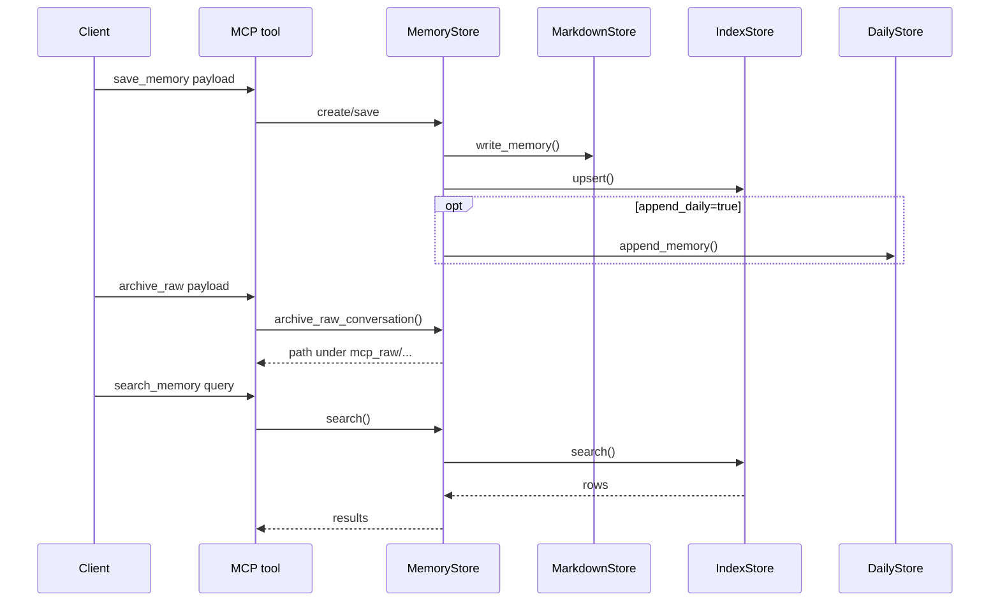
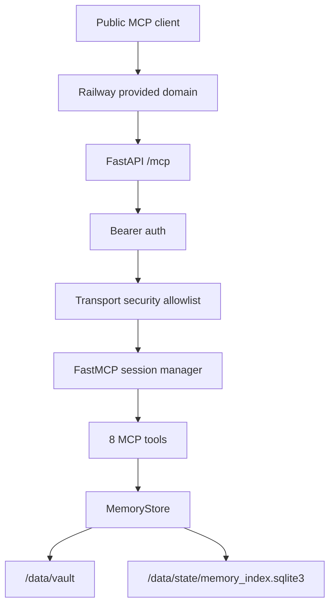
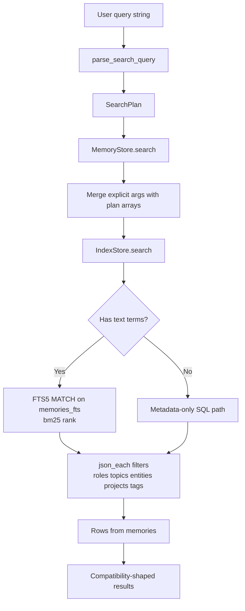
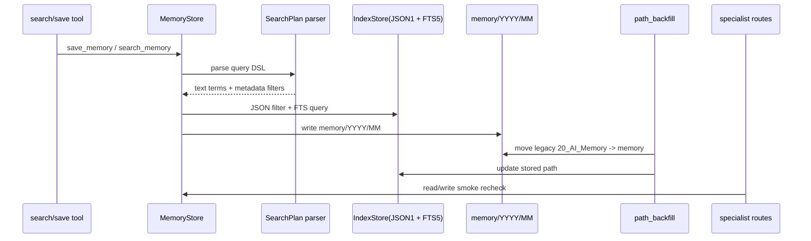
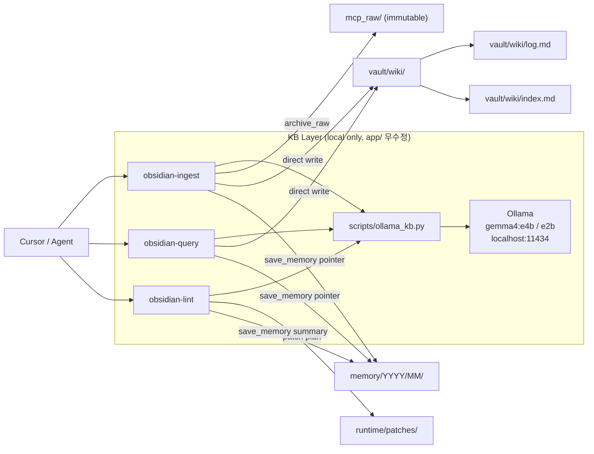
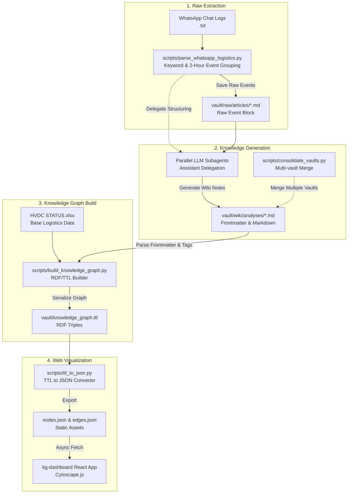

# System Architecture

> ⚠️ **CRITICAL WARNING / 중요 경고** ⚠️
> **모든 작업 및 데이터는 반드시 아래 Vault 경로를 사용해야 합니다:**
> `C:\Users\jichu\Downloads\valut`

이 문서는 `mcp_obsidian` 루트의 현재 런타임 구조를 정리한 아키텍처 참조 문서다.
기준 우선순위는 `AGENTS.md`, 현재 코드, 그리고 실제 검증 결과다.

## 목적

- Obsidian vault를 Markdown SSOT로 유지한다.
- SQLite는 Markdown에서 파생된 검색용 인덱스로만 사용한다.
- 읽기는 넓게, 쓰기는 의도적으로 유지한다.
- Cursor, Claude Code, 그리고 원격 API 계열 클라이언트가 같은 backend/store를 공유하되, client-specific MCP profiles를 가질 수 있게 유지한다.
- 이 문서의 기본 범위는 현재 repo의 직접 runtime(`app/main.py`)이다.
- sibling `local-rag`, `standalone-package`는 현재 통합 경계에는 포함되지만, 구현 소유권은 이 저장소 밖에 있다.

## 런타임 구성

현재 실행 경로는 다음과 같다.

- FastAPI 앱이 `app/main.py`에서 시작된다.
- `app/chatgpt_main.py`도 별도 앱 엔트리로 존재하지만, 이 문서의 기본 운영 기준은 통합 앱 `app/main.py`다.
- `/healthz`는 상태 확인용 경로다.
- `/chatgpt-healthz`, `/claude-healthz`는 hosted specialist read-only profile 상태 확인용 경로다.
- `/chatgpt-write-healthz`, `/claude-write-healthz`는 hosted specialist write-capable sibling profile 상태 확인용 경로다.
- `/mcp`는 FastMCP 스트리머블 HTTP 앱을 마운트한 경로다.
- `/chatgpt-mcp`는 ChatGPT용 read-only `search` / `fetch` / `list_recent_memories` / `search_wiki` / `fetch_wiki` profile이다.
- `/chatgpt-mcp`는 현재 코드 기준으로 read-only tools 외에 `resources`와 `prompts` discoverability surface도 함께 가진다.
- `/chatgpt-mcp-write`는 ChatGPT용 authenticated specialist write-capable sibling profile이다.
- `/claude-mcp`는 Claude용 read-only `search` / `fetch` / `list_recent_memories` / `search_wiki` / `fetch_wiki` profile이다.
- `/claude-mcp`는 현재 코드 기준으로 read-only tools 외에 `resources`와 `prompts` discoverability surface도 함께 가진다.
- `/claude-mcp-write`는 Claude용 authenticated specialist write-capable sibling profile이다.
- 인증은 route별 effective token이 비어 있지 않을 때 Bearer token으로 적용된다. `/mcp`는 `MCP_API_TOKEN`, `/chatgpt-mcp-write`는 `CHATGPT_MCP_WRITE_TOKEN` 또는 `MCP_API_TOKEN`, `/claude-mcp-write`는 `CLAUDE_MCP_WRITE_TOKEN` 또는 `MCP_API_TOKEN`을 사용한다.
- 현재 Bearer auth는 `/mcp`, `/chatgpt-mcp-write`, `/claude-mcp-write` 경로에 적용된다.
- `/chatgpt-mcp`와 `/claude-mcp`는 현재 코드에서 bearer 없이 노출되는 read-only specialist mounts다. 이 경로들은 auth middleware 대상이 아니다.
- MCP 도구층은 `app/mcp_server.py`에 있으며 `search_memory`, `save_memory`, `get_memory`, `list_recent_memories`, `update_memory`, `archive_raw`, `search`, `fetch`, `search_wiki`, `fetch_wiki`와 wiki-native tools를 노출한다.
- `app/resources_server.py`는 `wiki/index`, `wiki/log/recent`, `wiki/topic/{slug}`, `schema/memory`, `ops/verification/latest`, `ops/routes/profile-matrix` resource를 노출한다.
- `app/prompts_server.py`는 `ingest_memory_to_wiki`, `reconcile_conflict`, `weekly_lint_report`, `summarize_recent_project_state` prompt를 노출한다.
- `app/services/wiki_search_service.py`는 `wiki/analyses` 범위의 read-only search/fetch를 담당한다.
- `app/wiki_tools.py`는 write profile 전용 `sync_wiki_index`, `append_wiki_log`, `write_wiki_page`, `lint_wiki`, `reconcile_conflict` tool을 노출한다.
- `app/chatgpt_mcp_server.py`, `app/claude_mcp_server.py`는 read-only standard `search` / `fetch` / `list_recent_memories` / `search_wiki` / `fetch_wiki` + `resources/prompts`와 authenticated sibling `search`, `fetch`, `list_recent_memories`, `search_wiki`, `fetch_wiki`, `save_memory`, `get_memory`, `update_memory`, wiki-native tools 조합을 제공한다.
- `app/chatgpt_mcp_server.py`와 `app/claude_mcp_server.py`에서 write tools는 `include_write_tools=True`일 때만 등록된다.
- `app/config.py`는 `WIKI_OVERLAY_DIRNAME`을 노출하며, 현재 기본값은 `wiki`다.
- `MemoryStore`는 저장·조회·검색·업데이트를 묶는 서비스 계층이다.
- `RawArchiveStore`는 raw conversation note를 `mcp_raw/` 아래에 저장한다.
- `MarkdownStore`는 vault 안의 Markdown 파일을 SSOT로 기록한다.
- `IndexStore`는 SQLite에 upsert 하고 검색을 빠르게 한다.
- `DailyStore`는 일간 노트 append를 선택적으로 처리한다.
- `SchemaValidator`는 shared schema를 로드해 write 전에 검증한다.
- `obsidian-memory-plugin/`는 local curator subproject이며 public MCP server 역할은 하지 않는다.
- `examples/`와 `docs/`는 런타임이 아니라 운영/연동 보조 자산이다.
- Railway preview에서는 `Dockerfile` 기반 컨테이너가 실행되고, volume `/data`가 vault/index 저장소를 제공한다.
- Railway production에서는 `/mcp`, `/chatgpt-mcp`, `/chatgpt-mcp-write`, `/claude-mcp`, `/claude-mcp-write`가 같은 volume `/data`를 공유한다.
- Railway public domain에서는 FastMCP DNS rebinding protection 때문에 explicit host/origin allowlist가 필요하다.
- 2026-04-11 current session에서는 production redeploy 후 read-only/write-side surfaces가 local current code와 일치했다. 아래의 2026-04-11 failure 기록은 redeploy 이전 snapshot이고, 이후 PASS 기록이 current-session final state다.
- `docs/HMAC_PHASE_2.md`는 optional signed-write phase-2 계약 문서다. 현재 루트 runtime 설명에서는 adjacent contract로 취급한다.
- optional dependency `[mcp]`가 빠져 있으면 `/mcp/`, `/chatgpt-mcp/`, `/chatgpt-mcp-write/`, `/claude-mcp/`, `/claude-mcp-write/`와 그 하위 path는 `503 mcp_dependency_missing` fallback을 반환한다.
- 현재 local code 기준으로 `WIKI_OVERLAY_DIRNAME`이 가리키는 overlay root는 compiled wiki layer다. `WikiStore`는 `index.md`, `log.md`, `topics/`, `entities/`, `conflicts/`, `reports/`를 만든다.

## Companion Runtime Boundary

현재 운영 문맥에는 아래 sibling runtime이 함께 등장하지만, 이 repo의 `app/` 코드 안에는 포함되지 않는다.

- `..\local-rag`
  - FastAPI local retrieval/generation service
  - `GET /health`
  - `POST /api/internal/ai/chat-local`
  - `GET /api/internal/ai/chat-local/ready`
  - conservative retrieval cache + sidecar metadata file
  - shared-secret guard via `x-local-rag-token`
- `..\myagent-copilot-kit\standalone-package`
  - app/proxy/orchestrator layer
  - `GET /api/ai/health` returns `localIntelligence` section: `{ok, memory: {...}, localRag: {...}}`
  - `localIntelligenceOk` flag = `memoryOk && localRagOk`
  - `localOnlyChatOk` now requires both `memoryOk` AND `localRagOk` (tightened)
  - `MYAGENT_LOCAL_RAG_BASE_URL`, `MYAGENT_LOCAL_RAG_TOKEN`
  - Default memory MCP mount changed from `/chatgpt-mcp-write` to `/chatgpt-mcp` (read-only, no bearer required)
  - `MYAGENT_MEMORY_TOKEN` / `MYAGENT_MEMORY_BEARER_TOKEN` / `MCP_API_TOKEN` as bearer fallback
  - RAG keyword auto-detection: messages with 근거/요약/문서/통관/etc → automatic local-rag route
  - Memory enrichment: when RAG keyword detected, queries memory MCP and injects KB context as system message
  - `kbEnriched` flag in `/api/ai/chat` response
  - Memory search query shortened to 80 chars for better Korean text hit rate
  - `routeHint=local` forces local route; `routeHint=copilot` forces copilot route
  - `local route` defaults to `gemma4:e4b` when the request omits `model`
  - `non-loopback bind` 시 `MYAGENT_PROXY_AUTH_TOKEN` 미설정이면 startup fail-fast

즉, 이 저장소는 durable memory / MCP control plane을 직접 소유하고, local chat-local orchestration은 companion runtime과의 경계로만 다룬다.


## 데이터 흐름

### `save_memory`

1. MCP tool이 `MemoryCreate` payload를 만든다.
2. `MemoryStore`가 현재 시간대를 기준으로 memory ID와 상대 경로를 만든다.
3. `MarkdownStore`가 vault에 Markdown 파일을 먼저 쓴다.
4. `IndexStore`가 SQLite에 upsert 한다.
5. `append_daily=True`이면 `DailyStore`가 `10_Daily/YYYY-MM-DD.md`에 보조 로그를 쓴다.

### `archive_raw`

1. MCP tool이 `mcp_id`, `source`, `body_markdown` 등으로 `RawConversationCreate`에 해당하는 입력을 받는다.
2. `MemoryStore.archive_raw_conversation()`가 `RawArchiveStore`에 위임한다.
3. `mcp_raw/<source>/<YYYY-MM-DD>/<mcp_id>.md`에 YAML frontmatter + body가 기록된다 (인덱스 대상은 아니다).

### `search_memory`

1. MCP tool이 query, types, project, tags, limit, recency 조건을 받는다.
2. `MemoryStore`가 query와 tag를 정규화한다.
3. `IndexStore`가 SQLite에서 후보를 읽는다.
4. `MemoryStore`가 결과를 루트 계약에 맞는 dict shape로 반환한다.

### `Railway preview request path`

1. 외부 client가 Railway public HTTPS domain으로 요청한다.
2. Railway edge가 FastAPI `/mcp`로 전달한다.
3. FastAPI bearer auth가 `Authorization: Bearer <token>`를 검증한다.
4. runtime host/origin lists가 모두 비어 있지 않을 때에만 FastMCP transport security가 allowlist를 검증한다. 이 리스트는 `MCP_ALLOWED_HOSTS`, `MCP_ALLOWED_ORIGINS`뿐 아니라 Railway-derived runtime values에서도 확장될 수 있다.
5. MCP session manager가 streamable HTTP 세션을 생성하거나 기존 세션을 사용한다.
6. tool call은 동일한 `MemoryStore` 계층으로 내려간다.



## 보호 계약

아래 계약은 유지되어야 한다.

- Tool names는 `search_memory`, `save_memory`, `get_memory`, `list_recent_memories`, `update_memory`, `archive_raw`, `search`, `fetch`다.
- public endpoint shape는 `/mcp`, `/healthz`에 더해 specialist read/write mounts와 their health endpoints를 포함한다: `/chatgpt-mcp`, `/chatgpt-mcp-write`, `/claude-mcp`, `/claude-mcp-write`, `/chatgpt-healthz`, `/chatgpt-write-healthz`, `/claude-healthz`, `/claude-write-healthz`.
- Markdown-first architecture를 유지한다.
- SQLite는 derived index / accelerator only 이다.
- Vault relative path는 `/` separator를 사용한다.
- Memory ID는 `MEM-YYYYMMDD-HHMMSS-XXXXXX` 패턴을 유지한다.
- Frontmatter key는 임의 rename 하지 않는다.
- Compatibility wrapper response shape는 유지한다.
- 자동 write 범위는 넓히지 않는다.
- 새 memory writes는 `memory/YYYY/MM/` 아래로 저장하고, legacy `20_AI_Memory/...`는 read/update 호환 경로로 유지한다.
- `/chatgpt-mcp`, `/claude-mcp` read-only 마운트는 bearer 없이 노출됨. 프로덕션 배포 시 네트워크/프록시 레이어에서 차단하거나 전용 read token을 추가할 것 (변경 시 auth 게이트 승인 필요).
- `MCP_API_TOKEN` 기본값 `dev-change-me`는 프로덕션에서 반드시 교체해야 한다.
- `CHATGPT_MCP_WRITE_TOKEN`, `CLAUDE_MCP_WRITE_TOKEN`을 따로 두면 write sibling route에 별도 bearer를 적용할 수 있다. 비어 있으면 각 write route는 `MCP_API_TOKEN`으로 fallback 된다.

## 현재 코드 기준 상세

- `app/main.py`는 FastAPI app을 만들고 `/mcp`에 FastMCP app을 마운트한다.
- `app/main.py`는 통합 앱에서 `/mcp`, `/chatgpt-mcp`, `/chatgpt-mcp-write`, `/claude-mcp`, `/claude-mcp-write`를 함께 마운트한다.
- `app/mcp_server.py`는 wrapper helper를 통해 `search`와 `fetch`의 레거시 응답 모양을 유지한다.
- `app/chatgpt_mcp_server.py`와 `app/claude_mcp_server.py`는 standard `search` / `fetch` / `list_recent_memories` read-only profile과 authenticated write-capable sibling profile을 제공한다.
- `app/utils/specialist_readonly.py`는 specialist read-only `search`가 generic recent/list query를 recent browse로 보정하도록 돕는다.
- `app/config.py`는 `MCP_ALLOWED_HOSTS`, `MCP_ALLOWED_ORIGINS`를 CSV env로 읽는다.
- `app/config.py`는 `MCP_HMAC_SECRET`와 `mcp_hmac_enabled` flag를 제공한다. 실제 signed-write runtime 적용 여부는 별도 contract / implementation 확인이 필요하다.
- `app/config.py`는 `WIKI_OVERLAY_DIRNAME`으로 wiki overlay root를 바꿀 수 있게 한다. 현재 구현의 기본값은 `wiki`다.
- `app/mcp_server.py`는 allowlist가 있으면 `TransportSecuritySettings`를 명시적으로 주입한다.
- `app/services/memory_store.py`는 normalize, path build, save, get, recent, update 책임을 가진다.
- `app/services/raw_archive_store.py`는 raw conversation frontmatter/body를 `mcp_raw/`에 저장한다.
- `app/services/index_store.py`는 SQLite schema, upsert, search, recent를 담당한다.
- `app/services/markdown_store.py`는 frontmatter와 body 형식으로 Markdown SSOT를 기록한다.
- `app/services/daily_store.py`는 daily note append를 보조한다.
- `app/services/schema_validator.py`는 `schemas/`를 로드한다.
- `app/services/wiki_store.py`는 compiled wiki overlay를 관리한다. overlay root 아래에 `index.md`, `log.md`, `topics/`, `entities/`, `conflicts/`, `reports/`를 만들고, compiled page에는 `compiled_layer: true` frontmatter를 넣는다.
- `app/services/wiki_index_service.py`는 recent memory pointers를 바탕으로 `wiki/index.md`를 다시 만든다.
- `app/services/wiki_log_service.py`는 recent memory activity를 `wiki/log.md`에 반영하고, append-style log entry도 추가한다.
- `app/resources_server.py`의 wiki resources는 overlay를 직접 읽는 것이 아니라 compiled overlay surface를 읽는 용도다.
- `search_wiki` / `fetch_wiki`는 기존 `memory` search/fetch semantics를 바꾸지 않고 `wiki/analyses`를 별도 corpus로 읽는 용도다.
- `app/wiki_tools.py`의 write tools는 compiled wiki overlay만 갱신한다. raw archive나 memory SSOT를 직접 대체하지 않는다.
- `schemas/`는 raw/memory note contract의 단일 기준선이다.
- `app/utils/ids.py`, `app/utils/sanitize.py`, `app/utils/time.py`는 계약 보조 헬퍼다.

## 직접 확인한 실행 결과

### 2026-04-08 current workspace recheck

- `.venv\Scripts\python.exe -m pytest -q` → **65 passed**
- `.venv\Scripts\python.exe -m ruff check .` → **fail** (`11` existing issues, including tracked `app.py`)
- `.venv\Scripts\python.exe -m ruff format --check .` → **fail** (`3` files would be reformatted, `58` files already formatted)
- `.venv\Scripts\python.exe -c "from app.main import app; print(app.title)"` → `obsidian-mcp`

### 2026-04-11 current session — local code vs deployed production surface

- current local code 기준 `/mcp`는 15개 tool을 가진다: `search_memory`, `save_memory`, `get_memory`, `list_recent_memories`, `update_memory`, `archive_raw`, `search`, `fetch`, `search_wiki`, `fetch_wiki`, `sync_wiki_index`, `append_wiki_log`, `write_wiki_page`, `lint_wiki`, `reconcile_conflict`
- current local `/chatgpt-mcp`, `/claude-mcp`는 read-only tools 외에 `resources`와 `prompts`도 노출한다.
- current local write-capable sibling mounts는 `save_memory`, `get_memory`, `update_memory`와 wiki-native tools를 함께 노출한다.
- current session의 final state에서는 `railway up -d` 이후 production `/chatgpt-mcp`와 `/claude-mcp` read-only recheck가 PASS였고, 두 route 모두 `search`, `fetch`, `list_recent_memories`, `search_wiki`, `fetch_wiki`, `resources = 5`, `prompts = 4` surface를 노출했다.
- current session의 final state에서는 production `/chatgpt-mcp-write`와 `/claude-mcp-write` write-side recheck도 PASS였고, 두 route 모두 `save_memory`, `get_memory`, `update_memory`와 wiki-native tools를 포함한 same 13-tool surface를 노출했다.
- 같은 세션 안의 earlier fail snapshot은 redeploy 전 배포 지연과 verifier header/tool expectation mismatch를 보여 준 중간 증거다. 현재 상태 판정은 later PASS 기준으로 읽고, earlier fail detail은 `docs/MCP_RUNTIME_EVIDENCE.md`에 시간순으로 남긴다.

### 2026-04-08 companion ingest + local route verification

- note: 아래 기록은 sibling repo의 temp companion runtime evidence다. current local `127.0.0.1:3010` 프로세스와 같은 세션 결과로 합치지 않는다.
- local MCP `/healthz` → `200 {"ok":true,"service":"obsidian-mcp"}`
- local-rag `/health` → `200`, `model = gemma4:e4b`, repo `vault/wiki` 기준 temp instance에서 `documents = 7`
- standalone `/api/ai/health` (temp instance) → `localOnlyChatOk = true`, `memoryOk = true`, `localRag.chatRouteReady = true`
- manual KB ingest
  - raw copy → `vault/raw/articles/chatgpt-projects-pipeline-standard.md`
  - wiki note → `vault/wiki/concepts/chatgpt-projects-pipeline-standard.md`
  - MCP `archive_raw` returned id → `convo-chatgpt-projects-pipeline-standard-2026-04-08`
  - MCP `save_memory` returned id → `MEM-20260408-163522-F9FE2A`
- temp `local-rag` direct call → ingested concept note를 retrieval source로 반환
- temp `standalone-package` memory bridge
  - `/api/memory/search` → `MEM-20260408-163522-F9FE2A`
  - `/api/memory/fetch` → saved pointer 본문
- temp `standalone-package` local route
  - 이전 동작: `model` 미지정 시 Copilot default model이 내려가 `local-rag` 503 유발 가능
  - 현재 동작: `model` 미지정이어도 local route가 `gemma4:e4b`로 자동 매핑되어 `POST /api/ai/chat` 성공
- note: repo vault 직접 확인 대상은 `vault/raw/` / `vault/wiki/` direct-write 결과였다. `archive_raw`는 returned `mcp_id` + `path` 기준으로 확인했고, `save_memory`는 returned `id` + `/api/memory/search` / `/api/memory/fetch` readback 기준으로 검증했다

### 2026-04-08 production specialist route recheck (current Codex session)

- production `/chatgpt-mcp` tool set → `search`, `fetch`, `list_recent_memories`
- `list_recent_memories(limit=5)` → recent titles 5건 반환
- generic recent query fallback
  - `search("2026 03 memory memo")` → recent browse와 같은 결과 반환
  - first hit `fetch(id)` → wrapper fetch payload 정상 반환

### 2026-04-08 current local standalone spot-check (current Codex session)

- `GET http://127.0.0.1:3010/` → `200`, title `Standalone Chat`, input + send button visible
- `GET http://127.0.0.1:3010/api/ai/health` → `200`
  - `chatOk = false`
  - `localOnlyChatOk = false`
  - `memoryOk = false`
  - payload 내부 `localRag.status = "down"`, `ollama = "down"`
  - payload 내부 `memory.status = "ok"`, `tools = ["search", "fetch", "list_recent_memories", "save_memory", "get_memory", "update_memory"]`
- `GET http://127.0.0.1:3010/api/memory/health` → `503`
  - payload는 `memory.status = "ok"`를 유지해 bridge health 판정과 payload 상태가 어긋남
- `POST http://127.0.0.1:3010/api/memory/save` → `200`
  - sample id: `MEM-20260408-221147-54967A`
  - follow-up `GET /api/memory/fetch?id=MEM-20260408-221147-54967A` → saved record readback 확인
- `POST http://127.0.0.1:3010/api/ai/chat` with valid `messages[]` payload and `routeHint: "local"` → `503 LOCAL_RUNNER_FAILED`
  - detail: local-rag upstream returned `OLLAMA_UNAVAILABLE` because `http://127.0.0.1:11434/api/chat` returned `404`

### 2026-04-07 QA 검증 (historical snapshot; mstack-pipeline 5라운드 병렬)

- `ruff check .` → All checks passed ✅ (scripts/ 24건 수정 후)
- `ruff format --check .` → 22 files already formatted ✅
- `pytest -q` → **65 passed, 0 failed** ✅
- `from app.main import app` → import OK ✅
- vault 4계층 존재 확인: `vault/raw/`, `vault/mcp_raw/`, `vault/wiki/`, `vault/memory/` ✅
- cross-layer 오염 없음 (memory 노트가 wiki 본문을 중복 저장하지 않음) ✅
- `.cursor/skills/obsidian-{ingest,query,lint}/SKILL.md` frontmatter 수정 완료 ✅

### 2026-03-28 기준으로 아래를 직접 확인했다

- local verification
  - `pytest -q` -> pass
  - `ruff check .` -> pass
  - `ruff format --check .` -> pass
- plugin verification
  - `npm run check` -> pass
  - `npm run build` -> pass
- Railway preview verification
  - `/healthz` -> `200`
  - `/mcp` -> `307` with `https://.../mcp/`
  - `/mcp/` -> `400 Missing session ID`
  - public HTTPS에서 `list_recent_memories`, `search_memory`, `get_memory`, `search`, `fetch` 성공
  - raw archive exclusion query는 empty results
- Railway production specialist verification
  - `/chatgpt-healthz` -> `200`
  - `/chatgpt-write-healthz` -> `200`
  - `/claude-healthz` -> `200`
  - `/claude-write-healthz` -> `200`
  - `/chatgpt-mcp` read-only `search` / `fetch` -> pass
  - `/chatgpt-mcp-write` authenticated `search` / `fetch` / `save_memory` / `get_memory` / `update_memory` -> pass
  - `/claude-mcp` read-only `search` / `fetch` -> pass
  - `/claude-mcp-write` authenticated `search` / `fetch` / `save_memory` / `get_memory` / `update_memory` -> pass
- note: 위 항목은 2026-03-28 historical specialist verification이다. 2026-04-11 current session의 earlier snapshot에서는 production write sibling route가 아직 wiki-native tools를 노출하지 않는다는 점이 확인됐고, later redeploy snapshot에서는 PASS로 갱신됐다.



## 채택하지 않은 delivery snapshot 변경

delivery snapshot의 내용 중 아래는 현재 루트 계약에 맞지 않아 채택하지 않았다.

- alternate auth module로의 교체
- alternate host/port defaults
- `FastMCP` factory를 통한 응답 shape 변경
- `search` / `fetch` wrapper shape 변경
- 루트 계약을 덮는 snapshot replacement

이 프로젝트에서는 safe selective merge만 허용하고, 보호 계약을 우선한다.

## 검증 관점

이 문서를 기준으로 확인할 항목은 다음이다.

- `/healthz`와 `/mcp`가 현재 루트 코드와 일치하는가
- `save_memory`가 Markdown first, SQLite second 순서를 지키는가
- `search_memory`와 compatibility wrapper의 반환 shape가 유지되는가
- delivery archive는 문서 참조 대상으로만 남아 있는가
- Railway preview가 로컬 계약을 깨지 않고 같은 MCP surface를 노출하는가
- 현재 local code와 production deployment의 검증은 분리해서 봐야 한다. local code의 tool/resource surface는 이 문서의 기준이며, production은 별도 redeploy와 smoke recheck가 있어야 같은 상태로 판정할 수 있다.
- `tests/test_auth.py`는 bearer-required route와 bearer-free specialist read-only route를 검증한다.
- `tests/test_wiki_overlay_surface.py`와 `tests/test_wiki_write_surface.py`는 compiled wiki overlay resource/prompt surface와 write-only wiki tool surface를 검증한다.
- `tests/test_wiki_search_service.py`와 `tests/test_dual_corpus_mcp.py`는 wiki read surface와 dual-corpus MCP contract를 검증한다.

## 2026-03-28 Search V2 And Path Migration Addendum

이 섹션은 기존 설명을 대체하지 않고, 최신 구현 기준으로 추가된 검색 v2, 메타데이터 배열 저장, 경로 마이그레이션, specialist route 재확인 사항만 덧붙인다.

### SearchPlan parsing과 검색 DSL

- `app/models.py`에는 `SearchPlan`이 추가되어 `raw_query`, `text_terms`, `roles`, `topics`, `entities`, `projects`, `tags`, `status`, `after`, `before`, `limit`를 구조화한다.
- `app/utils/search_query.py`의 `parse_search_query()`는 `text:"..."`, `role:`, `topic:`, `entity:`, `project:`, `tag:`, `status:`, `after:`, `before:`, `limit:` 토큰을 파싱한다.
- quoted phrase와 bare token은 `text_terms`로 들어가고, 인식하지 못한 `key:value`는 버리지 않고 자유 텍스트 검색어로 되돌린다.
- 빈 query는 예외 대신 빈 `SearchPlan`으로 정규화되어 기존 호출자와 호환된다.
- `MemoryStore.search()`는 query string에서 파싱한 structured filter와 별도 함수 인자로 받은 `roles/topics/entities/projects/tags`를 merge한 뒤 `IndexStore.search()`에 전달한다.

### Metadata arrays와 정규화 계약

- `MemoryCreate`, `MemoryPatch`, `MemoryRecord`는 `roles`, `topics`, `entities`, `projects`, `tags`, `raw_refs`, `relations`를 배열 필드로 유지한다.
- 입력은 단일값이어도 배열로 정규화하고, 공백 collapse, case-insensitive dedupe, language lowercase를 적용한다.
- `MemoryCreate`는 model validator에서 `role/...`, `topic/...`, `entity/...`, `project/...` namespaced tag를 자동 파생한다.
- `MemoryStore.save()`와 `MemoryStore.update()`는 이 배열 계약을 Markdown frontmatter와 SQLite index 양쪽에 같은 의미로 기록한다.

### JSON1+FTS5 search layer in IndexStore

- `IndexStore`는 startup 시 SQLite `JSON1`과 `FTS5` 지원을 강제 확인한다. 기능이 없으면 index를 degrade 하지 않고 바로 실패시킨다.
- `memories` 테이블은 JSON array 원본 컬럼 `roles/topics/entities/projects/tags/raw_refs/relations`와, FTS 가속용 평탄화 텍스트 컬럼 `tags_text/topics_text/entities_text/projects_text`를 같이 가진다.
- 기존 row는 `_refresh_search_text_columns()`로 평탄화 텍스트를 backfill 하고, `memories_fts` external-content virtual table은 `rebuild`로 재생성한다.
- insert/update/delete trigger가 `memories_fts`를 자동 동기화한다.
- 검색 시 자유 텍스트가 있으면 `FTS5 MATCH + bm25()`를 사용하고, structured filter는 `json_each(...) EXISTS`로 SQL 레벨에서 적용한다.
- 자유 텍스트가 없으면 metadata/date filter만으로 `updated_at DESC` 경로를 사용한다.
- 현재 date filter는 `created_at` 기준이며, `recency_days`는 SQL 이후 Python 후처리로 유지된다.



### `memory/YYYY/MM` write path와 legacy path compatibility

- 새 memory 문서는 `MemoryStore._memory_rel_path()`를 통해 `memory/YYYY/MM/<memory_id>.md`로 저장된다.
- vault bootstrap은 `memory/`와 legacy `20_AI_Memory/`를 함께 유지해 기존 문서와 새 문서가 공존할 수 있게 한다.
- `get`, `recent`, `update`는 index에 기록된 `path`를 기준으로 동작하므로 기존 legacy path row도 읽기와 수정이 가능하다.
- update는 기존 `path`를 그대로 유지한 채 문서를 다시 쓰므로, legacy 문서도 rewrite 시 같은 상대 경로에 재기록된다.

### Backfill / apply migration

- `app/services/path_backfill.py`는 legacy `20_AI_Memory/...` path row를 `memory/YYYY/MM/...` 구조로 옮기기 위한 별도 마이그레이션 유틸리티다.
- `plan_memory_path_backfill()`는 DB row의 `created_at`과 `id`로 target path를 계산하고, 파일/인덱스 상태를 비교해 `move`, `update_index_only`, `conflict`, `missing`으로 분류한다.
- `apply_memory_path_backfill(..., apply=False)`는 dry-run summary만 반환하고 파일과 DB를 바꾸지 않는다.
- `apply=True`일 때만 파일 move와 index `path` update가 실행된다.
- 테스트는 dry-run 비파괴성, 실제 move, index path 갱신을 각각 검증한다.

### Production specialist route smoke recheck

2026-03-28에 공개 production route 표면을 다시 확인했다.

- `https://mcp-server-production-90cb.up.railway.app/healthz` -> `200`
- `https://mcp-server-production-90cb.up.railway.app/chatgpt-healthz` -> `200`
- `https://mcp-server-production-90cb.up.railway.app/chatgpt-write-healthz` -> `200`
- `https://mcp-server-production-90cb.up.railway.app/claude-healthz` -> `200`
- `https://mcp-server-production-90cb.up.railway.app/claude-write-healthz` -> `200`
- `GET /chatgpt-mcp/` with `Accept: text/event-stream` -> `400 Missing session ID`
- `GET /claude-mcp/` with `Accept: text/event-stream` -> `400 Missing session ID`
- `GET /chatgpt-mcp-write/` without bearer -> `401 unauthorized`
- `GET /claude-mcp-write/` without bearer -> `401 unauthorized`
- 위 2026-03-28 항목은 historical snapshot이다. current 2026-04-11 session에서는 `scripts/verify_specialist_mcp_write.py`로 production `/chatgpt-mcp-write/`와 `/claude-mcp-write/` authenticated full tool smoke를 다시 실행했고, 결과는 `docs/MCP_RUNTIME_EVIDENCE.md`에 current-session PASS로 기록했다.

### Latest verification evidence tied to this addendum

- local targeted tests: `pytest -q tests/test_search_v2.py tests/test_path_backfill.py tests/test_healthz.py tests/test_auth.py` -> `20 passed`
- `tests/test_search_v2.py`는 SearchPlan 파싱, namespaced tag 파생, DSL 단일 query 검색, hyphenated token 검색을 검증한다.
- `tests/test_path_backfill.py`는 legacy path dry-run과 apply migration을 검증한다.
- `tests/test_healthz.py`, `tests/test_auth.py`는 specialist healthz와 write route auth gate를 검증한다.

## 2026-03-28 Architecture Delta — Metadata V2 and Production Migration

기존 아키텍처 설명을 유지한 채, 이번 구현으로 실제로 늘어난 계층만 추가 기록한다.

### SearchPlan and Query Semantics

- `app/models.py`의 `SearchPlan`이 query parsing의 typed contract다.
- `app/utils/search_query.py`는 free text + structured filter를 함께 해석한다.
- `MemoryStore.search()`는 parser 결과와 explicit args를 merge한다.
- `IndexStore.search()`는:
  - metadata array filter는 `json_each(...)`
  - text search는 FTS5 `MATCH`
  - 결과 정렬은 `bm25(...) + updated_at`

### Storage Path Delta

- current write path:
  - `memory/YYYY/MM/<MEM-ID>.md`
- legacy compatibility:
  - stored path가 legacy `20_AI_Memory/...`여도 `get`, `fetch`, `update`는 계속 읽는다
- operator migration:
  - `app/services/path_backfill.py`
  - `scripts/backfill_memory_paths.py`

### Production Runtime Delta

- production volume backfill apply가 완료됐다.
- legacy production notes `18건`이 `memory/YYYY/MM/...`로 이동됐다.
- post-apply dry run은 `candidate_count = 0`으로 닫혔다.
- specialist routes는 path migration 후 다시 smoke 검증됐다.



### Current Production Recheck Facts

- deployment after FTS fix:
  - `7f706b9c-9d3d-429d-abb7-ca8519c225c7`
  - `SUCCESS`
- read-only recheck:
  - ChatGPT -> pass
  - Claude -> pass
- write sibling recheck:
  - ChatGPT -> pass
    - sample id: `MEM-20260328-234330-5D6BA3`
  - Claude -> pass
    - sample id: `MEM-20260328-234330-2D7741`

## 2026-04-07 KB Layer — Gemma 4 + Ollama + 3 Cursor Skills

이 섹션은 기존 MCP 서버 계층과 분리된 로컬 KB 계층을 정의한다. `app/` 코드는 무수정이다.

### KB Layer 목적

- `vault/wiki/`를 장기 KB canonical 트리로 관리한다.
- Gemma 4 (로컬 Ollama)를 ingest/query/lint 워크플로우의 LLM으로 사용한다.
- `memory/`와 `mcp_raw/`의 역할을 오염하지 않는다.

### LLM Runtime

| 항목 | 값 |
|---|---|
| Provider | Ollama |
| Base URL | `http://localhost:11434` (env: `OLLAMA_BASE_URL`) |
| Primary model | `gemma4:e4b` (9.6 GB, 128K ctx) |
| Light model | `gemma4:e2b` (7.2 GB, 128K ctx) |
| API | `POST /api/chat`, `stream: false` |
| Timeout | 300 s (env: `OLLAMA_TIMEOUT`) |
| Adapter | `scripts/ollama_kb.py::generate()` |

### 스토리지 라우팅

```
입력/대화    →  archive_raw  →  mcp_raw/<source>/<date>/<id>.md  (immutable)
KB canonical →  직접 쓰기    →  vault/wiki/<category>/<slug>.md
요약/포인터  →  save_memory  →  memory/<YYYY>/<MM>/<MEM-ID>.md
운영 산출물  →  직접 쓰기    →  runtime/patches/ , runtime/audits/
```

`memory/`에는 **포인터 + 한 줄 요약만** 저장한다. wiki canonical 전문을 복사하지 않는다.

### 3개 스킬 역할

| Skill | 모델 | 역할 |
|---|---|---|
| `obsidian-ingest` | `gemma4:e4b` | 소스 분류 → wiki note 생성 → archive_raw → log·index 갱신 → memory 포인터 |
| `obsidian-query` | `gemma4:e4b` | wiki 검색 → Ollama 재순위 → 합성 답변 → analyses 저장(선택) → memory 포인터 |
| `obsidian-lint` | `gemma4:e2b` | frontmatter·링크·중복·품질 감사 → patch plan JSON → memory 결과 요약 |

### 아키텍처 다이어그램



## 2026-04-07 KB Layer E2E Verification

Phase 1-4 전 단계 로컬 실행으로 검증됨.

### 환경 확인 (Phase 1)

| 항목 | 결과 |
|---|---|
| `gemma4:e4b` | ✅ 설치 (9.6 GB) |
| `gemma4:e2b` | ✅ 설치 (7.2 GB) |
| `VAULT_PATH` | ✅ `./vault` |
| `OBSIDIAN_LOCAL_VAULT_PATH` | ✅ `C:\Users\jichu\OneDrive\문서\Obsidian Vault` |
| MCP `/healthz` | ✅ `{"ok":true,"service":"obsidian-mcp"}` |
| `vault/wiki/` 구조 | ✅ sources/concepts/entities/analyses + index.md + log.md |

### obsidian-ingest (Phase 2) — PASS

| Step | 결과 |
|---|---|
| Ollama health | OK |
| `archive_raw` | `mcp_raw/cursor/2026-04-07/convo-kb-ingest-test-2026-04-07.md` |
| Classify `gemma4:e4b` | `category=entities, slug=gemma-4-llm-model` |
| Knowledge extraction | 591자 한국어 구조화 본문 |
| Wiki note write | `vault/wiki/entities/gemma-4-llm-model.md` |
| `save_memory` pointer | `MEM-20260407-212039-9C7277` (`roles:["fact"]`, `raw_refs:[mcp_id]`) |
| `vault/wiki/log.md` | 업데이트 완료 |

### obsidian-query (Phase 3) — PASS

| Step | 결과 |
|---|---|
| 한국어 질의 | `"Gemma 4 모델에 대해 우리가 알고 있는 것은? 크기와 특징을 알려줘."` |
| 후보 검색 | 2개 노트, keyword score=2 각각 |
| Re-rank `gemma4:e4b` | `[0, 1]` JSON 정상 반환 |
| 합성 답변 | 1498자 한국어, `[[wiki/...]]` 인용 포함 |
| analyses 저장 | 건너뜀 (simple lookup — 정상 동작) |

### obsidian-lint (Phase 4) — PASS

| Step | 결과 |
|---|---|
| Historical run summary | 초기 2개 노트 기준 duplicate 감지 중심으로 보고됨 |
| Current artifact snapshot | `runtime/patches/kb-lint-2026-04-07.json` 기준 `total_notes: 4`, `total_deterministic: 12`, `auto_fixable: 4` |
| Current artifact recommendation | `Add outgoing [[links]] to orphan pages; confirm evidence in sources.` |
| Patch plan artifact | `runtime/patches/kb-lint-2026-04-07.json` |
| `save_memory` audit | `MEM-20260407-213350-B040B2` |

### 발견 버그 → 수정 완료

- `roles=["knowledge"]` → `MemoryRole` enum에 없는 값 → `roles=["fact"]` 로 수정
- 영향 파일: `obsidian-ingest/SKILL.md`, `obsidian-query/SKILL.md` (프로젝트 + 전역 각 2곳)

---

## 2026-04-07 — Karpathy LLM Wiki 고도화

### C안 Storage Routing (docs/storage-routing.md 참조)

4계층 분리 원칙:

| 계층 | 경로 | 쓰기 방식 | 불변? |
|---|---|---|---|
| 불변 원본 | `vault/raw/<type>/<slug>.md` | direct write | **Yes** |
| 아카이브 | `vault/mcp_raw/<src>/<date>/<id>.md` | `archive_raw` MCP | Yes |
| Canonical KB | `vault/wiki/<category>/<slug>.md` | direct write | No |
| 메모리 포인터 | `vault/memory/<YYYY>/<MM>/<MEM-ID>.md` | `save_memory` MCP | No |

### 설계 원칙

Karpathy의 LLM Wiki 아키텍처([Gist](https://gist.github.com/karpathy/442a6bf555914893e9891c11519de94f))를 반영:

- `vault/raw/` = immutable source of truth (원본 불변)
- `vault/wiki/` = LLM-maintained wiki (분석·정리)
- `index.md` = 탐색 허브 (query가 먼저 읽는 파일)
- `obsidian-lint` = Karpathy의 health-check 루프

### 추가된 저장소 레이어

| 경로 | 역할 | 불변 여부 |
|---|---|---|
| `vault/raw/articles/` | 웹 아티클·텍스트 원본 | **불변** |
| `vault/raw/pdf/` | PDF 원본 | **불변** |
| `vault/raw/notes/` | 수기 노트 원본 | **불변** |
| `vault/wiki/` | KB canonical (LLM 정리) | 갱신 가능 |

### 스킬 변경 요약

| 스킬 | 추가된 단계 |
|---|---|
| `obsidian-ingest` | Step 1a: vault/raw/ 복사, Step 5: 역방향 cross-link, Step 6: index.md Recent Notes 갱신 |
| `obsidian-query` | Step 2a: index.md 우선 탐색 → keyword match → full rglob |
| `obsidian-lint` | Step 2: orphan_page, missing_cross_reference, evidence_gap, stale_note 추가; Step 3: contradiction + stale claim 시맨틱 검사 |

### 확장된 Lint 검사 매트릭스

| 검사 | 단계 | Ollama 필요 | Auto-fix |
|---|---|---|---|
| missing_frontmatter | 2 | No | No |
| missing_field | 2 | No | Partial |
| broken_wikilink | 2 | No | No |
| tags_not_array | 2 | No | Yes |
| orphan_page | 2b | No | No |
| missing_cross_reference | 2d | No | No |
| evidence_gap | 2c | No | No |
| stale_note | 2 (detect) + 3b (semantic) | Yes | No |
| contradiction | 3a | Yes | No |
| duplicate | 3c | Yes | No |

## Karpathy Wiki Method 대조표

이 저장소는 Karpathy의 "Wiki Method" 패턴을 로컬 Ollama + Cursor Skills 구조로 구현한다.

| Karpathy 원안 | 현재 구현 | 상태 |
|---|---|---|
| `raw/` 불변 원본 저장 | `vault/raw/articles·pdf·notes/` | ✅ |
| `wiki/` LLM 정리본 | `vault/wiki/concepts·entities·analyses·sources/` | ✅ |
| `index.md` 자동 허브 | `obsidian-ingest` 스킬이 갱신 | ✅ |
| `log.md` 변경 로그 | lint/ingest 스킬이 기록 | ✅ |
| `claude.md` 시스템 프롬프트 | repo root `CLAUDE.md` + KB workflow 문서 (`vault/wiki/claude.md`는 현재 루트 repo 기준 미확인) | ✅ (repo contract) |
| Claude Code 실행 엔진 | Cursor Agent + Skills | ✅ (대체) |
| Claude API | Ollama `gemma4:e4b` (로컬, 무료) | ✅ (대체) |
| "업데이트해줘" | `obsidian-ingest` 스킬 | ✅ |
| "린트 돌려줘" | `obsidian-lint` 스킬 (원안보다 강화) | ✅ |
| Web Clipping → raw/ | `docs/web-clipping-setup.md` | ✅ |
| YouTube 대본 처리 | `yt-dlp` 가이드 포함 | ✅ |
| 토큰 절감 측정 | 미구현 (`scripts/token_savings.py` deferred) | ❌ |

**원안 대비 추가된 강점**: `mcp_raw/` (불변 인덱싱된 아카이브) + `memory/` (검색 포인터) 레이어가 추가됨. 원안은 단순 파일 시스템이지만 현재 구현은 FastAPI + FastMCP + SQLite FTS5까지 결합된 더 견고한 구조.

## 2026-04-09 WhatsApp Knowledge Graph & Dashboard Integration

이 섹션은 6개 주요 물류 WhatsApp 채널(Abu Dhabi, DSV, Project Lightning, Jopetwil 71, MIR, SHU)의 대화 로그를 기반으로 한 지식 추출 및 시각화 아키텍처를 상세히 정의한다. 기존 시스템 아키텍처와 결합하여 원본 메시지가 지식 그래프(Knowledge Graph)로 변환되고 최종적으로 React 기반 대시보드에 렌더링되는 전체 파이프라인의 구체적인 구현 내역을 포함한다.

### 통합 데이터 파이프라인 (WhatsApp → Dashboard) 상세

이 파이프라인은 정규식과 LLM 병렬 에이전트를 혼합하여 효율적으로 데이터를 추출하고, 온톨로지(RDF)를 거쳐 브라우저 친화적인 JSON으로 시각화하는 과정으로 이루어진다.



### 상세 구현 프로세스

1. **로그 파싱 및 이벤트 그룹화 (`parse_whatsapp_logistics.py`)**:
   - `[URGENT]`, `delay`, `hold`, `weather` 등 특정 키워드(표준 태그, 제약 사항, 예외 키워드)를 감지한다.
   - 키워드가 포함된 메시지를 기준으로 2시간(±2시간) 단위의 이벤트 블록(Event Block)을 생성한다.
   - 추출된 이벤트 블록은 `vault/raw/articles/`에 마크다운 형식으로 원문 그대로 저장된다.
   - 메인 스크립트 블로킹을 방지하기 위해 LLM 직접 호출은 생략하고 병렬 Subagent(Assistant)에게 구조화 및 위키 작성을 위임(Delegate)한다.
   - **처리 용량 제한**: 병렬 서브에이전트 위임 테스트를 위해 채널당 최대 10개의 이벤트 블록(`MAX_TO_PROCESS = 10`)만 처리하도록 용량을 제어한다.

2. **다중 Vault 병합 (`consolidate_vaults.py`)**:
   - 여러 작업 환경(`vault`, `vault-test` 등)에 분산된 마크다운 데이터들을 스캔한다.
   - 파일 수정 시간(`mtime`)을 비교하여 최신 버전의 파일을 대상 디렉토리(`C:\Users\jichu\Downloads\valut`)로 통합 병합한다.

3. **지식 그래프 구축 (`build_knowledge_graph.py`)**:
   - **기본 물류 데이터 통합**: `HVDC STATUS.xlsx`에서 배송(Shipment), 발주(Order), 공급업체(Vendor), 선박/항공편(Vessel), 허브(Hub/MOSB), 창고(Warehouse), 현장(Site) 정보를 추출해 노드와 엣지(`hasOrder`, `storedAt`, `deliveredTo` 등)를 RDF 그래프(Graph)로 구성한다.
   - **이슈 데이터 매핑**: 병렬 Subagent가 작성한 `vault/wiki/analyses/*.md` 파일을 스캔하고 YAML Frontmatter의 `slug`, `title`, `tags`를 파싱하여 `LogisticsIssue` 노드를 생성한다.
   - **태그 기반 릴레이션**: 파싱된 태그를 기반으로 이슈가 발생한 장소나 관련 자산을 추론하여 연결한다. (예: `shu` → Site/SHU, `jpt71` → Vessel/JPT71, `mosb` → Hub/MOSB).
   - 완성된 그래프는 `vault/knowledge_graph.ttl` 파일로 직렬화(Serialize)된다.

4. **JSON 변환 (`ttl_to_json.py`)**:
   - 브라우저 클라이언트가 RDF/TTL을 직접 읽는 오버헤드를 줄이기 위해, `rdflib`을 이용해 TTL 파일을 파싱한다.
   - 노드 배열(`nodes.json`)과 엣지 배열(`edges.json`)의 두 가지 정적 에셋 파일로 변환하여 대시보드가 서빙할 수 있도록 저장한다.

5. **대시보드 렌더링 아키텍처 및 UI/UX (`kg-dashboard/src/App.tsx` & `GraphView.tsx`)**:
   - **엔진**: `react-cytoscapejs` 라이브러리를 사용하여 네트워크 그래프를 고성능으로 렌더링한다. (초기 계획안의 Cosmograph 대신 채택)
   - **그래프 인덱싱 및 최적화 (`buildGraphIndex`)**: 전체 노드와 엣지를 O(1) 조회가 가능하도록 `nodeById`, `degreeById` 인덱스를 사전 구축하여 렌더링 성능을 확보한다.
   - **다이나믹 스타일링**: 노드 타입별 컬러 코딩을 적용하고(`LogisticsIssue`는 빨간색, `Shipment`는 파란색 등), 줌 아웃 시 노드 라벨 텍스트가 겹치는 Hairball 현상을 막기 위해 `min-zoomed-font-size` 속성을 적용해 확대 시에만 라벨이 보이도록 최적화했다. 선택된 노드는 애니메이션(`cy.animate`)을 통해 화면 중앙으로 포커스된다.
   - **4가지 View Modes (뷰 모드)**:
     - **Summary (요약 뷰)**: 기본 모드. 하위 노드를 숨기고 이슈와 핵심 인프라(허브) 위주로 보여주며, `getCollapsedCountLabel`을 통해 생략된 선박/화물 개수(Shipment, Vessel, Vendor 등)를 요약 라벨로 제공한다. (concentric 레이아웃)
     - **Issues (이슈 중심 뷰)**: `LogisticsIssue` 노드 및 그와 직접 연결된 핵심 인프라만 남겨 문제 흐름을 좁혀 시각화한다.
     - **Search (검색 뷰)**: `useDeferredValue`를 활용해 검색어(`searchTerm`) 입력 시 렌더링 지연을 방지하는 지연 검색(Deferred Search)을 구현했다. `buildSearchView`를 통해 검색된 노드와 주변 맥락(1-depth 이웃)만 필터링하여 보여준다.
     - **Ego (선택 노드 뷰)**: 노드를 선택했을 때 활성화되며, 해당 노드 주변 1~2 hop의 이웃만 남겨 허브를 명확히 읽을 수 있도록 한다. (`breadthfirst` 레이아웃 적용)
   - **동적 메트릭 도출 (`deriveMetrics`)**: 현재 뷰(visibleGraph)에 맞춰 표시/숨김 상태의 노드 및 엣지 개수, 핫스팟(이슈 및 허브 개수) 지표를 실시간 연산하여 대시보드 상단 Stat Grid에 제공한다.
   - **Obsidian 딥링크 연동**: `LogisticsIssue` 노드를 클릭하면 노드 세부 정보 패널이 나타나며, `obsidian://open?vault=mcp_obsidian&file=vault/wiki/analyses/...` 프로토콜을 사용해 원본 마크다운 위키 파일을 직접 열어볼 수 있는 강력한 드릴다운(Drill-down) 연결을 제공한다.
