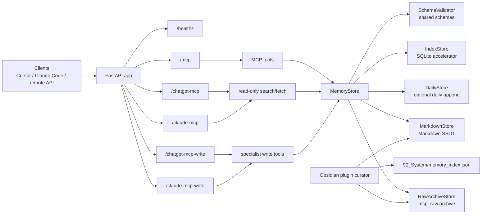
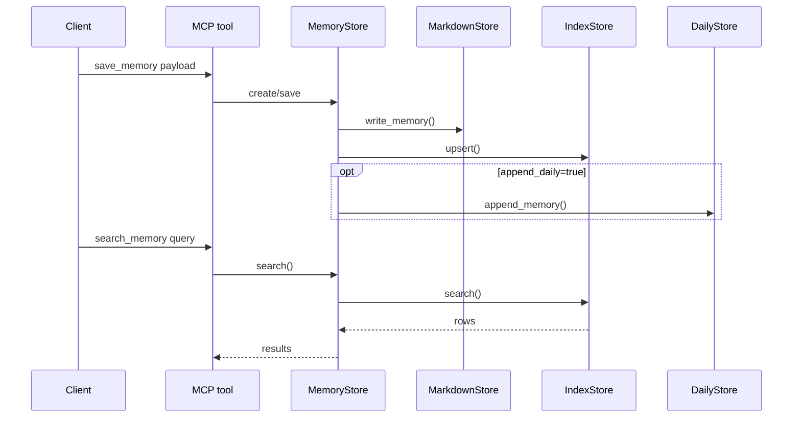
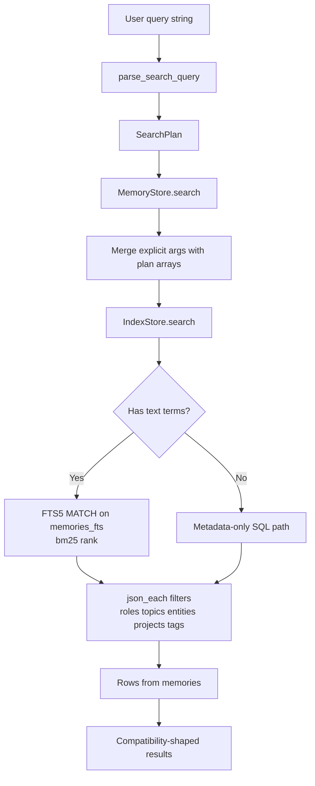
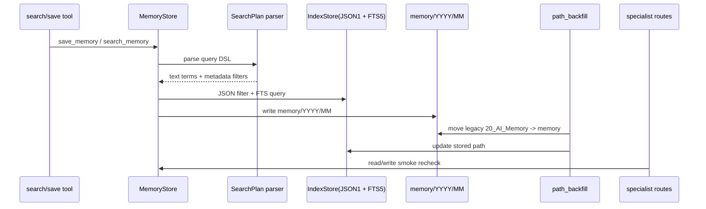

# System Architecture

이 문서는 `mcp_obsidian` 루트의 현재 런타임 구조를 정리한 아키텍처 참조 문서다.
기준 우선순위는 `AGENTS.md`, 현재 코드, 그리고 실제 검증 결과다.

## 목적

- Obsidian vault를 Markdown SSOT로 유지한다.
- SQLite는 Markdown에서 파생된 검색용 인덱스로만 사용한다.
- 읽기는 넓게, 쓰기는 의도적으로 유지한다.
- Cursor, Claude Code, 그리고 원격 API 계열 클라이언트가 같은 MCP 계약을 공유하도록 한다.

## 런타임 구성

현재 실행 경로는 다음과 같다.

- FastAPI 앱이 `app/main.py`에서 시작된다.
- `/healthz`는 상태 확인용 경로다.
- `/chatgpt-healthz`, `/claude-healthz`는 hosted specialist read-only profile 상태 확인용 경로다.
- `/chatgpt-write-healthz`, `/claude-write-healthz`는 hosted specialist write-capable sibling profile 상태 확인용 경로다.
- `/mcp`는 FastMCP 스트리머블 HTTP 앱을 마운트한 경로다.
- `/chatgpt-mcp`는 ChatGPT용 read-only `search` / `fetch` profile이다.
- `/chatgpt-mcp-write`는 ChatGPT용 authenticated specialist write-capable sibling profile이다.
- `/claude-mcp`는 Claude용 read-only `search` / `fetch` profile이다.
- `/claude-mcp-write`는 Claude용 authenticated specialist write-capable sibling profile이다.
- 인증은 `MCP_API_TOKEN`이 비어 있지 않을 때 Bearer token으로 적용된다.
- 현재 Bearer auth는 `/mcp`, `/chatgpt-mcp-write`, `/claude-mcp-write` 경로에 적용된다.
- MCP 도구층은 `app/mcp_server.py`에 있으며 `search_memory`, `save_memory`, `get_memory`, `list_recent_memories`, `update_memory`, `search`, `fetch`를 노출한다.
- `app/chatgpt_mcp_server.py`, `app/claude_mcp_server.py`는 read-only standard `search` / `fetch`와 authenticated sibling `save_memory`, `get_memory`, `update_memory` 조합을 제공한다.
- `MemoryStore`는 저장·조회·검색·업데이트를 묶는 서비스 계층이다.
- `RawArchiveStore`는 raw conversation note를 `mcp_raw/` 아래에 저장한다.
- `MarkdownStore`는 vault 안의 Markdown 파일을 SSOT로 기록한다.
- `IndexStore`는 SQLite에 upsert 하고 검색을 빠르게 한다.
- `DailyStore`는 일간 노트 append를 선택적으로 처리한다.
- `SchemaValidator`는 shared schema를 로드해 write 전에 검증한다.
- `obsidian-memory-plugin/`는 local curator subproject이며 public MCP server 역할은 하지 않는다.
- `examples/`와 `docs/`는 런타임이 아니라 운영/연동 보조 자산이다.
- Railway preview에서는 `Dockerfile` 기반 컨테이너가 실행되고, volume `/data`가 vault/index 저장소를 제공한다.
- Railway production에서는 `/mcp`, `/chatgpt-mcp`, `/chatgpt-mcp-write`, `/claude-mcp`, `/claude-mcp-write`가 같은 volume `/data`를 공유한다.
- Railway public domain에서는 FastMCP DNS rebinding protection 때문에 explicit host/origin allowlist가 필요하다.
- HMAC phase-2가 켜진 경우 new/updated memory docs와 raw archive docs에 `mcp_sig`가 기록된다.

## 데이터 흐름

### `save_memory`

1. MCP tool이 `MemoryCreate` payload를 만든다.
2. `MemoryStore`가 현재 시간대를 기준으로 memory ID와 상대 경로를 만든다.
3. `MarkdownStore`가 vault에 Markdown 파일을 먼저 쓴다.
4. `IndexStore`가 SQLite에 upsert 한다.
5. `append_daily=True`이면 `DailyStore`가 `10_Daily/YYYY-MM-DD.md`에 보조 로그를 쓴다.

### `search_memory`

1. MCP tool이 query, types, project, tags, limit, recency 조건을 받는다.
2. `MemoryStore`가 query와 tag를 정규화한다.
3. `IndexStore`가 SQLite에서 후보를 읽는다.
4. `MemoryStore`가 결과를 루트 계약에 맞는 dict shape로 반환한다.

### `Railway preview request path`

1. 외부 client가 Railway public HTTPS domain으로 요청한다.
2. Railway edge가 FastAPI `/mcp`로 전달한다.
3. FastAPI bearer auth가 `Authorization: Bearer <token>`를 검증한다.
4. FastMCP transport security가 `MCP_ALLOWED_HOSTS`, `MCP_ALLOWED_ORIGINS` allowlist를 검증한다.
5. MCP session manager가 streamable HTTP 세션을 생성하거나 기존 세션을 사용한다.
6. tool call은 동일한 `MemoryStore` 계층으로 내려간다.

## 보호 계약

아래 계약은 유지되어야 한다.

- Tool names는 `search_memory`, `save_memory`, `get_memory`, `list_recent_memories`, `update_memory`, `search`, `fetch`다.
- Public endpoint shape는 `/mcp`, `/healthz`다.
- Markdown-first architecture를 유지한다.
- SQLite는 derived index / accelerator only 이다.
- Vault relative path는 `/` separator를 사용한다.
- Memory ID는 `MEM-YYYYMMDD-HHMMSS-XXXXXX` 패턴을 유지한다.
- Frontmatter key는 임의 rename 하지 않는다.
- Compatibility wrapper response shape는 유지한다.
- 자동 write 범위는 넓히지 않는다.
- 새 memory writes는 `memory/YYYY/MM/` 아래로 저장하고, legacy `20_AI_Memory/...`는 read/update 호환 경로로 유지한다.

## 현재 코드 기준 상세

- `app/main.py`는 FastAPI app을 만들고 `/mcp`에 FastMCP app을 마운트한다.
- `app/main.py`는 통합 앱에서 `/mcp`, `/chatgpt-mcp`, `/chatgpt-mcp-write`, `/claude-mcp`, `/claude-mcp-write`를 함께 마운트한다.
- `app/mcp_server.py`는 wrapper helper를 통해 `search`와 `fetch`의 레거시 응답 모양을 유지한다.
- `app/chatgpt_mcp_server.py`와 `app/claude_mcp_server.py`는 standard `search` / `fetch` read-only profile과 authenticated write-capable sibling profile을 제공한다.
- `app/config.py`는 `MCP_ALLOWED_HOSTS`, `MCP_ALLOWED_ORIGINS`를 CSV env로 읽는다.
- `app/config.py`는 `MCP_HMAC_SECRET`를 통해 optional signing을 켠다.
- `app/mcp_server.py`는 allowlist가 있으면 `TransportSecuritySettings`를 명시적으로 주입한다.
- `app/services/memory_store.py`는 normalize, path build, save, get, recent, update 책임을 가진다.
- `app/services/raw_archive_store.py`는 raw conversation frontmatter/body를 `mcp_raw/`에 저장한다.
- `app/services/index_store.py`는 SQLite schema, upsert, search, recent를 담당한다.
- `app/services/markdown_store.py`는 frontmatter와 body 형식으로 Markdown SSOT를 기록한다.
- `app/services/daily_store.py`는 daily note append를 보조한다.
- `app/services/schema_validator.py`는 `schemas/`를 로드한다.
- `schemas/`는 raw/memory note contract의 단일 기준선이다.
- `app/utils/ids.py`, `app/utils/sanitize.py`, `app/utils/time.py`는 계약 보조 헬퍼다.

## 직접 확인한 실행 결과

2026-03-28 기준으로 아래를 직접 확인했다.

- local verification
  - `pytest -q` -> pass
  - `ruff check .` -> pass
  - `ruff format --check .` -> pass
- plugin verification
  - `npm run check` -> pass
  - `npm run build` -> pass
- Railway preview verification
  - `/healthz` -> `200`
  - `/mcp` -> `307` with `https://.../mcp/`
  - `/mcp/` -> `400 Missing session ID`
  - public HTTPS에서 `list_recent_memories`, `search_memory`, `get_memory`, `search`, `fetch` 성공
  - raw archive exclusion query는 empty results
- Railway production specialist verification
  - `/chatgpt-healthz` -> `200`
  - `/chatgpt-write-healthz` -> `200`
  - `/claude-healthz` -> `200`
  - `/claude-write-healthz` -> `200`
  - `/chatgpt-mcp` read-only `search` / `fetch` -> pass
  - `/chatgpt-mcp-write` authenticated `search` / `fetch` / `save_memory` / `get_memory` / `update_memory` -> pass
  - `/claude-mcp` read-only `search` / `fetch` -> pass
  - `/claude-mcp-write` authenticated `search` / `fetch` / `save_memory` / `get_memory` / `update_memory` -> pass

## 채택하지 않은 delivery snapshot 변경

delivery snapshot의 내용 중 아래는 현재 루트 계약에 맞지 않아 채택하지 않았다.

- alternate auth module로의 교체
- alternate host/port defaults
- `FastMCP` factory를 통한 응답 shape 변경
- `search` / `fetch` wrapper shape 변경
- 루트 계약을 덮는 snapshot replacement

이 프로젝트에서는 safe selective merge만 허용하고, 보호 계약을 우선한다.

## 검증 관점

이 문서를 기준으로 확인할 항목은 다음이다.

- `/healthz`와 `/mcp`가 현재 루트 코드와 일치하는가
- `save_memory`가 Markdown first, SQLite second 순서를 지키는가
- `search_memory`와 compatibility wrapper의 반환 shape가 유지되는가
- delivery archive는 문서 참조 대상으로만 남아 있는가
- Railway preview가 로컬 계약을 깨지 않고 같은 MCP surface를 노출하는가

## 2026-03-28 Search V2 And Path Migration Addendum

이 섹션은 기존 설명을 대체하지 않고, 최신 구현 기준으로 추가된 검색 v2, 메타데이터 배열 저장, 경로 마이그레이션, specialist route 재확인 사항만 덧붙인다.

### SearchPlan parsing과 검색 DSL

- `app/models.py`에는 `SearchPlan`이 추가되어 `raw_query`, `text_terms`, `roles`, `topics`, `entities`, `projects`, `tags`, `status`, `after`, `before`, `limit`를 구조화한다.
- `app/utils/search_query.py`의 `parse_search_query()`는 `text:"..."`, `role:`, `topic:`, `entity:`, `project:`, `tag:`, `status:`, `after:`, `before:`, `limit:` 토큰을 파싱한다.
- quoted phrase와 bare token은 `text_terms`로 들어가고, 인식하지 못한 `key:value`는 버리지 않고 자유 텍스트 검색어로 되돌린다.
- 빈 query는 예외 대신 빈 `SearchPlan`으로 정규화되어 기존 호출자와 호환된다.
- `MemoryStore.search()`는 query string에서 파싱한 structured filter와 별도 함수 인자로 받은 `roles/topics/entities/projects/tags`를 merge한 뒤 `IndexStore.search()`에 전달한다.

### Metadata arrays와 정규화 계약

- `MemoryCreate`, `MemoryPatch`, `MemoryRecord`는 `roles`, `topics`, `entities`, `projects`, `tags`, `raw_refs`, `relations`를 배열 필드로 유지한다.
- 입력은 단일값이어도 배열로 정규화하고, 공백 collapse, case-insensitive dedupe, language lowercase를 적용한다.
- `MemoryCreate`는 model validator에서 `role/...`, `topic/...`, `entity/...`, `project/...` namespaced tag를 자동 파생한다.
- `MemoryStore.save()`와 `MemoryStore.update()`는 이 배열 계약을 Markdown frontmatter와 SQLite index 양쪽에 같은 의미로 기록한다.

### JSON1+FTS5 search layer in IndexStore

- `IndexStore`는 startup 시 SQLite `JSON1`과 `FTS5` 지원을 강제 확인한다. 기능이 없으면 index를 degrade 하지 않고 바로 실패시킨다.
- `memories` 테이블은 JSON array 원본 컬럼 `roles/topics/entities/projects/tags/raw_refs/relations`와, FTS 가속용 평탄화 텍스트 컬럼 `tags_text/topics_text/entities_text/projects_text`를 같이 가진다.
- 기존 row는 `_refresh_search_text_columns()`로 평탄화 텍스트를 backfill 하고, `memories_fts` external-content virtual table은 `rebuild`로 재생성한다.
- insert/update/delete trigger가 `memories_fts`를 자동 동기화한다.
- 검색 시 자유 텍스트가 있으면 `FTS5 MATCH + bm25()`를 사용하고, structured filter는 `json_each(...) EXISTS`로 SQL 레벨에서 적용한다.
- 자유 텍스트가 없으면 metadata/date filter만으로 `updated_at DESC` 경로를 사용한다.
- 현재 date filter는 `created_at` 기준이며, `recency_days`는 SQL 이후 Python 후처리로 유지된다.

### `memory/YYYY/MM` write path와 legacy path compatibility

- 새 memory 문서는 `MemoryStore._memory_rel_path()`를 통해 `memory/YYYY/MM/<memory_id>.md`로 저장된다.
- vault bootstrap은 `memory/`와 legacy `20_AI_Memory/`를 함께 유지해 기존 문서와 새 문서가 공존할 수 있게 한다.
- `get`, `recent`, `update`는 index에 기록된 `path`를 기준으로 동작하므로 기존 legacy path row도 읽기와 수정이 가능하다.
- update는 기존 `path`를 그대로 유지한 채 문서를 다시 쓰므로, legacy 문서도 rewrite 시 같은 상대 경로에 재기록된다.

### Backfill / apply migration

- `app/services/path_backfill.py`는 legacy `20_AI_Memory/...` path row를 `memory/YYYY/MM/...` 구조로 옮기기 위한 별도 마이그레이션 유틸리티다.
- `plan_memory_path_backfill()`는 DB row의 `created_at`과 `id`로 target path를 계산하고, 파일/인덱스 상태를 비교해 `move`, `update_index_only`, `conflict`, `missing`으로 분류한다.
- `apply_memory_path_backfill(..., apply=False)`는 dry-run summary만 반환하고 파일과 DB를 바꾸지 않는다.
- `apply=True`일 때만 파일 move와 index `path` update가 실행된다.
- 테스트는 dry-run 비파괴성, 실제 move, index path 갱신을 각각 검증한다.

### Production specialist route smoke recheck

2026-03-28에 공개 production route 표면을 다시 확인했다.

- `https://mcp-server-production-90cb.up.railway.app/healthz` -> `200`
- `https://mcp-server-production-90cb.up.railway.app/chatgpt-healthz` -> `200`
- `https://mcp-server-production-90cb.up.railway.app/chatgpt-write-healthz` -> `200`
- `https://mcp-server-production-90cb.up.railway.app/claude-healthz` -> `200`
- `https://mcp-server-production-90cb.up.railway.app/claude-write-healthz` -> `200`
- `GET /chatgpt-mcp/` with `Accept: text/event-stream` -> `400 Missing session ID`
- `GET /claude-mcp/` with `Accept: text/event-stream` -> `400 Missing session ID`
- `GET /chatgpt-mcp-write/` without bearer -> `401 unauthorized`
- `GET /claude-mcp-write/` without bearer -> `401 unauthorized`
- authenticated full tool smoke는 `scripts/verify_specialist_mcp_write.py` 경로가 현재 기준 런북이며, 이번 워크스페이스에서는 `MCP_BEARER_TOKEN`이 없어 재실행하지 않았다.

### Latest verification evidence tied to this addendum

- local targeted tests: `pytest -q tests/test_search_v2.py tests/test_path_backfill.py tests/test_healthz.py tests/test_auth.py` -> `20 passed`
- `tests/test_search_v2.py`는 SearchPlan 파싱, namespaced tag 파생, DSL 단일 query 검색, hyphenated token 검색을 검증한다.
- `tests/test_path_backfill.py`는 legacy path dry-run과 apply migration을 검증한다.
- `tests/test_healthz.py`, `tests/test_auth.py`는 specialist healthz와 write route auth gate를 검증한다.

## 2026-03-28 Architecture Delta — Metadata V2 and Production Migration

기존 아키텍처 설명을 유지한 채, 이번 구현으로 실제로 늘어난 계층만 추가 기록한다.

### SearchPlan and Query Semantics

- `app/models.py`의 `SearchPlan`이 query parsing의 typed contract다.
- `app/utils/search_query.py`는 free text + structured filter를 함께 해석한다.
- `MemoryStore.search()`는 parser 결과와 explicit args를 merge한다.
- `IndexStore.search()`는:
  - metadata array filter는 `json_each(...)`
  - text search는 FTS5 `MATCH`
  - 결과 정렬은 `bm25(...) + updated_at`

### Storage Path Delta

- current write path:
  - `memory/YYYY/MM/<MEM-ID>.md`
- legacy compatibility:
  - stored path가 legacy `20_AI_Memory/...`여도 `get`, `fetch`, `update`는 계속 읽는다
- operator migration:
  - `app/services/path_backfill.py`
  - `scripts/backfill_memory_paths.py`

### Production Runtime Delta

- production volume backfill apply가 완료됐다.
- legacy production notes `18건`이 `memory/YYYY/MM/...`로 이동됐다.
- post-apply dry run은 `candidate_count = 0`으로 닫혔다.
- specialist routes는 path migration 후 다시 smoke 검증됐다.

### Current Production Recheck Facts

- deployment after FTS fix:
  - `7f706b9c-9d3d-429d-abb7-ca8519c225c7`
  - `SUCCESS`
- read-only recheck:
  - ChatGPT -> pass
  - Claude -> pass
- write sibling recheck:
  - ChatGPT -> pass
    - sample id: `MEM-20260328-234330-5D6BA3`
  - Claude -> pass
    - sample id: `MEM-20260328-234330-2D7741`
