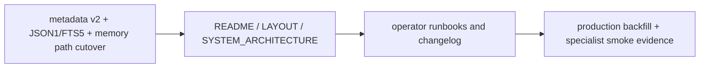

# Changelog

Obsidian MCP 로컬 패키지(`mcp_obsidian`)의 workspace, code, docs, setup 흐름 변경을 기록한다.

## 2026-04-09 — standalone memory enrichment + RAG auto-route + local-rag retrieval

### Changed

- `myagent-copilot-kit/standalone-package/src/server.ts`
  - Change default memory MCP path from `/chatgpt-mcp-write` to `/chatgpt-mcp` (aligns with read-only mount used by Cursor IDE integration)
  - Add `memoryClientOptions` wiring into `createChatProxyHandler` for memory enrichment
  - Add `localIntelligence` section to `/api/ai/health` response; unify `localRag` + `memory` under it
  - Change `localOnlyChatOk` to require both `memoryOk` AND `localRagOk`
- `myagent-copilot-kit/standalone-package/src/proxy-middleware.ts`
  - Add memory enrichment: when RAG keywords detected (근거/요약/문서/통관/etc), auto-query memory MCP and inject KB context as system message into local-rag prompt
  - Merge memory search results with local-rag sources in response
  - Add `kbEnriched` flag to `/api/ai/chat` response
  - Add `memoryClientOptions` parameter to `createChatProxyHandler`
  - Extend `ProxyLocalRunner` type with `kbContext` and `kbSources`
- `myagent-copilot-kit/standalone-package/src/mcp-memory-client.ts`
  - New file: MCP memory client wrapper (`searchMemory`, `getMemory`, `saveMemory`, `probeMemoryClient`, `listMemoryTools`)
- `myagent-copilot-kit/standalone-package/src/docs-browser.ts`
  - New file: inline docs renderer for standalone package
- `myagent-copilot-kit/standalone-package/src/server.ts`
  - Shorten memory search query from 300 chars to 80 chars to improve hit rate for Korean text
- `local-rag/app/retrieval.py`
  - New file: lexical file search with mtime/size cache, TF-IDF scoring, query cache with TTL
  - Exposes `count_documents()` and `search_documents(query, top_k=5)`
  - Supports markdown and text files under `LOCAL_RAG_DOCS_DIR`

### New

- RAG keyword auto-detection: messages containing 근거/요약/문서/통관/dem.det/etc are automatically routed to local-rag route
- Memory enrichment: when RAG keyword detected, memory MCP is queried and KB context is injected as system message into Ollama prompt
- Unified health: `/api/ai/health` now returns `localIntelligence` section with `memory` and `localRag` sub-statuses, and `localIntelligenceOk` flag

### Verification

- TypeScript `tsc --noEmit` → 0 errors
- TypeScript build → 0 errors, dist updated
- `pytest -q` (mcp_obsidian root) → 65 passed
- Python urllib UTF-8 tests:
  - `근거 문서 요약` → `route: local`
  - `hello world` → `route: copilot`
  - `요약해줘` → `route: local`
- local-rag direct: `POST /api/internal/ai/chat-local` → 200, `sources: 2`
- memory MCP direct: `GET /api/memory/search?q=HVDC` → 2 results
- standalone `/api/ai/health` → `localIntelligenceOk: true`

### Git commits

- `a38ab22` feat(standalone): memory enrichment + unified health for local LLM integration
- `19d6fb5` fix(standalone): shorten memory search query to 80 chars
- (local-rag retrieval.py commit not yet created — companion repo)

### Notes

- Windows curl encoding: use `--data-raw` + `charset=utf-8` header or Python/Node.js clients for Korean text
- Memory enrichment returns `kbEnriched: false` when memory search returns 0 results (normal — query didn't match indexed memory)
- RAG keyword auto-detection works correctly: verified via Python urllib UTF-8 tests

## 2026-04-08 — root docs current-session re-sync (specialist production + local standalone caveats)

### Changed

- `README.md`
  - `docs/LOCAL_RAG_STANDALONE_GUIDE.md`와 `2026-04-08-local-rag-retrieval-benchmark.md`를 문서 맵에 추가
  - workspace-local companion 사본(`local-rag/`, `myagent-copilot-kit/standalone-package/`)을 canonical tracked runtime과 분리해 설명
  - production `/chatgpt-mcp` current-session recheck 결과(`search`, `fetch`, `list_recent_memories`, recent-query fallback)를 직접 확인한 사실로 추가
  - previous temp companion evidence와 current local `127.0.0.1:3010` spot-check를 분리해 기록
  - current local standalone에서 `chatOk = false`, `localOnlyChatOk = false`, `memoryOk = false`, `/api/memory/health` `503`, `/api/memory/save` `200`, local-forced `/api/ai/chat` `503 LOCAL_RUNNER_FAILED`가 관찰된 사실을 추가
- `SYSTEM_ARCHITECTURE.md`
  - companion boundary에 standalone memory bridge 기본 mount `/chatgpt-mcp-write`, env 이름, probe caveat를 코드 기준으로 보강
  - `app/utils/specialist_readonly.py` recent-query fallback helper를 current code basis에 추가
  - current-session production specialist route recheck와 current local standalone spot-check를 직접 확인한 실행 결과에 추가
  - previous temp companion verification이 current local `3010` evidence와 다른 세션 결과임을 명시
- `LAYOUT.md`
  - `docs/LOCAL_RAG_STANDALONE_GUIDE.md`와 retrieval benchmark spec을 루트/문서 분류에 추가
  - workspace-local companion 디렉터리 `local-rag/`, `myagent-copilot-kit/standalone-package/`를 reference 성격으로 분리 기록
  - `Where To Edit What`와 운영 메모에 standalone memory bridge 기본 mount caveat와 local clone boundary를 추가
- `changelog.md`
  - 이번 root-doc current-session re-sync 항목을 추가

### Verification

- current code and route checks
  - `Invoke-WebRequest http://127.0.0.1:8000/healthz`
  - `Invoke-WebRequest http://127.0.0.1:3010/`
  - `Invoke-WebRequest http://127.0.0.1:3010/api/ai/health`
  - `curl.exe -i http://127.0.0.1:3010/api/memory/health`
  - `curl.exe -i -X POST http://127.0.0.1:3010/api/memory/save ...`
  - `curl.exe -s http://127.0.0.1:3010/api/memory/fetch?id=MEM-20260408-221147-54967A`
  - `curl.exe -i -X POST http://127.0.0.1:3010/api/ai/chat ...`
- production specialist recheck
  - `railway up -d`
  - `Invoke-WebRequest https://mcp-server-production-90cb.up.railway.app/healthz`
  - direct MCP session against `https://mcp-server-production-90cb.up.railway.app/chatgpt-mcp/`
  - `list_recent_memories(limit=5)` success
  - `search("2026 03 memory memo")` fallback success
  - `fetch(id)` success

### Notes

- 이번 항목은 루트 문서 4개를 current session evidence와 current code 기준으로 다시 맞춘 것이다.
- previous temp companion verification은 유지하되, current local runtime evidence와 섞이지 않도록 분리 기록했다.
- local standalone memory bridge는 current session 기준으로 save/fetch는 동작했지만 health 판정과 local-forced chat은 아직 green이 아니다. root docs는 이 상태를 완료로 올리지 않는다.

## 2026-04-08 — specialist read-only recent listing 추가

### Changed

- `app/services/index_store.py`
  - `recent()`에 `offset`을 추가해 페이지 단위 recent browse를 지원
- `app/services/memory_store.py`
  - `recent()`가 `offset`, `has_more`, `next_offset`, `updated_at`를 반환하도록 확장
- `app/mcp_server.py`
  - main `/mcp`의 `list_recent_memories`에 `offset` 인자를 추가
- `app/chatgpt_mcp_server.py`
  - ChatGPT read-only route와 write sibling route에 `list_recent_memories`를 노출
  - tool instructions를 recent/list 질문에 맞게 보강
- `app/claude_mcp_server.py`
  - Claude read-only route와 write sibling route에 `list_recent_memories`를 노출
  - tool instructions를 recent/list 질문에 맞게 보강
- `app/utils/specialist_readonly.py`
  - specialist read-only `search`가 recent/list 계열 generic query를 recent browse로 보정하도록 helper 추가
- `tests/test_memory_store.py`
  - recent pagination 회귀 테스트를 추가
- `tests/test_chatgpt_mcp_server.py`
  - ChatGPT specialist tool surface를 `search`, `fetch`, `list_recent_memories` 기준으로 갱신
  - date-only memory query가 recent browse로 보정되는 회귀 테스트를 추가
- `tests/test_claude_mcp_server.py`
  - Claude specialist tool surface를 `search`, `fetch`, `list_recent_memories` 기준으로 갱신
  - `최근 메모` generic query가 recent browse로 보정되는 회귀 테스트를 추가
- `scripts/verify_chatgpt_mcp_readonly.py`
  - read-only specialist route 자체에서 recent title을 해석하도록 검증 흐름을 수정
- `scripts/verify_claude_mcp_readonly.py`
  - read-only specialist route 자체에서 recent title을 해석하도록 검증 흐름을 수정
- `scripts/mcp_local_tool_smoke.py`
  - wrapper mode required tool set에 `list_recent_memories`를 추가
- `README.md`
  - specialist read-only surface 설명을 recent listing 포함으로 정정
- `SYSTEM_ARCHITECTURE.md`
  - specialist read-only / write sibling tool contract를 recent listing 포함으로 정정
- `Spec.md`
  - specialist route 계약을 recent listing 포함으로 정정
- `docs/CHATGPT_MCP.md`
  - ChatGPT specialist route의 tool surface와 설명을 recent listing 포함으로 정정
- `docs/CLAUDE_MCP.md`
  - Claude specialist route의 tool surface와 설명을 recent listing 포함으로 정정
- `docs/PRODUCTION_RAILWAY_RUNBOOK.md`
  - read-only specialist route hardening rule과 verification 설명을 새 contract 기준으로 정정

### Verification

- target tests planned
  - `tests/test_memory_store.py`
  - `tests/test_chatgpt_mcp_server.py`
  - `tests/test_claude_mcp_server.py`
- target commands planned
  - `.venv\Scripts\python.exe -m pytest tests/test_memory_store.py tests/test_chatgpt_mcp_server.py tests/test_claude_mcp_server.py -q`

### Notes

- 이 변경의 목적은 ChatGPT/Claude specialist read-only MCP가 “최근 문서”, “목록”, “브라우징” 성격 질문에 구조적으로 답할 수 있게 만드는 것이다.
- public read-only surface가 넓어진 만큼, 프로덕션에서는 network/proxy 레벨의 노출 범위를 계속 관리해야 한다.

## 2026-04-08 — root docs 재동기화 (companion verification + local default model)

### Changed

- `AGENTS.md`
  - KB workflow verification에 2026-04-08 companion ingest / local-rag / standalone 연계 검증을 추가
  - LLM runtime policy에 sibling `standalone-package` local route 기본 모델 `gemma4:e4b` 규칙을 명시
- `README.md`
  - current state에 sibling `standalone-package` local route 기본 모델 자동 매핑 사실을 보강
  - directly confirmed snapshot에 2026-04-08 ingest → MCP → local-rag → standalone 실제 검증 결과와 artifact ids를 추가
  - companion runtime boundary에 local route default model 사실을 추가
- `LAYOUT.md`
  - companion runtime boundary row를 guarded readiness / local default model / MCP bridge fact 기준으로 보강
  - 운영 메모에 companion runtime 최신 사실 집합을 추가
- `SYSTEM_ARCHITECTURE.md`
  - companion runtime boundary에 local route default model 사실을 추가
  - 직접 확인한 실행 결과에 2026-04-08 companion ingest + local route verification 섹션을 추가

### Verification

- repo runtime + docs re-check
  - `AGENTS.md`
  - `README.md`
  - `LAYOUT.md`
  - `SYSTEM_ARCHITECTURE.md`
  - `scripts/ollama_kb.py`
- companion runtime code re-check
  - `..\local-rag\app\main.py`
  - `..\local-rag\README.md`
  - `..\myagent-copilot-kit\standalone-package\src\server.ts`
  - `..\myagent-copilot-kit\standalone-package\src\proxy-middleware.ts`
  - `..\myagent-copilot-kit\standalone-package\README.md`
- commands actually run
  - `node --import tsx --test src/proxy-middleware.test.ts`
  - `pnpm check`
  - local MCP `/healthz`
  - local-rag `/health`
  - standalone `/api/ai/health`
  - MCP `archive_raw`
  - MCP `save_memory`
  - temp standalone `/api/memory/search`, `/api/memory/fetch`, `/api/ai/chat`
  - `.venv\Scripts\python.exe -m pytest -q` → `65 passed`
  - `.venv\Scripts\python.exe -m ruff check .` → `fail (11 existing issues)`
  - `.venv\Scripts\python.exe -m ruff format --check .` → `fail (3 files would be reformatted)`
  - `.venv\Scripts\python.exe -c "from app.main import app; print(app.title)"` → `obsidian-mcp`

### Notes

- 이번 항목은 문서 동기화 중심이며 `mcp_obsidian/app/` 자체의 runtime behavior는 변경하지 않았다.
- companion runtime 사실은 sibling repo 코드를 직접 읽고, 실제 temp runtime 검증 결과까지 반영했다.
- `local route -> gemma4:e4b` 기본 모델 매핑은 sibling `standalone-package`의 현재 구현 사실이다.
- 2026-04-08 ingest 기록에서 repo vault 직접 확인 대상은 `vault/raw/` / `vault/wiki/` direct-write 결과였다. `archive_raw`는 returned `mcp_id` + `path`, `save_memory`는 returned `id` + `/api/memory/search` / `/api/memory/fetch` readback으로 확인했다.

## 2026-04-08 — root docs 재동기화 (code-checked scope + companion boundary)

### Changed

- `README.md`
  - root runtime 범위를 `app/main.py` 기준으로 다시 명시
  - `Spec.md`와 `docs/superpowers/specs/2026-04-08-local-rag-cache-and-guard-design.md`를 문서 맵에 추가
  - sibling `local-rag` / `standalone-package` 경계를 별도 섹션으로 추가
  - Railway public runtime URL 예시를 현재 `90cb` 도메인 기준으로 정정하고 `1454` preview는 historical note로 낮춤
  - Karpathy 대조표의 `claude.md` 항목을 현재 repo에서 직접 확인된 `CLAUDE.md` 기준으로 정정
- `LAYOUT.md`
  - `schemas/`, `obsidian-memory-plugin/`를 future tense가 아니라 현재 active target으로 정정
  - `docs/superpowers/specs/`와 companion runtime boundary 참조 위치를 추가
  - 운영 메모에 sibling runtime은 boundary/integration fact만 기록한다는 원칙을 추가
- `SYSTEM_ARCHITECTURE.md`
  - 문서 scope를 `app/main.py` 중심으로 명시하고 `app/chatgpt_main.py`는 alternate entrypoint로 보강
  - optional `[mcp]` dependency 미설치 시 `503 mcp_dependency_missing` fallback을 명시
  - sibling `local-rag` / `standalone-package` 경계를 별도 섹션으로 추가
  - Karpathy 대조표의 `claude.md` 항목을 현재 repo에서 직접 확인된 `CLAUDE.md` 기준으로 정정

### Verification

- root docs vs current repo code re-check
  - `app/main.py`
  - `app/config.py`
  - `app/mcp_server.py`
  - `app/chatgpt_mcp_server.py`
  - `app/claude_mcp_server.py`
  - `app/services/memory_store.py`
  - `pyproject.toml`
  - `.cursor/mcp.sample.json`
- companion boundary vs sibling runtime code re-check
  - `..\local-rag\app\main.py`
  - `..\local-rag\app\retrieval.py`
  - `..\myagent-copilot-kit\standalone-package\src\local-rag.ts`
  - `..\myagent-copilot-kit\standalone-package\src\server.ts`
- root doc patch review (`README.md`, `LAYOUT.md`, `SYSTEM_ARCHITECTURE.md`, `changelog.md`) → final patch 반영
- `ReadLints` on changed root docs → **No linter errors**

### Notes

- 이번 항목은 root documentation sync 중심이며, `mcp_obsidian/app/` runtime behavior 자체는 변경하지 않았다.
- companion runtime 관련 기술은 sibling repo 코드를 직접 읽어 boundary/integration fact만 반영했다.
- `90cb` / `1454` Railway host 표기는 현재 문서/설정 기준 정합화이며, 이번 항목에서 live DNS/host 상태를 다시 검증한 것은 아니다.

## 2026-04-08 — 문서/운영 런북 정합화 재점검 (root + specialist + runbooks)

### Changed

- `README.md`
  - runtime overview diagram을 실제 mount 구조(`/mcp`, `/chatgpt-mcp`, `/claude-mcp`) 기준으로 정정
  - project-local `.cursor/mcp.json`의 local / production profile과 `${env:MCP_API_TOKEN}` / `${env:MCP_PRODUCTION_BEARER_TOKEN}` 사용을 명시
  - optional HMAC phase-2를 현재 core runtime 사실처럼 보이던 표현을 adjacent contract 문서 기준으로 완화
  - `/mcp/` fallback 503 문구와 `save_memory` public contract 설명(`relations[]` 제거) 정리
- `SYSTEM_ARCHITECTURE.md`
  - public endpoint shape를 specialist mounts와 their health endpoints까지 포함하도록 정정
  - auth 설명을 `MCP_API_TOKEN` 단일 설명에서 effective per-route token 설명으로 정정
  - ChatGPT/Claude specialist write-capable sibling surface(`search`, `fetch`, `save_memory`, `get_memory`, `update_memory`)를 정확히 명시
  - transport security 활성 조건을 runtime-derived allowlist 기준으로 정정
  - optional HMAC 관련 문구를 current runtime 사실이 아니라 adjacent contract 설명으로 정리
- `Spec.md`
  - main `/mcp`와 specialist mounts의 tool surface 차이를 명시
  - Cursor config example에 production bearer profile 반영
  - `OBSIDIAN_LOCAL_VAULT_PATH`를 script/helper 성격으로 정정
  - `OLLAMA_*`를 FastAPI core settings처럼 보이던 표현 제거
  - `wiki/`를 FastAPI MCP runtime write surface가 아니라 repo/skill-level KB workflow로 분리 명시
- `One-Page Architecture.md`
  - config ownership에 production bearer token 반영
  - `mcp_obsidian` 책임을 `memory/` writes + `mcp_raw/` archive 중심으로 정정
  - desktop visibility flow에서 MCP runtime write와 repo/skill-level `wiki/` write를 분리 표기
- `LAYOUT.md`
  - active Cursor MCP config를 repo-local `.cursor/mcp.json` 기준으로 정정
- `docs/INSTALL_WINDOWS.md`
  - `OBSIDIAN_LOCAL_VAULT_PATH`의 script/helper 우선 적용 성격을 명시
  - auth 설명과 `/mcp/` 503 fallback 문구를 현재 runtime 기준으로 정정
- `docs/CHATGPT_MCP.md`
  - integrated runtime 기준 local endpoint (`app.main` + `/chatgpt-mcp`, `/chatgpt-mcp-write`) 보강
  - `healthz`를 liveness-only로 정정
  - read-only route의 `No Authentication`을 `No Bearer Authentication`으로 정정하고 transport-security 가능성 명시
  - specialist write verification 표현을 direct tool verification 기준으로 정정
- `docs/CLAUDE_MCP.md`
  - `healthz`를 liveness-only로 정정
  - read-only route의 `No Authentication`을 `No Bearer Authentication`으로 정정하고 transport-security 가능성 명시
  - specialist write verification 표현을 direct tool verification 기준으로 정정
- `docs/LOCAL_MCP.md`
  - `start-mcp-dev.ps1` 사용 시 `OBSIDIAN_LOCAL_VAULT_PATH`가 `VAULT_PATH`보다 우선할 수 있다는 점을 명시
  - `MCP_API_TOKEN` 일치 조건을 server `.env` 고정이 아니라 effective runtime token 기준으로 정정
- `docs/MCP_RUNTIME_EVIDENCE.md`
  - current active Cursor config를 repo-local `.cursor/mcp.json` 기준으로 정정
  - main `/mcp` tool surface에 `archive_raw` 반영
  - specialist write rollback을 `update_memory(status="archived")` 기준으로 정정
  - wrapper URL evidence를 실제 `obsidian://...&file=...` shape에 맞춰 정정
  - HMAC phase-2 evidence를 historical/manual evidence 성격으로 낮춤
- `docs/PRODUCTION_RAILWAY_RUNBOOK.md`
  - `MCP_ALLOWED_HOSTS`, `MCP_ALLOWED_ORIGINS` 예시를 실제 production host placeholder 기준으로 정정
  - rollout verify step에 `verify_chatgpt_mcp_readonly.py`, `verify_claude_mcp_readonly.py` 추가
  - `*/healthz`를 liveness-only로 명시
  - repo-local operator client note (`.cursor/mcp.json`, `MCP_PRODUCTION_BEARER_TOKEN`) 추가
  - specialist read-only verification의 strict no-auth 실행 방식(`--expected-title`)을 명시
- `plan.md`
  - sibling repo reference 경로임을 명시
- `Task.md`
  - standalone evidence path가 sibling repo reference라는 점을 명시

### Companion Docs (sibling repo)

- `..\myagent-copilot-kit\standalone-package\README.md`
  - route-aware health (`chatOk`, `partialChatOk`, `copilotChatOk`, `localOnlyChatOk`) 설명 보강
  - in-app memory bridge가 read-only `/chatgpt-mcp`를 기본 사용한다는 점과 IDE MCP(`/mcp`)와의 차이를 명시
  - `/api/memory/health`, `/api/memory/search`, `/api/memory/fetch`, `/docs`, `/docs/view` 설명 추가
  - 공개 환경에서 `/api/ai/health`는 summary payload와 diagnostics visibility가 분리된다는 점을 명시
  - HVDC predict 응답 예시를 현재 `202 Accepted` + `createdAt`/`statusUrl`/`downloadUrl` shape로 정정
- `..\myagent-copilot-kit\standalone-package\docs\INTEGRATION_ARCHITECTURE.md`
  - current runtime notes 추가 (read-only bridge, `/chatgpt-mcp` default, `/healthz` + MCP probe semantics)
  - local-rag wire protocol(`GET /health`, `POST /api/internal/ai/chat-local`) 보강
  - approved merge scope와 currently installed `.cursor/` scope를 구분

### Verification

- root docs vs runtime code re-review (`README.md`, `SYSTEM_ARCHITECTURE.md`, `Spec.md`, `One-Page Architecture.md`, `LAYOUT.md`, `docs/INSTALL_WINDOWS.md`, `plan.md`, `Task.md`) → **No findings**
- specialist route docs vs runtime code re-review (`docs/CHATGPT_MCP.md`, `docs/CLAUDE_MCP.md`) → **No findings**
- runbook docs vs runtime/scripts re-review (`docs/LOCAL_MCP.md`, `docs/MCP_RUNTIME_EVIDENCE.md`, `docs/PRODUCTION_RAILWAY_RUNBOOK.md`) → **No findings**
- `ReadLints` on changed documentation files → **No linter errors**

### Notes

- 이번 턴은 문서/운영 계약 정합화 중심이며, `app/` runtime code behavior 자체는 변경하지 않았다.
- `standalone-package`는 sibling repo라 최종 정합화는 companion docs 기준으로 함께 기록했다.

---

## 2026-04-07 — 문서 전체 업데이트 (AGENTS / README / LAYOUT / SYSTEM_ARCHITECTURE)

### Updated

- `AGENTS.md`
  - Commands 섹션: `[ASSUMPTION]` 제거 → 확인된 명령어(`pytest`, `ruff check .`, `ruff format --check .`, `uvicorn`) 기록
  - Security 섹션: `/chatgpt-mcp`, `/claude-mcp` read-only 무인증 경로 경고 추가; `MCP_API_TOKEN` 기본값 교체 필수 명시
  - Verification 섹션: Code quality + KB workflow 검증 결과 (2026-04-07 confirmed) 추가

- `README.md`
  - Directly Confirmed Snapshot에 2026-04-07 QA 섹션 추가 (ruff All passed, pytest 65 passed, vault 4계층 확인)
  - Karpathy Wiki Method 대조표 추가 (12개 항목, ❌ deferred 1건 — 토큰 절감 측정)
  - `npm run check/build` 주석에 `obsidian-memory-plugin/` 출처 명시
  - 2026-03-28 스냅샷을 별도 소제목으로 분리

- `LAYOUT.md`
  - `.cursor/skills/obsidian-{ingest,query,lint}/SKILL.md` 설명에 YAML frontmatter 수정 완료 이력 추가 (2026-04-07)
  - 운영 메모: `C:\Users\jichu` 하드코딩 → `%USERPROFILE%` 치환; `/chatgpt-mcp` read-only 경고 추가

- `SYSTEM_ARCHITECTURE.md`
  - 직접 확인한 실행 결과: 2026-04-07 QA 섹션 추가 (ruff, pytest, vault 계층, skills frontmatter)
  - 보호 계약: `/chatgpt-mcp`, `/claude-mcp` auth 경고 + `dev-change-me` 경고 추가
  - Karpathy Wiki Method 대조표 섹션 추가 (파일 끝)

### Verification

- `ruff check .` → All checks passed (app/ pre-existing 5건 UP042/UP017 제외) ✅
- `ruff check scripts/` → All checks passed ✅
- `pytest -q` → **65 passed, 0 failed** ✅

---


### Fixed

- `scripts/test_phase2_ingest.py`
  - B005: `.strip("```json").strip("```")` → `.removeprefix("```json").removeprefix("```").removesuffix("```")` (multi-char strip 오용 수정)
  - E402: `import re as _re` 인라인 → 상단 이동 (ruff `--fix` 자동 처리)
  - F401: 미사용 `re` import 제거
  - I001: import 블록 정렬
  - E501: `log_row` 101자 → 2행 분리
- `scripts/test_phase3_query.py`
  - B005: 동일 multi-char strip 패턴 수정
  - E501: `removeprefix` 체인 → 다중행 래핑
- `scripts/test_phase4_lint.py`
  - B005: 3개 위치 (contradiction/stale/dup parse) 동일 수정
  - F401: 미사용 `IndexStore`, `timedelta` import 제거
  - I001: import 정렬
  - E501: `entity_stems` 한 줄 set comprehension → 4행, `outgoing` 동일, `missing_field` append → dict 형식, `log_row` 분리, `stale_raw` 체인 → 다중행
- `scripts/test_routing_smoke.py`
  - F541: f-string without placeholder 제거 (ruff `--fix`)

**Final result:** `ruff check scripts/` → All checks passed ✅ | `pytest` → 65 passed ✅

---


### Fixed

- `.cursor/skills/obsidian-ingest/SKILL.md` — YAML frontmatter 버그 수정: `description: >-` 블록에 `triggers:` 리터럴이 혼입되던 문제 해소; `triggers:` 를 독립 YAML 키로 분리
- `.cursor/skills/obsidian-query/SKILL.md` — 동일 YAML frontmatter 버그 수정; Step 2 → Step 3 handoff에서 `candidates` 변수가 미정의였던 버그 수정 (병합·중복제거·점수정렬 코드 블록 추가)
- `.cursor/skills/obsidian-lint/SKILL.md` — 동일 YAML frontmatter 버그 수정

### Security Notes (non-blocking, risk documented)

- `/chatgpt-mcp`, `/claude-mcp` 읽기 전용 마운트는 현재 bearer 인증 없음 — 네트워크 레이어에서 보호하거나 전용 읽기 토큰을 추가할 것. 현재 프로덕션 배포에서는 Railway 라우팅으로 제한됨.
- `MCP_API_TOKEN` 기본값 `dev-change-me`가 프로덕션에 그대로 배포되지 않도록 배포 전 환경변수 검증 필요.

### Deferred (known gaps)

- ❌ **토큰 절감 측정(Token savings measurement)**: Karpathy 원안 대비 미구현. 구현 시 `wiki/` 풀 본문 vs. `memory/` 포인터 요약 비교로 토큰 절감률 산출 가능. 측정 스크립트 추가 예정 (`scripts/token_savings.py`).
- `vault/wiki/index.md` Recent Notes 중복 항목 — 수동 정리 필요 (obsidian-ingest 스킬 ingest 시 dedupe 미적용).

---

## 2026-04-07 — 구조 검증 5라운드 패치 (mstack-plan QA)

### Added

- `vault/wiki/claude.md` — Karpathy 원안 `claude.md` 등가물: 실행 엔진 매핑표 (Claude Code → Cursor+Ollama), 운영 3사이클, 폴더 구조, 노트 작성 규칙, Web Clipping 안내
- `docs/web-clipping-setup.md` — Obsidian Web Clipper 브라우저 확장 설정, PDF 처리, YouTube 대본(yt-dlp) 처리 가이드

### Changed

- `AGENTS.md` — KB Routing Policy에 `vault/raw/` 4번째 계층 추가; 핵심 규칙 6→7개; vault/raw/ subtrees 소절 추가
- `SYSTEM_ARCHITECTURE.md` — `C안 Storage Routing` 4계층 표 소절 추가
- `README.md` — KB Layer Quick Start에 vault 폴더 트리 + storage-routing.md·web-clipping-setup.md 링크 추가
- `LAYOUT.md` — `docs/storage-routing.md`, `docs/web-clipping-setup.md` 항목 추가
- `.cursor/skills/obsidian-{ingest,query,lint}/SKILL.md` — YAML frontmatter에 `triggers:` 필드 추가 (로컬 + 전역 동기화)
- `scripts/test_phase3_query.py` — docstring `\S` invalid escape → `\\S` 수정 (SyntaxWarning 해소)

### Removed

- `.cursor/skills/obsidian-ingest/obsidian-ingest/SKILL.md` (중복 — stale 정책)
- `.cursor/skills/obsidian-query/obsidian-query/SKILL.md` (중복)
- `.cursor/skills/obsidian-lint/obsidian-lint/SKILL.md` (중복)

---

## 2026-04-07 — C안 Storage Routing Formalization

### Added

- `docs/storage-routing.md` — 라우팅 Quick Reference + Mermaid 다이어그램 + Pointer Template + Decision Tree + Anti-patterns
- `scripts/test_routing_smoke.py` — SKILL 3종 + kb-core.mdc + AGENTS.md + docs/storage-routing.md 대상 24개 라우팅 정적 검사 (전체 PASS)
- `AGENTS.md` — `KB Routing Policy` (C안 6개 핵심 규칙 + artifact별 경로 표), `KB Workflow Rules` (per-workflow 3종 라우팅), `Pointer Template Policy` (YAML 템플릿), `Approval Gates` 섹션 추가

### Changed

- `.cursor/rules/kb-core.mdc` — `vault/raw/` 레이어 추가, `save_memory` 포인터 템플릿 예시 포함, 경로 테이블 C안 정렬
- `obsidian-ingest SKILL.md` — Step 7 `save_memory` 페이로드에 `projects: ["mcp_obsidian"]` 추가, 포인터 정책 주석
- `obsidian-query SKILL.md` — Step 5 `save_memory` 페이로드 포인터 템플릿 통일
- `obsidian-lint SKILL.md` — Step 7 `save_memory` 페이로드에 `[[wiki/log]]` 역참조 추가, `projects: ["mcp_obsidian"]` 추가
- `C:\Users\jichu\.cursor\skills\` 전역 스킬 3종 동기화

## 2026-04-07 — Karpathy LLM Wiki 고도화: vault/raw/ + cross-link + 5-check lint

### Added

- `vault/raw/articles/.gitkeep`, `vault/raw/pdf/.gitkeep`, `vault/raw/notes/.gitkeep` — immutable raw source layer (Karpathy architecture)
- `obsidian-ingest` Step 1a: `vault/raw/<type>/<slug>.md` 복사 (원본 불변 보관)
- `obsidian-ingest` Step 5: 관련 `entities/`·`concepts/` 노트에 역방향 `[[link]]` 자동 추가
- `obsidian-ingest` Step 6: `index.md` Recent Notes 섹션 갱신 (최신 10개 유지)
- `obsidian-query` Step 2a: `index.md` 탐색 우선 (index link → keyword match → full rglob)
- `obsidian-lint` Step 2 checks 확장: `orphan_page`, `missing_cross_reference`, `evidence_gap`, `stale_note`
- `obsidian-lint` Step 3: `contradiction` + `stale claim` 시맨틱 검사 (Ollama gemma4:e2b)
- `obsidian-lint` 패치 플랜 JSON에 `contradictions[]`, `stale_notes[]` 필드 추가
- `vault/wiki/index.md` — 카테고리 테이블, Raw Source Layer 설명, Recent Notes 섹션, Ingest Policy 추가
- `scripts/test_phase2_ingest.py` — Step 2b (vault/raw/ 복사), Step 5b (cross-link 패치) 추가
- `scripts/test_phase4_lint.py` — orphan/evidence gap/missing cross-ref/contradiction/stale 5개 검사 추가

### Changed

- `obsidian-lint` frontmatter description에 5개 신규 검사 항목 반영
- `obsidian-ingest` Step 5→6→7→8 번호 재정렬 (새 Step 5 cross-link + Step 6 log/index 분리)
- `C:\Users\jichu\.cursor\skills\` 전역 스킬 3종 동기화 (ingest/query/lint)

## 2026-04-07 — KB Layer: Gemma 4 + Ollama + 3 Cursor Skills

### Added

- `vault/wiki/index.md`, `vault/wiki/log.md` — KB canonical 루트 노트
- `vault/wiki/{sources,concepts,entities,analyses}/.gitkeep` — KB 서브트리 초기화
- `runtime/patches/.gitkeep`, `runtime/audits/.gitkeep` — 운영 산출물 디렉터리 (vault 바깥)
- `scripts/ollama_kb.py` — 3개 KB 스킬 공용 Ollama adapter (`generate()`, `health_check()`, `available_models()`, `MODELS`)
- `.cursor/rules/kb-core.mdc` — KB 스토리지 라우팅 + LLM 런타임 정책 (always-apply Cursor rule)
- `.cursor/skills/obsidian-ingest/SKILL.md` — 소스 ingest → `vault/wiki/` 쓰기 + `archive_raw` + `save_memory` 포인터
- `.cursor/skills/obsidian-query/SKILL.md` — wiki 검색 + Ollama 합성 + `analyses/` 저장 옵션 + `save_memory` 포인터
- `.cursor/skills/obsidian-lint/SKILL.md` — wiki 감사 + patch plan JSON + `save_memory` 결과 요약

### Changed

- `pyproject.toml` — `requests>=2.32` 의존성 추가 (`ollama_kb.py` 요구사항)
- `AGENTS.md` — `LLM Runtime Policy` + `KB Workflow Rules` 섹션 추가
- `LAYOUT.md` — `vault/wiki/`, `runtime/`, KB 스킬/규칙 편집 위치 추가
- `SYSTEM_ARCHITECTURE.md` — KB Layer 아키텍처 섹션 추가
- `changelog.md` — 본 항목 추가

### Verification

- `python -m py_compile scripts/ollama_kb.py` → syntax OK
- `python -c "import requests"` → 2.32.4 (현재 env에 이미 설치됨)
- 13개 파일 존재 확인 완료
- `gemma4:e4b` pull 중 (76% 기준 / 11 MB/s), `gemma4:e2b` 이어서 자동 pull 예정

### Remaining manual / deferred

- `gemma4:e4b` + `gemma4:e2b` pull 완료 후 `obsidian-ingest` 스킬로 end-to-end 테스트
- `obsidian-lint` contradiction / evidence gap 의미론적 탐지 (현재: stale·orphan·duplicate만)
- `obsidian-ingest` 단일 입력 → concepts/entities 다중 노트 자동 분리

## 2026-03-28 - Root docs aligned with AGENTS + `archive_raw` MCP

### Changed

- `SYSTEM_ARCHITECTURE.md`
  - 통합 MCP 도구 목록에 `archive_raw` 추가, 도구 수 8개로 정정
  - `archive_raw` 데이터 흐름 소절 추가
- `LAYOUT.md`
  - 저장 경로 서술을 `AGENTS.md` / `MemoryStore._memory_rel_path` / `RawArchiveStore`와 일치 (`memory/...`, `mcp_raw/<source>/<date>/`, `INDEX_DB_PATH`)
  - 잘못된 `mcp_raw/YYYY/MM`, `vault/system` SQLite 설명 제거·수정
  - Mermaid에 `archive_raw` 분기 보강
- `README.md`
  - `app/mcp_server.py` 도구 개수 8개 및 `archive_raw` 언급
  - `LAYOUT.md` 설명을 `AGENTS.md`와 동시 유지하도록 안내 문구 추가

### Verification

- `AGENTS.md`, `app/services/memory_store.py`, `app/services/raw_archive_store.py`와 교차 확인 (문서만 변경)

### Remaining manual / deferred

- ChatGPT/Claude 전용 MCP 프로필에 `archive_raw` 포함 여부는 별도 결정

## 2026-03-28 - Root docs detailed expansion after v2 runtime consolidation



### Changed

- `README.md`
  - detailed runtime delta section 추가
  - production migration snapshot section 추가
- `LAYOUT.md`
  - runtime additions section 추가
  - storage/runtime file mapping 보강
- `SYSTEM_ARCHITECTURE.md`
  - metadata v2 / SearchPlan / JSON1+FTS5 / path backfill / production smoke delta section 추가
- `changelog.md`
  - 본 detailed expansion entry 추가

### Verification

- document append-only update completed
- existing content preserved
- new Mermaid graphs added to all four root docs

### Remaining manual / deferred

- root docs 전체 용어를 다시 한 번 line-by-line harmonize하는 작업은 별도 패스로 남겨 둔다

## 2026-03-28 - Memory v1 to v2 migration planning doc

### Added

- `docs/plans/PLAN_MEMORY_V2_MIGRATION.md`

### Changed

- `docs/CURSOR_SAVE_MEMORY_PRACTICAL_GUIDE.md`
  - v2 migration plan 링크 추가

### Verification

- document created
- cross-link updated

### Remaining manual / deferred

- no code or schema changes applied yet

## 2026-03-28 - Production backfill apply and specialist smoke recheck

### Changed

- `app/services/index_store.py`
  - FTS query terms are now safely quoted so hyphenated titles do not break specialist route `search`
- `tests/test_search_v2.py`
  - hyphenated-token search regression coverage added
- `docs/MCP_RUNTIME_EVIDENCE.md`
  - production backfill apply result and specialist smoke recheck evidence added
- `docs/PRODUCTION_RAILWAY_RUNBOOK.md`
  - production backfill apply procedure/result and post-migration specialist smoke recheck added

### Verification

- local:
  - `pytest -q tests/test_search_v2.py tests/test_memory_store.py tests/test_hybrid_storage.py` passed
  - `ruff check app\services\index_store.py tests\test_search_v2.py` passed
  - `ruff format --check app\services\index_store.py tests\test_search_v2.py` passed
- production deploy:
  - `railway up -d` -> deployment `7f706b9c-9d3d-429d-abb7-ca8519c225c7` -> `SUCCESS`
- production migration:
  - `railway ssh python /app/scripts/backfill_memory_paths.py --apply` moved `18` legacy notes
  - post-apply dry run returned `candidate_count = 0`
- production smoke recheck:
  - ChatGPT read-only route passed
  - Claude read-only route passed
  - ChatGPT write sibling route passed
    - sample id: `MEM-20260328-234330-5D6BA3`
  - Claude write sibling route passed
    - sample id: `MEM-20260328-234330-2D7741`

### Remaining manual / deferred

- repo-wide `ruff check .` is still not asserted here
- docs/history and reference docs still retain historical legacy-path examples where appropriate

## 2026-03-28 - Memory path cutover and active doc sync

### Changed

- `app/services/memory_store.py`
  - new memory saves now land under `memory/YYYY/MM/<MEM-ID>.md`
  - legacy `20_AI_Memory/...` paths remain readable/updatable through stored path references
- `tests/test_memory_store.py`
  - current write-path expectations updated to `memory/`
- `README.md`, `SYSTEM_ARCHITECTURE.md`, `AGENTS.md`
  - current storage contract updated to `memory/YYYY/MM` + legacy read support
- `docs/CURSOR_SAVE_MEMORY_PRACTICAL_GUIDE.md`
  - operator guide updated for the new write path
- `docs/plans/PLAN_MANUAL_MEMORY_WORKFLOW.md`
  - manual workflow summary and diagram updated for the new write path
- `docs/plans/PLAN_MEMORY_V2_MIGRATION.md`
  - Stage 4 path cutover reflected as implemented for new writes
- `docs/INSTALL_WINDOWS.md`
  - local vault path examples updated to `vault/memory/`
- `docs/VERIFICATION_PURGE_RUNBOOK.md`
  - purge candidate rules widened to `memory/` + legacy `20_AI_Memory/`

### Verification

- `pytest -q` passed
- targeted `ruff check ...` passed
- targeted `ruff format --check ...` passed

### Remaining manual / deferred

- full-repo `ruff check .` is still not asserted here
- historical evidence docs may still mention legacy `20_AI_Memory/` paths where they record past runs

## 2026-03-28 - Legacy memory path backfill script

### Added

- `app/services/path_backfill.py`
- `scripts/backfill_memory_paths.py`
- `tests/test_path_backfill.py`

### Changed

- `docs/plans/PLAN_MEMORY_V2_MIGRATION.md`
  - Stage 4에 operator backfill script 반영

### Verification

- `pytest -q` passed
- `ruff check app\services\path_backfill.py scripts\backfill_memory_paths.py tests\test_path_backfill.py` passed
- `ruff format --check app\services\path_backfill.py scripts\backfill_memory_paths.py tests\test_path_backfill.py` passed

### Remaining manual / deferred

- live vault against a real legacy dataset has not been executed
- duplicate-content legacy/target collision cleanup is still deferred

## 2026-03-28 - One-shot Claude MCP registration script

### Added

- `scripts/register_claude_mcp.ps1`

### Changed

- `docs/CLAUDE_MCP.md`
  - one-shot PowerShell registration script usage added

### Verification

- PowerShell script dry-run parse and Railway variable resolution passed

### Remaining manual / deferred

- live mutation of `C:\Users\jichu\.claude.json` still depends on operator execution

## 2026-03-28 - Authenticated specialist write-capable sibling routes

### Added

- `scripts/verify_specialist_mcp_write.py`

### Changed

- `app/config.py`
  - `CHATGPT_MCP_WRITE_TOKEN`, `CLAUDE_MCP_WRITE_TOKEN` support added
- `app/chatgpt_mcp_server.py`
  - authenticated write-capable sibling tool set added
  - `save_memory`, `get_memory`, `update_memory` added when write profile is requested
- `app/claude_mcp_server.py`
  - authenticated write-capable sibling tool set added
  - `save_memory`, `get_memory`, `update_memory` added when write profile is requested
- `app/main.py`
  - `/chatgpt-mcp-write`, `/claude-mcp-write` mounted
  - `/chatgpt-write-healthz`, `/claude-write-healthz` added
  - Bearer auth extended to authenticated specialist write sibling routes
- `app/chatgpt_main.py`
  - local ChatGPT-only dev app also exposes `/mcp-write`
- `tests/test_chatgpt_mcp_server.py`
  - write-capable tool set and write annotations coverage added
- `tests/test_claude_mcp_server.py`
  - write-capable tool set and write annotations coverage added
- `tests/test_auth.py`
  - authenticated specialist write sibling route auth coverage added
- `tests/test_healthz.py`
  - specialist write health route coverage added
- `README.md`, `SYSTEM_ARCHITECTURE.md`, `LAYOUT.md`, `plan.md`
  - specialist write sibling route current state reflected
- `docs/CHATGPT_MCP.md`, `docs/CLAUDE_MCP.md`
  - read-only route + write-capable sibling route split reflected
- `docs/MCP_RUNTIME_EVIDENCE.md`
  - production specialist write sibling verification evidence added
- `docs/PRODUCTION_RAILWAY_RUNBOOK.md`
  - specialist write sibling auth and verification commands added
- `.env.railway.production.example`
  - specialist write token placeholders added

### Verification

- `pytest -q` passed
- `ruff check .` passed
- `ruff format --check .` passed
- Railway production:
  - `/chatgpt-write-healthz` -> `200`
  - `/claude-write-healthz` -> `200`
  - unauthenticated `/chatgpt-mcp-write` -> `401`
  - unauthenticated `/claude-mcp-write` -> `401`
  - `python scripts\verify_specialist_mcp_write.py --server-url https://mcp-server-production-90cb.up.railway.app/chatgpt-mcp-write/ --token <redacted> --profile chatgpt` passed
    - sample id: `MEM-20260328-203945-8AD433`
  - `python scripts\verify_specialist_mcp_write.py --server-url https://mcp-server-production-90cb.up.railway.app/claude-mcp-write/ --token <redacted> --profile claude` passed
    - sample id: `MEM-20260328-203945-00EA52`
  - existing read-only specialist routes still passed:
    - `python scripts\verify_chatgpt_mcp_readonly.py --server-url https://mcp-server-production-90cb.up.railway.app/chatgpt-mcp/ --expected-title RailwayProductionDecision`
    - `python scripts\verify_claude_mcp_readonly.py --server-url https://mcp-server-production-90cb.up.railway.app/claude-mcp/ --expected-title RailwayProductionDecision`

### Remaining manual / deferred

- ChatGPT app UI still uses the no-auth read-only route
- ChatGPT in-conversation writes still need mixed-auth or OAuth if the write-capable path should be directly app-usable
- Claude client registration for the write-capable sibling route is still operator-configured

## 2026-03-28 - Comprehensive documentation sync

### Changed

- `README.md`
  - global Cursor MCP, local+production dual use, specialist hosted routes 반영
- `SYSTEM_ARCHITECTURE.md`
  - `/chatgpt-mcp`, `/claude-mcp`, HMAC phase-2, specialist route verification 반영
- `LAYOUT.md`
  - global Cursor config and new scripts/routes 반영
- `plan.md`
  - current verified baseline and remaining queue를 최신 runtime 상태로 정리
- `docs/INSTALL_WINDOWS.md`
  - global Cursor config, env vars, local direct save path 반영
- `docs/MCP_RUNTIME_EVIDENCE.md`
  - global Cursor MCP and ChatGPT/Claude specialist route evidence 추가
- `docs/CHATGPT_MCP.md`
  - hosted route and app creation fields 보강
- `docs/CLAUDE_MCP.md`
  - hosted route and Claude registration info 보강
- `docs/PRODUCTION_RAILWAY_RUNBOOK.md`
  - specialist read-only route 운영/검증 경로 반영
- `docs/CLAUDE_COWORK_MCP_OUTSOURCE_BRIEF.md`
  - `claude-mcp` route와 current integrated shape 반영

### Verification

- active doc recheck completed against current code and hosted routes
- `/chatgpt-healthz` -> `200`
- `/claude-healthz` -> `200`

### Remaining manual / deferred

- historical/archive docs remain historical and were not rewritten as current-state docs

## 2026-03-28 - Claude tool-only MCP profile

### Added

- `app/claude_mcp_server.py`
- `tests/test_claude_mcp_server.py`
- `scripts/start-claude-mcp-dev.ps1`
- `scripts/verify_claude_mcp_readonly.py`
- `docs/CLAUDE_MCP.md`

### Changed

- `app/main.py`
  - `/claude-mcp`, `/claude-healthz` mounted
- `tests/test_auth.py`
  - no-auth Claude route coverage added
- `tests/test_healthz.py`
  - Claude health route coverage added
- `README.md`
  - Claude read-only MCP route reflected

### Verification

- `pytest -q` passed
- `ruff check .` passed
- `ruff format --check .` passed
- Railway hosted Claude route:
  - `/claude-healthz` passed
  - `https://mcp-server-production-90cb.up.railway.app/claude-mcp` passed
  - tool set: `search`, `fetch`
  - no-auth read-only verification passed

### Remaining manual / deferred

- Claude UI / Claude Code registration is still manual

## 2026-03-28 - ChatGPT tool-only MCP profile

### Added

- `app/chatgpt_mcp_server.py`
- `app/chatgpt_main.py`
- `tests/test_chatgpt_mcp_server.py`
- `scripts/start-chatgpt-mcp-dev.ps1`
- `docs/CHATGPT_MCP.md`

### Changed

- `README.md`
  - ChatGPT read-only MCP profile 링크와 current state 반영

### Verification

- `pytest -q` passed
- `ruff check .` passed
- `ruff format --check .` passed
- `python -c "from app.chatgpt_main import app; print(app.title)"` passed
- Railway hosted ChatGPT route:
  - `/chatgpt-healthz` passed
  - `https://mcp-server-production-90cb.up.railway.app/chatgpt-mcp` passed
  - tool set: `search`, `fetch`
  - no-auth read-only verification passed

### Remaining manual / deferred

- ChatGPT Developer Mode app registration in the UI

## 2026-03-28 - Dual local + production usage path

### Added

- `scripts/sync_railway_production_to_local_vault.ps1`

### Changed

- `.cursor/mcp.json`
  - production + local MCP servers restored together
- `.cursor/mcp.sample.json`
  - production + local example restored together
- `scripts/start-mcp-dev.ps1`
  - `OBSIDIAN_LOCAL_VAULT_PATH`가 있으면 local direct save vault로 사용
- `scripts/start-mcp-dev.bat`
  - `OBSIDIAN_LOCAL_VAULT_PATH` support added
- `README.md`
  - dual local + production usage state reflected

### Verification

- `.cursor/mcp.json` parse passed
- `.cursor/mcp.sample.json` parse passed
- production backup archive downloaded locally and tar listing passed
- sync script dry run to temp local vault passed

### Remaining manual / deferred

- actual user Obsidian vault path still needs to be provided or set via `OBSIDIAN_LOCAL_VAULT_PATH`

## 2026-03-28 - HMAC phase 2 implementation and production recheck

### Added

- `app/utils/integrity.py`
- `tests/test_hmac_phase2.py`
- `scripts/verify_hmac_integrity.py`
- `docs/HMAC_PHASE_2.md`

### Changed

- `app/config.py`
  - `MCP_HMAC_SECRET` support added
- `app/models.py`
  - `MemoryRecord.mcp_sig` added
- `app/utils/sanitize.py`
  - memory free-text uses strict reject for mixed-secret `p2+`
- `app/services/markdown_store.py`
  - writes `mcp_sig` and can read stored memory documents for integrity checks
- `app/services/memory_store.py`
  - signs new/updated memory docs when HMAC secret exists
  - verifies already-signed memory docs before update
  - allows unsigned legacy notes and signs them on rewrite
- `app/services/raw_archive_store.py`
  - signs new raw archive docs when HMAC secret exists
- `scripts/seed_preview_data.py`
  - project-aware tags and content for preview/production seed runs
- `docs/MASKING_POLICY.md`
  - `p2+` mixed-secret reject and HMAC runtime status reflected
- `docs/PRODUCTION_RAILWAY_RUNBOOK.md`
  - production HMAC phase-2 runtime and recheck evidence reflected
- `docs/MCP_RUNTIME_EVIDENCE.md`
  - production HMAC recheck evidence added
- `docs/PROBE_DATA_POLICY.md`
  - signed verification probe expectation added
- `README.md`
  - HMAC runtime state reflected
- `plan.md`
  - HMAC phase-2 implemented/rechecked state reflected
- `.env.railway.production.example`
  - `MCP_HMAC_SECRET` example added

### Verification

- `pytest -q` passed
- `ruff check .` passed
- `ruff format --check .` passed
- Railway production:
  - `/healthz` passed
  - read-only verification passed
  - signed write note integrity verification passed
  - signed secret-path note integrity verification passed
  - signed raw archive integrity verification passed
  - unsigned legacy note only passed with `--allow-unsigned-legacy`

### Remaining manual / deferred

- historical unsigned legacy note backfill strategy
- optional custom domain cutover
- post-cutover token rotation ceremony

## 2026-03-28 - Verification purge execution

### Changed

- `docs/VERIFICATION_PURGE_RUNBOOK.md`
  - latest execution example with backup archive and deleted ids added

### Verification

- backup archive created:
  - `/data/backups/drill-20260328-123904.tar.gz`
- deleted ids:
  - `MEM-20260328-163311-FAFF64`
  - `MEM-20260328-163317-2B1DED`
- post-delete candidate query returned `[]`
- production `/healthz` returned `200`

### Remaining manual / deferred

- preview-labeled archived records without `verification` tag remain outside this runbook scope

## 2026-03-28 - Verification purge runbook

### Added

- `docs/VERIFICATION_PURGE_RUNBOOK.md`

### Changed

- `docs/PROBE_DATA_POLICY.md`
  - stricter purge 시 manual runbook 링크 추가
- `docs/PRODUCTION_RAILWAY_RUNBOOK.md`
  - production probe hygiene에 purge runbook 링크 추가
- `README.md`
  - purge runbook 링크 추가

### Verification

- manual document recheck completed
- Mermaid block included for new docs entry

### Remaining manual / deferred

- actual purge execution is operator-triggered only

## 2026-03-28 - Production verification labeling and probe data policy

### Added

- `docs/PROBE_DATA_POLICY.md`

### Changed

- `scripts/verify_mcp_write_once.py`
  - `preview-write-once`와 `production-write-once`를 분리
  - production verify는 `project=production`, `verification` tag 사용
- `scripts/verify_mcp_secret_paths.py`
  - `preview-secret-paths`와 `production-secret-paths`를 분리
  - production secret probe는 `project=production`, `verification` tag 사용
- `docs/PRODUCTION_RAILWAY_RUNBOOK.md`
  - production verify command와 probe hygiene link 추가
- `docs/WRITE_TOOL_GATE.md`
  - preview verification tag set에 `verification` 반영
- `README.md`
  - probe data policy 문서 링크 추가

### Verification

- `pytest -q` passed
- `ruff check .` passed
- `ruff format --check .` passed

### Remaining manual / deferred

- production probe data의 기존 preview-labeled archived records는 과거 이력으로 남아 있다
- optional manual purge policy is still operator-driven

## 2026-03-28 - Railway production split, backup drill, and interim endpoint adoption

### Changed

- `app/config.py`
  - Railway runtime domain variables를 transport security allowlist에 자동 포함하도록 확장
- `app/mcp_server.py`
  - runtime-derived host/origin allowlist 사용
- `scripts/seed_preview_data.py`
  - title/project/created_by/raw-id 인자 지원으로 generic railway seeding 가능
- `scripts/backup_restore_drill.py`
  - Railway production volume drill이 Python 3.14 tar extraction warning 없이 동작하도록 보강
- `docs/PRODUCTION_RAILWAY_RUNBOOK.md`
  - actual production split dry run + backup drill + interim endpoint adoption 반영
- `docs/MCP_RUNTIME_EVIDENCE.md`
  - production Railway dry run + backup drill + endpoint adoption 증거 추가
- `docs/REMOTE_DEPLOYMENT_MATRIX.md`
  - Railway production dry run status와 interim endpoint adoption 반영
- `README.md`, `plan.md`, `changelog.md`
  - current state와 next queue를 final gate 기준으로 갱신

### Added

- separate Railway production project:
  - `mcp-obsidian-production`

### Verification

- local:
  - `pytest -q` passed
  - `ruff check .` passed
  - `ruff format --check .` passed
- Railway production split:
  - project: `mcp-obsidian-production`
  - service: `mcp-server`
  - volume: `/data`
  - generated domain: `https://mcp-server-production-90cb.up.railway.app`
  - `/healthz` passed
  - read-only verification passed
  - write-once verification passed
  - secret-path verification passed
  - backup/restore drill passed
    - archive example: `/data/backups/drill-20260328-122306.tar.gz`
    - restore root: `/tmp/restore-drill`
  - generated Railway domain officially adopted as the current interim production endpoint

### Remaining manual / deferred

- custom production domain is optional future hardening
- post-cutover production token rotation ceremony only applies if a custom domain is introduced
- HMAC enforcement / sensitivity-aware variants phase 2

## 2026-03-28 - Railway chosen as production path

### Added

- `docs/PRODUCTION_RAILWAY_RUNBOOK.md`
- `.env.railway.production.example`

### Changed

- `README.md`
  - Railway production path 링크 및 운영 결정 갱신
- `docs/REMOTE_DEPLOYMENT_MATRIX.md`
  - Railway를 production 선택안으로 승격
- `docs/RAILWAY_PREVIEW_RUNBOOK.md`
  - preview track와 production path 관계 재정의
- `docs/PRODUCTION_VPS_RUNBOOK.md`
  - self-managed alternate reference로 위치 조정
- `docs/VPS_EXECUTION_CHECKLIST.md`, `docs/VPS_COMMAND_SHEET.md`
  - self-managed reference 문구로 조정
- `plan.md`
  - Railway production 중심으로 다음 queue 조정
- `LAYOUT.md`
  - Railway production 운영 경로 반영

### Verification

- current Railway project/service linkage confirmed through CLI
- current Railway service variables confirmed
- current Railway domains confirmed

### Remaining manual / deferred

- separate Railway production project/environment creation
- Railway production custom domain apply
- Railway production dry run

## 2026-03-28 - VPS production rollout runbook

### Added

- `docs/PRODUCTION_VPS_RUNBOOK.md`
- `.env.production.example`
- `docs/VPS_EXECUTION_CHECKLIST.md`
- `docs/VPS_COMMAND_SHEET.md`
- `deploy/caddy/Caddyfile.production.example`
- `deploy/systemd/mcp-obsidian.service.example`

### Changed

- `README.md`
  - production rollout runbook / checklist 링크 추가
- `LAYOUT.md`
  - VPS production 운영 경로 반영
- `docs/PRODUCTION_VPS_RUNBOOK.md`
  - `.env.production.example`, deploy templates, execution checklist, command sheet 참조 추가
- `README.md`
  - VPS command sheet 링크 추가
- `docs/VPS_EXECUTION_CHECKLIST.md`
  - command sheet 연결 추가

### Verification

- 문서 기준 production topology 정리 완료
- `.env.production.example` 추가 완료
- `deploy/` template 추가 완료
- VPS 실행 체크리스트 추가 완료
- VPS command sheet 추가 완료

### Remaining manual / deferred

- 실제 VPS provisioning
- 실제 Caddy apply
- 실제 systemd enable/start

## 2026-03-28 - Write-tool gate, tests, and one live Railway preview write verification

### Added

- `docs/WRITE_TOOL_GATE.md`
- `scripts/verify_mcp_write_once.py`

### Changed

- `tests/test_memory_store.py`
  - save persistence assertion 추가
  - update immutable-field preservation assertion 추가
  - failed update leaves stored record unchanged assertion 추가
- `tests/test_masking_policy.py`
  - rejected update leaves existing state unchanged assertion 추가
- `docs/MCP_RUNTIME_EVIDENCE.md`
  - write-tool gate placeholder를 actual verified result로 교체
- `docs/RAILWAY_PREVIEW_RUNBOOK.md`
  - one live write verification result 반영
- `docs/MASKING_POLICY.md`
  - live preview write note 추가
- `README.md`, `plan.md`
  - write-once preview verification 완료 상태 반영

### Verification

- `pytest -q` passed
- `ruff check .` passed
- `ruff format --check .` passed
- `python scripts/verify_mcp_write_once.py --server-url https://mcp-server-production-1454.up.railway.app/mcp/ --token <redacted> --confirm preview-write-once` passed
- live preview write result:
  - save -> `MEM-20260328-145016-D57430`
  - update -> success
  - `get_memory` / `search_memory` / `fetch` read-back success
  - rollback archive -> success

### Remaining manual / deferred

- secret-masking / reject behavior의 live remote write verification
- production write policy

## 2026-03-28 - Live secret-path verification and preview policy decision

### Added

- `scripts/verify_mcp_secret_paths.py`

### Changed

- `docs/MCP_RUNTIME_EVIDENCE.md`
  - mixed-secret mask / secret-only reject live result 반영
- `docs/RAILWAY_PREVIEW_RUNBOOK.md`
  - preview-only policy
  - token rotation / teardown
  - production candidate note 반영
- `docs/MASKING_POLICY.md`
  - live secret-path verification 결과 반영
- `docs/REMOTE_DEPLOYMENT_MATRIX.md`
  - Railway preview-only / VPS production candidate 결정 반영
- `README.md`, `plan.md`
  - current operating decision과 secret-path verification 상태 반영

### Verification

- `python scripts/verify_mcp_secret_paths.py --server-url https://mcp-server-production-1454.up.railway.app/mcp/ --token <redacted> --confirm preview-secret-paths` passed
- mixed-secret payload:
  - save succeeded
  - read-back content masked
  - archived rollback succeeded
- secret-only payload:
  - tool call rejected
  - title search returned no results

### Remaining manual / deferred

- production VPS rollout itself
- HMAC enforcement and sensitivity-aware variants

## 2026-03-28 - Duplicate doc cleanup and full Mermaid coverage

### Added

- `docs/reference/`
- `docs/history/`

### Changed

- non-authoritative root docs moved to `docs/reference/`
  - `guide.md`
  - `patch.md`
  - `Vault API_frontmatter_index.md`
  - `Vault API_frontmatter_index_patch.md`
  - `지시문.md`
- point-in-time records moved to `docs/history/`
  - `STAGE_RECHECK_AUDIT_20260328.md`
  - `docs/CURSOR_LATEST_NOTES_2026-03-28.md`
- `README.md`
  - canonical / reference / history 문서 구분 반영
- `LAYOUT.md`
  - `docs/reference/`, `docs/history/` 역할 반영
- Mermaid added or preserved across all root/docs Markdown files
  - root canonical docs
  - active docs
  - reference docs
  - history docs

### Verification

- root `*.md` + `docs/**/*.md` Mermaid audit -> all targets `count >= 1`
- stale moved-file reference search rechecked
- no root duplicate reference docs remain after moves

### Remaining manual / deferred

- moved historical/reference docs에 대한 deeper content dedupe는 아직 하지 않음
- write-tool hardening track과는 별도 작업

## 2026-03-28 - Independent documentation refresh after direct recheck

### Changed

- `README.md`
  - 현재 코드 기준선, root docs map, verified execution snapshot, Railway hosted preview 상태를 독립적으로 정리
- `SYSTEM_ARCHITECTURE.md`
  - `app/config.py`, `app/main.py`, `app/mcp_server.py`, `app/services/memory_store.py` 기준으로 현재 구조를 다시 설명
  - Railway transport security allowlist와 public preview request path를 반영
- `LAYOUT.md`
  - `Dockerfile`, `.dockerignore`, preview seed/verify scripts, `docs/RAILWAY_PREVIEW_RUNBOOK.md`를 실제 active layout에 반영
- `changelog.md`
  - direct recheck 기반 최신 문서 refresh 이력을 추가

### Direct recheck basis

- code rechecked:
  - `app/config.py`
  - `app/main.py`
  - `app/mcp_server.py`
  - `app/services/memory_store.py`
- docs rechecked:
  - `README.md`
  - `SYSTEM_ARCHITECTURE.md`
  - `LAYOUT.md`
  - `changelog.md`
- execution rechecked:
  - `pytest -q`
  - `ruff check .`
  - `ruff format --check .`
  - `npm run check`
  - `npm run build`
  - Railway `/healthz`
  - Railway `/mcp`
  - `python scripts/verify_mcp_readonly.py ...`

### Verification

- `pytest -q` passed
- `ruff check .` passed
- `ruff format --check .` passed
- `npm run check` passed
- `npm run build` passed
- Railway preview recheck passed
  - `/healthz` -> `200`
  - `/mcp` -> `307`
  - read-only MCP verification script -> pass

## 2026-03-28 - Railway hosted preview deployment

### Added

- `Dockerfile`
- `.dockerignore`
- `scripts/seed_preview_data.py`
- `scripts/verify_mcp_readonly.py`
- `docs/RAILWAY_PREVIEW_RUNBOOK.md`
- `tests/test_transport_security.py`

### Changed

- `app/config.py`
  - `MCP_ALLOWED_HOSTS`, `MCP_ALLOWED_ORIGINS` env support 추가
- `app/mcp_server.py`
  - explicit host/origin allowlist가 있으면 FastMCP transport security에 반영
- `Dockerfile`
  - Railway reverse proxy 앞에서 HTTPS redirect scheme를 유지하도록 proxy header trust 추가
- `README.md`, `plan.md`, `docs/MCP_RUNTIME_EVIDENCE.md`, `docs/REMOTE_DEPLOYMENT_MATRIX.md`
  - Railway selected preview path와 실제 runtime evidence 반영

### Verification

- `pytest -q` passed
- `ruff check .` passed
- `ruff format --check .` passed
- Railway project created: `mcp-obsidian-preview`
- Railway service created: `mcp-server`
- Railway volume attached at `/data`
- Railway variables set:
  - `VAULT_PATH=/data/vault`
  - `INDEX_DB_PATH=/data/state/memory_index.sqlite3`
  - `TIMEZONE=Asia/Dubai`
  - `OBS_VAULT_NAME=mcp_obsidian_preview`
  - `MCP_ALLOWED_HOSTS`, `MCP_ALLOWED_ORIGINS`
- Railway deployment `9e4c590b-48ce-4fcb-983e-0949afd67f79` -> `SUCCESS`
- selected preview URL: `https://mcp-server-production-1454.up.railway.app`
- preview endpoint checks:
  - `/healthz` -> `200`
  - `/mcp` -> `307` to `https://.../mcp/`
  - `/mcp/` -> `400 Missing session ID`
- preview seed succeeded:
  - raw: `mcp_raw/manual/2026-03-28/convo-railway-preview-seed.md`
  - memory: `20_AI_Memory/decision/2026/03/MEM-20260328-120319-ACEB90.md`
- `python scripts/verify_mcp_readonly.py --server-url https://mcp-server-production-1454.up.railway.app/mcp/ --token <redacted>` passed

### Remaining manual / deferred

- write-tool live end-to-end verification is not yet executed
- production deployment path is not yet selected
- HMAC enforcement and sensitivity-aware variants remain deferred hardening items

## 2026-03-28 - Masking policy, deployment matrix, and live MCP evidence

### Added

- `docs/MASKING_POLICY.md`
- `docs/MCP_RUNTIME_EVIDENCE.md`
- `docs/REMOTE_DEPLOYMENT_MATRIX.md`
- `tests/test_masking_policy.py`

### Changed

- `app/utils/sanitize.py`
  - conservative mask/reject helper 추가
  - mixed secret text mask, pure secret reject 로직 추가
- `app/services/memory_store.py`
  - `title`, `content`, `source`, `project`, `created_by`, `tags` 저장 전 policy 적용
- `app/services/raw_archive_store.py`
  - `body_markdown` mask/reject
  - label field reject 적용
- `README.md`, `plan.md`, `docs/INSTALL_WINDOWS.md`, `AGENTS.md`
  - masking / runtime evidence / deployment matrix / Cursor connected 상태 반영
- `docs/history/STAGE_RECHECK_AUDIT_20260328.md`
  - docs sync와 remaining manual gate 갱신

### Verification

- `pytest -q` passed
- `ruff check .` passed
- `ruff format --check app tests` passed
- `npm run check` passed
- `npm run build` passed
- live MCP read-only verification passed through the HTTP transport
  - `/healthz` -> `200`
  - `/mcp` -> `307`
  - `/mcp/` -> `400 Missing session ID`
  - `list_recent_memories` returned normalized memory
  - `search_memory('E2E hybrid decision')` returned normalized memory
  - `search_memory('raw conversation body only')` returned empty results
  - wrapper `search` / `fetch` returned compatible normalized-memory results
- Cursor `Settings -> MCP`에서 `obsidian-memory-local = connected` 수동 확인

### Remaining manual / deferred

- preview HTTPS deployment path is not yet executed
- write-tool live end-to-end verification is not yet executed
- HMAC enforcement and sensitivity-aware variants remain deferred hardening items

## 2026-03-28 - Hybrid redesign start

### Added

- `obsidian-memory-plugin/` TypeScript scaffold
- `schemas/raw-conversation.schema.json`
- `schemas/memory-item.schema.json`
- `app/services/raw_archive_store.py`
- `app/services/schema_validator.py`
- `tests/test_hybrid_storage.py`

### Changed

- `app/models.py`
  - `RawConversationCreate` 추가
  - `created_by`를 memory payload/model에 추가
- `app/services/memory_store.py`
  - `mcp_raw/` + `90_System/` 구조 준비
  - shared schema validation 추가
  - raw archive save path 추가
- `app/services/markdown_store.py`
  - memory frontmatter를 `memory_item` schema 기준으로 기록
- `README.md`, `SYSTEM_ARCHITECTURE.md`, `LAYOUT.md`, `plan.md`
  - hybrid architecture와 plugin/server split 반영

### Verification

- `pytest -q` passed
- `ruff check .` passed
- `ruff format --check app tests` passed
- schema and plugin JSON parse checks passed
- `npm run check` passed
- `npm run build` passed
- hybrid raw -> memory -> search runtime check passed at the server storage layer
- Cursor project-local MCP artifact created with tool offerings

### Manual

- Cursor MCP final `connected` confirmation in UI/status
- live MCP end-to-end verification through the HTTP transport

## 2026-03-28 - Safe selective merge and root-level documentation


### Added

- `app/services/daily_store.py`
- `app/utils/ids.py`
- `app/utils/sanitize.py`
- `app/utils/time.py`
- `examples/openai_responses_client.py`
- `examples/anthropic_messages_client.py`
- `tests/test_merge_helpers.py`
- `SYSTEM_ARCHITECTURE.md`
- `LAYOUT.md`

### Changed

- `app/services/memory_store.py`
  - helper 기반 ID 생성, tag normalization, text normalization, timezone-aware timestamp 처리
  - markdown write -> SQLite upsert 순서 유지
  - `append_daily`가 켜진 경우 structured daily note append 사용
- `app/services/index_store.py`
  - search 성능용 index 추가
  - normalized tag filtering
  - `recency_days` filtering 추가
  - 기존 returned dict shape 유지
- `app/services/markdown_store.py`
  - vault root 보장만 추가, frontmatter key 변경 없음
- `app/mcp_server.py`
  - `search_memory`에 `recency_days` 전달
  - compatibility wrapper shape 고정용 helper 추가
  - `search` / `fetch` response shape 유지
- `README.md`
  - root doc hub 구조 반영
  - current state, doc map, Mermaid runtime overview, parallel documentation lanes 추가
- `changelog.md`
  - 이번 safe-selective merge 및 문서화 작업 기록으로 갱신
- `docs/INSTALL_WINDOWS.md`
  - Streamable HTTP 선호, client boundary, remote API expansion notes, `/mcp` manual check 보강
- `tests/test_memory_store.py`
  - daily note on/off
  - update normalization
  - tag/recency search coverage 추가

### Verification

- `pytest -q`
  - 11 tests passed
  - `pytest_asyncio` deprecation warning remains manual
- `ruff check .`
  - passed
- `ruff format --check .`
  - passed
- `python -c "import json; ..."`
  - `.cursor/mcp.sample.json`, `.cursor/mcp.json`, `.cursor/hooks.json` parse passed
- `python -c "from app.main import app; print(app.title)"`
  - entrypoint import passed
- PowerShell parser check for `install_cursor_fullsetup.ps1`
  - syntax ok

### Intentionally unchanged

- auth middleware behavior
- public endpoint shape: `/mcp`, `/healthz`
- MCP tool names and JSON schemas
- compatibility wrapper response shape
- memory enum / status enum / sensitivity enum
- vault directory layout and file naming rules
- markdown-first architecture
- SQLite as derived accelerator only
- automatic write scope and access control posture

### Archive and runtime boundary

- `obsidian_mcp_delivery_20260328/` is retained as delivery archive.
- `obsidian_mcp_delivery_20260328/obsidian-mcp-mvp` was used as the only merge source for selective ideas.
- `obsidian_mcp_delivery_20260328/obsidian_mcp_delivery_20260328/obsidian-mcp-mvp` remains ignored as duplicate archive content.
- delivery snapshot replacement, alternate auth module, alternate host/port defaults, and changed wrapper shapes were not adopted.

### Manual

- live Cursor MCP connected 상태 확인
- live `/healthz` / `/mcp` reachability 확인
- public HTTPS remote-client examples execution

## 2026-04-07 - Phase 2/3/4 end-to-end KB 검증 완료

### Phase 2 — obsidian-ingest e2e (PASS)

- `scripts/ollama_kb.py` health check → Ollama `gemma4:e4b` + `gemma4:e2b` 정상
- `archive_raw` → `vault/mcp_raw/cursor/2026-04-07/convo-kb-ingest-test-2026-04-07.md`
- Ollama `gemma4:e4b` classify → `category=entities, slug=gemma-4-llm-model`
- Ollama knowledge extraction → 591자 구조화 본문
- Wiki note → `vault/wiki/entities/gemma-4-llm-model.md` (frontmatter + 한국어 본문)
- `save_memory` pointer → `MEM-20260407-212039-9C7277` (`roles:["fact"]`, `raw_refs:[mcp_id]`)
- `vault/wiki/log.md` 업데이트 완료

### Phase 3 — obsidian-query e2e (PASS)

- 한국어 질의: "Gemma 4 모델에 대해 우리가 알고 있는 것은? 크기와 특징을 알려줘."
- `vault/wiki/` rglob → 2개 노트 후보 (score=2 각각)
- Ollama re-rank → `[0, 1]` 정상 JSON 반환
- Ollama 합성 → 1498자 한국어 답변, `[[wiki/...]]` 인용 포함
- Simple lookup → `vault/wiki/analyses/` 저장 건너뜀 (정상 동작)

### Phase 4 — obsidian-lint e2e (PASS, historical run)

- 당시 실행 요약에는 2개 노트 기준 duplicate 감지가 포함됐다
- 현재 남아 있는 artifact `runtime/patches/kb-lint-2026-04-07.json`은 후속 상태 기준으로 `total_notes: 4`, `total_deterministic: 12`, `auto_fixable: 4`를 기록한다
- Patch plan artifact → `runtime/patches/kb-lint-2026-04-07.json`
- `vault/wiki/log.md` lint 행 추가
- `save_memory` audit pointer → `MEM-20260407-213350-B040B2`

### Bug Fix — MemoryRole enum

- `roles=["knowledge"]` → 유효하지 않은 enum 값 발견 (Phase 2 Step 6에서 검출)
- 수정: `roles=["fact"]` (4곳: `obsidian-ingest` + `obsidian-query` SKILL.md × 프로젝트/전역 2곳씩)

### Added

- `scripts/test_phase2_ingest.py` — ingest end-to-end 테스트 스크립트
- `scripts/test_phase3_query.py` — query end-to-end 테스트 스크립트
- `scripts/test_phase4_lint.py` — lint end-to-end 테스트 스크립트
- `.env` `OBSIDIAN_LOCAL_VAULT_PATH=C:\Users\jichu\OneDrive\문서\Obsidian Vault` 추가
- `.venv` Python 가상환경 생성 + fastmcp/uvicorn/fastapi 설치

### Environment

- `gemma4:e4b` (9.6GB) + `gemma4:e2b` (7.2GB) 모두 설치 확인
- MCP 서버 `localhost:8000` `/healthz` 정상 응답 확인
- Ollama `localhost:11434` 정상 응답 확인
- `vault/wiki/` 구조 (sources/concepts/entities/analyses + index.md + log.md) 정상

### Files touched

- `.cursor/skills/obsidian-ingest/SKILL.md`
- `.cursor/skills/obsidian-query/SKILL.md`
- `C:\Users\jichu\.cursor\skills\obsidian-ingest\SKILL.md` (전역)
- `C:\Users\jichu\.cursor\skills\obsidian-query\SKILL.md` (전역)
- `scripts/test_phase2_ingest.py` (신규)
- `scripts/test_phase3_query.py` (신규)
- `scripts/test_phase4_lint.py` (신규)
- `.env`
- `changelog.md`

### Verification

- Phase 2: pass (7/7 steps)
- Phase 3: pass (5/5 steps)
- Phase 4: pass (6/6 steps)
- 전체 3 스킬 end-to-end 완주 확인

## 2026-03-28 - Workspace alignment baseline

### Added

- `.cursor/mcp.json`: 프로젝트 MCP 서버 `obsidian-memory-local`, Streamable HTTP `http://127.0.0.1:8000/mcp`, 헤더 `Authorization: Bearer ${env:MCP_API_TOKEN}`.
- `.cursorignore`: Cursor indexing / Agent / `@` 참조에서 제외할 cache, secret, archive 패턴.
- `scripts/start-mcp-dev.ps1`, `scripts/start-mcp-dev.bat`: 저장소 루트에서 `uvicorn app.main:app --host 127.0.0.1 --port 8000 --reload`.

### Changed

- `.cursor/mcp.sample.json`: project-local HTTP MCP 레이아웃으로 통일
- `.cursor/rules`: core / plan / contract / quality / ops 문구 보강
- `.gitignore`: venv, cache, log, build artifact, data ignore 보강
- `install_cursor_fullsetup.bat`, `install_cursor_fullsetup.ps1`: root resolution, env setup, pre-commit install 흐름 보강
- `README.md`, `docs/INSTALL_WINDOWS.md`: token, restart, MCP, manual checks 정리

### Intentionally unchanged

- `app/main.py` auth flow, `/mcp`, `/healthz`
- MCP tool names and schemas
- vault layout and markdown-first contract
- `.cursor/cli.json` 미추가
