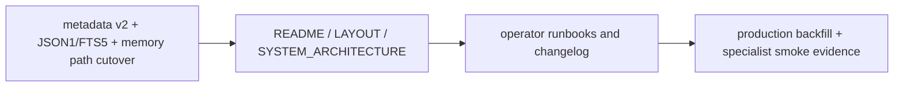

# Changelog

Obsidian MCP 로컬 패키지(`mcp_obsidian`)의 workspace, code, docs, setup 흐름 변경을 기록한다.

## 2026-03-28 - Root docs detailed expansion after v2 runtime consolidation

### Changed

- `README.md`
  - detailed runtime delta section 추가
  - production migration snapshot section 추가
- `LAYOUT.md`
  - runtime additions section 추가
  - storage/runtime file mapping 보강
- `SYSTEM_ARCHITECTURE.md`
  - metadata v2 / SearchPlan / JSON1+FTS5 / path backfill / production smoke delta section 추가
- `changelog.md`
  - 본 detailed expansion entry 추가

### Verification

- document append-only update completed
- existing content preserved
- new Mermaid graphs added to all four root docs

### Remaining manual / deferred

- root docs 전체 용어를 다시 한 번 line-by-line harmonize하는 작업은 별도 패스로 남겨 둔다

## 2026-03-28 - Memory v1 to v2 migration planning doc

### Added

- `docs/plans/PLAN_MEMORY_V2_MIGRATION.md`

### Changed

- `docs/CURSOR_SAVE_MEMORY_PRACTICAL_GUIDE.md`
  - v2 migration plan 링크 추가

### Verification

- document created
- cross-link updated

### Remaining manual / deferred

- no code or schema changes applied yet

## 2026-03-28 - Production backfill apply and specialist smoke recheck

### Changed

- `app/services/index_store.py`
  - FTS query terms are now safely quoted so hyphenated titles do not break specialist route `search`
- `tests/test_search_v2.py`
  - hyphenated-token search regression coverage added
- `docs/MCP_RUNTIME_EVIDENCE.md`
  - production backfill apply result and specialist smoke recheck evidence added
- `docs/PRODUCTION_RAILWAY_RUNBOOK.md`
  - production backfill apply procedure/result and post-migration specialist smoke recheck added

### Verification

- local:
  - `pytest -q tests/test_search_v2.py tests/test_memory_store.py tests/test_hybrid_storage.py` passed
  - `ruff check app\services\index_store.py tests\test_search_v2.py` passed
  - `ruff format --check app\services\index_store.py tests\test_search_v2.py` passed
- production deploy:
  - `railway up -d` -> deployment `7f706b9c-9d3d-429d-abb7-ca8519c225c7` -> `SUCCESS`
- production migration:
  - `railway ssh python /app/scripts/backfill_memory_paths.py --apply` moved `18` legacy notes
  - post-apply dry run returned `candidate_count = 0`
- production smoke recheck:
  - ChatGPT read-only route passed
  - Claude read-only route passed
  - ChatGPT write sibling route passed
    - sample id: `MEM-20260328-234330-5D6BA3`
  - Claude write sibling route passed
    - sample id: `MEM-20260328-234330-2D7741`

### Remaining manual / deferred

- repo-wide `ruff check .` is still not asserted here
- docs/history and reference docs still retain historical legacy-path examples where appropriate

## 2026-03-28 - Memory path cutover and active doc sync

### Changed

- `app/services/memory_store.py`
  - new memory saves now land under `memory/YYYY/MM/<MEM-ID>.md`
  - legacy `20_AI_Memory/...` paths remain readable/updatable through stored path references
- `tests/test_memory_store.py`
  - current write-path expectations updated to `memory/`
- `README.md`, `SYSTEM_ARCHITECTURE.md`, `AGENTS.md`
  - current storage contract updated to `memory/YYYY/MM` + legacy read support
- `docs/CURSOR_SAVE_MEMORY_PRACTICAL_GUIDE.md`
  - operator guide updated for the new write path
- `docs/plans/PLAN_MANUAL_MEMORY_WORKFLOW.md`
  - manual workflow summary and diagram updated for the new write path
- `docs/plans/PLAN_MEMORY_V2_MIGRATION.md`
  - Stage 4 path cutover reflected as implemented for new writes
- `docs/INSTALL_WINDOWS.md`
  - local vault path examples updated to `vault/memory/`
- `docs/VERIFICATION_PURGE_RUNBOOK.md`
  - purge candidate rules widened to `memory/` + legacy `20_AI_Memory/`

### Verification

- `pytest -q` passed
- targeted `ruff check ...` passed
- targeted `ruff format --check ...` passed

### Remaining manual / deferred

- full-repo `ruff check .` is still not asserted here
- historical evidence docs may still mention legacy `20_AI_Memory/` paths where they record past runs

## 2026-03-28 - Legacy memory path backfill script

### Added

- `app/services/path_backfill.py`
- `scripts/backfill_memory_paths.py`
- `tests/test_path_backfill.py`

### Changed

- `docs/plans/PLAN_MEMORY_V2_MIGRATION.md`
  - Stage 4에 operator backfill script 반영

### Verification

- `pytest -q` passed
- `ruff check app\services\path_backfill.py scripts\backfill_memory_paths.py tests\test_path_backfill.py` passed
- `ruff format --check app\services\path_backfill.py scripts\backfill_memory_paths.py tests\test_path_backfill.py` passed

### Remaining manual / deferred

- live vault against a real legacy dataset has not been executed
- duplicate-content legacy/target collision cleanup is still deferred

## 2026-03-28 - One-shot Claude MCP registration script

### Added

- `scripts/register_claude_mcp.ps1`

### Changed

- `docs/CLAUDE_MCP.md`
  - one-shot PowerShell registration script usage added

### Verification

- PowerShell script dry-run parse and Railway variable resolution passed

### Remaining manual / deferred

- live mutation of `C:\Users\jichu\.claude.json` still depends on operator execution

## 2026-03-28 - Authenticated specialist write-capable sibling routes

### Added

- `scripts/verify_specialist_mcp_write.py`

### Changed

- `app/config.py`
  - `CHATGPT_MCP_WRITE_TOKEN`, `CLAUDE_MCP_WRITE_TOKEN` support added
- `app/chatgpt_mcp_server.py`
  - authenticated write-capable sibling tool set added
  - `save_memory`, `get_memory`, `update_memory` added when write profile is requested
- `app/claude_mcp_server.py`
  - authenticated write-capable sibling tool set added
  - `save_memory`, `get_memory`, `update_memory` added when write profile is requested
- `app/main.py`
  - `/chatgpt-mcp-write`, `/claude-mcp-write` mounted
  - `/chatgpt-write-healthz`, `/claude-write-healthz` added
  - Bearer auth extended to authenticated specialist write sibling routes
- `app/chatgpt_main.py`
  - local ChatGPT-only dev app also exposes `/mcp-write`
- `tests/test_chatgpt_mcp_server.py`
  - write-capable tool set and write annotations coverage added
- `tests/test_claude_mcp_server.py`
  - write-capable tool set and write annotations coverage added
- `tests/test_auth.py`
  - authenticated specialist write sibling route auth coverage added
- `tests/test_healthz.py`
  - specialist write health route coverage added
- `README.md`, `SYSTEM_ARCHITECTURE.md`, `LAYOUT.md`, `plan.md`
  - specialist write sibling route current state reflected
- `docs/CHATGPT_MCP.md`, `docs/CLAUDE_MCP.md`
  - read-only route + write-capable sibling route split reflected
- `docs/MCP_RUNTIME_EVIDENCE.md`
  - production specialist write sibling verification evidence added
- `docs/PRODUCTION_RAILWAY_RUNBOOK.md`
  - specialist write sibling auth and verification commands added
- `.env.railway.production.example`
  - specialist write token placeholders added

### Verification

- `pytest -q` passed
- `ruff check .` passed
- `ruff format --check .` passed
- Railway production:
  - `/chatgpt-write-healthz` -> `200`
  - `/claude-write-healthz` -> `200`
  - unauthenticated `/chatgpt-mcp-write` -> `401`
  - unauthenticated `/claude-mcp-write` -> `401`
  - `python scripts\verify_specialist_mcp_write.py --server-url https://mcp-server-production-90cb.up.railway.app/chatgpt-mcp-write/ --token <redacted> --profile chatgpt` passed
    - sample id: `MEM-20260328-203945-8AD433`
  - `python scripts\verify_specialist_mcp_write.py --server-url https://mcp-server-production-90cb.up.railway.app/claude-mcp-write/ --token <redacted> --profile claude` passed
    - sample id: `MEM-20260328-203945-00EA52`
  - existing read-only specialist routes still passed:
    - `python scripts\verify_chatgpt_mcp_readonly.py --server-url https://mcp-server-production-90cb.up.railway.app/chatgpt-mcp/ --expected-title RailwayProductionDecision`
    - `python scripts\verify_claude_mcp_readonly.py --server-url https://mcp-server-production-90cb.up.railway.app/claude-mcp/ --expected-title RailwayProductionDecision`

### Remaining manual / deferred

- ChatGPT app UI still uses the no-auth read-only route
- ChatGPT in-conversation writes still need mixed-auth or OAuth if the write-capable path should be directly app-usable
- Claude client registration for the write-capable sibling route is still operator-configured

## 2026-03-28 - Comprehensive documentation sync

### Changed

- `README.md`
  - global Cursor MCP, local+production dual use, specialist hosted routes 반영
- `SYSTEM_ARCHITECTURE.md`
  - `/chatgpt-mcp`, `/claude-mcp`, HMAC phase-2, specialist route verification 반영
- `LAYOUT.md`
  - global Cursor config and new scripts/routes 반영
- `plan.md`
  - current verified baseline and remaining queue를 최신 runtime 상태로 정리
- `docs/INSTALL_WINDOWS.md`
  - global Cursor config, env vars, local direct save path 반영
- `docs/MCP_RUNTIME_EVIDENCE.md`
  - global Cursor MCP and ChatGPT/Claude specialist route evidence 추가
- `docs/CHATGPT_MCP.md`
  - hosted route and app creation fields 보강
- `docs/CLAUDE_MCP.md`
  - hosted route and Claude registration info 보강
- `docs/PRODUCTION_RAILWAY_RUNBOOK.md`
  - specialist read-only route 운영/검증 경로 반영
- `docs/CLAUDE_COWORK_MCP_OUTSOURCE_BRIEF.md`
  - `claude-mcp` route와 current integrated shape 반영

### Verification

- active doc recheck completed against current code and hosted routes
- `/chatgpt-healthz` -> `200`
- `/claude-healthz` -> `200`

### Remaining manual / deferred

- historical/archive docs remain historical and were not rewritten as current-state docs

## 2026-03-28 - Claude tool-only MCP profile

### Added

- `app/claude_mcp_server.py`
- `tests/test_claude_mcp_server.py`
- `scripts/start-claude-mcp-dev.ps1`
- `scripts/verify_claude_mcp_readonly.py`
- `docs/CLAUDE_MCP.md`

### Changed

- `app/main.py`
  - `/claude-mcp`, `/claude-healthz` mounted
- `tests/test_auth.py`
  - no-auth Claude route coverage added
- `tests/test_healthz.py`
  - Claude health route coverage added
- `README.md`
  - Claude read-only MCP route reflected

### Verification

- `pytest -q` passed
- `ruff check .` passed
- `ruff format --check .` passed
- Railway hosted Claude route:
  - `/claude-healthz` passed
  - `https://mcp-server-production-90cb.up.railway.app/claude-mcp` passed
  - tool set: `search`, `fetch`
  - no-auth read-only verification passed

### Remaining manual / deferred

- Claude UI / Claude Code registration is still manual

## 2026-03-28 - ChatGPT tool-only MCP profile

### Added

- `app/chatgpt_mcp_server.py`
- `app/chatgpt_main.py`
- `tests/test_chatgpt_mcp_server.py`
- `scripts/start-chatgpt-mcp-dev.ps1`
- `docs/CHATGPT_MCP.md`

### Changed

- `README.md`
  - ChatGPT read-only MCP profile 링크와 current state 반영

### Verification

- `pytest -q` passed
- `ruff check .` passed
- `ruff format --check .` passed
- `python -c "from app.chatgpt_main import app; print(app.title)"` passed
- Railway hosted ChatGPT route:
  - `/chatgpt-healthz` passed
  - `https://mcp-server-production-90cb.up.railway.app/chatgpt-mcp` passed
  - tool set: `search`, `fetch`
  - no-auth read-only verification passed

### Remaining manual / deferred

- ChatGPT Developer Mode app registration in the UI

## 2026-03-28 - Dual local + production usage path

### Added

- `scripts/sync_railway_production_to_local_vault.ps1`

### Changed

- `.cursor/mcp.json`
  - production + local MCP servers restored together
- `.cursor/mcp.sample.json`
  - production + local example restored together
- `scripts/start-mcp-dev.ps1`
  - `OBSIDIAN_LOCAL_VAULT_PATH`가 있으면 local direct save vault로 사용
- `scripts/start-mcp-dev.bat`
  - `OBSIDIAN_LOCAL_VAULT_PATH` support added
- `README.md`
  - dual local + production usage state reflected

### Verification

- `.cursor/mcp.json` parse passed
- `.cursor/mcp.sample.json` parse passed
- production backup archive downloaded locally and tar listing passed
- sync script dry run to temp local vault passed

### Remaining manual / deferred

- actual user Obsidian vault path still needs to be provided or set via `OBSIDIAN_LOCAL_VAULT_PATH`

## 2026-03-28 - HMAC phase 2 implementation and production recheck

### Added

- `app/utils/integrity.py`
- `tests/test_hmac_phase2.py`
- `scripts/verify_hmac_integrity.py`
- `docs/HMAC_PHASE_2.md`

### Changed

- `app/config.py`
  - `MCP_HMAC_SECRET` support added
- `app/models.py`
  - `MemoryRecord.mcp_sig` added
- `app/utils/sanitize.py`
  - memory free-text uses strict reject for mixed-secret `p2+`
- `app/services/markdown_store.py`
  - writes `mcp_sig` and can read stored memory documents for integrity checks
- `app/services/memory_store.py`
  - signs new/updated memory docs when HMAC secret exists
  - verifies already-signed memory docs before update
  - allows unsigned legacy notes and signs them on rewrite
- `app/services/raw_archive_store.py`
  - signs new raw archive docs when HMAC secret exists
- `scripts/seed_preview_data.py`
  - project-aware tags and content for preview/production seed runs
- `docs/MASKING_POLICY.md`
  - `p2+` mixed-secret reject and HMAC runtime status reflected
- `docs/PRODUCTION_RAILWAY_RUNBOOK.md`
  - production HMAC phase-2 runtime and recheck evidence reflected
- `docs/MCP_RUNTIME_EVIDENCE.md`
  - production HMAC recheck evidence added
- `docs/PROBE_DATA_POLICY.md`
  - signed verification probe expectation added
- `README.md`
  - HMAC runtime state reflected
- `plan.md`
  - HMAC phase-2 implemented/rechecked state reflected
- `.env.railway.production.example`
  - `MCP_HMAC_SECRET` example added

### Verification

- `pytest -q` passed
- `ruff check .` passed
- `ruff format --check .` passed
- Railway production:
  - `/healthz` passed
  - read-only verification passed
  - signed write note integrity verification passed
  - signed secret-path note integrity verification passed
  - signed raw archive integrity verification passed
  - unsigned legacy note only passed with `--allow-unsigned-legacy`

### Remaining manual / deferred

- historical unsigned legacy note backfill strategy
- optional custom domain cutover
- post-cutover token rotation ceremony

## 2026-03-28 - Verification purge execution

### Changed

- `docs/VERIFICATION_PURGE_RUNBOOK.md`
  - latest execution example with backup archive and deleted ids added

### Verification

- backup archive created:
  - `/data/backups/drill-20260328-123904.tar.gz`
- deleted ids:
  - `MEM-20260328-163311-FAFF64`
  - `MEM-20260328-163317-2B1DED`
- post-delete candidate query returned `[]`
- production `/healthz` returned `200`

### Remaining manual / deferred

- preview-labeled archived records without `verification` tag remain outside this runbook scope

## 2026-03-28 - Verification purge runbook

### Added

- `docs/VERIFICATION_PURGE_RUNBOOK.md`

### Changed

- `docs/PROBE_DATA_POLICY.md`
  - stricter purge 시 manual runbook 링크 추가
- `docs/PRODUCTION_RAILWAY_RUNBOOK.md`
  - production probe hygiene에 purge runbook 링크 추가
- `README.md`
  - purge runbook 링크 추가

### Verification

- manual document recheck completed
- Mermaid block included for new docs entry

### Remaining manual / deferred

- actual purge execution is operator-triggered only

## 2026-03-28 - Production verification labeling and probe data policy

### Added

- `docs/PROBE_DATA_POLICY.md`

### Changed

- `scripts/verify_mcp_write_once.py`
  - `preview-write-once`와 `production-write-once`를 분리
  - production verify는 `project=production`, `verification` tag 사용
- `scripts/verify_mcp_secret_paths.py`
  - `preview-secret-paths`와 `production-secret-paths`를 분리
  - production secret probe는 `project=production`, `verification` tag 사용
- `docs/PRODUCTION_RAILWAY_RUNBOOK.md`
  - production verify command와 probe hygiene link 추가
- `docs/WRITE_TOOL_GATE.md`
  - preview verification tag set에 `verification` 반영
- `README.md`
  - probe data policy 문서 링크 추가

### Verification

- `pytest -q` passed
- `ruff check .` passed
- `ruff format --check .` passed

### Remaining manual / deferred

- production probe data의 기존 preview-labeled archived records는 과거 이력으로 남아 있다
- optional manual purge policy is still operator-driven

## 2026-03-28 - Railway production split, backup drill, and interim endpoint adoption

### Changed

- `app/config.py`
  - Railway runtime domain variables를 transport security allowlist에 자동 포함하도록 확장
- `app/mcp_server.py`
  - runtime-derived host/origin allowlist 사용
- `scripts/seed_preview_data.py`
  - title/project/created_by/raw-id 인자 지원으로 generic railway seeding 가능
- `scripts/backup_restore_drill.py`
  - Railway production volume drill이 Python 3.14 tar extraction warning 없이 동작하도록 보강
- `docs/PRODUCTION_RAILWAY_RUNBOOK.md`
  - actual production split dry run + backup drill + interim endpoint adoption 반영
- `docs/MCP_RUNTIME_EVIDENCE.md`
  - production Railway dry run + backup drill + endpoint adoption 증거 추가
- `docs/REMOTE_DEPLOYMENT_MATRIX.md`
  - Railway production dry run status와 interim endpoint adoption 반영
- `README.md`, `plan.md`, `changelog.md`
  - current state와 next queue를 final gate 기준으로 갱신

### Added

- separate Railway production project:
  - `mcp-obsidian-production`

### Verification

- local:
  - `pytest -q` passed
  - `ruff check .` passed
  - `ruff format --check .` passed
- Railway production split:
  - project: `mcp-obsidian-production`
  - service: `mcp-server`
  - volume: `/data`
  - generated domain: `https://mcp-server-production-90cb.up.railway.app`
  - `/healthz` passed
  - read-only verification passed
  - write-once verification passed
  - secret-path verification passed
  - backup/restore drill passed
    - archive example: `/data/backups/drill-20260328-122306.tar.gz`
    - restore root: `/tmp/restore-drill`
  - generated Railway domain officially adopted as the current interim production endpoint

### Remaining manual / deferred

- custom production domain is optional future hardening
- post-cutover production token rotation ceremony only applies if a custom domain is introduced
- HMAC enforcement / sensitivity-aware variants phase 2

## 2026-03-28 - Railway chosen as production path

### Added

- `docs/PRODUCTION_RAILWAY_RUNBOOK.md`
- `.env.railway.production.example`

### Changed

- `README.md`
  - Railway production path 링크 및 운영 결정 갱신
- `docs/REMOTE_DEPLOYMENT_MATRIX.md`
  - Railway를 production 선택안으로 승격
- `docs/RAILWAY_PREVIEW_RUNBOOK.md`
  - preview track와 production path 관계 재정의
- `docs/PRODUCTION_VPS_RUNBOOK.md`
  - self-managed alternate reference로 위치 조정
- `docs/VPS_EXECUTION_CHECKLIST.md`, `docs/VPS_COMMAND_SHEET.md`
  - self-managed reference 문구로 조정
- `plan.md`
  - Railway production 중심으로 다음 queue 조정
- `LAYOUT.md`
  - Railway production 운영 경로 반영

### Verification

- current Railway project/service linkage confirmed through CLI
- current Railway service variables confirmed
- current Railway domains confirmed

### Remaining manual / deferred

- separate Railway production project/environment creation
- Railway production custom domain apply
- Railway production dry run

## 2026-03-28 - VPS production rollout runbook

### Added

- `docs/PRODUCTION_VPS_RUNBOOK.md`
- `.env.production.example`
- `docs/VPS_EXECUTION_CHECKLIST.md`
- `docs/VPS_COMMAND_SHEET.md`
- `deploy/caddy/Caddyfile.production.example`
- `deploy/systemd/mcp-obsidian.service.example`

### Changed

- `README.md`
  - production rollout runbook / checklist 링크 추가
- `LAYOUT.md`
  - VPS production 운영 경로 반영
- `docs/PRODUCTION_VPS_RUNBOOK.md`
  - `.env.production.example`, deploy templates, execution checklist, command sheet 참조 추가
- `README.md`
  - VPS command sheet 링크 추가
- `docs/VPS_EXECUTION_CHECKLIST.md`
  - command sheet 연결 추가

### Verification

- 문서 기준 production topology 정리 완료
- `.env.production.example` 추가 완료
- `deploy/` template 추가 완료
- VPS 실행 체크리스트 추가 완료
- VPS command sheet 추가 완료

### Remaining manual / deferred

- 실제 VPS provisioning
- 실제 Caddy apply
- 실제 systemd enable/start

## 2026-03-28 - Write-tool gate, tests, and one live Railway preview write verification

### Added

- `docs/WRITE_TOOL_GATE.md`
- `scripts/verify_mcp_write_once.py`

### Changed

- `tests/test_memory_store.py`
  - save persistence assertion 추가
  - update immutable-field preservation assertion 추가
  - failed update leaves stored record unchanged assertion 추가
- `tests/test_masking_policy.py`
  - rejected update leaves existing state unchanged assertion 추가
- `docs/MCP_RUNTIME_EVIDENCE.md`
  - write-tool gate placeholder를 actual verified result로 교체
- `docs/RAILWAY_PREVIEW_RUNBOOK.md`
  - one live write verification result 반영
- `docs/MASKING_POLICY.md`
  - live preview write note 추가
- `README.md`, `plan.md`
  - write-once preview verification 완료 상태 반영

### Verification

- `pytest -q` passed
- `ruff check .` passed
- `ruff format --check .` passed
- `python scripts/verify_mcp_write_once.py --server-url https://mcp-server-production-1454.up.railway.app/mcp/ --token <redacted> --confirm preview-write-once` passed
- live preview write result:
  - save -> `MEM-20260328-145016-D57430`
  - update -> success
  - `get_memory` / `search_memory` / `fetch` read-back success
  - rollback archive -> success

### Remaining manual / deferred

- secret-masking / reject behavior의 live remote write verification
- production write policy

## 2026-03-28 - Live secret-path verification and preview policy decision

### Added

- `scripts/verify_mcp_secret_paths.py`

### Changed

- `docs/MCP_RUNTIME_EVIDENCE.md`
  - mixed-secret mask / secret-only reject live result 반영
- `docs/RAILWAY_PREVIEW_RUNBOOK.md`
  - preview-only policy
  - token rotation / teardown
  - production candidate note 반영
- `docs/MASKING_POLICY.md`
  - live secret-path verification 결과 반영
- `docs/REMOTE_DEPLOYMENT_MATRIX.md`
  - Railway preview-only / VPS production candidate 결정 반영
- `README.md`, `plan.md`
  - current operating decision과 secret-path verification 상태 반영

### Verification

- `python scripts/verify_mcp_secret_paths.py --server-url https://mcp-server-production-1454.up.railway.app/mcp/ --token <redacted> --confirm preview-secret-paths` passed
- mixed-secret payload:
  - save succeeded
  - read-back content masked
  - archived rollback succeeded
- secret-only payload:
  - tool call rejected
  - title search returned no results

### Remaining manual / deferred

- production VPS rollout itself
- HMAC enforcement and sensitivity-aware variants

## 2026-03-28 - Duplicate doc cleanup and full Mermaid coverage

### Added

- `docs/reference/`
- `docs/history/`

### Changed

- non-authoritative root docs moved to `docs/reference/`
  - `guide.md`
  - `patch.md`
  - `Vault API_frontmatter_index.md`
  - `Vault API_frontmatter_index_patch.md`
  - `지시문.md`
- point-in-time records moved to `docs/history/`
  - `STAGE_RECHECK_AUDIT_20260328.md`
  - `docs/CURSOR_LATEST_NOTES_2026-03-28.md`
- `README.md`
  - canonical / reference / history 문서 구분 반영
- `LAYOUT.md`
  - `docs/reference/`, `docs/history/` 역할 반영
- Mermaid added or preserved across all root/docs Markdown files
  - root canonical docs
  - active docs
  - reference docs
  - history docs

### Verification

- root `*.md` + `docs/**/*.md` Mermaid audit -> all targets `count >= 1`
- stale moved-file reference search rechecked
- no root duplicate reference docs remain after moves

### Remaining manual / deferred

- moved historical/reference docs에 대한 deeper content dedupe는 아직 하지 않음
- write-tool hardening track과는 별도 작업

## 2026-03-28 - Independent documentation refresh after direct recheck

### Changed

- `README.md`
  - 현재 코드 기준선, root docs map, verified execution snapshot, Railway hosted preview 상태를 독립적으로 정리
- `SYSTEM_ARCHITECTURE.md`
  - `app/config.py`, `app/main.py`, `app/mcp_server.py`, `app/services/memory_store.py` 기준으로 현재 구조를 다시 설명
  - Railway transport security allowlist와 public preview request path를 반영
- `LAYOUT.md`
  - `Dockerfile`, `.dockerignore`, preview seed/verify scripts, `docs/RAILWAY_PREVIEW_RUNBOOK.md`를 실제 active layout에 반영
- `changelog.md`
  - direct recheck 기반 최신 문서 refresh 이력을 추가

### Direct recheck basis

- code rechecked:
  - `app/config.py`
  - `app/main.py`
  - `app/mcp_server.py`
  - `app/services/memory_store.py`
- docs rechecked:
  - `README.md`
  - `SYSTEM_ARCHITECTURE.md`
  - `LAYOUT.md`
  - `changelog.md`
- execution rechecked:
  - `pytest -q`
  - `ruff check .`
  - `ruff format --check .`
  - `npm run check`
  - `npm run build`
  - Railway `/healthz`
  - Railway `/mcp`
  - `python scripts/verify_mcp_readonly.py ...`

### Verification

- `pytest -q` passed
- `ruff check .` passed
- `ruff format --check .` passed
- `npm run check` passed
- `npm run build` passed
- Railway preview recheck passed
  - `/healthz` -> `200`
  - `/mcp` -> `307`
  - read-only MCP verification script -> pass

## 2026-03-28 - Railway hosted preview deployment

### Added

- `Dockerfile`
- `.dockerignore`
- `scripts/seed_preview_data.py`
- `scripts/verify_mcp_readonly.py`
- `docs/RAILWAY_PREVIEW_RUNBOOK.md`
- `tests/test_transport_security.py`

### Changed

- `app/config.py`
  - `MCP_ALLOWED_HOSTS`, `MCP_ALLOWED_ORIGINS` env support 추가
- `app/mcp_server.py`
  - explicit host/origin allowlist가 있으면 FastMCP transport security에 반영
- `Dockerfile`
  - Railway reverse proxy 앞에서 HTTPS redirect scheme를 유지하도록 proxy header trust 추가
- `README.md`, `plan.md`, `docs/MCP_RUNTIME_EVIDENCE.md`, `docs/REMOTE_DEPLOYMENT_MATRIX.md`
  - Railway selected preview path와 실제 runtime evidence 반영

### Verification

- `pytest -q` passed
- `ruff check .` passed
- `ruff format --check .` passed
- Railway project created: `mcp-obsidian-preview`
- Railway service created: `mcp-server`
- Railway volume attached at `/data`
- Railway variables set:
  - `VAULT_PATH=/data/vault`
  - `INDEX_DB_PATH=/data/state/memory_index.sqlite3`
  - `TIMEZONE=Asia/Dubai`
  - `OBS_VAULT_NAME=mcp_obsidian_preview`
  - `MCP_ALLOWED_HOSTS`, `MCP_ALLOWED_ORIGINS`
- Railway deployment `9e4c590b-48ce-4fcb-983e-0949afd67f79` -> `SUCCESS`
- selected preview URL: `https://mcp-server-production-1454.up.railway.app`
- preview endpoint checks:
  - `/healthz` -> `200`
  - `/mcp` -> `307` to `https://.../mcp/`
  - `/mcp/` -> `400 Missing session ID`
- preview seed succeeded:
  - raw: `mcp_raw/manual/2026-03-28/convo-railway-preview-seed.md`
  - memory: `20_AI_Memory/decision/2026/03/MEM-20260328-120319-ACEB90.md`
- `python scripts/verify_mcp_readonly.py --server-url https://mcp-server-production-1454.up.railway.app/mcp/ --token <redacted>` passed

### Remaining manual / deferred

- write-tool live end-to-end verification is not yet executed
- production deployment path is not yet selected
- HMAC enforcement and sensitivity-aware variants remain deferred hardening items

## 2026-03-28 - Masking policy, deployment matrix, and live MCP evidence

### Added

- `docs/MASKING_POLICY.md`
- `docs/MCP_RUNTIME_EVIDENCE.md`
- `docs/REMOTE_DEPLOYMENT_MATRIX.md`
- `tests/test_masking_policy.py`

### Changed

- `app/utils/sanitize.py`
  - conservative mask/reject helper 추가
  - mixed secret text mask, pure secret reject 로직 추가
- `app/services/memory_store.py`
  - `title`, `content`, `source`, `project`, `created_by`, `tags` 저장 전 policy 적용
- `app/services/raw_archive_store.py`
  - `body_markdown` mask/reject
  - label field reject 적용
- `README.md`, `plan.md`, `docs/INSTALL_WINDOWS.md`, `AGENTS.md`
  - masking / runtime evidence / deployment matrix / Cursor connected 상태 반영
- `docs/history/STAGE_RECHECK_AUDIT_20260328.md`
  - docs sync와 remaining manual gate 갱신

### Verification

- `pytest -q` passed
- `ruff check .` passed
- `ruff format --check app tests` passed
- `npm run check` passed
- `npm run build` passed
- live MCP read-only verification passed through the HTTP transport
  - `/healthz` -> `200`
  - `/mcp` -> `307`
  - `/mcp/` -> `400 Missing session ID`
  - `list_recent_memories` returned normalized memory
  - `search_memory('E2E hybrid decision')` returned normalized memory
  - `search_memory('raw conversation body only')` returned empty results
  - wrapper `search` / `fetch` returned compatible normalized-memory results
- Cursor `Settings -> MCP`에서 `obsidian-memory-local = connected` 수동 확인

### Remaining manual / deferred

- preview HTTPS deployment path is not yet executed
- write-tool live end-to-end verification is not yet executed
- HMAC enforcement and sensitivity-aware variants remain deferred hardening items

## 2026-03-28 - Hybrid redesign start

### Added

- `obsidian-memory-plugin/` TypeScript scaffold
- `schemas/raw-conversation.schema.json`
- `schemas/memory-item.schema.json`
- `app/services/raw_archive_store.py`
- `app/services/schema_validator.py`
- `tests/test_hybrid_storage.py`

### Changed

- `app/models.py`
  - `RawConversationCreate` 추가
  - `created_by`를 memory payload/model에 추가
- `app/services/memory_store.py`
  - `mcp_raw/` + `90_System/` 구조 준비
  - shared schema validation 추가
  - raw archive save path 추가
- `app/services/markdown_store.py`
  - memory frontmatter를 `memory_item` schema 기준으로 기록
- `README.md`, `SYSTEM_ARCHITECTURE.md`, `LAYOUT.md`, `plan.md`
  - hybrid architecture와 plugin/server split 반영

### Verification

- `pytest -q` passed
- `ruff check .` passed
- `ruff format --check app tests` passed
- schema and plugin JSON parse checks passed
- `npm run check` passed
- `npm run build` passed
- hybrid raw -> memory -> search runtime check passed at the server storage layer
- Cursor project-local MCP artifact created with tool offerings

### Manual

- Cursor MCP final `connected` confirmation in UI/status
- live MCP end-to-end verification through the HTTP transport

## 2026-03-28 - Safe selective merge and root-level documentation

### Added

- `app/services/daily_store.py`
- `app/utils/ids.py`
- `app/utils/sanitize.py`
- `app/utils/time.py`
- `examples/openai_responses_client.py`
- `examples/anthropic_messages_client.py`
- `tests/test_merge_helpers.py`
- `SYSTEM_ARCHITECTURE.md`
- `LAYOUT.md`

### Changed

- `app/services/memory_store.py`
  - helper 기반 ID 생성, tag normalization, text normalization, timezone-aware timestamp 처리
  - markdown write -> SQLite upsert 순서 유지
  - `append_daily`가 켜진 경우 structured daily note append 사용
- `app/services/index_store.py`
  - search 성능용 index 추가
  - normalized tag filtering
  - `recency_days` filtering 추가
  - 기존 returned dict shape 유지
- `app/services/markdown_store.py`
  - vault root 보장만 추가, frontmatter key 변경 없음
- `app/mcp_server.py`
  - `search_memory`에 `recency_days` 전달
  - compatibility wrapper shape 고정용 helper 추가
  - `search` / `fetch` response shape 유지
- `README.md`
  - root doc hub 구조 반영
  - current state, doc map, Mermaid runtime overview, parallel documentation lanes 추가
- `changelog.md`
  - 이번 safe-selective merge 및 문서화 작업 기록으로 갱신
- `docs/INSTALL_WINDOWS.md`
  - Streamable HTTP 선호, client boundary, remote API expansion notes, `/mcp` manual check 보강
- `tests/test_memory_store.py`
  - daily note on/off
  - update normalization
  - tag/recency search coverage 추가

### Verification

- `pytest -q`
  - 11 tests passed
  - `pytest_asyncio` deprecation warning remains manual
- `ruff check .`
  - passed
- `ruff format --check .`
  - passed
- `python -c "import json; ..."`
  - `.cursor/mcp.sample.json`, `.cursor/mcp.json`, `.cursor/hooks.json` parse passed
- `python -c "from app.main import app; print(app.title)"`
  - entrypoint import passed
- PowerShell parser check for `install_cursor_fullsetup.ps1`
  - syntax ok

### Intentionally unchanged

- auth middleware behavior
- public endpoint shape: `/mcp`, `/healthz`
- MCP tool names and JSON schemas
- compatibility wrapper response shape
- memory enum / status enum / sensitivity enum
- vault directory layout and file naming rules
- markdown-first architecture
- SQLite as derived accelerator only
- automatic write scope and access control posture

### Archive and runtime boundary

- `obsidian_mcp_delivery_20260328/` is retained as delivery archive.
- `obsidian_mcp_delivery_20260328/obsidian-mcp-mvp` was used as the only merge source for selective ideas.
- `obsidian_mcp_delivery_20260328/obsidian_mcp_delivery_20260328/obsidian-mcp-mvp` remains ignored as duplicate archive content.
- delivery snapshot replacement, alternate auth module, alternate host/port defaults, and changed wrapper shapes were not adopted.

### Manual

- live Cursor MCP connected 상태 확인
- live `/healthz` / `/mcp` reachability 확인
- public HTTPS remote-client examples execution

## 2026-03-28 - Workspace alignment baseline

### Added

- `.cursor/mcp.json`: 프로젝트 MCP 서버 `obsidian-memory-local`, Streamable HTTP `http://127.0.0.1:8000/mcp`, 헤더 `Authorization: Bearer ${env:MCP_API_TOKEN}`.
- `.cursorignore`: Cursor indexing / Agent / `@` 참조에서 제외할 cache, secret, archive 패턴.
- `scripts/start-mcp-dev.ps1`, `scripts/start-mcp-dev.bat`: 저장소 루트에서 `uvicorn app.main:app --host 127.0.0.1 --port 8000 --reload`.

### Changed

- `.cursor/mcp.sample.json`: project-local HTTP MCP 레이아웃으로 통일
- `.cursor/rules`: core / plan / contract / quality / ops 문구 보강
- `.gitignore`: venv, cache, log, build artifact, data ignore 보강
- `install_cursor_fullsetup.bat`, `install_cursor_fullsetup.ps1`: root resolution, env setup, pre-commit install 흐름 보강
- `README.md`, `docs/INSTALL_WINDOWS.md`: token, restart, MCP, manual checks 정리

### Intentionally unchanged

- `app/main.py` auth flow, `/mcp`, `/healthz`
- MCP tool names and schemas
- vault layout and markdown-first contract
- `.cursor/cli.json` 미추가
