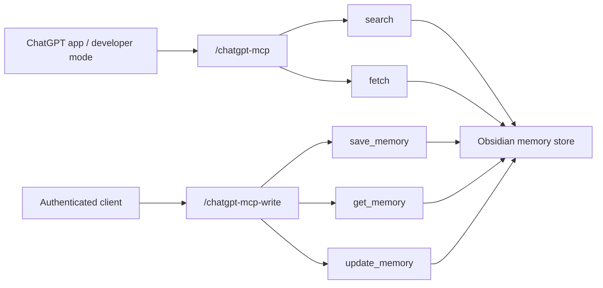

# ChatGPT MCP



## Archetype

`tool-only`

## Purpose

이 문서는 ChatGPT용 specialist MCP 경로 2개를 다룬다.

- public app-facing read-only route
- authenticated write-capable sibling route

## Tool Surface

### Read-only route `/chatgpt-mcp`

- `search`
- `fetch`

둘 다 read-only다.

### Write-capable sibling `/chatgpt-mcp-write`

- `search`
- `fetch`
- `save_memory`
- `get_memory`
- `update_memory`

이 sibling route는 Bearer auth가 필요하다.

## Local Run

```powershell
powershell -ExecutionPolicy Bypass -File .\scripts\start-chatgpt-mcp-dev.ps1
```

endpoint:

- `http://127.0.0.1:8001/mcp`

## Hosted Route

- read-only:
  - `https://mcp-server-production-90cb.up.railway.app/chatgpt-mcp`
  - auth:
    - `No Authentication`
  - verification:
    - `/chatgpt-healthz` -> `200`
    - tool set: `search`, `fetch`
    - no-auth read-only verification passed
- write-capable sibling:
  - `https://mcp-server-production-90cb.up.railway.app/chatgpt-mcp-write`
  - auth:
    - `Authorization: Bearer <CHATGPT_MCP_WRITE_TOKEN or MCP_API_TOKEN>`
  - verification:
    - `/chatgpt-write-healthz` -> `200`
    - unauthenticated route probe -> `401`
    - authenticated specialist write verification passed

## App Creation Fields

- name:
  - `obsidian-memory-chatgpt`
- MCP server URL:
  - `https://mcp-server-production-90cb.up.railway.app/chatgpt-mcp`
- authentication:
  - `No Authentication`
- description:
  - `Obsidian-backed read-only memory search and fetch for ChatGPT`

## Notes

- 기존 full MCP surface를 대체하지 않는다.
- ChatGPT app creation UI에는 현재 read-only route만 바로 연결한다.
- write-capable sibling route는 operator/integration path로 배포했다.
- OpenAI Developer Mode docs 기준 ChatGPT app은 `OAuth`, `No Authentication`, `Mixed Authentication`을 지원한다.
- 현재 repo는 ChatGPT write route를 bearer-gated sibling으로 먼저 구현했다.
- 따라서 ChatGPT app 안에서 실제 write까지 쓰려면 다음 단계에서 mixed-auth 또는 OAuth metadata/runtime을 추가해야 한다.
- standard `search` / `fetch` naming을 유지한다.

## Verification Command

```powershell
python scripts\verify_specialist_mcp_write.py --server-url https://mcp-server-production-90cb.up.railway.app/chatgpt-mcp-write/ --token <TOKEN> --profile chatgpt
```
