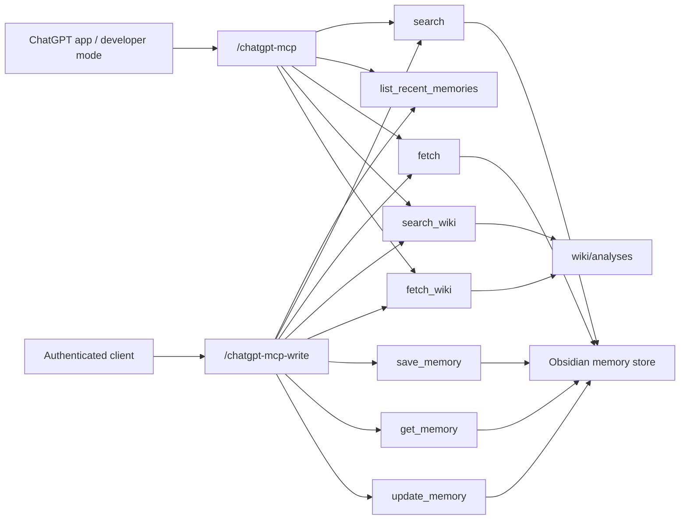

# ChatGPT MCP



## Archetype

`tool-only`

## Purpose

이 문서는 ChatGPT용 specialist MCP 경로 2개를 다룬다.

- public app-facing read-only route
- authenticated write-capable sibling route

## Tool Surface

### Read-only route `/chatgpt-mcp`

- `search`
- `list_recent_memories`
- `fetch`
- `search_wiki`
- `fetch_wiki`
- resources
  - `resource://wiki/index`
  - `resource://wiki/log/recent`
  - `resource://wiki/topic/{slug}`
  - `resource://schema/memory`
  - `resource://ops/verification/latest`
  - `resource://ops/routes/profile-matrix`
- prompts
  - `ingest_memory_to_wiki`
  - `reconcile_conflict`
  - `weekly_lint_report`
  - `summarize_recent_project_state`

주의:
- 모델이 recent/list 질문에서 실수로 `search`를 먼저 호출해도, date-only memory query나 `최근 메모` 같은 generic recent query는 recent browse 의도로 처리되도록 보정한다.

둘 다 read-only다.

### Write-capable sibling `/chatgpt-mcp-write`

- `search`
- `list_recent_memories`
- `fetch`
- `search_wiki`
- `fetch_wiki`
- `save_memory`
- `get_memory`
- `update_memory`
- `sync_wiki_index`
- `append_wiki_log`
- `write_wiki_page`
- `lint_wiki`
- `reconcile_conflict`

이 sibling route는 Bearer auth가 필요하다.

## Local Run

통합 runtime 기준:

```powershell
uvicorn app.main:app --host 127.0.0.1 --port 8000 --reload
```

endpoint:

- `http://127.0.0.1:8000/chatgpt-mcp`
- `http://127.0.0.1:8000/chatgpt-mcp-write`

specialist-only dev script 기준:

```powershell
powershell -ExecutionPolicy Bypass -File .\scripts\start-chatgpt-mcp-dev.ps1
```

endpoint:

- `http://127.0.0.1:8001/mcp`

## Hosted Route

- read-only:
  - `https://mcp-server-production-90cb.up.railway.app/chatgpt-mcp`
  - auth:
    - `No Bearer Authentication`
    - deployment에 따라 host/origin allowlist는 적용될 수 있음
  - verification:
    - `/chatgpt-healthz` -> `200` (liveness only)
    - `python scripts\verify_chatgpt_mcp_readonly.py --server-url https://mcp-server-production-90cb.up.railway.app/chatgpt-mcp/` -> pass
    - `python scripts\mcp_local_tool_smoke.py --base-url https://mcp-server-production-90cb.up.railway.app --path /chatgpt-mcp/ --search-query "초기 실행 절차를 CLAUDE.md와 wiki 업데이트 규칙으로 고정한다" --require-read-hit` -> pass
    - current-session read-only surface: `search`, `list_recent_memories`, `fetch`, `search_wiki`, `fetch_wiki`
    - current-session read-only discoverability: `resources = 5`, `prompts = 4`
- write-capable sibling:
  - `https://mcp-server-production-90cb.up.railway.app/chatgpt-mcp-write`
  - auth:
    - `Authorization: Bearer <CHATGPT_MCP_WRITE_TOKEN or MCP_API_TOKEN>`
  - verification:
    - `/chatgpt-write-healthz` -> `200` (liveness only)
    - unauthenticated route probe -> `401`
    - `python scripts\verify_specialist_mcp_write.py --server-url https://mcp-server-production-90cb.up.railway.app/chatgpt-mcp-write/ --token <TOKEN> --profile chatgpt` -> pass
    - current-session write surface: 13 tools including `search_wiki`, `fetch_wiki`, `sync_wiki_index`, `append_wiki_log`, `write_wiki_page`, `lint_wiki`, `reconcile_conflict`

## App Creation Fields

- name:
  - `obsidian-memory-chatgpt`
- MCP server URL:
  - `https://mcp-server-production-90cb.up.railway.app/chatgpt-mcp`
- authentication:
  - `No Authentication`
- description:
  - `Obsidian-backed read-only memory and wiki-analysis search, recent listing, and fetch for ChatGPT`

## Notes

- 기존 full MCP surface를 대체하지 않는다.
- ChatGPT app creation UI에는 현재 read-only route만 바로 연결한다.
- write-capable sibling route는 operator/integration path로 배포했다.
- OpenAI Developer Mode docs 기준 ChatGPT app은 `OAuth`, `No Authentication`, `Mixed Authentication`을 지원한다.
- 현재 repo는 ChatGPT write route를 bearer-gated sibling으로 먼저 구현했다.
- 따라서 ChatGPT app 안에서 실제 write까지 쓰려면 다음 단계에서 mixed-auth 또는 OAuth metadata/runtime을 추가해야 한다.
- standard `search` / `fetch` naming을 유지하고, recent/list 성격 질문은 `list_recent_memories`로 처리한다.
- `search_wiki` / `fetch_wiki`는 `wiki/analyses`를 위한 read-only 보조 surface다. unified search는 MCP public tool이 아니라 standalone orchestration layer에서만 합쳐진다.
- current-session production PASS evidence는 `docs/MCP_RUNTIME_EVIDENCE.md`에 시간순으로 유지한다.

## Verification Commands

```powershell
python scripts\verify_chatgpt_mcp_readonly.py --server-url https://mcp-server-production-90cb.up.railway.app/chatgpt-mcp/
python scripts\mcp_local_tool_smoke.py --base-url https://mcp-server-production-90cb.up.railway.app --path /chatgpt-mcp/ --search-query "초기 실행 절차를 CLAUDE.md와 wiki 업데이트 규칙으로 고정한다" --require-read-hit
python scripts\verify_specialist_mcp_write.py --server-url https://mcp-server-production-90cb.up.railway.app/chatgpt-mcp-write/ --token <TOKEN> --profile chatgpt
```

현재 코드 기준으로 위 verifier는 `save_memory/get_memory/update_memory`뿐 아니라 `sync_wiki_index`, `append_wiki_log`, `lint_wiki`까지 함께 점검하도록 확장됐다. live production 결과는 별도 evidence에 기록해야 한다.
