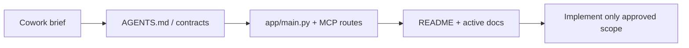

# Claude Cowork / Claude Code — MCP 작업 외주 브리프

이 문서는 **Claude Cowork(또는 Claude Code 세션)** 에서 이 저장소의 **MCP 서버 제작·확장·수정**을 외부에 맡길 때 붙여 넣거나 공유할 **최소 지침**이다.  
`plan.md`와 별도로 두며, 외주 담당자는 아래 순서대로 읽고 작업한다.



**검증 기준선:** 저장소의 `AGENTS.md`, `app/main.py`, `app/mcp_server.py`, `docs/CHATGPT_MCP.md`, `.github/workflows/ci.yml` 과 대조해 2026-03-28에 정합성을 맞춤.

## 1. 필수 선행 읽기 (순서 고정)

1. 저장소 루트 `AGENTS.md` — 도구 계약, 데이터 계약, 보안 경계, **Ask Before Changing**, 검증·보고 규약.
2. `CLAUDE.md` — Claude 전용 델타(훅·스킬·plan mode 관련).
3. `SYSTEM_ARCHITECTURE.md` — `/healthz`, `/mcp`, 스토어 계층, 인증 개요.
4. (선택) `README.md`의 **Document Map** — 문서·스크립트 위치를 한 번에 파악.
5. MCP·메모리 저장과 직접 겹치면 `.cursor/skills/mcp-contract-review/SKILL.md` 및 `.cursor/skills/obsidian-memory-workflow/SKILL.md` 를 읽는다.
6. **ChatGPT 전용 read-only 프로필**을 건드릴 때는 `docs/CHATGPT_MCP.md` 를 반드시 읽는다 (도구는 `search` / `fetch` 만, 별도 URL·앱 구성).

**금지:** 위를 건너뛰고 도구 이름·엔드포인트·스키마만 보고 구현을 바꾸는 것.

## 2. 잠금 계약 (변경 시 저장소 소유자 사전 승인 필수)

아래는 **단독 판단으로 바꾸지 않는다.** 바꿔야 하면 설계안 + 영향 범위 + 마이그레이션을 문서화하고 **명시적 승인**을 받은 뒤에만 반영한다.

- 공개 엔드포인트 형태: **`GET /healthz`**, MCP 스트림 HTTP 앱은 통합 앱에서 **`/mcp`** 에 마운트된다 (`app/main.py` 의 `app.mount("/mcp", ...)`).
- 통합 앱에는 보조 엔드포인트가 있다: `GET /chatgpt-healthz`, ChatGPT 전용 MCP 마운트 **`/chatgpt-mcp`** (도구·정책은 `docs/CHATGPT_MCP.md` 준수), `GET /claude-healthz`, Claude 전용 MCP 마운트 **`/claude-mcp`** (도구·정책은 `docs/CLAUDE_MCP.md` 준수). 로컬 전용으로 `app/chatgpt_main.py` 가 별도 포트에서 **`/mcp`** 를 쓰는 구성도 있다 — **문서와 코드를 함께** 확인할 것.
- 구현 참고: 통합 앱의 Bearer 검사는 요청 경로가 **`/mcp`로 시작할 때만** 적용된다 (`app/main.py`). **`/chatgpt-mcp`와 `/claude-mcp`는 그 분기 밖**이므로 인증·노출 범위를 바꿀 때는 계약 검토가 필요하다.
- **Ask Before Changing** (`AGENTS.md` 원문과 동일): 인증 미들웨어, 공개 엔드포인트 형태(`/mcp`, `/healthz`), MCP 도구 이름·JSON 스키마, 메모리·상태·민감도 enum, vault 레이아웃·파일 명명, 호환 래퍼 응답 형태, 자동 쓰기 증가·접근 통제 약화.
- MCP **도구 이름** (안정 유지):
  - `search_memory`, `save_memory`, `get_memory`, `list_recent_memories`, `update_memory`
  - 호환 래퍼: `search`, `fetch`
- 호환 래퍼 **응답 형태** 무단 변경 금지.
- 프론트매터 키, status/sensitivity 등 **열거형·필드 계약**의 조용한 이름 변경·의미 변경 금지.
- Vault 레이아웃·상대 경로 규칙(`/` 구분자), 메모리 ID 패턴 `MEM-YYYYMMDD-HHMMSS-XXXXXX` 무단 변경 금지.
- **Markdown-first**: 마크다운이 SSOT, SQLite는 파생 검색 인덱스.
- **자동 쓰기 범위 확대**, **접근 통제 완화** 금지. (예: 호스팅에서 ChatGPT 경로의 인증 모델을 임의로 바꾸는 것도 접근 통제 변경이므로 승인 없이 하지 않는다.)

무결성·서명 필드(HMAC phase-2 등)는 구현과 `docs/HMAC_PHASE_2.md` 가 정하는 범위를 깨거나 저장 포맷을 조용히 바꾸지 않는다.

새 MCP 서버를 **별도 엔트리포인트**로 추가하는 것(예: 기존과 분리된 read-only 프로필)은 **기존 7개 도구 계약과 `/mcp`·`/healthz` 계약을 깨지 않는 한**, 테스트·문서와 함께 가능하다. 기존 도구를 **대체·리네임**하는 것은 **승인 없이 하지 않는다.**

## 3. 보안·비밀 (하드코딩 금지)

- 실제 `MCP_API_TOKEN`, Vault 실경로, 사설 URL, 프로덕션 호스트를 코드·문서·커밋에 넣지 않는다. (예시 URL이 이미 들어 있는 **기존** 문서를 복제해 새 비밀을 추가하지 말 것.)
- 설정은 환경 변수·**저장소 루트**의 `.env`(로컬, 커밋 제외)로만 둔다. 템플릿은 루트 **`.env.example`** 을 따른다.
- 메모리 본문·로그에 민감 정보를 그대로 남기지 않는다. 마스킹·거절 기준은 `docs/MASKING_POLICY.md` 및 구현 `app/utils/sanitize.py` 등을 따른다.

## 4. 작업 범위 구분 (외주 요청서에 명시할 것)

요청 시 아래 중 하나로 **범위를 고정**한다.

| 유형 | 설명 | 비고 |
|------|------|------|
| **A. 버그픽스** | 기존 계약 유지, 최소 diff | 회귀 테스트 추가 권장 |
| **B. 기능 추가 (내부)** | 새 헬퍼·비공개 API, 도구 시그니처 불변 | 공개 스키마 변경 없음 |
| **C. 기능 추가 (도구)** | 새 파라미터/도구 | **Ask Before Changing** 해당 시 사전 승인 |
| **D. 배포/런북** | Dockerfile, 스크립트, 문서만 | 런타임 계약 변경 시 A/B/C와 분리해 검토 |

범위 밖(리팩터 전면 교체, 프레임워크 교체, 인증 모델 변경 등)은 별도 기획으로 분리한다.

## 5. 구현 시 터치 가능한 주요 경로 (참고)

- `app/main.py` — 앱 팩토리, bearer 미들웨어, `/mcp`·`/chatgpt-mcp`·`/claude-mcp` 마운트.
- `app/mcp_server.py` — 전체 MCP 도구 등록·스키마.
- `app/chatgpt_mcp_server.py`, `app/chatgpt_main.py` — ChatGPT read-only 프로필(해당 작업 시만).
- `app/services/memory_store.py` — 저장·검색·일간 노트 등 오케스트레이션.
- `app/services/` — 스토어·인덱스 계층.
- `schemas/` — JSON Schema; 저장 포맷과 맞출 것.
- `tests/` — 계약·회귀.
- (플러그인만) `obsidian-memory-plugin/` — MCP 서버 역할은 하지 않지만 vault 큐레이션과 연관될 수 있음.

**원칙:** 기존 추상화를 먼저 재사용하고, diff는 작게 유지한다.

## 6. 완료 정의 (반드시 수행 후 보고)

최초 환경부터 필요하면 (`AGENTS.md` 기준):

```powershell
pip install -e .[dev]
pip install -e .[mcp]
```

로컬에서 아래를 **실행했는지** 로그와 함께 보고한다. 실행 불가 환경이면 `manual` 이라고 쓰고 이유를 남긴다.

```powershell
pytest -q
ruff check .
```

포맷 검사는 **`AGENTS.md` 계약**이 우선한다:

```powershell
ruff format --check app tests
```

저장소 CI(`.github/workflows/ci.yml`)는 `ruff format --check .` 를 사용한다. PR 전에 둘 다 통과시키면 안전하다.

(Windows) 개발 서버 스모크는 `README.md` 또는 `docs/INSTALL_WINDOWS.md` 를 따른다.

**Obsidian 플러그인** 디렉터리를 변경한 경우: `obsidian-memory-plugin/` 에서 `npm run check`, `npm run build` 를 보고에 포함한다.

## 7. 보고 형식 (`AGENTS.md` Output Contract 준수)

완료 보고에 **반드시** 포함 (`AGENTS.md` 와 동일):

- 무엇이 바뀌었는지 요약
- 수정·추가한 파일 목록
- 실제로 실행한 명령 목록
- 검증 상태: pass / fail / manual
- 남은 리스크, 가정, 아직 검증하지 않은 항목

**Ask Before Changing** 에 해당하는 변경을 **제안만** 하고 구현하지 않은 경우, 그 목록을 따로 적는다.

## 8. Claude Code 운영 팁 (외주 팀용)

- 저장소 계약·인증·퍼시스턴스를 건드리면 **plan mode 먼저** (`.cursor/rules/010-plan-mode.mdc`, `CLAUDE.md` 참고).
- 큰 작업은 구현 전에 짧은 설계 메모(파일 경로, 공개 API 영향, 테스트 계획)를 남긴다.
- 서브에이전트/병렬 작업 시 **같은 파일 동시 편집**을 피하고, 계약 파일(`app/mcp_server.py`, `schemas/`)은 단일 담당으로 둔다.

## 9. 이 문서의 위치

- 경로: `docs/CLAUDE_COWORK_MCP_OUTSOURCE_BRIEF.md`
- `plan.md` 에는 넣지 않는다. 로드맵과 외주 브리프는 목적이 다르다.

---

**본 문서 유지보수:** 내용을 바꾼 뒤에는 `AGENTS.md`, `app/main.py`, `app/mcp_server.py` 와 모순이 없는지 다시 대조할 것.
