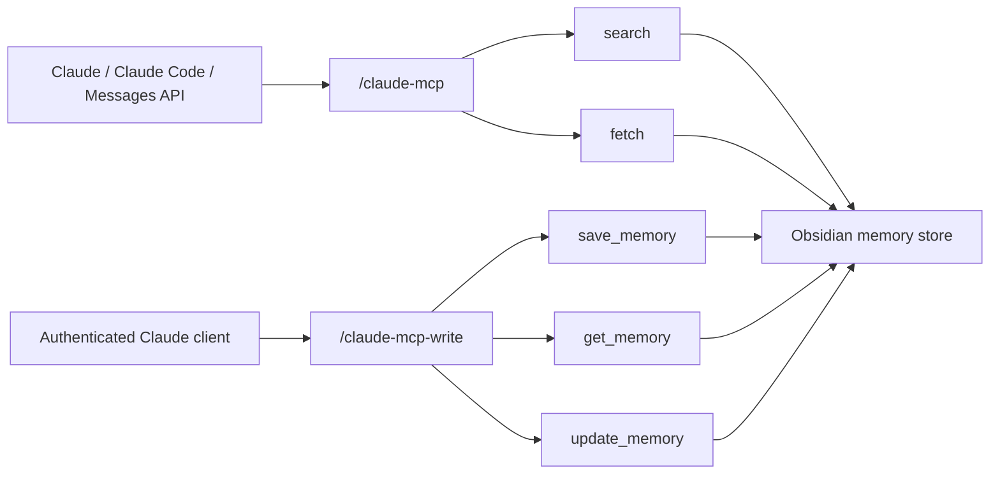

# Claude MCP



## Archetype

`tool-only`

## Purpose

이 문서는 Claude용 specialist MCP 경로 2개를 다룬다.

- public read-only route
- authenticated write-capable sibling route

## Tool Surface

### Read-only route `/claude-mcp`

- `search`
- `fetch`

둘 다 read-only다.

### Write-capable sibling `/claude-mcp-write`

- `search`
- `fetch`
- `save_memory`
- `get_memory`
- `update_memory`

이 sibling route는 Bearer auth가 필요하다.

## Hosted Route

- read-only:
  - `https://mcp-server-production-90cb.up.railway.app/claude-mcp`
  - auth:
    - `No Authentication`
  - verification:
    - `/claude-healthz` -> `200`
    - tool set: `search`, `fetch`
    - no-auth read-only verification passed
- write-capable sibling:
  - `https://mcp-server-production-90cb.up.railway.app/claude-mcp-write`
  - auth:
    - `Authorization: Bearer <CLAUDE_MCP_WRITE_TOKEN or MCP_API_TOKEN>`
  - verification:
    - `/claude-write-healthz` -> `200`
    - unauthenticated route probe -> `401`
    - authenticated specialist write verification passed

## Claude Usage

Anthropic MCP connector docs 기준:

- remote MCP server must be public HTTP(S)
- Streamable HTTP and SSE are supported
- currently only tool calls are supported

So the public route stays read-only and tool-only, while the sibling route carries authenticated writes.

## Registration

- Claude Code add command:
  - `claude mcp add --transport http obsidian-memory-claude https://mcp-server-production-90cb.up.railway.app/claude-mcp`
- one-shot PowerShell registration script:
  - `powershell -ExecutionPolicy Bypass -File .\scripts\register_claude_mcp.ps1`

## Verification Command

```powershell
python scripts\verify_specialist_mcp_write.py --server-url https://mcp-server-production-90cb.up.railway.app/claude-mcp-write/ --token <TOKEN> --profile claude
```

OAuth-capable route operator verification:
