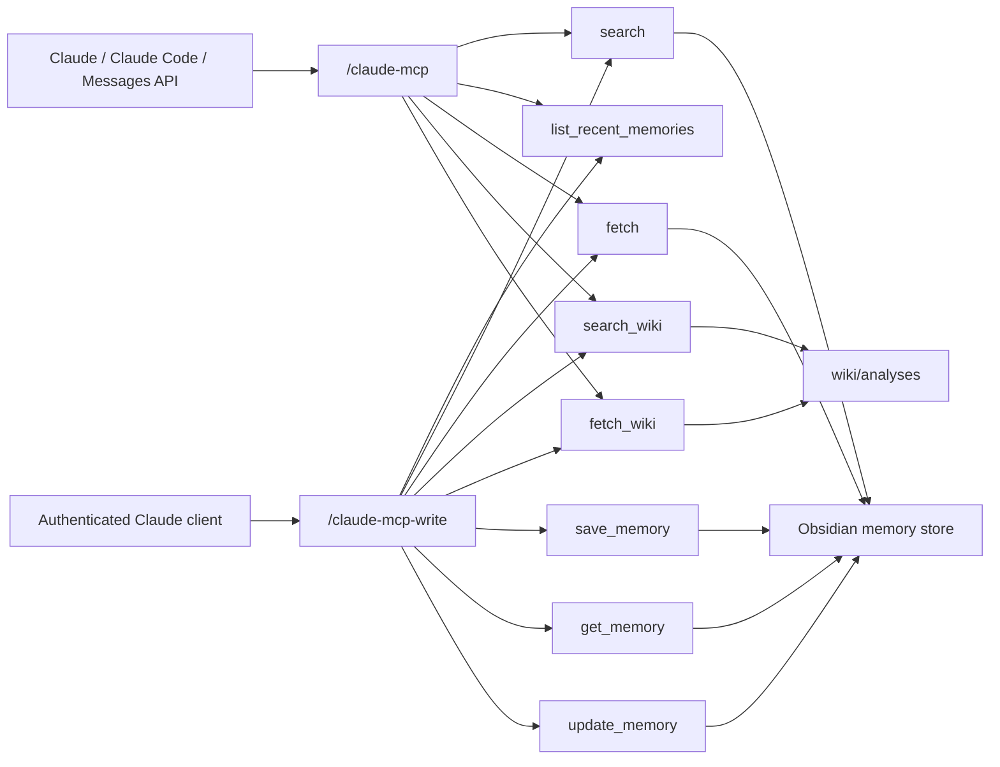

# Claude MCP



## Archetype

`tool-only`

## Purpose

이 문서는 Claude용 specialist MCP 경로 2개를 다룬다.

- public read-only route
- authenticated write-capable sibling route

## Tool Surface

### Read-only route `/claude-mcp`

- `search`
- `list_recent_memories`
- `fetch`
- `search_wiki`
- `fetch_wiki`
- resources
  - `resource://wiki/index`
  - `resource://wiki/log/recent`
  - `resource://wiki/topic/{slug}`
  - `resource://schema/memory`
  - `resource://ops/verification/latest`
  - `resource://ops/routes/profile-matrix`
- prompts
  - `ingest_memory_to_wiki`
  - `reconcile_conflict`
  - `weekly_lint_report`
  - `summarize_recent_project_state`

주의:
- 모델이 recent/list 질문에서 실수로 `search`를 먼저 호출해도, date-only memory query나 `최근 메모` 같은 generic recent query는 recent browse 의도로 처리되도록 보정한다.

둘 다 read-only다.

### Write-capable sibling `/claude-mcp-write`

- `search`
- `list_recent_memories`
- `fetch`
- `search_wiki`
- `fetch_wiki`
- `save_memory`
- `get_memory`
- `update_memory`
- `sync_wiki_index`
- `append_wiki_log`
- `write_wiki_page`
- `lint_wiki`
- `reconcile_conflict`

이 sibling route는 Bearer auth가 필요하다.

## Hosted Route

- read-only:
  - `https://mcp-server-production-90cb.up.railway.app/claude-mcp`
  - auth:
    - `No Bearer Authentication`
    - deployment에 따라 host/origin allowlist는 적용될 수 있음
  - verification:
    - `/claude-healthz` -> `200` (liveness only)
    - `python scripts\verify_claude_mcp_readonly.py --server-url https://mcp-server-production-90cb.up.railway.app/claude-mcp/` -> pass
    - `python scripts\mcp_local_tool_smoke.py --base-url https://mcp-server-production-90cb.up.railway.app --path /claude-mcp/ --search-query "초기 실행 절차를 CLAUDE.md와 wiki 업데이트 규칙으로 고정한다" --require-read-hit` -> pass
    - current-session read-only surface: `search`, `list_recent_memories`, `fetch`, `search_wiki`, `fetch_wiki`
    - current-session read-only discoverability: `resources = 5`, `prompts = 4`
- write-capable sibling:
  - `https://mcp-server-production-90cb.up.railway.app/claude-mcp-write`
  - auth:
    - `Authorization: Bearer <CLAUDE_MCP_WRITE_TOKEN or MCP_API_TOKEN>`
  - verification:
    - `/claude-write-healthz` -> `200` (liveness only)
    - unauthenticated route probe -> `401`
    - `python scripts\verify_specialist_mcp_write.py --server-url https://mcp-server-production-90cb.up.railway.app/claude-mcp-write/ --token <TOKEN> --profile claude` -> pass
    - current-session write surface: 13 tools including `search_wiki`, `fetch_wiki`, `sync_wiki_index`, `append_wiki_log`, `write_wiki_page`, `lint_wiki`, `reconcile_conflict`

## Claude Usage

Anthropic MCP connector docs 기준:

- remote MCP server must be public HTTP(S)
- Streamable HTTP and SSE are supported
- currently only tool calls are supported

So the public route stays read-only and tool-only, while the sibling route carries authenticated writes.

- `search_wiki` / `fetch_wiki`는 `wiki/analyses`를 위한 read-only 보조 surface다. unified search는 MCP public tool이 아니라 standalone orchestration layer에서만 합쳐진다.
- current-session production PASS evidence는 `docs/MCP_RUNTIME_EVIDENCE.md`에 시간순으로 유지한다.

## Registration

- Claude Code add command:
  - `claude mcp add --transport http obsidian-memory-claude https://mcp-server-production-90cb.up.railway.app/claude-mcp`
- one-shot PowerShell registration script:
  - `powershell -ExecutionPolicy Bypass -File .\scripts\register_claude_mcp.ps1`

## Verification Commands

```powershell
python scripts\verify_claude_mcp_readonly.py --server-url https://mcp-server-production-90cb.up.railway.app/claude-mcp/
python scripts\mcp_local_tool_smoke.py --base-url https://mcp-server-production-90cb.up.railway.app --path /claude-mcp/ --search-query "초기 실행 절차를 CLAUDE.md와 wiki 업데이트 규칙으로 고정한다" --require-read-hit
python scripts\verify_specialist_mcp_write.py --server-url https://mcp-server-production-90cb.up.railway.app/claude-mcp-write/ --token <TOKEN> --profile claude
```

현재 코드 기준으로 위 verifier는 `save_memory/get_memory/update_memory`뿐 아니라 `sync_wiki_index`, `append_wiki_log`, `lint_wiki`까지 함께 점검하도록 확장됐다. live production 결과는 별도 evidence에 기록해야 한다.
