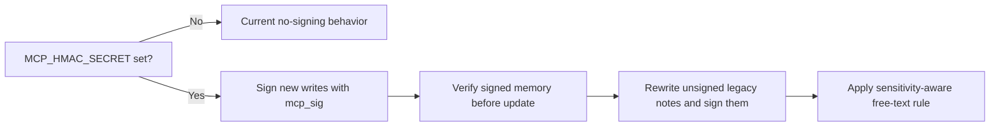

# HMAC Phase 2

## Status

`Implemented and rechecked`

## Scope

When `MCP_HMAC_SECRET` is configured:

- new memory documents are signed
- updated memory documents are signed
- raw archive documents are signed
- signed memory documents are verified before update
- unsigned legacy memory documents are allowed and get signed on rewrite
- `mcp_sig` remains optional metadata for compatibility with historical unsigned notes

## Memory Document Rules

### New writes

- sign the generated memory document with `mcp_sig`
- keep the public tool contract unchanged
- continue to store Markdown SSOT first

### Updates

- verify the existing stored memory signature before rewrite
- if the stored note is unsigned, allow the rewrite and add a signature on save
- if signature verification fails, reject the update

## Raw Archive Rules

- raw archive notes are signed when `MCP_HMAC_SECRET` is present
- signature metadata stays inside the frontmatter contract
- archive verification is additive and should not change the raw note path layout

## Sensitivity-Aware Variant

- `p1` keeps the current conservative mask-or-reject behavior
- `p2+` rejects mixed-secret free text instead of masking it
- pure secret values remain reject-only
- label fields still reject sensitive token-like data

## Non-Goals

- changing MCP tool names
- changing `/mcp` or `/healthz`
- breaking unsigned legacy notes
- making HMAC mandatory for historical vault content
- introducing delete semantics for verification or purge flows

## Implementation Note

This phase is intentionally additive:

- existing notes remain readable
- legacy unsigned notes may be rewritten and signed later
- phase 2 keeps the current indexing and raw archive paths intact

## Current Runtime Status

- local runtime: implemented
- Railway production: `MCP_HMAC_SECRET` configured
- verified results:
  - signed write note:
    - `MEM-20260328-165501-4BBDFC`
  - signed secret-path note:
    - `MEM-20260328-165506-A19EBD`
  - signed raw archive:
    - `mcp_raw/manual/2026-03-28/convo-railway-production-hmac-seed.md`
  - unsigned legacy note:
    - `MEM-20260328-120319-2591AB`
    - accepted only with explicit verifier override
