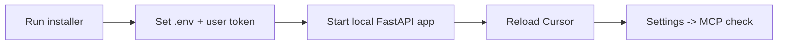

# Windows install



## Target path
`C:\Users\jichu\Downloads\mcp_obsidian\`

## Required / expected files
- `install_cursor_fullsetup.ps1`, `install_cursor_fullsetup.bat` (root)
- `.env.example` → installer copies to `.env` when missing
- `AGENTS.md`, `CLAUDE.md`, `README.md` (repo contract + editor hints)
- `.cursor/rules/`, `.cursor/skills/`, `.cursor/agents/`, `.cursor/hooks.json`
- `.cursor/mcp.json` (active project-local Cursor MCP config)
- `.cursor/mcp.sample.json` (preserved sample)
- `schemas/` (shared raw/memory JSON Schema)
- `obsidian-memory-plugin/` (local curator plugin scaffold)

## Steps
1. Extract or clone so the folder above is the project root.
2. Open PowerShell in the project root (or double-click `install_cursor_fullsetup.bat`; it passes the script directory as `-ProjectRoot` so setup runs in the right folder). The PowerShell script also resolves its own directory as the default project root when `-ProjectRoot` is omitted.
3. Run:

```powershell
powershell -ExecutionPolicy Bypass -File .\install_cursor_fullsetup.ps1
```

The script creates `.venv` if needed, runs `pip install -e .[dev]`, copies `.env.example` to `.env` when `.env` is missing, seeds `.cursor/mcp.json` from `.cursor/mcp.sample.json` when missing, runs `git init` when `.git` is missing, and runs `python -m pre_commit install` from the virtual environment.

4. Open Cursor in this folder.

## Token and MCP (Cursor)
1. Edit `.env` and set `MCP_API_TOKEN` (and `VAULT_PATH`, `INDEX_DB_PATH`, `TIMEZONE`, etc.).
2. Set `MCP_API_TOKEN` and `MCP_PRODUCTION_BEARER_TOKEN` in your **Windows user environment** so Cursor can expand them from `.cursor/mcp.json`.
3. If local direct save or production-to-local sync helpers should target your real Obsidian vault, set `OBSIDIAN_LOCAL_VAULT_PATH` too. This is primarily consumed by helper scripts rather than the core FastAPI settings model.
4. **Restart Cursor** (or reload the window) after changing those environment variables.
5. Start the FastAPI app (see below), then in Cursor check **Settings → MCP** or **Output → MCP Logs** for `obsidian-memory-local` and `obsidian-memory-production`.

Auth is enforced whenever the effective token for the target route is non-empty. Because the installer copies `.env.example` by default, local bootstraps start with a placeholder token until you replace it.

Streamable HTTP is the preferred transport for this pack. The preferred Cursor configuration for this repo is project-local (`.cursor/mcp.json`).

로컬 MCP만 빠르게 정리한 허브: [LOCAL_MCP.md](LOCAL_MCP.md) (Cursor 내장 “Local MCP”가 아니라 **이 레포 uvicorn + `.cursor/mcp.json`** 조합임을 명시).

## Run the MCP HTTP app locally
With `.venv` activated:

```powershell
powershell -ExecutionPolicy Bypass -File .\scripts\start-mcp-dev.ps1
```

or:

```powershell
uvicorn app.main:app --host 127.0.0.1 --port 8000 --reload
```

Entry point is `app.main:app` per `AGENTS.md`. Without optional `[mcp]` deps, `/mcp/` 또는 그 하위 path may return **503** with a developer message instead of crashing.

현재 hybrid 방향에서는 다음 경로도 함께 존재할 수 있다.

- `vault/mcp_raw/`
- `vault/memory/`
- `vault/90_System/`

legacy read compatibility:

- `vault/20_AI_Memory/`

## Check Cursor setup
- Rules load from `.cursor/rules/*.mdc` (project rules).
- Skills live under `.cursor/skills/`; subagents under `.cursor/agents/`.
- Hooks: `.cursor/hooks.json` plus `shell_guard.py` / `shell_log.py`.

Try:
- `What skills are available?`
- `Use the planner subagent to review the scaffold.`

## Client boundaries

| Client | Localhost works | Public HTTPS required | Notes |
| --- | --- | --- | --- |
| Cursor | Yes | No | This repo uses project-local `.cursor/mcp.json` with local + production profiles. |
| Claude Code | Yes | No | Local validation can happen before public exposure. |
| OpenAI Responses API | No | Yes | Remote MCP usage belongs after local validation. |
| Anthropic Messages API | No | Yes | MCP connector is tool-call oriented. |

## Remote API expansion notes

- OpenAI remote MCP clients should target a public HTTPS `/mcp` endpoint after local validation is stable.
- Anthropic examples should use `betas=["mcp-client-2025-04-04"]` until your verified integration docs say otherwise.
- Optional example clients live under `examples/` and use `MCP_SERVER_URL` plus `MCP_BEARER_TOKEN`.

## Basic verification commands (from `AGENTS.md`)
```powershell
pytest -q
ruff check .
ruff format --check .
```

## Config syntax checks
```powershell
python -c "import json; json.load(open('.cursor/mcp.json')); json.load(open('.cursor/mcp.sample.json')); json.load(open('.cursor/hooks.json')); print('json ok')"
```

## Known manual checks
- Cursor MCP connects with no **401** once `MCP_API_TOKEN` matches `.env` and Cursor was restarted after env changes.
- Current workspace evidence includes a manual confirmation that `obsidian-memory-local` and `obsidian-memory-production` appear as **connected** in **Settings → MCP** once `.cursor/mcp.json` is present, env vars are set, and Cursor has been reloaded.
- `/mcp` may answer with **307** and `/mcp/` may answer with **400 Missing session ID** or another protocol-level response depending on request headers and MCP session state, so confirm both reachability and actual Cursor status together.
- Install optional MCP Python stack when you need a live `/mcp` implementation (`pip install -e .[mcp]` or per `pyproject.toml`).
- `.cursor/cli.json` is not part of this pack; add only with official Cursor CLI documentation for your version.
- `obsidian-memory-plugin/`는 별도 `npm run check` / `npm run build`로 검증한다.
- preview/public HTTPS rollout은 `docs/REMOTE_DEPLOYMENT_MATRIX.md`를 기준으로 local-green 이후에만 진행한다.
