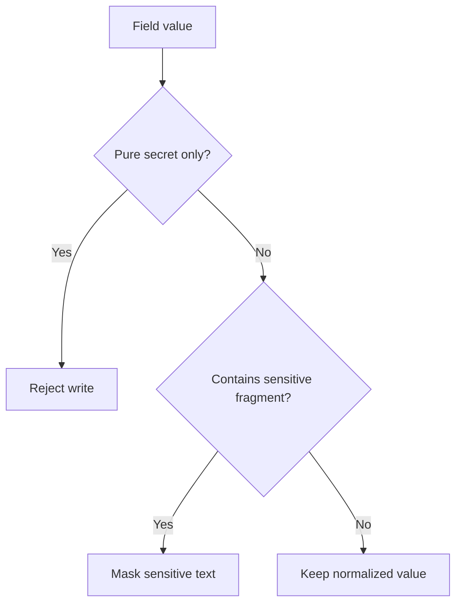

# Masking Policy

## Mode

`Conservative`

## Purpose

이 정책은 hybrid memory system에서 저장 전에 민감정보를 다루는 기준이다.

- normalized memory write
- raw conversation archive write
- wrapper read 결과는 저장된 값을 그대로 반영

## Field Policy

| Field | Rule | Action |
| --- | --- | --- |
| `title` | mixed text 가능 | mixed secret는 mask, pure secret는 reject |
| `content` | mixed text 가능 | mixed secret는 mask, pure secret는 reject |
| `body_markdown` | mixed text 가능 | mixed secret는 mask, pure secret는 reject |
| `tags` | label field | sensitive pattern 발견 시 reject |
| `source` | label field | sensitive pattern 발견 시 reject |
| `project` | label field | sensitive pattern 발견 시 reject |
| `created_by` | label field | sensitive pattern 발견 시 reject |

## Sensitive Patterns

초기 감지 패턴:

- `Bearer <token>`
- `sk-...` 형식 API key
- `api_key=...`
- `token=...`
- `password=...`
- `secret=...`
- credential가 포함된 URL

## Outcomes

### Mask

mixed text에서 민감한 부분만 가린다.

예:

- `Bearer abcdef...` -> `Bearer [REDACTED]`
- `token=supersecret` -> `token=[REDACTED]`
- `sk-ABCDEF...` -> `[REDACTED_API_KEY]`

### Reject

필드가 사실상 secret만 담고 있으면 저장을 막는다.

예:

- `content = "Bearer abcdefghijklmnop"`
- `project = "token=supersecret"`
- `tags = ["api_key=supersecret"]`

## Current Implementation

구현 위치:

- `app/utils/sanitize.py`
- `app/services/memory_store.py`
- `app/services/raw_archive_store.py`

## Verified Tests

- mixed secret masking in memory note
- pure secret rejection in memory note
- sensitive `project` / `tags` rejection
- update path masking
- raw archive masking and rejection

## Deferred

- plugin-side masking UI or review workflow
- broader raw archive sensitivity variants
- HMAC backfill for already-stored unsigned legacy notes

## HMAC Phase 2 Contract

Phase 2 scope is fixed in:

- [docs/HMAC_PHASE_2.md](HMAC_PHASE_2.md)

Exact contract summary:

- `MCP_HMAC_SECRET` is optional
- if set, new/updated memory docs and raw archive docs are signed
- signed memory docs are verified before update
- unsigned legacy docs are allowed and get signed on rewrite
- `p1` keeps the current mask-or-reject baseline
- `p2+` rejects mixed-secret free text instead of masking it

## Live Write Verification Note

- Railway preview에서 live `save_memory` / `update_memory` 1회 검증은 완료됐다.
- 해당 검증은 정상적인 non-secret preview payload를 사용했고, 최종 rollback은 `status=archived`로 처리했다.
- mixed-secret payload의 live masking 검증은 완료됐다.
- secret-only payload의 live rejection 검증은 완료됐다.

## Live Secret-Path Result

- mixed-secret preview payload:
  - saved successfully
  - stored content was masked on read-back
- secret-only preview payload:
  - tool execution failed as expected
  - rejected title was not searchable afterward
