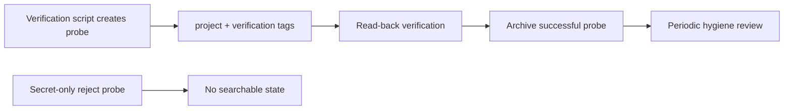

# Probe Data Policy



## Goal

이 문서는 MCP verification 스크립트가 남기는 probe data의 라벨링과 정리 기준을 고정한다.

## Scope

대상 스크립트:

- `scripts/verify_mcp_write_once.py`
- `scripts/verify_mcp_secret_paths.py`

대상 환경:

- Railway preview
- Railway production

## Labeling Rules

### Preview

- `project=preview`
- tags include:
  - `preview`
  - `verification`
- scenario tags:
  - `write-check`
  - `secret-probe`

### Production

- `project=production`
- tags include:
  - `production`
  - `verification`
- scenario tags:
  - `write-check`
  - `secret-probe`

### Lifecycle tags

- updated verification records add:
  - `updated`
- rollback after successful verification adds:
  - `rollback-archived`

## Title Prefix Rules

- preview write:
  - `Railway Preview Write Check`
- production write:
  - `Railway Production Write Check`
- preview secret probe:
  - `Railway Preview Secret Probe`
- production secret probe:
  - `Railway Production Secret Probe`

## Persistence Rules

- verification writes must set `append_daily=False`
- successful verification probes must be archived at the end of the script
- secret-only reject probes must not persist searchable state
- when `MCP_HMAC_SECRET` is configured, verification probes should end up signed with `mcp_sig`
- delete is not part of the current MCP tool surface
- archived verification notes may remain in the vault unless a separate manual purge is explicitly chosen

## Cleanup Policy

기본 정책은 `archive-first retention`이다.

- successful write and mixed-secret probes:
  - keep as `status=archived`
  - keep `verification` and scenario tags for traceability
- secret-only reject probes:
  - confirm `search_memory` returns no results
- operator hygiene review:
  - search by title prefix `Railway Production` or `Railway Preview`
  - filter archived verification notes before audits or exports
- stricter purge가 필요하면:
  - `docs/VERIFICATION_PURGE_RUNBOOK.md` 기준으로 archived verification notes를 수동 정리
  - 필요 시 SQLite index rebuild 또는 sync path 재검증

## Production Commands

```powershell
python scripts\verify_mcp_write_once.py --server-url https://mcp-server-production-90cb.up.railway.app/mcp/ --token <TOKEN> --confirm production-write-once
python scripts\verify_mcp_secret_paths.py --server-url https://mcp-server-production-90cb.up.railway.app/mcp/ --token <TOKEN> --confirm production-secret-paths
```

## Preview Commands

```powershell
python scripts\verify_mcp_write_once.py --server-url https://mcp-server-production-1454.up.railway.app/mcp/ --token <TOKEN> --confirm preview-write-once
python scripts\verify_mcp_secret_paths.py --server-url https://mcp-server-production-1454.up.railway.app/mcp/ --token <TOKEN> --confirm preview-secret-paths
```
