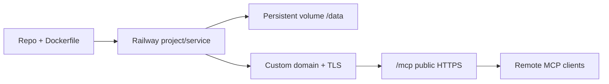
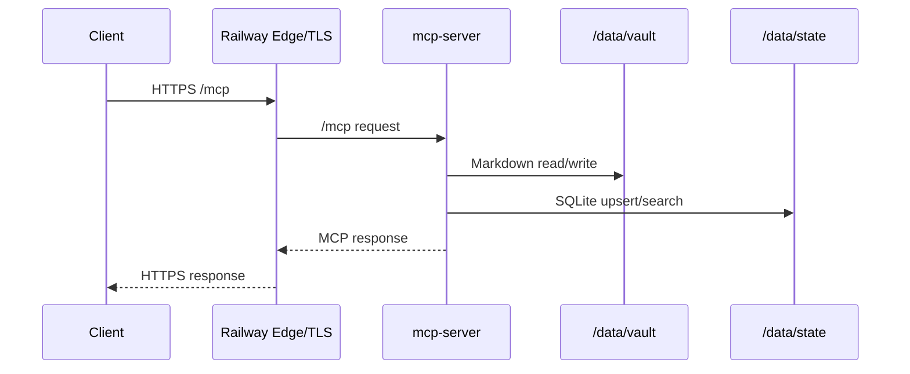

# Production Railway Runbook



## Goal

이 문서는 `mcp_obsidian`를 Railway를 기준 production 경로로 운영하기 위한 실행 기준 문서다.

현재 기준 결정:

- Railway = production path
- current Railway hosted runtime experience is already validated
- VPS + reverse proxy = alternate self-managed reference only

## Current Baseline

- current linked Railway project: `mcp-obsidian-production`
- current linked service: `mcp-server`
- current Railway environment: `production`
- current verified generated domain:
  - `https://mcp-server-production-90cb.up.railway.app`
- current live operator endpoint before custom domain:
  - `https://mcp-server-production-90cb.up.railway.app`

Production recommendation:

- preview and production are now split into separate Railway projects
- generated Railway domain is the current official interim production endpoint
- custom domain cutover is now an optional hardening upgrade, not a release blocker
- post-cutover token rotation only becomes mandatory when a custom domain is introduced

## Recommended Shape

- project: separate production project or separate protected production environment
- service: dedicated `mcp-server`
- storage: one persistent volume mounted at `/data`
- app runtime: `Dockerfile`
- public endpoint: Railway public HTTPS endpoint
- environment variables managed in Railway service variables



## Production Environment

Use Railway variables equivalent to:

```env
VAULT_PATH=/data/vault
INDEX_DB_PATH=/data/state/memory_index.sqlite3
MCP_API_TOKEN=<long-random-production-token>
MCP_HMAC_SECRET=<long-random-hmac-secret>
TIMEZONE=Asia/Dubai
OBS_VAULT_NAME=<production-vault-name>
MCP_ALLOWED_HOSTS=<production-public-host>
MCP_ALLOWED_ORIGINS=https://<production-public-host>
```

Repository template:

- `.env.railway.production.example`
- `docs/HMAC_PHASE_2.md`

Rules:

- production token must not reuse preview token
- generated Railway domain is acceptable as the primary operator endpoint until a custom domain exists
- production volume must not reuse synthetic preview dataset unless intentionally promoted
- specialist read-only routes may be exposed without auth only if they remain read-only and bounded; current contract is `search` / `list_recent_memories` / `fetch` / `search_wiki` / `fetch_wiki` plus read-only `resources/prompts` discoverability
- specialist write-capable sibling routes must remain Bearer-authenticated

## Deployment Model

1. Create a production Railway project or a protected production environment.
2. Add one service named `mcp-server`.
3. Attach one volume at `/data`.
4. Set production variables.
5. Deploy from the current repo using `railway up`.
6. Add custom domain if available. Otherwise keep the Railway-provided domain as the official interim production endpoint.
7. Verify:
   - `/healthz`
   - `/mcp`
   - `/mcp/`
   - `/chatgpt-healthz` (liveness only)
   - `/chatgpt-write-healthz` (liveness only)
   - `/claude-healthz` (liveness only)
   - `/claude-write-healthz` (liveness only)
   - `scripts/verify_mcp_readonly.py`
   - `scripts/verify_mcp_write_once.py`
   - `scripts/verify_mcp_secret_paths.py`
   - `scripts/verify_chatgpt_mcp_readonly.py`
   - `scripts/verify_claude_mcp_readonly.py`
   - `scripts/mcp_local_tool_smoke.py`
   - `scripts/verify_specialist_mcp_write.py`

## Operational Policy

- preview and production must not share the same writable dataset unless intentionally promoted
- rotate `MCP_API_TOKEN` when promoting from preview design to production service
- Railway-provided domain is accepted for current production operation
- custom domain remains an optional long-term branding and cutover upgrade

## Access Policy

- production URL is operator-facing and integration-facing
- do not reuse preview project domains for production
- generated production Railway domain may be used as the official current production address
- rotate `MCP_API_TOKEN` whenever operator scope changes
- keep preview and production services logically separate

## Operator Client Note

- repo-local production client profile lives in `.cursor/mcp.json`
- operator workstation must provide `MCP_PRODUCTION_BEARER_TOKEN` for `obsidian-memory-production`
- Railway service-side `MCP_API_TOKEN` and workstation-side `MCP_PRODUCTION_BEARER_TOKEN` must be aligned for the production `/mcp` profile to connect

## Verification Probe Hygiene

- production verification probes must use:
  - `project=production`
  - `verification` tag
- probe naming and cleanup rules are fixed in:
  - `docs/PROBE_DATA_POLICY.md`
  - `docs/VERIFICATION_PURGE_RUNBOOK.md`
- production commands:
  - `python scripts\verify_mcp_write_once.py --server-url https://mcp-server-production-90cb.up.railway.app/mcp/ --token <TOKEN> --confirm production-write-once`
  - `python scripts\verify_mcp_secret_paths.py --server-url https://mcp-server-production-90cb.up.railway.app/mcp/ --token <TOKEN> --confirm production-secret-paths`
- specialist read-only commands:
  - `python scripts\verify_chatgpt_mcp_readonly.py --server-url https://mcp-server-production-90cb.up.railway.app/chatgpt-mcp/`
  - `python scripts\verify_claude_mcp_readonly.py --server-url https://mcp-server-production-90cb.up.railway.app/claude-mcp/`
  - `python scripts\mcp_local_tool_smoke.py --base-url https://mcp-server-production-90cb.up.railway.app --path /chatgpt-mcp/ --search-query "초기 실행 절차를 CLAUDE.md와 wiki 업데이트 규칙으로 고정한다" --require-read-hit`
  - `python scripts\mcp_local_tool_smoke.py --base-url https://mcp-server-production-90cb.up.railway.app --path /claude-mcp/ --search-query "초기 실행 절차를 CLAUDE.md와 wiki 업데이트 규칙으로 고정한다" --require-read-hit`
  - `--token <TOKEN>` is optional for the read-only specialist route; it is no longer required to auto-resolve a recent title
  - verifier request headers must accept both `application/json` and `text/event-stream`; `text/event-stream` only requests can return `406`
- specialist write sibling commands:
  - `python scripts\verify_specialist_mcp_write.py --server-url https://mcp-server-production-90cb.up.railway.app/chatgpt-mcp-write/ --token <TOKEN> --profile chatgpt`
  - `python scripts\verify_specialist_mcp_write.py --server-url https://mcp-server-production-90cb.up.railway.app/claude-mcp-write/ --token <TOKEN> --profile claude`

## HMAC Phase 2

- `MCP_HMAC_SECRET` is configured on the current production service
- new and updated memory docs are signed with `mcp_sig`
- new raw archive docs are signed with `mcp_sig`
- signed memory docs are verified before update
- unsigned legacy memory docs are still allowed and get signed on rewrite
- exact scope is fixed in:
  - `docs/HMAC_PHASE_2.md`

## Backup and Rollback

- volume contents under `/data/vault` and `/data/state` must be backed up
- rollback means:
  - redeploy previous app image/source state
  - restore production volume backup if needed
- write rollback at app layer remains archived status, not delete

## Verification Gate

Production is only considered ready when all are true:

- production Railway service is separate from preview runtime
- Railway public HTTPS endpoint is active and adopted
- production token rotated from preview token
- read-only MCP verification passed
- specialist read-only route verification passed
- specialist write-capable sibling verification passed
- write-once verification passed
- secret-path verification passed
- backup/restore path documented and tested once

## 2026-04-11 Current-Session Production Parity Recheck

- deploy:
  - `railway up -d`
- health:
  - `/healthz` -> pass
  - `/chatgpt-healthz` -> pass
  - `/chatgpt-write-healthz` -> pass
  - `/claude-healthz` -> pass
  - `/claude-write-healthz` -> pass
- specialist read-only routes:
  - `python scripts\verify_chatgpt_mcp_readonly.py --server-url https://mcp-server-production-90cb.up.railway.app/chatgpt-mcp/` -> pass
  - `python scripts\verify_claude_mcp_readonly.py --server-url https://mcp-server-production-90cb.up.railway.app/claude-mcp/` -> pass
  - `python scripts\mcp_local_tool_smoke.py --base-url https://mcp-server-production-90cb.up.railway.app --path /chatgpt-mcp/ --search-query "초기 실행 절차를 CLAUDE.md와 wiki 업데이트 규칙으로 고정한다" --require-read-hit` -> pass
  - `python scripts\mcp_local_tool_smoke.py --base-url https://mcp-server-production-90cb.up.railway.app --path /claude-mcp/ --search-query "초기 실행 절차를 CLAUDE.md와 wiki 업데이트 규칙으로 고정한다" --require-read-hit` -> pass
  - current-session read-only surface:
    - `search`, `list_recent_memories`, `fetch`, `search_wiki`, `fetch_wiki`
  - current-session read-only discoverability:
    - `resources = 5`
    - `prompts = 4`
- specialist write-capable sibling routes:
  - `python scripts\verify_specialist_mcp_write.py --server-url https://mcp-server-production-90cb.up.railway.app/chatgpt-mcp-write/ --token <TOKEN> --profile chatgpt` -> pass
    - sample id: `MEM-20260411-194216-B12AE8`
  - `python scripts\verify_specialist_mcp_write.py --server-url https://mcp-server-production-90cb.up.railway.app/claude-mcp-write/ --token <TOKEN> --profile claude` -> pass
    - sample id: `MEM-20260411-194215-091F41`
  - current-session write surface:
    - 13 tools including `search_wiki`, `fetch_wiki`, `sync_wiki_index`, `append_wiki_log`, `write_wiki_page`, `lint_wiki`, `reconcile_conflict`
- verifier note:
  - current verifier header must include `Accept: application/json, text/event-stream`
  - earlier same-session `406` was caused by `Accept: text/event-stream` only and is no longer the current runbook state
- evidence:
  - `docs/MCP_RUNTIME_EVIDENCE.md`

## 2026-03-28 Historical Dry Run Result

- split project created:
  - `mcp-obsidian-production`
- service:
  - `mcp-server`
- environment:
  - `production`
- volume:
  - mounted at `/data`
- generated domain:
  - `https://mcp-server-production-90cb.up.railway.app`
- dry-run result:
  - `/healthz` passed
  - `/mcp` redirect passed
  - read-only verification passed
  - write-once verification passed
  - secret-path verification passed
  - backup/restore drill passed
    - archive example: `/data/backups/drill-20260328-122306.tar.gz`
    - restore root: `/tmp/restore-drill`
  - HMAC phase-2 recheck passed
    - write memory id: `MEM-20260328-165501-4BBDFC`
    - secret memory id: `MEM-20260328-165506-A19EBD`
    - raw seed path: `mcp_raw/manual/2026-03-28/convo-railway-production-hmac-seed.md`
    - signed memory/raw integrity verification passed
    - unsigned legacy note remained unsigned and only passed with explicit verifier override
  - specialist read-only routes passed
    - ChatGPT route: `/chatgpt-mcp`
    - Claude route: `/claude-mcp`
    - both exposed `search`, `fetch`, `list_recent_memories` and passed read-only verification
  - specialist write-capable sibling routes passed
    - ChatGPT route: `/chatgpt-mcp-write`
    - Claude route: `/claude-mcp-write`
    - both required Bearer auth and exposed `search`, `fetch`, `save_memory`, `get_memory`, `update_memory`
    - authenticated specialist write verification passed
- current release-gate decision:
  - closed for interim production mode
  - generated Railway domain is officially adopted until a custom domain exists
- note:
  - this block is a 2026-03-28 historical baseline
  - current production PASS state is tracked in the 2026-04-11 parity recheck above

Future hardening / optional upgrades:

- custom domain
- post-cutover production token rotation ceremony
- HMAC backfill for historical unsigned legacy notes

## Production Path Backfill Result

- deploy before migration:
  - `railway up -d`
  - deployment: `7f706b9c-9d3d-429d-abb7-ca8519c225c7`
  - status: `SUCCESS`
- dry run before apply:
  - `railway ssh python /app/scripts/backfill_memory_paths.py`
  - `candidate_count = 18`
  - all candidates were `move`
  - `conflicts = 0`
  - `missing = 0`
- apply:
  - `railway ssh python /app/scripts/backfill_memory_paths.py --apply`
  - moved legacy notes: `18`
- post-apply:
  - `railway ssh python /app/scripts/backfill_memory_paths.py`
  - `candidate_count = 0`
- current production storage truth:
  - new writes land under `memory/YYYY/MM/...`
  - previously migrated legacy notes also now resolve under `memory/YYYY/MM/...`

## 2026-03-28 Historical Specialist Route Smoke Recheck After Path Migration

- read-only routes rechecked:
  - `python scripts\verify_chatgpt_mcp_readonly.py --server-url https://mcp-server-production-90cb.up.railway.app/chatgpt-mcp/ --expected-title RailwayProductionDecision`
  - `python scripts\verify_claude_mcp_readonly.py --server-url https://mcp-server-production-90cb.up.railway.app/claude-mcp/ --expected-title RailwayProductionDecision`
  - both passed and returned `memory/2026/03/MEM-20260328-120319-2591AB.md`
- write-capable sibling routes rechecked:
  - `python scripts\verify_specialist_mcp_write.py --server-url https://mcp-server-production-90cb.up.railway.app/chatgpt-mcp-write/ --token <TOKEN> --profile chatgpt`
    - passed
    - sample id: `MEM-20260328-234330-5D6BA3`
  - `python scripts\verify_specialist_mcp_write.py --server-url https://mcp-server-production-90cb.up.railway.app/claude-mcp-write/ --token <TOKEN> --profile claude`
    - passed
    - sample id: `MEM-20260328-234330-2D7741`
- note:
  - specialist write recheck initially exposed a hyphenated-title FTS query bug
  - the bug was fixed and the production service was redeployed before the final smoke pass
