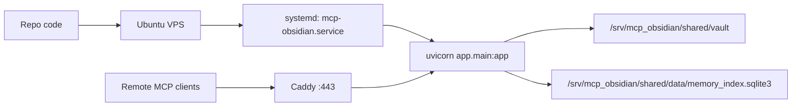
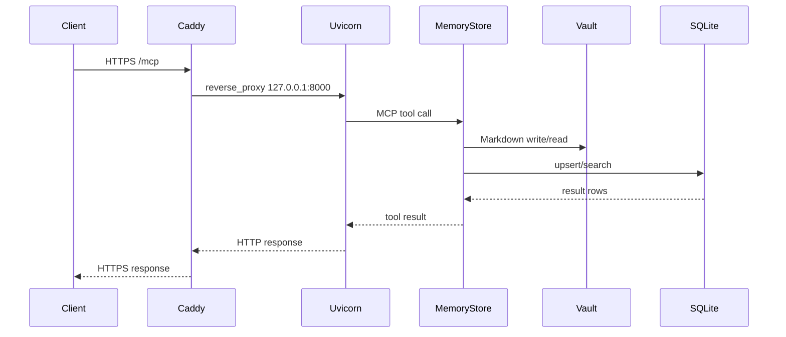

# Production VPS Runbook



## Goal

이 문서는 `mcp_obsidian`를 `VPS + Caddy + systemd` 구조로 운영할 때의 self-managed reference 문서다.

현재 기준 결정:

- Railway = production path
- VPS + reverse proxy = alternate self-managed reference
- reverse proxy default = Caddy
- process manager default = systemd

## Target Topology

- OS: Ubuntu 24.04 LTS
- app root: `/srv/mcp_obsidian/app`
- shared state root: `/srv/mcp_obsidian/shared`
- vault path: `/srv/mcp_obsidian/shared/vault`
- sqlite path: `/srv/mcp_obsidian/shared/data/memory_index.sqlite3`
- env file: `/srv/mcp_obsidian/shared/.env`
- bind target: `127.0.0.1:8000`
- public domain example: `mcp.example.com`



## Server Layout

```text
/srv/mcp_obsidian/
├─ app/
│  └─ repo working copy
├─ shared/
│  ├─ .env
│  ├─ vault/
│  └─ data/
│     └─ memory_index.sqlite3
├─ logs/
└─ backups/
```

## Required Environment

Production `.env` minimum:

```env
VAULT_PATH=/srv/mcp_obsidian/shared/vault
INDEX_DB_PATH=/srv/mcp_obsidian/shared/data/memory_index.sqlite3
MCP_API_TOKEN=<long-random-production-token>
TIMEZONE=Asia/Dubai
OBS_VAULT_NAME=<production-vault-name>
MCP_ALLOWED_HOSTS=mcp.example.com
MCP_ALLOWED_ORIGINS=https://mcp.example.com
```

Repository template:

- `.env.production.example`

Rules:

- production token must not reuse preview token
- production host/origin must point only to the public production domain
- production vault/data paths must not point to preview or local test paths

## System Dependencies

Install:

- `python3.12`
- `python3.12-venv`
- `git` or alternate artifact transfer path
- `caddy`

Optional:

- `ufw`
- `fail2ban`

## App Bootstrap

1. Create system directories:
   - `/srv/mcp_obsidian/app`
   - `/srv/mcp_obsidian/shared/vault`
   - `/srv/mcp_obsidian/shared/data`
   - `/srv/mcp_obsidian/logs`
   - `/srv/mcp_obsidian/backups`
2. Place repo contents under `/srv/mcp_obsidian/app`
3. Create virtualenv:
   - `python3.12 -m venv /srv/mcp_obsidian/app/.venv`
4. Install app:
   - `/srv/mcp_obsidian/app/.venv/bin/pip install -e /srv/mcp_obsidian/app[dev,mcp]`
5. Create production `.env` under `/srv/mcp_obsidian/shared/.env`
6. Copy template files from the repo:
   - `.env.production.example`
   - `deploy/caddy/Caddyfile.production.example`
   - `deploy/systemd/mcp-obsidian.service.example`
7. Follow the operator checklist:
   - `docs/VPS_EXECUTION_CHECKLIST.md`
8. Use the copy-paste command sheet for host execution:
   - `docs/VPS_COMMAND_SHEET.md`

## systemd Unit

Recommended unit: `/etc/systemd/system/mcp-obsidian.service`

Repository template:

- `deploy/systemd/mcp-obsidian.service.example`

```ini
[Unit]
Description=mcp_obsidian FastAPI + MCP server
After=network.target

[Service]
Type=simple
User=www-data
Group=www-data
WorkingDirectory=/srv/mcp_obsidian/app
EnvironmentFile=/srv/mcp_obsidian/shared/.env
ExecStart=/srv/mcp_obsidian/app/.venv/bin/uvicorn app.main:app --host 127.0.0.1 --port 8000 --proxy-headers --forwarded-allow-ips=127.0.0.1
Restart=always
RestartSec=5
StandardOutput=append:/srv/mcp_obsidian/logs/app.out.log
StandardError=append:/srv/mcp_obsidian/logs/app.err.log

[Install]
WantedBy=multi-user.target
```

Notes:

- `--proxy-headers` is required so scheme-sensitive MCP redirects remain `https://`
- `--forwarded-allow-ips=127.0.0.1` assumes Caddy proxies locally on the same host

Enable/start:

```bash
sudo systemctl daemon-reload
sudo systemctl enable --now mcp-obsidian
sudo systemctl status mcp-obsidian
```

## Caddyfile

Recommended Caddy config:

Repository template:

- `deploy/caddy/Caddyfile.production.example`

```caddyfile
mcp.example.com {
    encode gzip zstd

    reverse_proxy 127.0.0.1:8000
}
```

Why this is enough:

- Caddy terminates TLS automatically
- Caddy sets `X-Forwarded-Proto` and related proxy headers by default
- no extra `trusted_proxies` config is needed when Caddy is the public edge

Reload:

```bash
sudo caddy validate --config /etc/caddy/Caddyfile
sudo systemctl reload caddy
```

## Security Checklist

- SSH key-only auth
- firewall open only for:
  - `22/tcp`
  - `80/tcp`
  - `443/tcp`
- app bound only to `127.0.0.1`
- production token stored only in `.env`
- preview and production tokens separated
- vault/data permissions restricted to service user/group

## Verification Checklist

Local server-side:

```bash
cd /srv/mcp_obsidian/app
. .venv/bin/activate
pytest -q
ruff check .
ruff format --check .
```

Production endpoint:

```bash
curl -i https://mcp.example.com/healthz
curl -i -H "Authorization: Bearer <TOKEN>" https://mcp.example.com/mcp
curl -i -H "Authorization: Bearer <TOKEN>" -H "Accept: text/event-stream" https://mcp.example.com/mcp/
```

MCP verification:

- run read-only verification first
- run write-once verification
- run secret-path verification

Recommended order:

1. `scripts/verify_mcp_readonly.py`
2. `scripts/verify_mcp_write_once.py`
3. `scripts/verify_mcp_secret_paths.py`

## Backup and Rollback

Backup scope:

- `/srv/mcp_obsidian/shared/vault`
- `/srv/mcp_obsidian/shared/data/memory_index.sqlite3`
- `/srv/mcp_obsidian/shared/.env` stored separately and access-controlled

Rollback model:

- app release rollback:
  - restore previous app copy
  - restart `mcp-obsidian`
- data rollback:
  - restore vault/sqlite backup
- write rollback:
  - current application-level rollback remains archived status, not delete

## Operational Decision

Current operating decision:

- Railway is the current production path
- VPS + Caddy + systemd remains an alternate self-managed option

Do not call the system production-ready until all are true:

- public TLS domain active
- systemd restart behavior verified
- read-only MCP verification passed
- write-once verification passed
- secret-path verification passed
- backup + rollback checklist executed once in dry run
