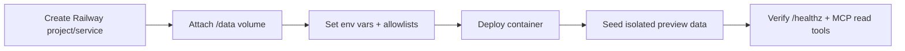

# Railway Preview Runbook

## Target shape

- platform: Railway
- project shape: new dedicated project
- preview data mode: isolated preview
- public endpoint: Railway-provided domain
- verification mode: read-only MCP first
- current project: `mcp-obsidian-preview`
- current service: `mcp-server`
- current selected domain: `https://mcp-server-production-1454.up.railway.app`

## Runtime model

- service runs from `Dockerfile`
- persistent data lives on a single Railway volume mounted at `/data`
- service variables:
  - `VAULT_PATH=/data/vault`
  - `INDEX_DB_PATH=/data/state/memory_index.sqlite3`
  - `TIMEZONE=Asia/Dubai`
  - `OBS_VAULT_NAME=mcp_obsidian_preview`
  - `MCP_API_TOKEN=<generated>`

## Bootstrap sequence

1. Create a new Railway project for this repo only.
2. Create a new service named `mcp-server`.
3. Add one volume mounted at `/data`.
4. Set service variables before first deploy.
5. Deploy with `railway up`.
6. Generate a Railway-provided domain.
7. Seed isolated preview data with `python /app/scripts/seed_preview_data.py` over `railway ssh`.
8. Verify:
   - `/healthz`
   - `/mcp`
   - `/mcp/`
   - `scripts/verify_mcp_readonly.py`

## Notes

- This preview does not mirror the local Obsidian vault.
- `obsidian-memory-plugin/` is not deployed to Railway.
- Write-tool verification has been performed once on isolated preview data.
- The MCP server requires explicit host/origin allowlists on Railway because FastMCP localhost defaults otherwise reject Railway public domains.

## Access Policy

- This Railway deployment is `preview-only`.
- Treat the public URL as operator-facing, not end-user-facing.
- Use read/write verification only with isolated preview data.
- Do not point local Obsidian primary vaults or production automations at this preview.

## Token Rotation and Teardown

- rotate token when:
  - preview access scope changes
  - a new operator receives access
  - verification sessions complete and continued exposure is not needed
- minimum teardown:
  - replace `MCP_API_TOKEN`
  - re-run preview verification if the preview remains active
- full teardown:
  - remove Railway public domain
  - delete or stop the preview service
  - delete the preview volume if the dataset is no longer needed

## Production Decision

- current decision:
  - Railway is the selected production path
  - production split dry run has been completed in a separate project
  - this preview runbook remains the pre-production / validation track
- reason:
  - Railway hosted runtime is already validated end-to-end
  - production now uses a separate Railway project, so preview and production no longer share the same project baseline

## Write-tool Gate

Status: `verified once`

Latest verified run:

- command:
  - `python scripts/verify_mcp_write_once.py --server-url https://mcp-server-production-1454.up.railway.app/mcp/ --token <redacted> --confirm preview-write-once`
- memory id:
  - `MEM-20260328-145016-D57430`
- outcome:
  - `save_memory` success
  - `update_memory` success
  - `get_memory` / `search_memory` / `fetch` read-back success
  - rollback archive success

Next use of this gate should keep the same scope:

1. Run one `save_memory` call against the Railway preview URL.
2. Run one `update_memory` call against the saved memory ID.
3. Read back the result through `get_memory`, `search_memory`, and `fetch`.
4. Archive the record as rollback.
5. Record the exact command, returned memory ID, and validation result here.
