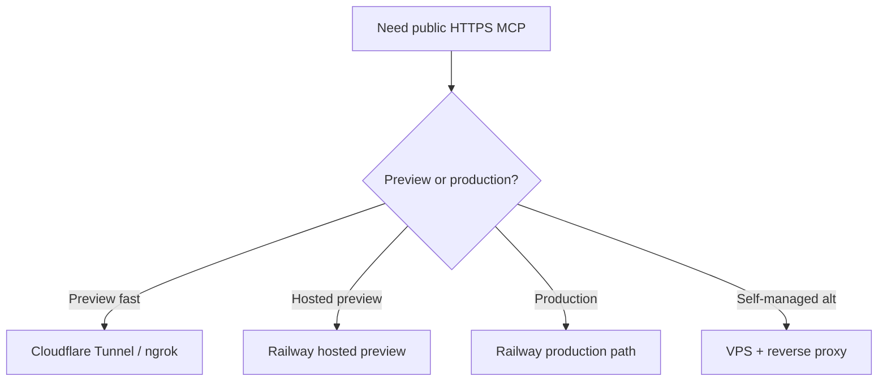

# Remote Deployment Matrix

## Goal

`Preview-first`

로컬 검증이 끝난 hybrid MCP server를 public HTTPS로 노출할 때의 후보를 비교한다.

## Shared Constraints

- HTTPS 필수
- bearer token 유지
- streamable HTTP 또는 HTTP/SSE 호환 필요
- OpenAI/Anthropic remote MCP는 authorization을 각 요청에 포함해야 함
- read-only tool rollout 우선

## Candidate Matrix

| Candidate | Best use | Strengths | Weaknesses | Verdict |
| --- | --- | --- | --- | --- |
| Cloudflare Tunnel | Preview-first | 빠른 HTTPS 노출, 비교적 안정적, 반복 검증에 적합 | 운영 관측/권한 정책은 별도 보강 필요 | preview 추천 |
| ngrok | Short-lived fallback | 설정 빠름, 디버깅 편함 | 장기 운영 기준으론 약함, 임시성 강함 | fallback only |
| Railway | Production path | 이미 검증된 hosted runtime, volume + domain + env 관리 일관성 | 플랫폼 종속성, volume/운영 정책을 Railway 방식에 맞춰야 함 | production 선택 |
| VPS + reverse proxy | Self-managed alternate | 고정 endpoint, TLS/로그/secret/관측 통제 용이 | 초기 설정 부담 큼, 직접 운영 책임 큼 | alternate only |

## Recommendation

- preview: Cloudflare Tunnel
- production: Railway
- fallback: ngrok

## Current selection

- user-selected hosted preview path: Railway
- reason: paid Railway account available, hosted public HTTPS MCP has already been validated, and Railway volume/domain model fits the current file-based runtime
- status: read-only, write-once, secret-path, separate production dry run, and production backup/restore drill already passed on Railway
- current decision:
  - Railway = production path
  - Railway generated production domain = official interim production endpoint
  - VPS + reverse proxy = alternate self-managed reference

## Rollout Prerequisites

preview 전:

- local `/healthz`
- local `/mcp`
- read-only MCP tool verification
- Cursor MCP tool offerings 확인

production 전:

- TLS
- secret handling
- access log / observability
- volume backup / restore
- write-tool policy 명시
- public Railway HTTPS endpoint adopted

## External References

- OpenAI MCP guide: `https://developers.openai.com/api/docs/mcp/`
- OpenAI MCP tool guide: `https://developers.openai.com/cookbook/examples/mcp/mcp_tool_guide/`
- Anthropic MCP connector: `https://docs.anthropic.com/ko/docs/agents-and-tools/mcp-connector`
- Cloudflare Tunnel docs: `https://developers.cloudflare.com/cloudflare-one/connections/connect-networks/`
- ngrok docs: `https://ngrok.com/docs/`
