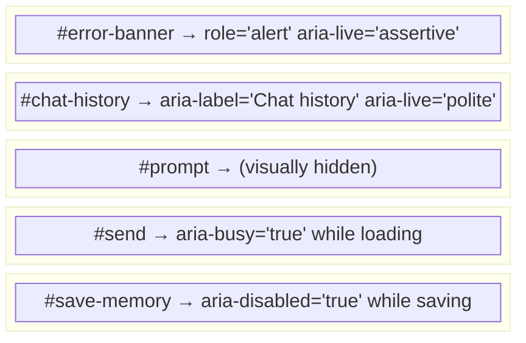

# Standalone Chat — UI/UX Studio Artifact

**Date:** 2026-04-08
**Author:** uiux-studio skill
**Status:** Draft — implementation-aligned, browser validation pending

---

## 1. Problem / Objective / KPI

| Field | Value |
|-------|-------|
| **Problem** | Standalone Chat is the only user-facing interface of the local AI stack. All HTML/CSS/JS is currently bundled into a single TypeScript render function (`renderChatHtml()`), making accessibility, maintainability, and extensibility difficult. |
| **Objective** | Systematically review the chat UX, document the current state, and establish a baseline for future improvements. |
| **KPI (4 of 8 selected)** | Task Success Rate · Error Rate · Recovery Success · p95 Interaction Latency |

---

## 2. Decisions

| # | Decision | Rationale | Validation |
|---|----------|-----------|------------|
| D1 | Keep current **inline HTML/CSS/JS single-function** structure | The current UI is still rendered from one `renderChatHtml()` function; structural refactoring remains deferred | Verified against `docs-browser.ts` |
| D2 | Keep the current **answer → optional save** post-result flow | `Save to memory` appears only after an answer is rendered; `clear-chat` clears visible chat state only and is not a rollback for memory writes | Verified against `docs-browser.ts` |
| D3 | Defer WCAG 2.2 AA accessibility to **Phase B patch** | `role`, `aria-live`, `aria-busy`, and explicit labels are still missing in the shipped script | Verified against `docs-browser.ts`; browser a11y validation still pending |

---

## 3. Artifacts

### 3.1 Screen Structure (Mermaid)

```mermaid
block-beta
  columns 1

  block:header:1
    H1["<h1> Standalone Chat </h1>"]
    P["<p> 질문을 입력하면 POST /api/ai/chat 호출 <a href='/docs'>문서 보기</a></p>"]
  end

  block:error:1
    ERROR["<div id='error-banner'> #error-banner (hidden by default, red)</div>"]
  end

  block:chat:1
    CH["<div id='chat-history' class='card' max-height:400px overflow-y:auto>"]
    CHILD["msg-user (right bubble) | msg-assistant (left bubble)"]
    CH.end
  end

  block:input:1
    TA["<textarea id='prompt' placeholder='...'>"]
    CTRLS1["<div class='controls'> select#model-select | input#token | button#clear-chat</div>"]
    CTRLS2["<div class='controls'> button#send(질문 보내기) + spinner | span#status </div>"]
  end

  block:response:1
    RESP["<div class='card'> <strong>응답</strong> <pre id='answer'> | button#save-memory (hidden) | span#memory-indicator</div>"]
  end

  block:sources:1
    SRC["<div class='card'> <strong>근거 문서</strong> <ul id='sources'></ul></div>"]
  end
```



### 3.2 Component Inventory

| Component | Element | Type | States | A11y Issues |
|-----------|---------|------|--------|-------------|
| Error Banner | `#error-banner` | alert div | hidden / visible (block) | No `role="alert"`, no `aria-live` |
| Chat History | `#chat-history` | scroll div | empty / populated | No `aria-label`, no focus management |
| Prompt Input | `#prompt` | textarea | default / typing / disabled | No `<label>`, only `placeholder` |
| Model Selector | `#model-select` | select | default / changed | No associated `<label>` |
| Token Input | `#token` | password input | empty / filled | No `<label>`, no `autocomplete` |
| Send Button | `#send` | button | idle / busy (disabled+spinner) | No `aria-busy` attribute |
| Clear Chat | `#clear-chat` | button (danger) | idle | — |
| Answer Area | `#answer` | pre | empty / content | No `role="region"` or `aria-label` |
| Save to Memory | `#save-memory` | button | hidden / visible / saving | No `aria-disabled` during save |
| Memory Indicator | `#memory-indicator` | span | hidden / saved-ok (green) / saved-fail (red) | No `aria-live="polite"` |
| Source List | `#sources` | ul | empty / items | No `aria-label` |

### 3.3 Interaction Flow (Mermaid Sequence)

```mermaid
sequenceDiagram
  participant U as User
  participant UI as Standalone Chat (docs-browser.ts)
  participant API as /api/ai/chat
  participant MEM as /api/memory/save
  participant RAG as local-rag (8010)
  participant OLL as Ollama (11434)

  U->>UI: Type query → click "질문 보내기"
  UI->>UI: setBusy(true), show spinner
  UI->>API: POST /api/ai/chat (messages[], model, mode:"chat", routeHint:"local", optional token)
  API->>RAG: POST /api/internal/ai/chat-local
  RAG->>OLL: Ollama chat completion
  OLL-->>RAG: completion text
  RAG-->>API: { text, model, provider, sources, riskFlags, latencyMs }
  API-->>UI: 200 { result: { text, model, provider, usage }, sources, riskFlags, latencyMs, ... }
  UI->>UI: render payload.result.text + payload.sources; show #save-memory button
  UI->>U: Display response

  Note over U,UI: User optionally clicks "이 대화를 메모리에 저장"
  U->>UI: Click save-memory
  UI->>MEM: POST /api/memory/save (title, content, source)
  MEM-->>UI: 200 { id, path, status: "saved" }
  UI->>U: Show "메모리에 저장됨 ✓"

  alt Network error / HTTP error
    UI->>UI: catch block → showError banner + status="오류"
    UI->>U: Red error banner displayed
  end
```

### 3.4 Recovery Paths

| Failure | Mechanism | User Recovery |
|---------|-----------|---------------|
| Network error during send | `catch` → `showError()` banner | Banner shows "네트워크 오류: ..."; user retries |
| HTTP 4xx/5xx response | `if (!response.ok)` → `showError()` | Banner shows HTTP status + error detail |
| Memory save fails (4xx/5xx) | `memIndicatorEl` turns red with HTTP status | User sees red failure text; no auto-retry |
| Memory save network error | `catch(ex)` → red failure text | Same as above |
| Token persistence fails | `try/catch` silently swallows | Token not saved; user re-enters on next session |
| History corrupted (bad JSON) | `loadHistory` `try/catch` → `[]` | Empty chat shown; stored history stays unreadable until local storage is cleared or corrected |

### 3.5 State Persistence

| Key | Storage | TTL | Contents |
|-----|---------|-----|----------|
| `chat_history_v1` | `localStorage` | Until cleared | Array of `{ role: "user"|"assistant", content: string }`, max 50 |
| `chat_token_v1` | `localStorage` | Until cleared | `x-ai-proxy-token` value (masked in UI) |
| `chat_model_v1` | `localStorage` | Until changed | Selected model string (`gemma4:e4b` or `gemma4:e2b`) |

---

## 4. Source References

- `myagent-copilot-kit/standalone-package/src/docs-browser.ts` — `renderChatHtml()` and inline client behavior
- `myagent-copilot-kit/standalone-package/src/proxy-middleware.ts` — `/api/ai/chat` response envelope
- `myagent-copilot-kit/standalone-package/src/local-rag.ts` — local-rag runner request path and response parsing
- `local-rag/app/main.py` — `/api/internal/ai/chat-local` route
- `uiux-studio/references/uiux-guide.md` v2026.01
- AGENTS.md — memory write contract, vault layout
- `start-all.ps1` — local startup and health checks

---

## 5. Simulation Notes

| Scenario | Steps | Expected | Actual | Verdict |
|---------|-------|---------|--------|---------|
| S1: Happy path | Send message → receive answer | Answer shows + save button appears | Code path confirmed; browser runtime not observed in this session | **Partial** |
| S2: HTTP error | Send with invalid token | Error banner with HTTP status | Code path confirmed; browser runtime not observed in this session | **Partial** |
| S3: Memory save OK | Click save-memory after answer | Success indicator shows and save button hides | Code path confirmed; browser runtime not observed in this session | **Partial** |
| S4: Empty prompt | Click send with empty textarea | Status "질문을 입력하세요." | Code path confirmed; browser runtime not observed in this session | **Partial** |
| S5: Keyboard a11y | Tab through all focusable elements | Logical tab order | Not verified | **Revise** |
| S6: Screen reader | Open with NVDA/JAWS | Structured announcement | Not verified | **Revise** |

---

## 6. Feasibility

| Gate | Decision | Note |
|------|----------|------|
| **Go** | ✗ | A11y blockers remain and browser validation is still pending |
| **Revise** | Recommended | Keep implementation-aligned documentation, then add `aria-*` attributes and run browser-based validation |

---

## 7. Open Questions

| OQ | Question | Assumption | Validation |
|----|----------|------------|------------|
| OQ-1 | Will Phase B UX improvements be done on a separate branch? | Separate branch (`feat/standalone-ui-upgrade`) | Confirm after PR #3 merge |
| OQ-2 | Where should `aria-live` region be attached? | `#error-banner` gets `role="alert"` | Keyboard-only smoke test required |
| OQ-3 | Should memory save have an explicit undo or delete flow? | Current UI has no rollback or delete affordance after save | Product decision required |
| OQ-4 | Does selecting `gemma4:e2b` materially improve real user latency? | Code passes the selected model through to `local-rag` and onward to Ollama | Runtime benchmark required |
| OQ-5 | Is it feasible to convert the single-file inline script to TypeScript modules? | Single-file structure maintained; evaluated in separate refactor task | Tech lead sign-off required |

---

## 8. Risks & Mitigation

| Risk | Likelihood | Impact | Mitigation |
|------|-----------|--------|------------|
| WCAG 2.2 AA non-compliance | Medium | Legal / operational | Phase B patch with `aria-*` as a separate tracked task |
| `localStorage` token exposure | Low | Credential exposure | Add `autocomplete="off"` and avoid storing shared tokens on shared machines |
| Save feedback is visual-only | Medium | Accessibility / trust issue | Add `aria-live` to error and save-status regions; verify focus behavior in browser |
| Corrupted local history silently disappears from the UI | Medium | User confusion | Surface a recovery hint or offer a reset action when history JSON cannot be parsed |

---

## 9. Validation Questions

1. Does **Tab** key focus traversal follow a logical order through all interactive elements?
2. Does **NVDA/JAWS** announce the `#error-banner` content when it appears?
3. Does the **memory save failure** message display in red (not grey) text?
4. Does selecting **gemma4:e2b** in `model-select` result in a measurably different response time vs gemma4:e4b?
5. After a failed save, does a later successful save restore clearly visible success styling?

---

## 10. Proposed A11y Patch (Phase B follow-up)

Minimal changes to bring WCAG 2.2 AA into compliance:


