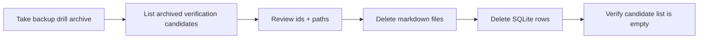

# Verification Purge Runbook



## Goal

이 문서는 Railway production volume 안에 남아 있는 archived verification records를 수동 정리하는 절차를 고정한다.

## Scope

대상:

- archived verification probe notes under `memory/`
- legacy archived verification probe notes under `20_AI_Memory/`
- matching rows in `/data/state/memory_index.sqlite3`

제외:

- active memory records
- non-verification archived records
- raw archive notes under `mcp_raw/`
- daily notes under `10_Daily/`

## Candidate Rule

아래 조건을 모두 만족하는 경우만 purge 후보로 본다.

- `status='archived'`
- tags contain `verification`
- title starts with one of:
  - `Railway Preview Write Check`
  - `Railway Preview Secret Probe`
  - `Railway Production Write Check`
  - `Railway Production Secret Probe`
- path starts with `memory/` or `20_AI_Memory/`

## Safety Rules

- purge 전에 backup drill archive를 한 번 더 생성한다.
- candidate id, title, path를 먼저 눈으로 확인한다.
- path가 `memory/`, `20_AI_Memory/` 밖이면 purge하지 않는다.
- markdown file 삭제와 SQLite row 삭제는 같은 id 기준으로 같이 수행한다.
- delete tool이 MCP surface에 없으므로 이 절차는 operator manual action이다.

## Step 1. Backup First

로컬 PowerShell:

```powershell
railway ssh python /app/scripts/backup_restore_drill.py
```

## Step 2. Open Railway Shell

로컬 PowerShell:

```powershell
railway ssh
```

이후 아래 명령은 Railway shell 안에서 실행한다.

## Step 3. List Purge Candidates

```sh
python - <<'PY'
import sqlite3

conn = sqlite3.connect("/data/state/memory_index.sqlite3")
rows = conn.execute(
    """
    SELECT id, title, project, status, path, tags
    FROM memories
    WHERE status = 'archived'
      AND tags LIKE '%"verification"%'
      AND (path LIKE 'memory/%' OR path LIKE '20_AI_Memory/%')
      AND (
        title LIKE 'Railway Preview Write Check%'
        OR title LIKE 'Railway Preview Secret Probe%'
        OR title LIKE 'Railway Production Write Check%'
        OR title LIKE 'Railway Production Secret Probe%'
      )
    ORDER BY updated_at DESC
    """
).fetchall()

for row in rows:
    print(" | ".join(str(item) for item in row))
PY
```

## Step 4. Delete Markdown Files and SQLite Rows

candidate id를 확인한 뒤, 아래 스크립트의 `TARGET_IDS`만 수정해서 실행한다.

```sh
python - <<'PY'
from pathlib import Path
import sqlite3

TARGET_IDS = [
    # "MEM-20260328-163311-FAFF64",
    # "MEM-20260328-163317-2B1DED",
]

conn = sqlite3.connect("/data/state/memory_index.sqlite3")
rows = conn.execute(
    f"SELECT id, path FROM memories WHERE id IN ({','.join('?' for _ in TARGET_IDS)})",
    TARGET_IDS,
).fetchall()

for memory_id, rel_path in rows:
    if not (rel_path.startswith("memory/") or rel_path.startswith("20_AI_Memory/")):
        raise SystemExit(f"Refusing to delete non-memory path: {rel_path}")
    abs_path = Path("/data/vault") / rel_path
    if abs_path.exists():
        abs_path.unlink()
    conn.execute("DELETE FROM memories WHERE id = ?", (memory_id,))

conn.commit()
print({"deleted_ids": [row[0] for row in rows]})
PY
```

## Step 5. Verify Purge Result

```sh
python - <<'PY'
import sqlite3

conn = sqlite3.connect("/data/state/memory_index.sqlite3")
rows = conn.execute(
    """
    SELECT id, title, path
    FROM memories
    WHERE status = 'archived'
      AND tags LIKE '%"verification"%'
      AND (path LIKE 'memory/%' OR path LIKE '20_AI_Memory/%')
      AND (
        title LIKE 'Railway Preview Write Check%'
        OR title LIKE 'Railway Preview Secret Probe%'
        OR title LIKE 'Railway Production Write Check%'
        OR title LIKE 'Railway Production Secret Probe%'
      )
    ORDER BY updated_at DESC
    """
).fetchall()

print({"remaining_candidates": rows})
PY
```

## Step 6. Exit Shell and Recheck Health

Railway shell 종료 후 로컬 PowerShell:

```powershell
Invoke-WebRequest https://mcp-server-production-90cb.up.railway.app/healthz -UseBasicParsing
```

## Notes

- 이 runbook는 selective purge만 다룬다.
- raw archive seed note는 기본 purge 대상이 아니다.
- verification records는 기본적으로 `archive-first retention` 정책을 따르며, purge는 stricter hygiene가 필요할 때만 수동 실행한다.

## Latest Execution Example

- date:
  - `2026-03-28`
- backup archive:
  - `/data/backups/drill-20260328-123904.tar.gz`
- deleted ids:
  - `MEM-20260328-163311-FAFF64`
  - `MEM-20260328-163317-2B1DED`
- post-delete candidate query:
  - `[]`
