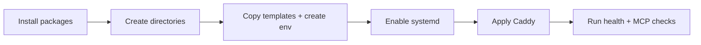

# VPS Command Sheet



## Purpose

이 문서는 Ubuntu VPS에서 self-managed 경로를 사용할 때 복붙 가능한 명령 순서를 한 장으로 정리한 operator sheet다.

## Replace First

아래 placeholder를 실제 값으로 바꾼다.

- `mcp.example.com`
- `<TOKEN>`
- 필요 시 service user/group

## 1. Install Packages

```bash
sudo apt update
sudo apt install -y python3.12 python3.12-venv caddy
```

## 2. Create Layout

```bash
sudo mkdir -p /srv/mcp_obsidian/app
sudo mkdir -p /srv/mcp_obsidian/shared/vault
sudo mkdir -p /srv/mcp_obsidian/shared/data
sudo mkdir -p /srv/mcp_obsidian/logs
sudo mkdir -p /srv/mcp_obsidian/backups
sudo chown -R $USER:$USER /srv/mcp_obsidian
```

## 3. Copy Repo and Templates

```bash
cd /srv/mcp_obsidian
# copy or rsync the repo contents into /srv/mcp_obsidian/app before continuing
cp /srv/mcp_obsidian/app/.env.production.example /srv/mcp_obsidian/shared/.env
cp /srv/mcp_obsidian/app/deploy/systemd/mcp-obsidian.service.example /tmp/mcp-obsidian.service
cp /srv/mcp_obsidian/app/deploy/caddy/Caddyfile.production.example /tmp/Caddyfile.production
```

## 4. Create Virtualenv and Install

```bash
python3.12 -m venv /srv/mcp_obsidian/app/.venv
/srv/mcp_obsidian/app/.venv/bin/pip install --upgrade pip
/srv/mcp_obsidian/app/.venv/bin/pip install -e /srv/mcp_obsidian/app[dev,mcp]
```

## 5. Edit Production Env

```bash
nano /srv/mcp_obsidian/shared/.env
```

Required values:

- `VAULT_PATH=/srv/mcp_obsidian/shared/vault`
- `INDEX_DB_PATH=/srv/mcp_obsidian/shared/data/memory_index.sqlite3`
- `MCP_API_TOKEN=<TOKEN>`
- `TIMEZONE=Asia/Dubai`
- `OBS_VAULT_NAME=mcp_obsidian_production`
- `MCP_ALLOWED_HOSTS=mcp.example.com`
- `MCP_ALLOWED_ORIGINS=https://mcp.example.com`

## 6. Install systemd Unit

```bash
sudo cp /tmp/mcp-obsidian.service /etc/systemd/system/mcp-obsidian.service
sudo systemctl daemon-reload
sudo systemctl enable --now mcp-obsidian
sudo systemctl status mcp-obsidian --no-pager
```

## 7. Install Caddy Config

```bash
sudo nano /etc/caddy/Caddyfile
sudo caddy validate --config /etc/caddy/Caddyfile
sudo systemctl reload caddy
sudo systemctl status caddy --no-pager
```

Minimal Caddy content:

```caddyfile
mcp.example.com {
    encode gzip zstd
    reverse_proxy 127.0.0.1:8000
}
```

## 8. Verify Endpoints

```bash
curl -i https://mcp.example.com/healthz
curl -i -H "Authorization: Bearer <TOKEN>" https://mcp.example.com/mcp
curl -i -H "Authorization: Bearer <TOKEN>" -H "Accept: text/event-stream" https://mcp.example.com/mcp/
```

## 9. Verify MCP Flows

```bash
cd /srv/mcp_obsidian/app
. .venv/bin/activate
python scripts/verify_mcp_readonly.py --server-url https://mcp.example.com/mcp/ --token <TOKEN>
python scripts/verify_mcp_write_once.py --server-url https://mcp.example.com/mcp/ --token <TOKEN> --confirm preview-write-once
python scripts/verify_mcp_secret_paths.py --server-url https://mcp.example.com/mcp/ --token <TOKEN> --confirm preview-secret-paths
```

## 10. Inspect Logs

```bash
journalctl -u mcp-obsidian -n 100 --no-pager
journalctl -u mcp-obsidian -f
```

## Final Gate

- `/healthz` = `200`
- `/mcp` redirect works
- read-only MCP verification passed
- write-once verification passed
- secret-path verification passed
- backup/rollback paths exist
