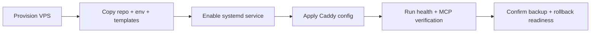

# VPS Execution Checklist

## Goal

이 문서는 `docs/PRODUCTION_VPS_RUNBOOK.md`를 실제 실행 순서로 축약한 self-managed operator checklist다.

Companion command sheet:

- `docs/VPS_COMMAND_SHEET.md`

## Pre-flight

- VPS host available
- public domain pointed to VPS
- SSH key access confirmed
- preview token and production token separated
- local repo validation already green:
  - `pytest -q`
  - `ruff check .`
  - `ruff format --check .`

## Files to Prepare

- repo working copy
- `.env.production.example` copied to production `.env`
- `deploy/caddy/Caddyfile.production.example`
- `deploy/systemd/mcp-obsidian.service.example`

## Host Execution Checklist

1. Install packages
   - `python3.12`
   - `python3.12-venv`
   - `caddy`
2. Create directories
   - `/srv/mcp_obsidian/app`
   - `/srv/mcp_obsidian/shared/vault`
   - `/srv/mcp_obsidian/shared/data`
   - `/srv/mcp_obsidian/logs`
   - `/srv/mcp_obsidian/backups`
3. Copy repo to `/srv/mcp_obsidian/app`
4. Create venv
   - `python3.12 -m venv /srv/mcp_obsidian/app/.venv`
5. Install app
   - `/srv/mcp_obsidian/app/.venv/bin/pip install -e /srv/mcp_obsidian/app[dev,mcp]`
6. Create `/srv/mcp_obsidian/shared/.env`
   - from `.env.production.example`
   - replace domain/token placeholders
7. Copy systemd template
   - `deploy/systemd/mcp-obsidian.service.example`
   - install as `/etc/systemd/system/mcp-obsidian.service`
8. Copy Caddy template
   - `deploy/caddy/Caddyfile.production.example`
   - merge into `/etc/caddy/Caddyfile`
9. Enable service
   - `sudo systemctl daemon-reload`
   - `sudo systemctl enable --now mcp-obsidian`
10. Validate Caddy
   - `sudo caddy validate --config /etc/caddy/Caddyfile`
   - `sudo systemctl reload caddy`

## Runtime Verification

- `curl -i https://mcp.example.com/healthz`
- `curl -i -H "Authorization: Bearer <TOKEN>" https://mcp.example.com/mcp`
- `curl -i -H "Authorization: Bearer <TOKEN>" -H "Accept: text/event-stream" https://mcp.example.com/mcp/`
- `python scripts/verify_mcp_readonly.py --server-url https://mcp.example.com/mcp/ --token <TOKEN>`
- `python scripts/verify_mcp_write_once.py --server-url https://mcp.example.com/mcp/ --token <TOKEN> --confirm preview-write-once`
- `python scripts/verify_mcp_secret_paths.py --server-url https://mcp.example.com/mcp/ --token <TOKEN> --confirm preview-secret-paths`

## Final Gate

- TLS active
- systemd service healthy
- read-only MCP verification passed
- write-once verification passed
- secret-path verification passed
- backup destination exists
- rollback steps understood
