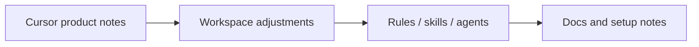

> Status: historical snapshot. This file records a dated Cursor product-note snapshot. Current repo operation has since moved to global Cursor MCP config and additional hosted specialist routes.

# Cursor latest notes reflected in this pack

Date baseline: 2026-03-28

## Reflected product changes

- Skills-first workspace: Cursor 2.4 introduced Agent Skills and a built-in `/migrate-to-skills` workflow.
- Subagents-first delegation: current setup includes focused project subagents instead of many generic helpers.
- Plugin-aware design: Cursor 2.5+ plugins can bundle skills, subagents, MCP servers, hooks, and rules, so this pack keeps those building blocks separated and clean.
- Cloud/automation aware: March 2026 introduced automations and broader marketplace plugins, but those remain optional because they require account or dashboard setup.
- MCP-ready layout: project-local MCP config belongs in `.cursor/mcp.json` when needed.

## What is intentionally not included

- Marketplace plugin manifest, because that spec was not fully verified for local project packaging.
- Team automation definitions, because they require dashboard-side configuration.
- Always-on broad hooks, because Windows hook behavior can be brittle; this pack uses only lightweight shell hooks.
