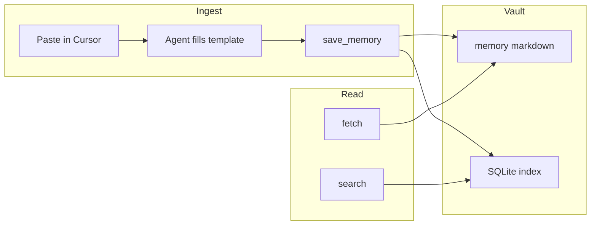

# Plan Doc — Cursor 수동 복붙 → Obsidian Memory 워크플로

> **Source intake**: `docs/CURSOR_SAVE_MEMORY_PRACTICAL_GUIDE.md`  
> **Plan skill**: project-plan v1.0.0  
> **Scope**: 운영 절차·품질 게이트·검증·롤백. **코드/스키마/MCP 계약 변경은 범위 밖** (변경 시 `AGENTS.md` Ask Before Changing).  
> **작성일**: 2026-03-28

---

## Input Gate (project-plan Required)

| 항목 | 상태 | 비고 |
|------|------|------|
| Current State Snapshot | ✅ | 아래 §D + 실전 가이드 §운영 흐름 |
| Selected Ideas | ✅ | 아래 Top 10 (운영·거버넌스 중심; 스택 업그레이드 아님) |
| Evidence Table | ✅ | §Evidence — **저장소 공식 문서/코드 경로** 위주; GitHub 벤치마크는 §AMBER |

---

## A) Executive Summary

수동으로 ChatGPT/Claude 대화를 Cursor에 붙여 넣고 `save_memory`로 정규화된 메모를 production vault에 쌓는다. 장기 기억의 SSOT는 마크다운(`memory/YYYY/MM/...`; legacy `20_AI_Memory/...` read support 유지)이고, SQLite는 검색 가속이다. 기본 운영 모드는 **옵션 B**(요약 + `decision`/`project_fact` 분리). 자동 ingest는 당분간 **필수 아님**. 성공은 “검색으로 다시 찾을 수 있고, 민감 정보가 과다 저장되지 않는 것”으로 정의한다.

---

## B) Stakeholders / Roles

| 역할 | 책임 |
|------|------|
| 사용자(작성자) | 복붙 제공, 사실/결정 구분, 민감도 판단 |
| Cursor 에이전트 | 템플릿 채움, `save_memory` 호출, 태그·`project` 일관성 |
| ChatGPT/Claude(소비) | `search` → `fetch`로 조회; 쓰기는 정책상 제한 |
| 운영(본인/팀) | 주간 정리, `source`/태그 규칙 유지 |

---

## C) UX — User Flow & IA (도구 중심)



- **IA**: 화면 없음; 상호작용은 Cursor 채팅 + MCP 도구.
- **접근성**: 템플릿 헤딩 구조 고정으로 스크린리더·스캔 가능(마크다운 본문).
- **User flow (저장)**  
  1. 외부 채팅 복사 → Cursor에 붙여 넣기  
  2. “이걸 memory로 저장” + 옵션 B 지시  
  3. 에이전트가 `memory_type`·`title`·`tags`·`project`·`source` 확정 후 `save_memory`  
- **User flow (조회)**  
  1. `search`로 후보 id 확보  
  2. `fetch`로 본문 확인  

---

## D) Current State Snapshot

| 영역 | 상태 |
|------|------|
| 수집 | 수동 복붙만; 자동 파이프라인 없음 |
| 저장 도구 | `save_memory` (`app/mcp_server.py`) |
| 타입 enum | `MemoryType` (`app/models.py`) |
| 계약 | `AGENTS.md` — 경로, 도구명, 보안 경계 |
| 소비 | `search` / `fetch` 래퍼 + `search_memory` / `get_memory` |
| 문서 | `docs/CURSOR_SAVE_MEMORY_PRACTICAL_GUIDE.md` |

---

## E) Target State & KPIs

| KPI | 측정 | 목표 |
|-----|------|------|
| 검색 적중 | 주간 샘플 n≥5 질의에서 원하는 메모 `fetch` 성공 | ≥80% (수동 스코어) |
| 중복/장문 | 동일 주제 다건·超長 `content` | 월 1회 리뷰에서 감소 추세 |
| 민감도 | `p1` 기본 위반(원문 시크릿) 건수 | 0건 |
| 일관성 | `project`·`source` 포맷 준수 | 주간 리뷰에서 90%+ |

---

## F) Architecture & Data Flow

- **Write path**: MCP `save_memory` → `MemoryStore` → 마크다운 파일 쓰기 → SQLite upsert (파생).
- **Read path**: `search`/`search_memory` → 인덱스 → `fetch`/`get_memory` → 마크다운 내용 반환.
- **인터페이스 변경 금지**(본 플랜): 도구 이름·스키마·경로는 `AGENTS.md` 고정.

---

## G) Implementation & Operations (문서/절차만)

| PR/작업 단위 | 내용 | 소유 |
|--------------|------|------|
| G1 | 실전 가이드를 팀 온보딩 체크리스트로 채택 | 사용자 |
| G2 | `source` 문자열 규칙 1줄 표준 확정 (예: `model / YYYY-MM-DD / slug`) | 사용자 |
| G3 | 옵션 B 기본 + 예외 시에만 `conversation_summary` 단건 | 사용자 |
| G4 | 주간 `list_recent_memories`로 중복·태그 난립 점검 | 운영 |
| G5 | (선택) 자동 ingest 검토 — **별도 ADR/승인 후** | 미정 |

코드 변경은 이 플랜의 게이트를 통과한 **후속 프로젝트**로 분리한다.

---

## H) Testing & Verification

| 검증 유형 | 방법 | 통과 기준 |
|-----------|------|-----------|
| 계약 스모크 | `save_memory` 후 Vault 경로·파일 존재 | `AGENTS.md` 경로 패턴 |
| 인덱스 | 동일 id로 `search`→`fetch` 라운드트립 | 제목·본문 일치 |
| 회귀 | `pytest -q` (저장소 변경이 있을 때만) | CI green |
| 수동 | 월 1 샘플: 태그·`memory_type` 적절성 | 체크리스트 전부 ✅ |

---

## I) Errors, Retries, Idempotency

| 상황 | 대응 |
|------|------|
| MCP/네트워크 실패 | 메시지 보존 후 재시도; 동일 `title`+`project` 중복 여부 확인 |
| 잘못된 `memory_type` | Pydantic/저장 계층 검증 메시지 → enum 테이블으로 수정 |
| 중복 저장 의심 | `search_memory`로 유사 제목 조회 후 `update_memory` 또는 새 id 수용 |
| 일일 노트 append | `append_daily` 기본 동작 이해; 끄는 경우는 명시적 요청 시만 |

---

## J) Dependencies & Compliance

| 항목 | 요구 |
|------|------|
| 환경 | `MCP_API_TOKEN`, `VAULT_PATH`, `INDEX_DB_PATH` 등 런타임 설정 |
| 라이선스 | 본 플랜은 신규 의존성 없음 |
| 정책 | `AGENTS.md` 보안·개인정보·마스킹; `docs/MASKING_POLICY.md` 참조 |

---

## K) Rollout / Rollback / Incident

| 단계 | Rollout | Rollback |
|------|---------|----------|
| 문서 채택 | 실전 가이드 + 본 플랜 링크 공유 | 링크 제거; 절차만 되돌림 |
| 잘못된 메모 | — | `update_memory` 또는 Vault에서 수동 편집(마크다운 SSOT) |
| 인덱스 불일치 | — | 플러그인/재인덱스 절차는 `obsidian-memory-plugin`·운영 런북 따름 |

**Incident**: 토큰 유출 의심 시 키 로테이션; Vault에 비밀이 저장됐다면 파일 수정 + 인덱스 재동기화.

---

## ㅋ) Appendix

### ㅋ.1 본문 템플릿 (복사용)

실전 가이드와 동일; 저장 시 `content`에 삽입.

```markdown
## 한 줄 요약

## 결정 (Decision)
-

## 사실 (Facts)
-

## 할 일 (Todo)

## 가정 / 미확인 (Assumption)

## 원문 발췌 (선택, 짧게)
```

### ㅋ.2 JSON Envelope (자동화·훅용, 선택)

```json
{
  "plan_id": "manual-memory-workflow-2026-03-28",
  "default_option": "B",
  "required_tools": ["save_memory", "search", "fetch"],
  "evidence_paths": [
    "AGENTS.md",
    "app/mcp_server.py",
    "app/models.py",
    "docs/CURSOR_SAVE_MEMORY_PRACTICAL_GUIDE.md"
  ]
}
```

---

## Selected Ideas — Top 10 (운영·거버넌스)

Impact/Effort/Risk/Confidence 1–5. PriorityScore = (I×C)/(E×R).

| # | Idea | I | E | R | C | Score | Evidence |
|---|------|---|---|---|---|-------|----------|
| 1 | 옵션 B를 기본 운영으로 채택 | 5 | 2 | 1 | 5 | 12.5 | 가이드 §옵션 비교 |
| 2 | `source` 포맷 표준화 | 4 | 1 | 1 | 4 | 16.0 | 가이드 §도구 인자 |
| 3 | 주간 `list_recent_memories` 리뷰 | 4 | 2 | 1 | 4 | 8.0 | 본 플랜 §G |
| 4 | `memory_type` 분할 저장 습관화 | 5 | 2 | 1 | 5 | 12.5 | `app/models.py` |
| 5 | 태그 3–7개 가이드 준수 | 3 | 1 | 1 | 4 | 12.0 | 가이드 §도구 인자 |
| 6 | 민감 정보 마스킹 (원문 금지) | 5 | 2 | 2 | 5 | 6.25 | `AGENTS.md` |
| 7 | 조회는 `search`→`fetch` 고정 순서 | 3 | 1 | 1 | 5 | 15.0 | `AGENTS.md` |
| 8 | 자동 ingest 보류 명시 | 4 | 1 | 1 | 5 | 20.0 | 실전 가이드 서문 |
| 9 | 월간 KPI 표 스스로 채점 | 3 | 2 | 1 | 3 | 4.5 | 본 플랜 §E |
| 10 | 스택 검색 개선(FTS 등) | 5 | 4 | 3 | 3 | 1.25 | `docs/PROJECT_UPGRADE_20260328.md` (별도 궤도) |

점수 1–3위 운영 결정: **#8, #2, #7** (자동 ingest 보류, `source` 표준, 조회 순서).

---

## Evidence Table

| Ref | platform | title | url / path | published_date | updated_date | accessed_date | popularity_metric | why_relevant |
|-----|----------|--------|------------|----------------|--------------|---------------|-------------------|--------------|
| E1 | official | Agent & tool contract | `AGENTS.md` | — | — | 2026-03-28 | — | 도구명·경로·보안 |
| E2 | official | MCP save_memory | `app/mcp_server.py` | — | — | 2026-03-28 | — | 저장 시그니처 |
| E3 | official | MemoryType enum | `app/models.py` | — | — | 2026-03-28 | — | `memory_type` 유효값 |
| E4 | official | Practical guide | `docs/CURSOR_SAVE_MEMORY_PRACTICAL_GUIDE.md` | — | 2026-03-28 | 2026-03-28 | — | 운영 템플릿 |

---

## Risk Register

| Risk | Likelihood | Impact | Mitigation |
|------|------------|--------|------------|
| 장문 원문 저장 | 중 | 검색 품질 저하 | 템플릿 + 발췌 길이 상한 |
| 태그/프로젝트 불일치 | 중 | 검색 미스 | 주간 리뷰 + 표준표 |
| 토큰/비밀 붙여넣기 | 저 | 보안 | 마스킹 정책 + 저장 전 확인 |
| 인덱스·파일 드리프트 | 저 | 조회 불일치 | 운영 런북 재동기화 |

---

## Delivery Plan

| 기간 | 산출 |
|------|------|
| 30일 | `source` 규칙 확정, 옵션 B 습관화 |
| 60일 | 주간 리뷰 8회 이상, KPI 첫 채점 |
| 90일 | 중복 감소 여부 검토; 자동 ingest 필요성 재평가 |

---

## AMBER_BUCKET

| 항목 | 사유 |
|------|------|
| GitHub repo 벤치마크 (2025-06+) | 본 플랜은 **운영 절차** 중심; 외부 “인기 레포” 근거는 수집하지 않았음. 스택/검색 개선은 `PROJECT_UPGRADE_20260328.md` 궤도에서 Evidence 요구사항 충족 후 병합 권장. |
| plan-benchmark-scout | 미실행 — Input이 실전 가이드 단일 문서인 경우 **선택**으로 분리 |

---

## Open Questions (≤3)

1. `source` 슬러그를 영문 고정할지, 한글 허용할지?  
2. `person` 타입 사용 빈도가 낮다면 별도 금지 정책을 둘지?  
3. 프로덕션 MCP 인스턴스가 여러 개일 때 `project` 네임스페이스를 어떻게 나눌지?

---

## Verification Gate (self-check)

| Check | Result |
|-------|--------|
| 파괴적 작업 명시 | 없음 — 문서만 |
| 계약 변경 제안 | 없음 |
| Evidence 최소 1건/아이디어 (운영 Top10) | repo official로 충족 |
| GitHub benchmark 병합 | AMBER — 미병합 |

**Overall**: **PASS** (문서·운영 범위 한정).

---

*문서 끝*
