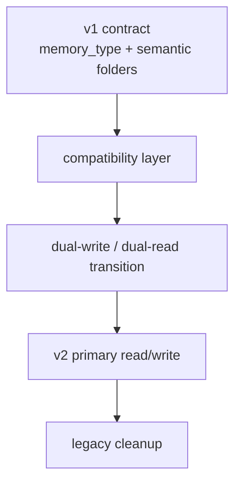
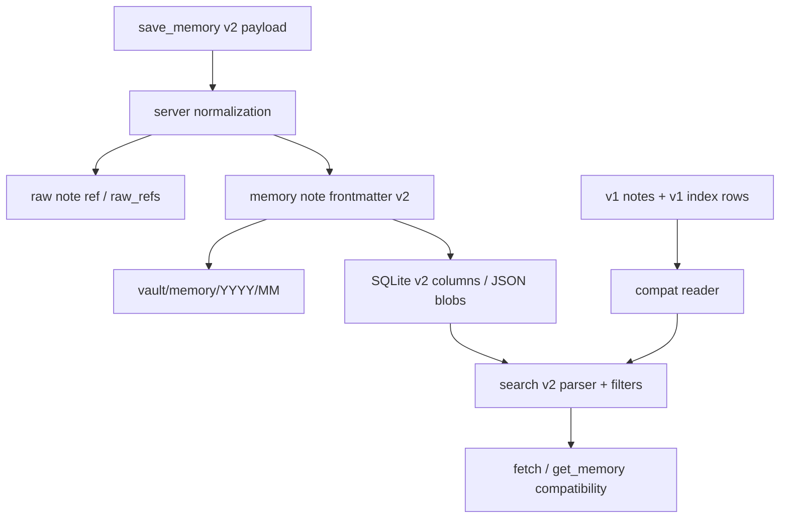

# Plan Doc — Memory v1 → v2 Metadata Migration



> **Source inputs**: `입력.MD`, `AGENTS.md`, current code in `app/models.py`, `app/mcp_server.py`, `app/services/*`  
> **Plan skill**: `mstack-plan`  
> **Scope**: `save_memory` v2, retrieval v2, storage/layout migration, backward compatibility  
> **Out of scope**: actual implementation in this document, ChatGPT/Claude auth redesign, vector search

---

## Phase 1: Business Review

### 1.1 문제 정의

- 초기 상태: memory 저장·검색 계약이 `memory_type` 단일 분류와 의미 폴더 구조(`20_AI_Memory/<memory_type>/...`)에 묶여 있었다.
- 목표 상태: 시간축 보관 + 다중 metadata(`roles[]`, `topics[]`, `entities[]`, `projects[]`) 기반 memory vault로 전환한다.

영향 범위:

- MCP write contract: `save_memory`, `update_memory`
- MCP read contract: `search_memory`, `get_memory`, wrapper `search`, `fetch`
- Markdown frontmatter
- SQLite index
- manual workflow docs

### 1.2 제안 옵션

| 옵션 | 설명 | 공수(일) | 리스크 | 비용(AED) |
|------|------|---------|--------|----------|
| A | 즉시 v2 전환. `memory_type`·의미 폴더를 한 번에 제거 | 5 | 매우 높음 | 0 |
| B | 호환 계층을 둔 점진 migration. v1/v2 공존 후 cutover | 8 | 중간 | 0 |
| C | 문서만 v2로 바꾸고 코드는 유지 | 2 | 높음 | 0 |

### 1.3 추천 & 근거

- 추천: **옵션 B**
- 이유:
  - 현재 production read/write가 이미 살아 있으므로 즉시 절단형 전환은 회귀 위험이 크다.
  - `save_memory v2`를 도입하되 v1 note/index와 공존시키는 편이 운영 충격이 낮다.
  - retrieval 품질 개선과 호환성 보존을 동시에 달성할 수 있다.

롤백:
- v2 read path를 비활성화하고 v1 index/query path로 되돌린다.

### 1.4 승인 요청

- [ ] Phase 1 승인

사용자가 한 번에 작성하라고 명시했으므로 Phase 2까지 이어서 기록한다.

---

## Phase 2: Engineering Review

### 2.1 Mermaid 다이어그램



### 2.2 파일 변경 목록

| 파일 | 변경 유형 | 설명 |
|------|----------|------|
| `app/models.py` | modify | `MemoryCreate/Record/Patch`에 v2 fields 추가; `memory_type`를 compatibility field로 강등 |
| `app/mcp_server.py` | modify | `save_memory` v2 입력, `search_memory` v2 검색 입력, wrapper 호환 유지 |
| `app/services/memory_store.py` | modify | 시간축 경로, v2 frontmatter, dual-read/write 로직 |
| `app/services/markdown_store.py` | modify | `note_kind`, `roles[]`, `topics[]`, `entities[]`, `projects[]`, `raw_refs[]` serialize/read |
| `app/services/index_store.py` | modify | v2 index schema; roles/topics/entities/projects filtering |
| `app/services/schema_validator.py` | modify | v2 schema 로딩 및 v1/v2 병행 검증 |
| `schemas/memory-item.schema.json` | modify | v1 compatibility or deprecated schema |
| `schemas/memory-item-v2.schema.json` | create | v2 memory schema |
| `schemas/raw-conversation.schema.json` | modify | `raw_refs` linkage consistency if needed |
| `tests/test_memory_store.py` | modify | v2 save/update/read assertions |
| `tests/test_hybrid_storage.py` | modify | raw 1건 -> memory N건 linkage assertions |
| `tests/test_search_v2.py` | create | metadata + full-text query coverage |
| `docs/CURSOR_SAVE_MEMORY_PRACTICAL_GUIDE.md` | modify | v2 운영 가이드 반영 |
| `docs/plans/PLAN_MANUAL_MEMORY_WORKFLOW.md` | modify | v1-only 표현 제거, v2 workflow 반영 |
| `README.md` | modify | storage model/current contract 갱신 |
| `SYSTEM_ARCHITECTURE.md` | modify | time-axis + metadata index 구조 반영 |
| `AGENTS.md` | modify or confirm | assumption 제거 후 current truth로 승격 여부 결정 |

### 2.3 의존성 & 순서

작업 순서:

1. `schema + model` 고정
2. `markdown_store + memory_store + index_store` dual-write/dual-read 추가
3. `mcp_server` input/output compatibility 정리
4. `tests` 확장
5. `docs` 동기화
6. sample data migration / backfill script (필요 시)

병렬 가능:

- schema/model 고정 후:
  - storage/index 구현
  - test scaffolding
  - docs draft

공유 모듈:

- `app/models.py`
- `app/services/memory_store.py`
- `app/services/index_store.py`
- `app/mcp_server.py`

### 2.4 테스트 전략

단위 테스트:

- `save_memory v2`에서 `roles[]`, `topics[]`, `entities[]`, `projects[]`, `raw_refs[]` 저장 확인
- v1 payload도 계속 저장 가능한지 확인
- `update_memory`가 v2 metadata를 수정 가능한지 확인
- `search_memory`가 metadata filters + full-text를 함께 적용하는지 확인

통합 테스트:

- raw 1건 저장 후 memory 여러 건 저장
- search 결과 id를 `fetch` / `get_memory`로 roundtrip
- 기존 v1 note가 v2 reader에서 계속 읽히는지 확인

회귀 테스트:

- existing `search` / `fetch` wrapper shape 유지
- existing production write verification scripts가 계속 통과하는지 확인

### 2.5 리스크 & 완화

| 리스크 | 관점 | 완화 |
|--------|------|------|
| 기존 note 경로 변경으로 fetch/url 깨짐 | 호환성 | v1 path를 읽기에서 계속 지원하고, 새 저장만 `memory/YYYY/MM`로 이동 |
| `memory_type` 제거로 API consumer 깨짐 | 호환성 | `memory_type`를 deprecated alias로 유지; `roles[]`에서 primary role derive |
| SQLite schema 마이그레이션 실패 | 데이터 | additive migration + fallback columns 유지 |
| 검색 품질 저하 | 성능/품질 | v1 query + v2 facet 병행 비교 테스트 |
| 문서/코드 drift 재발 | 운영 | doc sync를 same-change set에 포함 |

---

## Migration Stages

### Stage 0 — Freeze current v1 contract

- 현재 production behavior snapshot 고정
- sample v1 note / index row / wrapper response 저장

Acceptance:
- 현재 live verifier scripts pass

### Stage 1 — Add v2 fields without changing read path

- 모델에 `roles[]`, `topics[]`, `entities[]`, `projects[]`, `raw_refs[]`, `relations[]` 추가
- `memory_type` 유지
- 새 schema file 추가

Acceptance:
- v1 tests unchanged
- new schema validates example payloads

### Stage 2 — Dual-write metadata

- 새 memory note는 v2 frontmatter로 쓰되 `memory_type`도 compatibility로 같이 기록
- path는 아직 기존 경로 유지 또는 feature-flag로 전환

Acceptance:
- `save_memory v2` payload persists
- old readers still work

### Stage 3 — Dual-read / dual-search

- search index에 v2 columns 또는 JSON blobs 추가
- query parser가 metadata filters 지원
- wrapper `search/fetch`는 동일 shape 유지

Acceptance:
- v1 query path still works
- v2 query cases pass

### Stage 4 — Storage path cutover

- [x] 새 memory 저장 경로를 `memory/YYYY/MM`로 전환
- [ ] raw는 `mcp_raw/YYYY/MM` 또는 agreed path로 정리
- [x] legacy `20_AI_Memory/...` read support 유지
- [x] operator dry-run/apply backfill script 추가: `scripts/backfill_memory_paths.py`

Acceptance:
- new saves land in time-axis path
- old fetch URLs still resolve for legacy notes

### Stage 5 — Legacy cleanup

- `memory_type`를 optional/deprecated로 전환
- semantic folder assumptions 제거
- guide/runbook/docs 최종 sync

Acceptance:
- docs current truth aligned
- no active code path requires semantic folder tree

---

## Compatibility Rules

- `search` / `fetch` wrapper 이름은 유지
- `fetch` 반환 shape는 유지:
  - `id`
  - `title`
  - `text`
  - `url`
  - `metadata`
- `save_memory`는 v1과 v2를 일정 기간 둘 다 받는다
- `memory_type`는 즉시 삭제하지 않는다

---

## Minimal v2 Query Draft

- keep one string query for wrapper-level compatibility
- allow opt-in structured filters on `search_memory`

Example staged contract:

```json
{
  "query": "aggregate split",
  "roles": ["decision"],
  "topics": ["aggregate", "shipment"],
  "entities": ["DSV"],
  "projects": ["HVDC"],
  "tags": ["topic/aggregate"],
  "limit": 5,
  "recency_days": 30
}
```

---

## Approval Points

- [ ] Approve v2 field set
- [ ] Approve v1/v2 dual-write period
- [x] Approve path cutover from `20_AI_Memory/...` to `memory/YYYY/MM/...`
- [ ] Approve `memory_type` deprecation strategy

---

## Definition of Done

- v2 payload can be saved without breaking v1
- wrapper `search` / `fetch` keep current shape
- legacy notes remain readable
- new notes are metadata-first
- docs and AGENTS reflect actual current truth

---

*Last updated: 2026-03-28*
