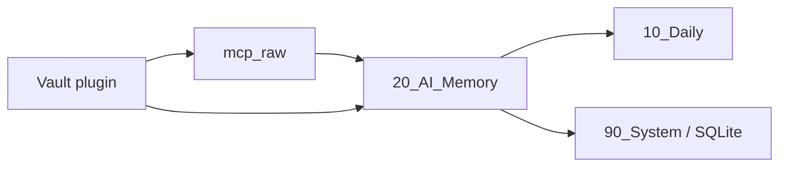

> Status: reference only. This archived design memo is not an authoritative runtime document.



판정: **조건부 예.** 제안한 **Vault API + frontmatter + index** 방향은 맞습니다. 다만 이것은 **Obsidian 내부 저장 계층 설계**로는 좋지만, **ChatGPT·Claude 공용 기억 시스템의 1차 구현**으로는 그대로 쓰면 비효율적입니다. ChatGPT와 Claude는 둘 다 **원격 HTTP 기반 MCP 서버**를 전제로 하므로, **Obsidian 플러그인과 MCP 서버를 분리**해야 합니다. ([Developer Documentation][1])

근거: Obsidian 개발 문서는 **DataAdapter보다 Vault API를 우선** 쓰라고 안내하고, frontmatter 수정도 **YAML 직접 문자열 편집 대신 `FileManager.processFrontMatter`** 사용을 권장합니다. 반면 OpenAI는 **ChatGPT Apps·deep research·API integration용 remote MCP server**를 공식 지원하고, Claude의 MCP connector도 **public HTTP로 노출된 remote MCP server**만 연결할 수 있으며 현재는 **tool calls만 지원**합니다. ([Developer Documentation][1])

다음행동: **구조를 2계층으로 고정**하십시오.
**1) Obsidian plugin = Vault/frontmatter/index 관리**
**2) FastAPI MCP server = ChatGPT·Claude 연결 브리지**

## 내 판단

당신이 제시한 문서는 **“Obsidian 내부 구현 규칙”**으로는 적절합니다.
하지만 당신의 목표는 **“AI 간 공용 기억 시스템”**입니다. 이 목표에서는 **플러그인 중심 설계보다 서버 중심 설계가 우선**입니다.

### 맞는 부분

* **Vault API 우선**: 플러그인 내부에서 파일 I/O를 할 때 맞는 원칙입니다. ([Developer Documentation][1])
* **frontmatter 표준화**: 메모리 품질 관리에 매우 좋습니다. Obsidian은 `metadataCache.getFileCache(file)?.frontmatter`로 frontmatter를 캐시에서 읽는 패턴이 알려져 있습니다. ([Obsidian Forum][2])
* **frontmatter 안전 수정**: 직접 YAML 문자열 편집보다 `processFrontMatter` 계열이 맞습니다. ([Developer Documentation][3])

### 그대로 쓰면 안 되는 부분

* **Obsidian plugin 자체를 MCP 서버로 생각하면 안 됩니다.**

  * ChatGPT 쪽은 **remote MCP server**를 ChatGPT Apps 및 API에 붙이는 구조입니다. ([OpenAI 개발자][4])
  * Claude 쪽도 **public HTTP remote MCP server**만 붙일 수 있고, local stdio는 Messages API connector에서 직접 못 씁니다. ([Claude Platform][5])
* 따라서 **Obsidian app 안의 plugin runtime**과 **외부 HTTP MCP server**는 역할이 달라야 합니다.

## 최종 권장 구조

### A. 1차 MVP

**FastAPI MCP server가 Vault 폴더를 직접 읽고 씁니다.**
Obsidian plugin은 아직 안 넣어도 됩니다.

이유는 단순합니다.

* Obsidian이 꺼져 있어도 서버는 돌아야 합니다.
* ChatGPT·Claude는 둘 다 HTTP MCP endpoint를 봅니다. ([OpenAI 개발자][4])
* memory 창고는 **항상 접근 가능**해야 합니다.

### B. 2차

**Obsidian plugin 추가**

역할은 아래 정도로 제한하는 게 좋습니다.

* Vault 내 메모리 note 생성/검수
* frontmatter 정규화
* 로컬 dashboard
* 수동 승인 저장
* file-index.json 보조 생성

## 구조를 이렇게 바꾸는 것이 맞습니다

```text
Obsidian Vault
├─ mcp_raw/
│  ├─ chatgpt/YYYY-MM-DD/convo-...
│  ├─ claude/YYYY-MM-DD/convo-...
│  └─ grok/YYYY-MM-DD/convo-...
├─ 20_AI_Memory/
│  ├─ preference/YYYY/MM/
│  ├─ project_fact/YYYY/MM/
│  ├─ decision/YYYY/MM/
│  ├─ person/YYYY/MM/
│  └─ conversation_summary/YYYY/MM/
└─ 90_System/
   ├─ file-index.json
   └─ memory_index.sqlite3
```

핵심은 **raw archive**와 **normalized memory**를 분리하는 것입니다.

* `mcp_raw/` = 대화 보관
* `20_AI_Memory/` = 장기기억

당신이 제시한 `/mcp/chatgpt/convo-2026-03-28/` 구조는 **원문 보관소**로는 좋습니다.
하지만 **장기기억 검색소**로는 비효율적입니다. 날짜·에이전트 기준으로만 쪼개면 나중에 “사용자 선호”, “HVDC 결정사항”, “DSV 관련 인물 정보” 검색이 약해집니다.

## frontmatter 표준은 이렇게 고치는 것이 좋습니다

당신 안의 frontmatter는 거의 맞습니다. 다만 **raw note용**과 **memory item용**을 분리하는 편이 낫습니다.

### Raw conversation note

```yaml
mcp_id: convo-2026-03-28-001
source: chatgpt
created_by: chaminkyu
created_at_utc: 2026-03-28T10:12:00Z
session_type: raw_conversation
project: HVDC
tags: [chat, raw]
mcp_sig: hmac-sha256:...
```

### Normalized memory note

```yaml
memory_id: mem-2026-03-28-001
memory_type: decision
source: chatgpt
created_at_utc: 2026-03-28T10:20:00Z
project: HVDC
tags: [aggregate, voyage71]
confidence: 0.92
status: active
mcp_sig: hmac-sha256:...
```

## File Index에 대한 판정

판정: **조건부 채택**

이유:

* 공식 플러그인 디렉터리에 **File Index**가 올라와 있고, GitHub README 기준으로 Vault 루트에 `file-index.json`을 유지하면서 `paths`와 `basenames` 맵을 생성합니다. ([GitHub][6])
* 다만 이 플러그인은 **community plugin**이고, GitHub README에 **basename 중복 구분 문제**가 명시되어 있습니다. 또한 현재 보이는 최신 릴리스는 **2023-11-17의 3.0.3**입니다. ([GitHub][6])

따라서 결론은 이겁니다.

* **보조 인덱스**로는 좋음
* **SSOT**로는 쓰지 말 것
* 1차 MVP의 필수 의존성으로 묶지 말 것

즉:

* **SSOT = Markdown + SQLite**
* **보조 = file-index.json**

## HMAC 서명에 대한 판정

판정: **좋은 설계지만 1차 MVP 필수는 아닙니다.**

이유:

* 위변조 감지 자체는 타당합니다.
* 하지만 핵심 목표는 먼저 **공용 기억 검색/저장**을 안정화하는 것입니다.
* HMAC은 **2차 보강**으로 넣는 편이 낫습니다.

내 권장 순서:

1. 저장 구조
2. 검색 품질
3. 중복 제거
4. frontmatter 정규화
5. HMAC/감사로그

## 최종 구조 비교

| 항목                | 당신 안          | 수정 권장안                           |
| ----------------- | ------------- | -------------------------------- |
| Vault API         | 유지            | 유지                               |
| frontmatter       | 유지            | raw/memory 분리                    |
| 인덱스               | file-index 중심 | SQLite 중심 + file-index 보조        |
| 폴더 구조             | agent/date 중심 | raw는 agent/date, memory는 type 중심 |
| ChatGPT/Claude 연결 | 암묵적           | 별도 HTTP MCP server 필수            |
| 1차 MVP            | 플러그인 중심       | FastAPI MCP server 중심            |

## 최종 결론

**당신 방향은 절반 맞고, 절반은 계층 분리가 필요합니다.**
정확한 구조는 아래입니다.

* **Obsidian plugin 설계 원칙**으로는 매우 좋음
* 하지만 **ChatGPT·Claude 공용 기억 시스템 MVP**는
  **“Obsidian plugin 중심”이 아니라 “FastAPI MCP server 중심”**으로 시작해야 함
* Obsidian plugin은 그 위에 얹는 **관리·검수·인덱스 보조 레이어**가 맞음

즉 한 줄로 정리하면:

**Vault API + frontmatter + index는 “Obsidian 내부 데이터 규약”으로 채택하고, 실제 ChatGPT·Claude 연동은 별도 remote HTTP MCP server가 담당하게 하십시오.** OpenAI와 Anthropic 모두 그 전제를 공식 문서로 요구합니다. ([OpenAI 개발자][4])

원하시면 다음 답변에서 바로 **“Hybrid 최종안” 기준으로**
**1) Obsidian plugin 스캐폴드(TypeScript)**
**2) FastAPI MCP server 완성 골격**
**3) raw/memory 저장 규칙 JSON Schema**
세 가지를 한 번에 내려드리겠습니다.

[1]: https://docs.obsidian.md/Reference/TypeScript%2BAPI/DataAdapter?utm_source=chatgpt.com "DataAdapter - Developer Documentation"
[2]: https://forum.obsidian.md/t/what-does-the-parsefrontmatteraliases-function-do/62680 "What does the parseFrontMatterAliases() function do? - Developers: Plugin & API - Obsidian Forum"
[3]: https://docs.obsidian.md/Plugins/Releasing/Plugin%2Bguidelines?utm_source=chatgpt.com "Plugin guidelines - Developer Documentation"
[4]: https://developers.openai.com/api/docs/mcp/ "Building MCP servers for ChatGPT Apps and API integrations"
[5]: https://platform.claude.com/docs/en/agents-and-tools/mcp-connector "MCP connector - Claude API Docs"
[6]: https://github.com/Steffo99/obsidian-file-index "GitHub - Steffo99/obsidian-file-index: Obsidian plugin to create a metadata file about the files present in the Vault · GitHub"
> Status: reference only. This archived reference note is not an authoritative runtime document. Current source-of-truth terminology lives in `README.md`, `SYSTEM_ARCHITECTURE.md`, and `docs/INSTALL_WINDOWS.md`.
