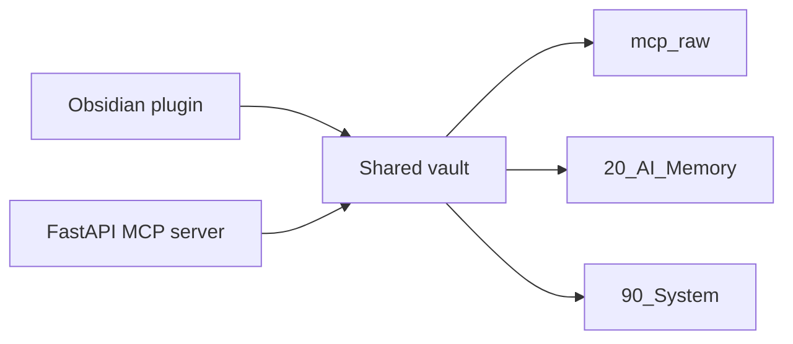

> Status: reference only. This archived final-proposal memo is not an authoritative runtime document.



판정: **예. Hybrid 최종안으로 바로 시작 가능합니다.**
근거: Obsidian 플러그인은 **Vault API 우선**, **`FileManager.processFrontMatter`로 frontmatter 수정**, **`Vault.process`로 백그라운드 편집**이 권장됩니다. 반면 OpenAI와 Anthropic은 둘 다 **public HTTP remote MCP server** 경유 연결을 전제로 하고, Claude MCP connector는 현재 **tool calls만 지원**합니다. 따라서 **Obsidian plugin = 로컬 저장/정리**, **FastAPI MCP server = ChatGPT·Claude 브리지**로 분리하는 것이 맞습니다. ([Developer Documentation][1])
다음행동: 아래 3개를 그대로 시작점으로 쓰십시오.
**1) Obsidian plugin 스캐폴드(TypeScript)**
**2) FastAPI MCP server 완성 골격**
**3) raw/memory 저장 규칙 JSON Schema**

---

# 0) Hybrid 최종안

```text
Obsidian Plugin (local curator)
 ├─ raw 대화 저장
 ├─ memory note 생성/검수
 ├─ frontmatter 정규화
 └─ index 재생성

FastAPI MCP Server (remote bridge)
 ├─ search_memory
 ├─ get_memory
 ├─ list_recent_memories
 ├─ save_memory
 └─ update_memory

Shared Vault
 ├─ mcp_raw/
 ├─ 20_AI_Memory/
 └─ 90_System/
```

이 구조를 택한 이유는 명확합니다. Obsidian 쪽은 Vault/frontmatter 규약을 안전하게 다루는 로컬 계층이 필요하고, OpenAI/Claude 쪽은 동일한 **HTTPS MCP endpoint**를 바라보는 원격 계층이 필요합니다. OpenAI는 ChatGPT Apps·deep research·API integration용 remote MCP server를 공식 지원하고, ChatGPT UI에서 같은 HTTPS endpoint를 연결할 수 있습니다. Claude는 Messages API에서 `mcp_servers`와 `tools`를 통해 remote MCP server를 직접 연결합니다. ([OpenAI Developers][2])

가정: **1차 MVP에서는 community plugin 의존성을 줄이기 위해 인덱스는 자체 JSON/SQLite로 관리**합니다.

---

# 1) Obsidian plugin 스캐폴드 (TypeScript)

## 1-1. 폴더 구조

```text
obsidian-memory-plugin/
├─ manifest.json
├─ package.json
├─ tsconfig.json
└─ src/
   ├─ main.ts
   ├─ types.ts
   ├─ settings.ts
   └─ services/
      └─ vault-store.ts
```

Obsidian 쪽 구현에서는 **Adapter API 직접 사용을 피하고**, **Vault API**와 **`FileManager.processFrontMatter`**를 우선 쓰는 방향이 안전합니다. 또한 경로 기반 접근은 `getAbstractFileByPath` 중심으로 두고, 전체 스캔은 **재색인 명령** 같은 제한된 작업에서만 쓰는 편이 맞습니다. ([Developer Documentation][1])

## 1-2. `manifest.json`

```json
{
  "id": "obsidian-memory-plugin",
  "name": "Obsidian Memory Plugin",
  "version": "0.1.0",
  "minAppVersion": "1.5.0",
  "description": "Hybrid memory layer for raw conversations and normalized AI memories.",
  "author": "chaminkyu",
  "isDesktopOnly": false
}
```

## 1-3. `src/types.ts`

```ts
export type MemorySource = "chatgpt" | "claude" | "grok" | "cursor" | "manual";
export type MemoryType =
  | "preference"
  | "project_fact"
  | "decision"
  | "person"
  | "todo"
  | "conversation_summary";

export interface RawConversationNote {
  schema_type: "raw_conversation";
  mcp_id: string;
  source: MemorySource;
  created_by: string;
  created_at_utc: string;
  conversation_date: string; // YYYY-MM-DD
  project?: string;
  tags?: string[];
  mcp_sig?: string;
  body_markdown: string;
}

export interface MemoryNote {
  schema_type: "memory_item";
  memory_id: string;
  memory_type: MemoryType;
  source: MemorySource;
  created_by: string;
  created_at_utc: string;
  title: string;
  content: string;
  project?: string;
  tags?: string[];
  confidence?: number;
  status?: "active" | "superseded" | "archived";
  mcp_sig?: string;
}

export interface IndexEntry {
  id: string;
  schema_type: "raw_conversation" | "memory_item";
  source: MemorySource;
  title: string;
  path: string;
  created_at_utc: string;
  tags: string[];
  project?: string;
}
```

## 1-4. `src/settings.ts`

```ts
export interface MemoryPluginSettings {
  rawRoot: string;
  memoryRoot: string;
  systemRoot: string;
  createdBy: string;
}

export const DEFAULT_SETTINGS: MemoryPluginSettings = {
  rawRoot: "mcp_raw",
  memoryRoot: "20_AI_Memory",
  systemRoot: "90_System",
  createdBy: "chaminkyu",
};
```

## 1-5. `src/services/vault-store.ts`

```ts
import { App, normalizePath, TFile, TFolder } from "obsidian";
import { IndexEntry, MemoryNote, RawConversationNote } from "../types";
import { MemoryPluginSettings } from "../settings";

export class VaultStore {
  constructor(
    private app: App,
    private settings: MemoryPluginSettings
  ) {}

  private async ensureFolder(path: string): Promise<void> {
    const normalized = normalizePath(path);
    const parts = normalized.split("/");
    let current = "";

    for (const part of parts) {
      current = current ? `${current}/${part}` : part;
      const existing = this.app.vault.getAbstractFileByPath(current);
      if (!existing) {
        await this.app.vault.createFolder(current);
      }
    }
  }

  private async getOrCreateFile(path: string, initial = ""): Promise<TFile> {
    const normalized = normalizePath(path);
    const existing = this.app.vault.getAbstractFileByPath(normalized);
    if (existing instanceof TFile) return existing;

    const dir = normalized.split("/").slice(0, -1).join("/");
    if (dir) await this.ensureFolder(dir);

    return this.app.vault.create(normalized, initial);
  }

  private fmBlock(frontmatter: Record<string, unknown>): string {
    const lines = ["---"];
    for (const [key, value] of Object.entries(frontmatter)) {
      if (Array.isArray(value)) {
        lines.push(`${key}:`);
        for (const item of value) lines.push(`  - ${item}`);
      } else if (value === undefined || value === null) {
        continue;
      } else {
        lines.push(`${key}: ${String(value)}`);
      }
    }
    lines.push("---", "");
    return lines.join("\n");
  }

  private rawPath(note: RawConversationNote): string {
    return normalizePath(
      `${this.settings.rawRoot}/${note.source}/${note.conversation_date}/${note.mcp_id}.md`
    );
  }

  private memoryPath(note: MemoryNote): string {
    const dt = note.created_at_utc.slice(0, 7).replace("-", "/");
    return normalizePath(
      `${this.settings.memoryRoot}/${note.memory_type}/${dt}/${note.memory_id}.md`
    );
  }

  async saveRawConversation(note: RawConversationNote): Promise<string> {
    const path = this.rawPath(note);
    const file = await this.getOrCreateFile(path);

    const frontmatter = {
      schema_type: note.schema_type,
      mcp_id: note.mcp_id,
      source: note.source,
      created_by: note.created_by,
      created_at_utc: note.created_at_utc,
      conversation_date: note.conversation_date,
      project: note.project,
      tags: note.tags ?? [],
      mcp_sig: note.mcp_sig,
    };

    const full = `${this.fmBlock(frontmatter)}${note.body_markdown.trim()}\n`;
    await this.app.vault.process(file, () => full);
    return path;
  }

  async saveMemory(note: MemoryNote): Promise<string> {
    const path = this.memoryPath(note);
    const file = await this.getOrCreateFile(path);

    await this.app.fileManager.processFrontMatter(file, (fm) => {
      fm.schema_type = note.schema_type;
      fm.memory_id = note.memory_id;
      fm.memory_type = note.memory_type;
      fm.source = note.source;
      fm.created_by = note.created_by;
      fm.created_at_utc = note.created_at_utc;
      fm.title = note.title;
      fm.project = note.project ?? null;
      fm.tags = note.tags ?? [];
      fm.confidence = note.confidence ?? 0.8;
      fm.status = note.status ?? "active";
      fm.mcp_sig = note.mcp_sig ?? null;
    });

    await this.app.vault.process(file, (old) => {
      const stripped = old.replace(/^---[\s\S]*?---\n?/, "").trim();
      void stripped;
      return `${this.fmBlock({
        schema_type: note.schema_type,
        memory_id: note.memory_id,
        memory_type: note.memory_type,
        source: note.source,
        created_by: note.created_by,
        created_at_utc: note.created_at_utc,
        title: note.title,
        project: note.project,
        tags: note.tags ?? [],
        confidence: note.confidence ?? 0.8,
        status: note.status ?? "active",
        mcp_sig: note.mcp_sig
      })}${note.content.trim()}\n`;
    });

    return path;
  }

  async rebuildIndex(): Promise<string> {
    const files = this.app.vault.getFiles();
    const entries: IndexEntry[] = [];

    for (const file of files) {
      const cache = this.app.metadataCache.getFileCache(file);
      const fm = cache?.frontmatter;
      if (!fm) continue;
      if (fm.schema_type !== "raw_conversation" && fm.schema_type !== "memory_item") continue;

      entries.push({
        id: String(fm.mcp_id ?? fm.memory_id),
        schema_type: fm.schema_type,
        source: String(fm.source),
        title: String(fm.title ?? fm.mcp_id ?? fm.memory_id),
        path: file.path,
        created_at_utc: String(fm.created_at_utc),
        tags: Array.isArray(fm.tags) ? fm.tags.map(String) : [],
        project: fm.project ? String(fm.project) : undefined,
      });
    }

    const outPath = normalizePath(`${this.settings.systemRoot}/memory_index.json`);
    const outFile = await this.getOrCreateFile(outPath, "[]\n");
    await this.app.vault.process(outFile, () => JSON.stringify(entries, null, 2));
    return outPath;
  }
}
```

## 1-6. `src/main.ts`

```ts
import { Notice, Plugin } from "obsidian";
import { DEFAULT_SETTINGS, MemoryPluginSettings } from "./settings";
import { VaultStore } from "./services/vault-store";
import { RawConversationNote, MemoryNote } from "./types";

export default class ObsidianMemoryPlugin extends Plugin {
  settings: MemoryPluginSettings;
  store!: VaultStore;

  async onload() {
    this.settings = Object.assign({}, DEFAULT_SETTINGS, await this.loadData());
    this.store = new VaultStore(this.app, this.settings);

    this.addCommand({
      id: "memory-rebuild-index",
      name: "Rebuild memory index",
      callback: async () => {
        const path = await this.store.rebuildIndex();
        new Notice(`Memory index rebuilt: ${path}`);
      },
    });

    this.addCommand({
      id: "memory-save-demo-raw",
      name: "Save demo raw conversation",
      callback: async () => {
        const note: RawConversationNote = {
          schema_type: "raw_conversation",
          mcp_id: `convo-${Date.now()}`,
          source: "chatgpt",
          created_by: this.settings.createdBy,
          created_at_utc: new Date().toISOString(),
          conversation_date: new Date().toISOString().slice(0, 10),
          project: "HVDC",
          tags: ["demo", "raw"],
          body_markdown: "## User\n예시 대화 원문\n\n## Assistant\n예시 응답 원문",
        };
        const path = await this.store.saveRawConversation(note);
        new Notice(`Raw conversation saved: ${path}`);
      },
    });

    this.addCommand({
      id: "memory-save-demo-item",
      name: "Save demo memory item",
      callback: async () => {
        const note: MemoryNote = {
          schema_type: "memory_item",
          memory_id: `mem-${Date.now()}`,
          memory_type: "decision",
          source: "chatgpt",
          created_by: this.settings.createdBy,
          created_at_utc: new Date().toISOString(),
          title: "Demo decision",
          content: "Voyage 71은 20mm aggregate only로 유지.",
          project: "HVDC",
          tags: ["demo", "decision"],
          confidence: 0.92,
          status: "active",
        };
        const path = await this.store.saveMemory(note);
        new Notice(`Memory saved: ${path}`);
      },
    });
  }

  async onunload() {
    await this.saveData(this.settings);
  }
}
```

### 플러그인 운영 원칙

* **raw conversation 저장**
* **memory item 생성/검수**
* **memory index 재생성**
* 외부 AI 호출은 하지 않음
* public endpoint 역할은 하지 않음

여기서 핵심은 Obsidian 쪽이 **Vault/frontmatter 정리기** 역할만 한다는 점입니다. Obsidian 문서는 직접 YAML 편집보다 `processFrontMatter`, 직접 file adapter보다 Vault API를 권장합니다. ([Developer Documentation][1])

---

# 2) FastAPI MCP server 완성 골격

Claude Messages API의 MCP connector는 현재 **tool call만 지원**하고, **public HTTP**로 노출된 MCP server만 붙일 수 있습니다. OpenAI Responses API도 remote MCP server를 `mcp` tool type으로 연결하며, **Streamable HTTP 또는 HTTP/SSE** transport를 사용합니다. Python SDK는 `FastMCP`로 tools/resources/prompts를 만들 수 있고, `streamable_http_app()`으로 기존 ASGI 앱에 mount할 수 있습니다. 따라서 이번 MVP는 **tools-first + Streamable HTTP**가 맞습니다. ([Claude][3])

## 2-1. 폴더 구조

```text
obsidian-mcp-server/
├─ pyproject.toml
├─ .env
└─ app/
   ├─ main.py
   ├─ config.py
   ├─ models.py
   ├─ mcp_server.py
   └─ services/
      ├─ index_store.py
      ├─ markdown_store.py
      └─ memory_store.py
```

## 2-2. `pyproject.toml`

```toml
[project]
name = "obsidian-mcp-server"
version = "0.1.0"
requires-python = ">=3.11"
dependencies = [
  "fastapi>=0.115.0",
  "uvicorn[standard]>=0.30.0",
  "mcp[cli]>=1.9.0",
  "pydantic>=2.8.0",
  "pydantic-settings>=2.4.0",
  "pyyaml>=6.0.2"
]
```

## 2-3. `.env`

```env
VAULT_PATH=C:\ObsidianVault
INDEX_DB_PATH=C:\ObsidianVault\90_System\memory_index.sqlite3
MCP_API_TOKEN=replace-with-long-random-secret
TIMEZONE=Asia/Dubai
```

## 2-4. `app/config.py`

```python
from pathlib import Path
from pydantic_settings import BaseSettings, SettingsConfigDict


class Settings(BaseSettings):
    model_config = SettingsConfigDict(env_file=".env", extra="ignore")

    vault_path: Path
    index_db_path: Path
    mcp_api_token: str
    timezone: str = "Asia/Dubai"


settings = Settings()
```

## 2-5. `app/models.py`

```python
from enum import Enum
from datetime import datetime
from pydantic import BaseModel, Field
from typing import Optional


class MemoryType(str, Enum):
    preference = "preference"
    project_fact = "project_fact"
    decision = "decision"
    person = "person"
    todo = "todo"
    conversation_summary = "conversation_summary"


class MemoryCreate(BaseModel):
    memory_type: MemoryType
    title: str
    content: str
    source: str
    project: Optional[str] = None
    tags: list[str] = Field(default_factory=list)
    confidence: float = 0.8
    created_by: str = "mcp-server"
    created_at_utc: Optional[datetime] = None


class MemoryPatch(BaseModel):
    memory_id: str
    title: Optional[str] = None
    content: Optional[str] = None
    tags: Optional[list[str]] = None
    confidence: Optional[float] = None
    status: Optional[str] = None
```

## 2-6. `app/services/index_store.py`

```python
import json
import sqlite3
from pathlib import Path


class IndexStore:
    def __init__(self, db_path: Path):
        db_path.parent.mkdir(parents=True, exist_ok=True)
        self.db_path = db_path
        self._init_db()

    def _conn(self):
        return sqlite3.connect(self.db_path)

    def _init_db(self):
        with self._conn() as conn:
            conn.execute("""
            CREATE TABLE IF NOT EXISTS memories (
              memory_id TEXT PRIMARY KEY,
              memory_type TEXT NOT NULL,
              title TEXT NOT NULL,
              content TEXT NOT NULL,
              source TEXT NOT NULL,
              project TEXT,
              tags TEXT NOT NULL,
              confidence REAL NOT NULL,
              status TEXT NOT NULL,
              created_at_utc TEXT NOT NULL,
              path TEXT NOT NULL
            )
            """)
            conn.commit()

    def upsert(self, row: dict):
        with self._conn() as conn:
            conn.execute("""
            INSERT INTO memories (
              memory_id, memory_type, title, content, source,
              project, tags, confidence, status, created_at_utc, path
            ) VALUES (?, ?, ?, ?, ?, ?, ?, ?, ?, ?, ?)
            ON CONFLICT(memory_id) DO UPDATE SET
              memory_type=excluded.memory_type,
              title=excluded.title,
              content=excluded.content,
              source=excluded.source,
              project=excluded.project,
              tags=excluded.tags,
              confidence=excluded.confidence,
              status=excluded.status,
              created_at_utc=excluded.created_at_utc,
              path=excluded.path
            """, (
              row["memory_id"], row["memory_type"], row["title"], row["content"], row["source"],
              row.get("project"), json.dumps(row.get("tags", []), ensure_ascii=False),
              row.get("confidence", 0.8), row.get("status", "active"),
              row["created_at_utc"], row["path"]
            ))
            conn.commit()

    def search(self, query: str, limit: int = 5):
        with self._conn() as conn:
            rows = conn.execute("""
            SELECT memory_id, memory_type, title, content, source, project, tags, confidence, status, created_at_utc, path
            FROM memories
            WHERE title LIKE ? OR content LIKE ?
            ORDER BY created_at_utc DESC
            LIMIT ?
            """, (f"%{query}%", f"%{query}%", limit)).fetchall()
        return rows

    def get(self, memory_id: str):
        with self._conn() as conn:
            row = conn.execute("""
            SELECT memory_id, memory_type, title, content, source, project, tags, confidence, status, created_at_utc, path
            FROM memories
            WHERE memory_id = ?
            """, (memory_id,)).fetchone()
        return row

    def recent(self, limit: int = 10):
        with self._conn() as conn:
            rows = conn.execute("""
            SELECT memory_id, memory_type, title, source, project, created_at_utc, path
            FROM memories
            ORDER BY created_at_utc DESC
            LIMIT ?
            """, (limit,)).fetchall()
        return rows
```

## 2-7. `app/services/markdown_store.py`

```python
from pathlib import Path
from datetime import datetime
import yaml


class MarkdownStore:
    def __init__(self, vault_path: Path):
        self.vault_path = vault_path

    def memory_path(self, memory_type: str, created_at: datetime, memory_id: str) -> Path:
        rel = Path("20_AI_Memory") / memory_type / created_at.strftime("%Y") / created_at.strftime("%m") / f"{memory_id}.md"
        return self.vault_path / rel

    def write_memory(self, payload: dict) -> str:
        created_at = datetime.fromisoformat(payload["created_at_utc"])
        path = self.memory_path(payload["memory_type"], created_at, payload["memory_id"])
        path.parent.mkdir(parents=True, exist_ok=True)

        fm = {
            "schema_type": "memory_item",
            "memory_id": payload["memory_id"],
            "memory_type": payload["memory_type"],
            "source": payload["source"],
            "created_by": payload["created_by"],
            "created_at_utc": payload["created_at_utc"],
            "title": payload["title"],
            "project": payload.get("project"),
            "tags": payload.get("tags", []),
            "confidence": payload.get("confidence", 0.8),
            "status": payload.get("status", "active"),
        }

        text = "---\n" + yaml.safe_dump(fm, allow_unicode=True, sort_keys=False) + "---\n\n" + payload["content"].strip() + "\n"
        path.write_text(text, encoding="utf-8")
        return path.relative_to(self.vault_path).as_posix()
```

## 2-8. `app/services/memory_store.py`

```python
from uuid import uuid4
from datetime import datetime, timezone
from app.models import MemoryCreate, MemoryPatch
from app.services.index_store import IndexStore
from app.services.markdown_store import MarkdownStore


class MemoryStore:
    def __init__(self, markdown: MarkdownStore, index: IndexStore):
        self.markdown = markdown
        self.index = index

    def _new_id(self) -> str:
        now = datetime.now(timezone.utc)
        return f"mem-{now.strftime('%Y%m%d-%H%M%S')}-{uuid4().hex[:6]}"

    def save(self, payload: MemoryCreate) -> dict:
        now = payload.created_at_utc or datetime.now(timezone.utc)
        row = {
            "memory_id": self._new_id(),
            "memory_type": payload.memory_type.value,
            "title": payload.title,
            "content": payload.content,
            "source": payload.source,
            "project": payload.project,
            "tags": payload.tags,
            "confidence": payload.confidence,
            "status": "active",
            "created_by": payload.created_by,
            "created_at_utc": now.isoformat(),
        }
        row["path"] = self.markdown.write_memory(row)
        self.index.upsert(row)
        return {"status": "saved", "memory_id": row["memory_id"], "path": row["path"]}

    def search(self, query: str, limit: int = 5) -> dict:
        rows = self.index.search(query, limit)
        results = []
        for r in rows:
            results.append({
                "memory_id": r[0],
                "memory_type": r[1],
                "title": r[2],
                "content_preview": r[3][:240],
                "source": r[4],
                "project": r[5],
                "tags": r[6],
                "confidence": r[7],
                "status": r[8],
                "created_at_utc": r[9],
                "path": r[10],
            })
        return {"results": results}

    def get(self, memory_id: str) -> dict:
        r = self.index.get(memory_id)
        if not r:
            return {"status": "not_found", "memory_id": memory_id}
        return {
            "memory_id": r[0],
            "memory_type": r[1],
            "title": r[2],
            "content": r[3],
            "source": r[4],
            "project": r[5],
            "tags": r[6],
            "confidence": r[7],
            "status": r[8],
            "created_at_utc": r[9],
            "path": r[10],
        }

    def recent(self, limit: int = 10) -> dict:
        rows = self.index.recent(limit)
        return {
            "results": [
                {
                    "memory_id": r[0],
                    "memory_type": r[1],
                    "title": r[2],
                    "source": r[3],
                    "project": r[4],
                    "created_at_utc": r[5],
                    "path": r[6],
                }
                for r in rows
            ]
        }

    def update(self, payload: MemoryPatch) -> dict:
        current = self.get(payload.memory_id)
        if current.get("status") == "not_found":
            return current

        row = {
            "memory_id": current["memory_id"],
            "memory_type": current["memory_type"],
            "title": payload.title or current["title"],
            "content": payload.content or current["content"],
            "source": current["source"],
            "project": current["project"],
            "tags": payload.tags if payload.tags is not None else current["tags"],
            "confidence": payload.confidence if payload.confidence is not None else current["confidence"],
            "status": payload.status or current["status"],
            "created_by": "mcp-server",
            "created_at_utc": current["created_at_utc"],
        }
        row["path"] = self.markdown.write_memory(row)
        self.index.upsert(row)
        return {"status": "updated", "memory_id": row["memory_id"], "path": row["path"]}
```

## 2-9. `app/mcp_server.py`

```python
from mcp.server.fastmcp import FastMCP
from app.config import settings
from app.models import MemoryCreate, MemoryPatch
from app.services.index_store import IndexStore
from app.services.markdown_store import MarkdownStore
from app.services.memory_store import MemoryStore

store = MemoryStore(
    markdown=MarkdownStore(settings.vault_path),
    index=IndexStore(settings.index_db_path),
)

mcp = FastMCP(
    "obsidian-memory",
    instructions=(
        "Shared long-term memory backed by an Obsidian vault. "
        "Use read tools first. Use write tools only for durable facts, decisions, and preferences."
    ),
    streamable_http_path="/"
)

@mcp.tool()
async def search_memory(query: str, limit: int = 5) -> dict:
    return store.search(query=query, limit=limit)

@mcp.tool()
async def get_memory(memory_id: str) -> dict:
    return store.get(memory_id)

@mcp.tool()
async def list_recent_memories(limit: int = 10) -> dict:
    return store.recent(limit=limit)

@mcp.tool()
async def save_memory(
    memory_type: str,
    title: str,
    content: str,
    source: str,
    project: str | None = None,
    tags: list[str] | None = None,
    confidence: float = 0.8,
) -> dict:
    payload = MemoryCreate(
        memory_type=memory_type,
        title=title,
        content=content,
        source=source,
        project=project,
        tags=tags or [],
        confidence=confidence,
    )
    return store.save(payload)

@mcp.tool()
async def update_memory(
    memory_id: str,
    title: str | None = None,
    content: str | None = None,
    tags: list[str] | None = None,
    confidence: float | None = None,
    status: str | None = None,
) -> dict:
    payload = MemoryPatch(
        memory_id=memory_id,
        title=title,
        content=content,
        tags=tags,
        confidence=confidence,
        status=status,
    )
    return store.update(payload)
```

## 2-10. `app/main.py`

```python
from contextlib import asynccontextmanager
from fastapi import FastAPI, Request
from fastapi.responses import JSONResponse
from app.config import settings
from app.mcp_server import mcp


@asynccontextmanager
async def lifespan(app: FastAPI):
    async with mcp.session_manager.run():
        yield


app = FastAPI(title="obsidian-memory-mcp", lifespan=lifespan)

@app.get("/healthz")
async def healthz():
    return {"ok": True}

@app.middleware("http")
async def auth_middleware(request: Request, call_next):
    if request.url.path.startswith("/mcp"):
        auth = request.headers.get("authorization", "")
        expected = f"Bearer {settings.mcp_api_token}"
        if auth != expected:
            return JSONResponse({"error": "unauthorized"}, status_code=401)
    return await call_next(request)

app.mount("/mcp", mcp.streamable_http_app())
```

## 2-11. 실행

```bash
uvicorn app.main:app --host 0.0.0.0 --port 8000
```

### 서버 운영 메모

* **read tools** 먼저
* **write tools**는 allowlist
* **HTTPS reverse proxy** 뒤에 배포
* `Authorization: Bearer ...` 방식 유지

OpenAI Responses API는 remote MCP server를 `mcp` tool로 붙이고 `server_url`, `authorization`, `require_approval`, `allowed_tools`를 사용할 수 있습니다. 또 `authorization` 값은 저장되지 않으므로 요청마다 보내야 합니다. ChatGPT에 app를 연결하면 tool payload가 UI에 보이고, **write tools는 기본적으로 수동 확인**이 요구됩니다. Claude는 `mcp_servers`와 `tools`의 `mcp_toolset`으로 붙이며, **public HTTP remote MCP server**와 **tool calls only**가 현재 제약입니다. ([OpenAI Developers][4])

---

# 3) raw/memory 저장 규칙 JSON Schema

## 3-1. `raw-conversation.schema.json`

```json
{
  "$schema": "https://json-schema.org/draft/2020-12/schema",
  "$id": "raw-conversation.schema.json",
  "title": "RawConversationNote",
  "type": "object",
  "properties": {
    "schema_type": {
      "type": "string",
      "const": "raw_conversation"
    },
    "mcp_id": {
      "type": "string",
      "pattern": "^convo-[A-Za-z0-9._:-]+$"
    },
    "source": {
      "type": "string",
      "enum": ["chatgpt", "claude", "grok", "cursor", "manual"]
    },
    "created_by": {
      "type": "string",
      "minLength": 1
    },
    "created_at_utc": {
      "type": "string",
      "format": "date-time"
    },
    "conversation_date": {
      "type": "string",
      "pattern": "^\\d{4}-\\d{2}-\\d{2}$"
    },
    "project": {
      "type": "string"
    },
    "tags": {
      "type": "array",
      "items": { "type": "string" }
    },
    "mcp_sig": {
      "type": "string"
    },
    "body_markdown": {
      "type": "string",
      "minLength": 1
    }
  },
  "required": [
    "schema_type",
    "mcp_id",
    "source",
    "created_by",
    "created_at_utc",
    "conversation_date",
    "body_markdown"
  ],
  "additionalProperties": false
}
```

## 3-2. `memory-item.schema.json`

```json
{
  "$schema": "https://json-schema.org/draft/2020-12/schema",
  "$id": "memory-item.schema.json",
  "title": "MemoryNote",
  "type": "object",
  "properties": {
    "schema_type": {
      "type": "string",
      "const": "memory_item"
    },
    "memory_id": {
      "type": "string",
      "pattern": "^mem-[A-Za-z0-9._:-]+$"
    },
    "memory_type": {
      "type": "string",
      "enum": [
        "preference",
        "project_fact",
        "decision",
        "person",
        "todo",
        "conversation_summary"
      ]
    },
    "source": {
      "type": "string",
      "enum": ["chatgpt", "claude", "grok", "cursor", "manual"]
    },
    "created_by": {
      "type": "string",
      "minLength": 1
    },
    "created_at_utc": {
      "type": "string",
      "format": "date-time"
    },
    "title": {
      "type": "string",
      "minLength": 1,
      "maxLength": 200
    },
    "content": {
      "type": "string",
      "minLength": 1
    },
    "project": {
      "type": "string"
    },
    "tags": {
      "type": "array",
      "items": { "type": "string" }
    },
    "confidence": {
      "type": "number",
      "minimum": 0,
      "maximum": 1
    },
    "status": {
      "type": "string",
      "enum": ["active", "superseded", "archived"]
    },
    "mcp_sig": {
      "type": "string"
    }
  },
  "required": [
    "schema_type",
    "memory_id",
    "memory_type",
    "source",
    "created_by",
    "created_at_utc",
    "title",
    "content"
  ],
  "additionalProperties": false
}
```

## 3-3. 저장 규칙

### raw

* 위치: `mcp_raw/{source}/{YYYY-MM-DD}/{mcp_id}.md`
* 목적: 원문 보관
* 검색 기본 대상: 아님
* 수정 정책: append-only 또는 관리자만 수정

### memory

* 위치: `20_AI_Memory/{memory_type}/{YYYY}/{MM}/{memory_id}.md`
* 목적: 장기기억
* 검색 기본 대상: 예
* 수정 정책: `status`와 `updated` 추적

### index

* 파일: `90_System/memory_index.json`
* DB: `90_System/memory_index.sqlite3`
* 원칙: **Markdown이 SSOT**, index는 재생성 가능 보조물

이 분리는 설계 선택입니다. 공식 문서가 강제하는 것은 아니지만, Obsidian은 plain text Vault 저장소이고 외부 변경을 반영하므로 **Markdown SSOT + 별도 인덱스** 구조가 운영상 가장 안전합니다. ([OpenAI Developers][2])

---

# 4) 연결 스냅샷

## OpenAI Responses API

OpenAI는 Responses API에서 remote MCP server를 `mcp` tool type으로 연결합니다. `server_url`, `authorization`, `require_approval`, `allowed_tools`를 설정할 수 있습니다. 또 deep research/company knowledge까지 확장하려면 **read-only `search`와 `fetch`** 호환 툴을 추가하는 것이 좋습니다. ([OpenAI Developers][4])

```python
from openai import OpenAI

client = OpenAI()

resp = client.responses.create(
    model="gpt-5",
    input="최근 HVDC decision memory 5개만 요약해줘.",
    tools=[
        {
            "type": "mcp",
            "server_label": "obsidian_memory",
            "server_url": "https://your-domain.com/mcp",
            "authorization": "Bearer YOUR_MCP_TOKEN",
            "allowed_tools": ["search_memory", "get_memory", "list_recent_memories"],
            "require_approval": "never"
        }
    ]
)
print(resp.output_text)
```

## Claude Messages API

Claude MCP connector는 `mcp_servers`와 `mcp_toolset`을 사용합니다. 현재 beta header가 필요하고, **tool calls만 지원**합니다. ([Claude][3])

```python
import anthropic

client = anthropic.Anthropic()

resp = client.messages.create(
    model="claude-opus-4-1",
    max_tokens=800,
    extra_headers={"anthropic-beta": "mcp-client-2025-11-20"},
    mcp_servers=[
        {
            "type": "url",
            "url": "https://your-domain.com/mcp",
            "name": "obsidian-memory",
            "authorization_token": "YOUR_MCP_TOKEN"
        }
    ],
    tools=[
        {
            "type": "mcp_toolset",
            "mcp_server_name": "obsidian-memory",
            "default_config": {"enabled": False},
            "configs": {
                "search_memory": {"enabled": True},
                "get_memory": {"enabled": True},
                "list_recent_memories": {"enabled": True}
            }
        }
    ],
    messages=[{"role": "user", "content": "HVDC 관련 최근 decision만 보여줘."}]
)
print(resp.content)
```

---

# 5) 바로 시작하는 순서

1. **Obsidian plugin부터 로컬에서 띄움**

   * raw note 저장
   * memory note 저장
   * index 재생성

2. **FastAPI MCP server 로컬 테스트**

   * `/healthz`
   * `/mcp`

3. **MCP Inspector 또는 API Playground로 호출 확인**
   Python SDK는 `http://localhost:8000/mcp` 연결 테스트 예시를 제공하고, ChatGPT 쪽도 Playground에서 MCP server를 추가해 raw request/response를 볼 수 있습니다. ([GitHub][5])

4. **OpenAI read-only 연결**

5. **Claude read-only 연결**

6. **그다음에 write tools 오픈**

---

# 최종 한 줄

**이 Hybrid 최종안의 핵심은 “Obsidian plugin이 Vault를 정리하고, FastAPI MCP server가 ChatGPT·Claude에 같은 기억을 공급하는 구조”입니다.**

원하면 다음 답변에서 바로 **이 골격을 실제 파일 단위 전체 코드로 묶은 배포형 v0.1 패키지**로 내려드리겠습니다.

[1]: https://docs.obsidian.md/oo/plugin "Obsidian October plugin self-critique checklist - Developer Documentation"
[2]: https://developers.openai.com/api/docs/mcp/ "Building MCP servers for ChatGPT Apps and API integrations"
[3]: https://platform.claude.com/docs/en/agents-and-tools/mcp-connector "MCP connector - Claude API Docs"
[4]: https://developers.openai.com/api/docs/guides/tools-connectors-mcp/ "MCP and Connectors | OpenAI API"
[5]: https://github.com/modelcontextprotocol/python-sdk "GitHub - modelcontextprotocol/python-sdk: The official Python SDK for Model Context Protocol servers and clients · GitHub"
> Status: reference only. This archived reference note is not an authoritative runtime document. Current source-of-truth terminology lives in `README.md`, `SYSTEM_ARCHITECTURE.md`, and `docs/INSTALL_WINDOWS.md`.
