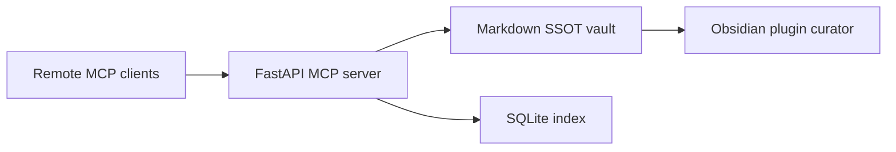

> Status: reference only. This archived design proposal is not an authoritative runtime document. Current source-of-truth terminology lives in `README.md`, `SYSTEM_ARCHITECTURE.md`, and `docs/INSTALL_WINDOWS.md`.



판정: **예. 이 방식으로 바로 MVP 설계 가능합니다.**
근거: OpenAI는 **ChatGPT Apps·deep research·API integration용 remote MCP server**를 공식 지원하고, Responses API는 **Streamable HTTP 또는 HTTP/SSE** transport의 remote MCP를 지원합니다. Anthropic도 **Messages API에서 MCP connector**로 remote MCP server를 직접 연결하며, 현재는 **tool call만 지원**합니다. Obsidian은 Vault를 **로컬 Markdown plain text 폴더**로 저장하고 외부 변경을 자동 반영합니다. MCP Python SDK는 **Streamable HTTP를 운영 권장 transport**로 제시하고 ASGI 앱으로 mount할 수 있습니다. ([developers.openai.com][1])
다음행동: **Obsidian = SSOT, MCP Server = 공용 기억 API, ChatGPT/Claude = 동일 MCP 서버 호출자** 구조로 시작하십시오.

# 1) 최종 권장 아키텍처

## 핵심 구조

```text
Obsidian Vault (SSOT, Markdown)
 ├─ 10_Daily/
 ├─ 20_AI_Memory/
 └─ 90_System/

FastAPI App
 ├─ /healthz
 ├─ /mcp        ← FastMCP streamable_http_app()
 └─ auth / logging / metrics

Memory Service
 ├─ Markdown writer/reader
 ├─ SQLite index
 ├─ search / save / get / list / update
 └─ daily append

Clients
 ├─ OpenAI Responses API
 └─ Anthropic Messages API (MCP connector)
```

이 구조가 맞는 이유는 세 가지입니다.
첫째, Obsidian은 로컬 Markdown Vault라서 **사람이 직접 열어보고 수정 가능한 SSOT**가 됩니다. 둘째, OpenAI와 Anthropic 모두 **public HTTP 기반 remote MCP**를 지원하므로 같은 서버를 양쪽에 붙일 수 있습니다. 셋째, Anthropic MCP connector는 현재 **tool call 중심**이므로, 이번 MVP는 **tools-only**로 설계하는 편이 맞습니다. ([Obsidian][2])

## 설계 원칙

* **SSOT는 Markdown**
* **검색 성능용 인덱스는 SQLite**
* **기억 저장은 구조화**
* **기본은 read-heavy, write는 통제**
* **transport는 Streamable HTTP**
* **Claude/ChatGPT 공용 tool contract 유지**

MCP Python SDK는 tools/resources/prompts를 모두 만들 수 있지만, Anthropic MCP connector는 현재 tool call만 지원합니다. 따라서 **이번 버전은 tools만 노출**하는 것이 가장 안전합니다. Streamable HTTP는 공식 SDK에서 운영 배포용 권장 transport로 제시됩니다. ([GitHub][3])

---

# 2) MVP에서 노출할 툴

## Core tools

1. `search_memory`
2. `save_memory`
3. `get_memory`
4. `list_recent_memories`
5. `update_memory`

## Optional compatibility tools

6. `search`
7. `fetch`

OpenAI 문서상 ChatGPT Apps·deep research·company knowledge까지 노릴 경우, **read-only `search`/`fetch` 호환 툴**을 추가하는 것이 맞습니다. 이 둘은 호환 스키마가 따로 있습니다. ([developers.openai.com][1])

---

# 3) 데이터 모델

## 권장 memory type

* `preference`
* `project_fact`
* `decision`
* `person`
* `todo`
* `conversation_summary`

## Markdown 저장 예시

```markdown
---
id: MEM-20260328-103045-A1B2C3
type: decision
title: Voyage 71 aggregate decision
source: chatgpt
project: HVDC
tags:
  - AGI
  - aggregate
  - voyage71
confidence: 0.92
sensitivity: p1
status: active
created_at: 2026-03-28T10:30:45+04:00
updated_at: 2026-03-28T10:30:45+04:00
---

5mm aggregate는 stock shortage로 Voyage 72로 이연한다.
```

## 파일 경로 규칙

```text
20_AI_Memory/
├─ decision/2026/03/MEM-20260328-103045-A1B2C3.md
├─ project_fact/2026/03/MEM-....
├─ preference/2026/03/MEM-....
└─ person/2026/03/MEM-....
```

Obsidian은 외부 파일 변경을 자동 반영하므로, MCP 서버가 이 Markdown 파일을 쓰면 Vault에서 바로 확인 가능합니다. ([Obsidian][2])

---

# 4) 툴 스키마(JSON)

## 4-1. `search_memory`

```json
{
  "name": "search_memory",
  "description": "Search normalized memories stored in the Obsidian vault.",
  "inputSchema": {
    "$schema": "https://json-schema.org/draft/2020-12/schema",
    "type": "object",
    "properties": {
      "query": { "type": "string" },
      "types": {
        "type": "array",
        "items": {
          "type": "string",
          "enum": ["preference", "project_fact", "decision", "person", "todo", "conversation_summary"]
        }
      },
      "project": { "type": "string" },
      "tags": {
        "type": "array",
        "items": { "type": "string" }
      },
      "limit": {
        "type": "integer",
        "minimum": 1,
        "maximum": 20,
        "default": 5
      },
      "recency_days": {
        "type": "integer",
        "minimum": 1,
        "maximum": 3650
      }
    },
    "required": ["query"],
    "additionalProperties": false
  }
}
```

## 4-2. `save_memory`

```json
{
  "name": "save_memory",
  "description": "Save a normalized memory record into Obsidian and update the index.",
  "inputSchema": {
    "$schema": "https://json-schema.org/draft/2020-12/schema",
    "type": "object",
    "properties": {
      "memory_type": {
        "type": "string",
        "enum": ["preference", "project_fact", "decision", "person", "todo", "conversation_summary"]
      },
      "title": { "type": "string", "minLength": 1, "maxLength": 200 },
      "content": { "type": "string", "minLength": 1 },
      "source": {
        "type": "string",
        "enum": ["chatgpt", "claude", "grok", "cursor", "manual"]
      },
      "project": { "type": "string" },
      "tags": {
        "type": "array",
        "items": { "type": "string" }
      },
      "confidence": {
        "type": "number",
        "minimum": 0,
        "maximum": 1
      },
      "sensitivity": {
        "type": "string",
        "enum": ["p0", "p1", "p2_masked"],
        "default": "p1"
      },
      "append_daily": {
        "type": "boolean",
        "default": true
      },
      "occurred_at": {
        "type": "string",
        "format": "date-time"
      }
    },
    "required": ["memory_type", "title", "content", "source"],
    "additionalProperties": false
  }
}
```

## 4-3. `get_memory`

```json
{
  "name": "get_memory",
  "description": "Get a memory by id.",
  "inputSchema": {
    "$schema": "https://json-schema.org/draft/2020-12/schema",
    "type": "object",
    "properties": {
      "memory_id": { "type": "string" }
    },
    "required": ["memory_id"],
    "additionalProperties": false
  }
}
```

## 4-4. `list_recent_memories`

```json
{
  "name": "list_recent_memories",
  "description": "List recent memory records.",
  "inputSchema": {
    "$schema": "https://json-schema.org/draft/2020-12/schema",
    "type": "object",
    "properties": {
      "limit": {
        "type": "integer",
        "minimum": 1,
        "maximum": 50,
        "default": 10
      },
      "memory_type": {
        "type": "string",
        "enum": ["preference", "project_fact", "decision", "person", "todo", "conversation_summary"]
      },
      "project": { "type": "string" }
    },
    "additionalProperties": false
  }
}
```

## 4-5. `update_memory`

```json
{
  "name": "update_memory",
  "description": "Patch an existing memory record.",
  "inputSchema": {
    "$schema": "https://json-schema.org/draft/2020-12/schema",
    "type": "object",
    "properties": {
      "memory_id": { "type": "string" },
      "title": { "type": "string", "maxLength": 200 },
      "content": { "type": "string" },
      "tags": {
        "type": "array",
        "items": { "type": "string" }
      },
      "confidence": {
        "type": "number",
        "minimum": 0,
        "maximum": 1
      },
      "status": {
        "type": "string",
        "enum": ["active", "superseded", "archived"]
      }
    },
    "required": ["memory_id"],
    "additionalProperties": false
  }
}
```

## 4-6. OpenAI 호환용 `search`

```json
{
  "name": "search",
  "description": "Compatibility wrapper for ChatGPT apps/deep research.",
  "inputSchema": {
    "$schema": "https://json-schema.org/draft/2020-12/schema",
    "type": "object",
    "properties": {
      "query": { "type": "string" }
    },
    "required": ["query"],
    "additionalProperties": false
  }
}
```

## 4-7. OpenAI 호환용 `fetch`

```json
{
  "name": "fetch",
  "description": "Compatibility wrapper for ChatGPT apps/deep research.",
  "inputSchema": {
    "$schema": "https://json-schema.org/draft/2020-12/schema",
    "type": "object",
    "properties": {
      "id": { "type": "string" }
    },
    "required": ["id"],
    "additionalProperties": false
  }
}
```

OpenAI 문서 기준으로 `search`는 `results[]` 배열을, `fetch`는 `id/title/text/url/metadata`를 JSON-encoded text content로 반환해야 합니다. ([developers.openai.com][1])

---

# 5) 폴더 구조

```text
obsidian-mcp/
├─ app/
│  ├─ main.py
│  ├─ config.py
│  ├─ models.py
│  ├─ mcp_server.py
│  ├─ services/
│  │  ├─ memory_store.py
│  │  ├─ markdown_store.py
│  │  ├─ index_store.py
│  │  └─ daily_store.py
│  └─ utils/
│     ├─ ids.py
│     ├─ time.py
│     └─ sanitize.py
├─ data/
│  └─ memory_index.sqlite3
├─ .env
├─ pyproject.toml
└─ README.md
```

---

# 6) Python/FastAPI 기반 MVP 코드 구조

## 6-1. `pyproject.toml`

```toml
[project]
name = "obsidian-mcp"
version = "0.1.0"
requires-python = ">=3.11"
dependencies = [
  "fastapi",
  "uvicorn[standard]",
  "mcp[cli]",
  "pydantic",
  "pydantic-settings",
  "pyyaml"
]
```

공식 MCP Python SDK는 `mcp[cli]` 설치를 안내하고, tools/resources/prompts와 stdio/SSE/Streamable HTTP transport를 지원합니다. ([GitHub][3])

## 6-2. `app/config.py`

```python
from pathlib import Path
from pydantic_settings import BaseSettings, SettingsConfigDict


class Settings(BaseSettings):
    model_config = SettingsConfigDict(env_file=".env", extra="ignore")

    app_name: str = "obsidian-mcp"
    vault_path: Path
    index_db_path: Path = Path("data/memory_index.sqlite3")
    mcp_api_token: str
    timezone: str = "Asia/Dubai"


settings = Settings()
```

## 6-3. `app/models.py`

```python
from enum import Enum
from typing import Optional
from pydantic import BaseModel, Field
from datetime import datetime


class MemoryType(str, Enum):
    preference = "preference"
    project_fact = "project_fact"
    decision = "decision"
    person = "person"
    todo = "todo"
    conversation_summary = "conversation_summary"


class MemoryRecord(BaseModel):
    id: str
    memory_type: MemoryType
    title: str
    content: str
    source: str
    project: Optional[str] = None
    tags: list[str] = Field(default_factory=list)
    confidence: float = 0.8
    sensitivity: str = "p1"
    status: str = "active"
    created_at: datetime
    updated_at: datetime
    path: str


class MemoryCreate(BaseModel):
    memory_type: MemoryType
    title: str
    content: str
    source: str
    project: Optional[str] = None
    tags: list[str] = Field(default_factory=list)
    confidence: float = 0.8
    sensitivity: str = "p1"
    append_daily: bool = True
    occurred_at: Optional[datetime] = None


class MemoryPatch(BaseModel):
    memory_id: str
    title: Optional[str] = None
    content: Optional[str] = None
    tags: Optional[list[str]] = None
    confidence: Optional[float] = None
    status: Optional[str] = None
```

## 6-4. `app/services/index_store.py`

```python
import json
import sqlite3
from pathlib import Path
from app.models import MemoryRecord


class IndexStore:
    def __init__(self, db_path: Path):
        db_path.parent.mkdir(parents=True, exist_ok=True)
        self.db_path = db_path
        self._init_db()

    def _conn(self):
        return sqlite3.connect(self.db_path)

    def _init_db(self):
        with self._conn() as conn:
            conn.execute("""
            CREATE TABLE IF NOT EXISTS memories (
                id TEXT PRIMARY KEY,
                memory_type TEXT NOT NULL,
                title TEXT NOT NULL,
                content TEXT NOT NULL,
                source TEXT NOT NULL,
                project TEXT,
                tags TEXT NOT NULL,
                confidence REAL NOT NULL,
                sensitivity TEXT NOT NULL,
                status TEXT NOT NULL,
                created_at TEXT NOT NULL,
                updated_at TEXT NOT NULL,
                path TEXT NOT NULL
            )
            """)
            conn.commit()

    def upsert(self, rec: MemoryRecord):
        with self._conn() as conn:
            conn.execute("""
            INSERT INTO memories (
                id, memory_type, title, content, source, project, tags,
                confidence, sensitivity, status, created_at, updated_at, path
            ) VALUES (?, ?, ?, ?, ?, ?, ?, ?, ?, ?, ?, ?, ?)
            ON CONFLICT(id) DO UPDATE SET
                memory_type=excluded.memory_type,
                title=excluded.title,
                content=excluded.content,
                source=excluded.source,
                project=excluded.project,
                tags=excluded.tags,
                confidence=excluded.confidence,
                sensitivity=excluded.sensitivity,
                status=excluded.status,
                created_at=excluded.created_at,
                updated_at=excluded.updated_at,
                path=excluded.path
            """, (
                rec.id, rec.memory_type.value, rec.title, rec.content, rec.source,
                rec.project, json.dumps(rec.tags, ensure_ascii=False),
                rec.confidence, rec.sensitivity, rec.status,
                rec.created_at.isoformat(), rec.updated_at.isoformat(), rec.path
            ))
            conn.commit()

    def get(self, memory_id: str):
        with self._conn() as conn:
            row = conn.execute("SELECT * FROM memories WHERE id = ?", (memory_id,)).fetchone()
            return row

    def recent(self, limit: int = 10, memory_type: str | None = None, project: str | None = None):
        sql = "SELECT * FROM memories WHERE 1=1"
        args = []
        if memory_type:
            sql += " AND memory_type = ?"
            args.append(memory_type)
        if project:
            sql += " AND project = ?"
            args.append(project)
        sql += " ORDER BY created_at DESC LIMIT ?"
        args.append(limit)
        with self._conn() as conn:
            return conn.execute(sql, args).fetchall()

    def search(self, query: str, limit: int = 5, memory_types: list[str] | None = None,
               project: str | None = None, tags: list[str] | None = None):
        sql = "SELECT * FROM memories WHERE (title LIKE ? OR content LIKE ?)"
        args = [f"%{query}%", f"%{query}%"]

        if memory_types:
            placeholders = ",".join("?" for _ in memory_types)
            sql += f" AND memory_type IN ({placeholders})"
            args.extend(memory_types)

        if project:
            sql += " AND project = ?"
            args.append(project)

        if tags:
            for tag in tags:
                sql += " AND tags LIKE ?"
                args.append(f"%{tag}%")

        sql += " ORDER BY updated_at DESC LIMIT ?"
        args.append(limit)

        with self._conn() as conn:
            return conn.execute(sql, args).fetchall()
```

## 6-5. `app/services/markdown_store.py`

```python
import yaml
from pathlib import Path
from datetime import datetime
from app.models import MemoryCreate, MemoryPatch, MemoryRecord


class MarkdownStore:
    def __init__(self, vault_path: Path):
        self.vault_path = vault_path

    def memory_path(self, memory_type: str, dt: datetime, memory_id: str) -> Path:
        return self.vault_path / "20_AI_Memory" / memory_type / dt.strftime("%Y") / dt.strftime("%m") / f"{memory_id}.md"

    def write_memory(self, rec: MemoryRecord):
        path = self.vault_path / rec.path
        path.parent.mkdir(parents=True, exist_ok=True)

        frontmatter = {
            "id": rec.id,
            "type": rec.memory_type.value,
            "title": rec.title,
            "source": rec.source,
            "project": rec.project,
            "tags": rec.tags,
            "confidence": rec.confidence,
            "sensitivity": rec.sensitivity,
            "status": rec.status,
            "created_at": rec.created_at.isoformat(),
            "updated_at": rec.updated_at.isoformat(),
        }

        body = (
            "---\n"
            + yaml.safe_dump(frontmatter, allow_unicode=True, sort_keys=False)
            + "---\n\n"
            + rec.content.strip()
            + "\n"
        )
        path.write_text(body, encoding="utf-8")

    def append_daily(self, text: str, dt: datetime):
        path = self.vault_path / "10_Daily" / f"{dt.strftime('%Y-%m-%d')}.md"
        path.parent.mkdir(parents=True, exist_ok=True)
        if not path.exists():
            path.write_text(f"# {dt.strftime('%Y-%m-%d')}\n\n", encoding="utf-8")
        with path.open("a", encoding="utf-8", newline="\n") as f:
            f.write(f"\n## {dt.strftime('%H:%M')}\n- Memory: {text.strip()}\n")
```

## 6-6. `app/services/memory_store.py`

```python
from datetime import datetime
from pathlib import Path
from uuid import uuid4

from app.models import MemoryCreate, MemoryPatch, MemoryRecord
from app.services.markdown_store import MarkdownStore
from app.services.index_store import IndexStore


class MemoryStore:
    def __init__(self, vault_path: Path, index_db_path: Path):
        self.md = MarkdownStore(vault_path)
        self.idx = IndexStore(index_db_path)

    def _new_id(self, dt: datetime) -> str:
        return f"MEM-{dt.strftime('%Y%m%d-%H%M%S')}-{uuid4().hex[:6].upper()}"

    def save(self, payload: MemoryCreate) -> dict:
        now = payload.occurred_at or datetime.now().astimezone()
        memory_id = self._new_id(now)
        rel_path = Path("20_AI_Memory") / payload.memory_type.value / now.strftime("%Y") / now.strftime("%m") / f"{memory_id}.md"

        rec = MemoryRecord(
            id=memory_id,
            memory_type=payload.memory_type,
            title=payload.title,
            content=payload.content,
            source=payload.source,
            project=payload.project,
            tags=payload.tags,
            confidence=payload.confidence,
            sensitivity=payload.sensitivity,
            status="active",
            created_at=now,
            updated_at=now,
            path=str(rel_path).replace("\\", "/"),
        )

        self.md.write_memory(rec)
        self.idx.upsert(rec)

        if payload.append_daily:
            self.md.append_daily(f"{payload.title} — {payload.content}", now)

        return {
            "id": rec.id,
            "path": rec.path,
            "status": "saved"
        }

    def search(self, query: str, types=None, project=None, tags=None, limit=5):
        rows = self.idx.search(query=query, memory_types=types, project=project, tags=tags, limit=limit)
        hits = []
        for row in rows:
            hits.append({
                "id": row[0],
                "type": row[1],
                "title": row[2],
                "content": row[3][:300],
                "source": row[4],
                "project": row[5],
                "tags": row[6],
                "confidence": row[7],
                "created_at": row[10],
                "updated_at": row[11],
                "path": row[12],
            })
        return {"results": hits}

    def get(self, memory_id: str):
        row = self.idx.get(memory_id)
        if not row:
            return None
        return {
            "id": row[0],
            "type": row[1],
            "title": row[2],
            "content": row[3],
            "source": row[4],
            "project": row[5],
            "tags": row[6],
            "confidence": row[7],
            "sensitivity": row[8],
            "status": row[9],
            "created_at": row[10],
            "updated_at": row[11],
            "path": row[12],
        }

    def recent(self, limit=10, memory_type=None, project=None):
        rows = self.idx.recent(limit=limit, memory_type=memory_type, project=project)
        return {
            "results": [
                {
                    "id": row[0],
                    "type": row[1],
                    "title": row[2],
                    "source": row[4],
                    "project": row[5],
                    "created_at": row[10],
                    "path": row[12],
                }
                for row in rows
            ]
        }

    def update(self, patch: MemoryPatch):
        current = self.get(patch.memory_id)
        if not current:
            return {"status": "not_found", "id": patch.memory_id}

        now = datetime.now().astimezone()
        updated = MemoryRecord(
            id=current["id"],
            memory_type=current["type"],
            title=patch.title or current["title"],
            content=patch.content or current["content"],
            source=current["source"],
            project=current["project"],
            tags=patch.tags if patch.tags is not None else current["tags"],
            confidence=patch.confidence if patch.confidence is not None else current["confidence"],
            sensitivity=current["sensitivity"],
            status=patch.status or current["status"],
            created_at=datetime.fromisoformat(current["created_at"]),
            updated_at=now,
            path=current["path"],
        )

        self.md.write_memory(updated)
        self.idx.upsert(updated)
        return {"status": "updated", "id": updated.id, "path": updated.path}
```

## 6-7. `app/mcp_server.py`

```python
from mcp.server.fastmcp import FastMCP
from app.config import settings
from app.models import MemoryCreate, MemoryPatch
from app.services.memory_store import MemoryStore

store = MemoryStore(settings.vault_path, settings.index_db_path)

mcp = FastMCP(
    name="obsidian-memory",
    instructions=(
        "This server provides shared long-term memory backed by an Obsidian vault. "
        "Use read tools first. Use write tools only for durable user preferences, "
        "project facts, decisions, and conversation summaries."
    ),
)

@mcp.tool()
async def search_memory(
    query: str,
    types: list[str] | None = None,
    project: str | None = None,
    tags: list[str] | None = None,
    limit: int = 5,
    recency_days: int | None = None,
) -> dict:
    return store.search(query=query, types=types, project=project, tags=tags, limit=limit)

@mcp.tool()
async def save_memory(
    memory_type: str,
    title: str,
    content: str,
    source: str,
    project: str | None = None,
    tags: list[str] | None = None,
    confidence: float = 0.8,
    sensitivity: str = "p1",
    append_daily: bool = True,
    occurred_at: str | None = None,
) -> dict:
    payload = MemoryCreate(
        memory_type=memory_type,
        title=title,
        content=content,
        source=source,
        project=project,
        tags=tags or [],
        confidence=confidence,
        sensitivity=sensitivity,
        append_daily=append_daily,
        occurred_at=occurred_at,
    )
    return store.save(payload)

@mcp.tool()
async def get_memory(memory_id: str) -> dict:
    result = store.get(memory_id)
    return result or {"status": "not_found", "id": memory_id}

@mcp.tool()
async def list_recent_memories(limit: int = 10, memory_type: str | None = None, project: str | None = None) -> dict:
    return store.recent(limit=limit, memory_type=memory_type, project=project)

@mcp.tool()
async def update_memory(
    memory_id: str,
    title: str | None = None,
    content: str | None = None,
    tags: list[str] | None = None,
    confidence: float | None = None,
    status: str | None = None,
) -> dict:
    patch = MemoryPatch(
        memory_id=memory_id,
        title=title,
        content=content,
        tags=tags,
        confidence=confidence,
        status=status,
    )
    return store.update(patch)

# OpenAI compatibility wrappers
@mcp.tool()
async def search(query: str) -> dict:
    hits = store.search(query=query, limit=5)["results"]
    return {
        "results": [
            {
                "id": h["id"],
                "title": h["title"],
                "url": f"obsidian://open?vault=YourVault&file={h['path']}",
            }
            for h in hits
        ]
    }

@mcp.tool()
async def fetch(id: str) -> dict:
    item = store.get(id)
    if not item:
        return {"id": id, "title": "Not found", "text": "", "url": "", "metadata": {"status": "not_found"}}
    return {
        "id": item["id"],
        "title": item["title"],
        "text": item["content"],
        "url": f"obsidian://open?vault=YourVault&file={item['path']}",
        "metadata": {
            "type": item["type"],
            "project": item["project"],
            "source": item["source"],
            "tags": item["tags"],
        }
    }
```

## 6-8. `app/main.py`

```python
from fastapi import FastAPI, Request
from fastapi.responses import JSONResponse

from app.config import settings
from app.mcp_server import mcp

app = FastAPI(title=settings.app_name)

@app.get("/healthz")
async def healthz():
    return {"ok": True, "service": settings.app_name}

@app.middleware("http")
async def bearer_auth(request: Request, call_next):
    if request.url.path.startswith("/mcp"):
        auth = request.headers.get("authorization", "")
        expected = f"Bearer {settings.mcp_api_token}"
        if auth != expected:
            return JSONResponse({"error": "unauthorized"}, status_code=401)
    return await call_next(request)

app.mount("/mcp", mcp.streamable_http_app())
```

공식 SDK는 `streamable_http_app()`으로 기존 ASGI 서버에 mount하는 패턴을 제시합니다. 또한 Streamable HTTP는 운영 배포용 권장 transport입니다. ([GitHub][3])

---

# 7) `.env` 예시

```env
VAULT_PATH=C:\ObsidianVault
INDEX_DB_PATH=data/memory_index.sqlite3
MCP_API_TOKEN=change-this-long-random-token
TIMEZONE=Asia/Dubai
```

가정: Vault는 Windows 로컬 경로에 있고, 운영 연결용 MCP endpoint는 별도 HTTPS 도메인으로 공개합니다.

---

# 8) 실행

```bash
uvicorn app.main:app --host 0.0.0.0 --port 8000
```

배포 시에는 `https://your-domain.com/mcp` 형태의 public HTTPS endpoint가 필요합니다. Anthropic MCP connector는 **local STDIO server를 직접 연결할 수 없고**, **public HTTP** 기반이어야 하며 Streamable HTTP와 SSE를 지원합니다. OpenAI Responses API도 remote MCP에 대해 **Streamable HTTP 또는 HTTP/SSE**를 지원합니다. ([platform.claude.com][4])

---

# 9) OpenAI 연결 예시

OpenAI Responses API는 `type: "mcp"`로 remote MCP server를 붙이고, `allowed_tools`, `authorization`, `require_approval`를 설정할 수 있습니다. 또한 `mcp_list_tools`를 대화 컨텍스트에 유지하면 매 턴마다 tool list를 다시 가져오지 않아 latency 최적화에 유리합니다. ([developers.openai.com][5])

```python
from openai import OpenAI

client = OpenAI()

resp = client.responses.create(
    model="gpt-5",
    input="최근 HVDC 관련 결정사항만 5개 찾아 요약해줘.",
    tools=[
        {
            "type": "mcp",
            "server_label": "obsidian_memory",
            "server_url": "https://your-domain.com/mcp",
            "authorization": "Bearer <MCP_API_TOKEN>",
            "allowed_tools": ["search_memory", "get_memory", "list_recent_memories"],
            "require_approval": "never"
        }
    ]
)

print(resp.output_text)
```

## OpenAI write profile

```python
resp = client.responses.create(
    model="gpt-5",
    input="이 사용자 선호를 장기기억으로 저장해줘: 앞으로 한국어로 답변 선호.",
    tools=[
        {
            "type": "mcp",
            "server_label": "obsidian_memory",
            "server_url": "https://your-domain.com/mcp",
            "authorization": "Bearer <MCP_API_TOKEN>",
            "allowed_tools": ["save_memory"],
            "require_approval": "never"
        }
    ]
)
```

---

# 10) Claude 연결 예시

Anthropic MCP connector는 Messages API에서 **별도 MCP client 없이** remote MCP server를 직접 붙일 수 있습니다. 현재 beta header는 `mcp-client-2025-11-20`이고, request는 `mcp_servers`와 `tools`의 `mcp_toolset`로 구성됩니다. OAuth bearer token도 지원합니다. ([platform.claude.com][4])

```python
import anthropic

client = anthropic.Anthropic()

resp = client.messages.create(
    model="claude-opus-4-6",
    max_tokens=1024,
    extra_headers={"anthropic-beta": "mcp-client-2025-11-20"},
    mcp_servers=[
        {
            "type": "url",
            "url": "https://your-domain.com/mcp",
            "name": "obsidian-memory",
            "authorization_token": "<MCP_API_TOKEN>"
        }
    ],
    tools=[
        {
            "type": "mcp_toolset",
            "mcp_server_name": "obsidian-memory",
            "default_config": {
                "enabled": False
            },
            "configs": {
                "search_memory": {"enabled": True},
                "get_memory": {"enabled": True},
                "list_recent_memories": {"enabled": True}
            }
        }
    ],
    messages=[
        {
            "role": "user",
            "content": "HVDC 프로젝트 관련 최근 결정사항만 요약해줘."
        }
    ]
)

print(resp.content)
```

## Claude write profile

```python
resp = client.messages.create(
    model="claude-sonnet-4-6",
    max_tokens=512,
    extra_headers={"anthropic-beta": "mcp-client-2025-11-20"},
    mcp_servers=[
        {
            "type": "url",
            "url": "https://your-domain.com/mcp",
            "name": "obsidian-memory",
            "authorization_token": "<MCP_API_TOKEN>"
        }
    ],
    tools=[
        {
            "type": "mcp_toolset",
            "mcp_server_name": "obsidian-memory",
            "default_config": {"enabled": False},
            "configs": {
                "save_memory": {"enabled": True}
            }
        }
    ],
    messages=[
        {
            "role": "user",
            "content": "다음 내용을 preference로 저장해줘: 사용자는 향후 답변을 한국어로 선호한다."
        }
    ]
)
```

---

# 11) 운영 권장안

## MVP 운영 정책

* **read tools 기본 허용**
* **write tools 분리**
* `save_memory`는 모든 대화에 자동 허용하지 말고, 별도 capture flow에서만 사용
* `p2_masked` 외 민감정보 원문 저장 금지
* Daily note append는 켜되, 계약·단가·PII는 축약/마스킹

OpenAI는 custom remote MCP server 보안을 위해 **OAuth와 dynamic client registration**을 권장합니다. Anthropic도 remote MCP server는 **신뢰 가능한 서버만 연결**하라고 명시합니다. ([developers.openai.com][1])

## 권장 단계

1. **Phase 1**: `search_memory`, `get_memory`, `list_recent_memories`
2. **Phase 2**: `save_memory`
3. **Phase 3**: `update_memory`
4. **Phase 4**: OpenAI용 `search`/`fetch` alias
5. **Phase 5**: embeddings / reranking / dedupe

---

# 12) 이 설계의 장점

* Obsidian이 **사람이 읽는 기억 창고**
* ChatGPT/Claude가 **같은 기억을 조회**
* 앱 내장 Memory와 별개로 **공용 memory layer** 구축
* 플랫폼 변경에도 **Markdown SSOT 유지**
* 나중에 Grok/xAI API도 같은 서버에 붙이기 쉬움

---

# 13) 최종 한 줄

**당신이 만들어야 하는 것은 “ChatGPT용 MCP 서버”와 “Claude용 MCP 서버” 두 개가 아니라, `Obsidian-backed shared memory MCP server` 한 개입니다.**

원하면 다음 답변에서 바로 **실행 가능한 전체 MVP 코드 묶음 1세트**로, 파일별 완성본까지 내려드리겠습니다.

[1]: https://developers.openai.com/api/docs/mcp/ "Building MCP servers for ChatGPT Apps and API integrations"
[2]: https://obsidian.md/help/data-storage "How Obsidian stores data - Obsidian Help"
[3]: https://github.com/modelcontextprotocol/python-sdk "GitHub - modelcontextprotocol/python-sdk: The official Python SDK for Model Context Protocol servers and clients · GitHub"
[4]: https://platform.claude.com/docs/en/agents-and-tools/mcp-connector "MCP connector - Claude API Docs"
[5]: https://developers.openai.com/api/docs/guides/tools-connectors-mcp/ "MCP and Connectors | OpenAI API"
