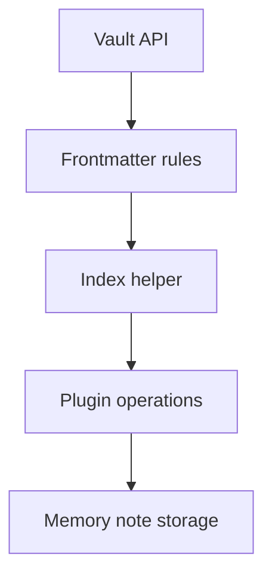

> Status: reference only. This archived proposal is not an authoritative runtime document. Current source-of-truth terminology lives in `README.md`, `SYSTEM_ARCHITECTURE.md`, and `docs/INSTALL_WINDOWS.md`.



옵시디언(Obsidian)을 “대화 기억 창고”로 쓰려면, **공식 Vault API + 프런트매터(Frontmatter) 규칙 + 인덱스**를 표준으로 잡는 게 가장 안전하고 확장성이 좋아요. 아래처럼 시작하세요.

---

# 1) 왜 Vault API인가

* 옵시디언은 플러그인에서 **`app.vault`(Vault API)** 로 파일 읽기/쓰기·폴더 순회·이동 등을 제공합니다. 제작 가이드도 **Adapter(저수준 파일시스템)보다 Vault API를 우선**하라고 권장합니다. ([Developer Documentation][1])
* 프런트매터는 메타데이터 캐시·유틸을 통해 안전하게 파싱/수정하는 패턴이 정리돼 있습니다(예: `parseFrontMatter*` 관련 논의와 예시). ([Obsidian Forum][2])

---

# 2) 폴더 매핑 규칙(권장)

* 대화 에이전트/세션별 하위 폴더:
  `/mcp/chatgpt/convo-2026-03-28/`, `/mcp/claude/convo-2026-03-28/` 처럼 **에이전트·날짜 기준**으로 분리
* 각 노트 **필수 프런트매터(최소)**:

  ```yaml
  ---
  mcp_id: convo-2026-03-28-001
  source: chatgpt          # chatgpt | claude | grok ...
  created_by: chaminkyu
  created_at_utc: 2026-03-28T10:12:00Z
  mcp_sig: "hmac-sha256:BASE64…"   # 금칙: 시크릿은 금고/OS 키체인에 보관
  ---
  ```
* **HMAC 서명(`mcp_sig`)**: 노트 본문+핵심 필드를 HMAC으로 서명해 위·변조 감지. 시크릿은 볼트 밖(예: Windows 자격 증명 관리자, macOS 키체인)에 저장.

---

# 3) 인덱스 전략(스캔 비용↓, 외부 연동↑)

* 볼트 루트에 **`file-index.json`** 를 유지하는 “File Index” 플러그인 사용 추천(파일 경로/베이스네임 맵을 자동 생성·갱신). 외부 앱이 옵시디언 내부 구조를 몰라도 링크 해석이 쉬워집니다. ([Obsidian Stats][3])

---

# 4) 플러그인 구현 체크리스트

* 파일 IO: `app.vault.read/modify/create/rename/delete` 중심으로 구현(직접 fs 접근 지양). ([Mintlify][4])
* 메타데이터: `metadataCache`와 프런트매터 파서 유틸 사용(직접 문자열 조작 최소화). ([Obsidian Forum][5])
* 인덱스: 존재 시 `file-index.json` 을 우선 조회, 없으면 Vault 트래버스(숨김/예외 폴더는 제외 정규식). ([GitHub][6])
* 성능: 초기 인덱싱/동기화 후 플러그인 탓에 느려지지 않도록 증분 업데이트·디바운스 적용(커뮤니티 이슈 참고). ([Obsidian Forum][7])

---

# 5) 실전 배치 예시(간단 워크플로)

1. MCP/에이전트가 새 대화를 저장 → 위 프런트매터 + 본문 기록
2. 저장 직후 HMAC 생성 → `mcp_sig` 필드 업데이트
3. File Index가 자동으로 경로/베이스네임 갱신 → 대시보드/봇에서 빠른 조회

---

원하시면, **옵시디언 플러그인 스캐폴드(TypeScript) + HMAC 유틸 + Vault API 래퍼 + File Index 연동 예제**를 바로 만들어 드릴게요.

[1]: https://docs.obsidian.md/Plugins/Releasing/Plugin%2Bguidelines?utm_source=chatgpt.com "Plugin guidelines - Developer Documentation"
[2]: https://forum.obsidian.md/t/what-does-the-parsefrontmatteraliases-function-do/62680?utm_source=chatgpt.com "What does the parseFrontMatterAliases() function do?"
[3]: https://www.obsidianstats.com/plugins/file-index?utm_source=chatgpt.com "File Index - Obsidian plugin to create a metadata file about ..."
[4]: https://mintlify.com/obsidianmd/obsidian-api/api/app?utm_source=chatgpt.com "App - Obsidian API"
[5]: https://forum.obsidian.md/t/current-status-for-parsing-working-with-yaml-frontmatter/70290?utm_source=chatgpt.com "Current status for parsing / working with YAML frontmatter"
[6]: https://github.com/Steffo99/obsidian-file-index?utm_source=chatgpt.com "Steffo99/obsidian-file-index"
[7]: https://forum.obsidian.md/t/identifying-which-plugins-are-slowing-down-indexing/84577?utm_source=chatgpt.com "Identifying Which Plugins Are Slowing Down Indexing - Help"

판정: 예. 바로 붙여 넣어 쓸 수 있는 **Obsidian 플러그인 MVP 스캐폴드**로 드립니다.
근거: Obsidian은 파일 작업에 `Vault` API 사용을 권장하고, 프런트매터 수정은 `FileManager.processFrontMatter`, 백그라운드 내용 수정은 `Vault.process()` 사용을 권장합니다. 샘플 플러그인은 TypeScript 템플릿으로 제공됩니다. ([Developer Documentation][1])
다음행동: 아래 구조대로 생성 후 `npm i` → `npm run dev` → 테스트 Vault에 설치하면 됩니다. 샘플은 `/mcp/...` 노트 저장 + HMAC + `file-index.json` 조회까지 포함합니다. ([GitHub][2])

## 1) 폴더 구조

```text
obsidian-mcp-memory/
├─ manifest.json
├─ package.json
├─ tsconfig.json
├─ esbuild.config.mjs
├─ styles.css
├─ main.ts
└─ src/
   ├─ types.ts
   ├─ settings.ts
   ├─ crypto.ts
   ├─ vault-wrapper.ts
   ├─ frontmatter.ts
   ├─ file-index.ts
   └─ memory-service.ts
```

---

## 2) manifest.json

```json
{
  "id": "mcp-memory-vault",
  "name": "MCP Memory Vault",
  "version": "0.1.0",
  "minAppVersion": "1.5.0",
  "description": "Save AI conversations into Obsidian vault with frontmatter, HMAC, and file-index support.",
  "author": "MR.CHA",
  "authorUrl": "https://example.com",
  "isDesktopOnly": false
}
```

---

## 3) package.json

```json
{
  "name": "obsidian-mcp-memory",
  "version": "0.1.0",
  "private": true,
  "description": "Obsidian plugin for MCP memory vault",
  "main": "main.js",
  "scripts": {
    "dev": "node esbuild.config.mjs",
    "build": "node esbuild.config.mjs production"
  },
  "devDependencies": {
    "@types/node": "^24.0.0",
    "builtin-modules": "^4.0.0",
    "esbuild": "^0.25.0",
    "obsidian": "latest",
    "tslib": "^2.8.0",
    "typescript": "^5.8.0"
  }
}
```

---

## 4) tsconfig.json

```json
{
  "compilerOptions": {
    "baseUrl": ".",
    "inlineSourceMap": true,
    "inlineSources": true,
    "module": "ESNext",
    "target": "ES2020",
    "allowJs": false,
    "noImplicitAny": true,
    "moduleResolution": "Bundler",
    "importHelpers": true,
    "isolatedModules": true,
    "strictNullChecks": true,
    "lib": ["DOM", "ES2020"],
    "types": ["node"]
  },
  "include": ["**/*.ts"]
}
```

---

## 5) esbuild.config.mjs

```js
import esbuild from "esbuild";
import process from "process";
import builtins from "builtin-modules";

const production = process.argv[2] === "production";

const context = await esbuild.context({
  entryPoints: ["main.ts"],
  bundle: true,
  external: [
    "obsidian",
    "electron",
    ...builtins
  ],
  format: "cjs",
  target: "es2020",
  logLevel: "info",
  sourcemap: production ? false : "inline",
  treeShaking: true,
  outfile: "main.js"
});

if (production) {
  await context.rebuild();
  await context.dispose();
} else {
  await context.watch();
}
```

---

## 6) styles.css

```css
.mcp-memory-note {
}
```

---

## 7) src/types.ts

```ts
export type MemorySource = "chatgpt" | "claude" | "grok" | "gemini" | "other";

export interface McpFrontmatter {
  mcp_id: string;
  source: MemorySource;
  created_by: string;
  created_at_utc: string;
  mcp_sig?: string;
  tags?: string[];
}

export interface SaveConversationInput {
  source: MemorySource;
  sessionId: string;
  title: string;
  body: string;
  createdBy: string;
  createdAtUtc?: string;
  tags?: string[];
}

export interface PluginSettings {
  rootFolder: string;
  createdBy: string;
  hmacSecret: string;
  fileIndexPath: string;
  useFileIndex: boolean;
}

export const DEFAULT_SETTINGS: PluginSettings = {
  rootFolder: "mcp",
  createdBy: "chaminkyu",
  hmacSecret: "",
  fileIndexPath: "file-index.json",
  useFileIndex: true
};
```

---

## 8) src/settings.ts

```ts
import { App, PluginSettingTab, Setting } from "obsidian";
import type McpMemoryPlugin from "../main";
import { DEFAULT_SETTINGS } from "./types";

export class McpMemorySettingTab extends PluginSettingTab {
  plugin: McpMemoryPlugin;

  constructor(app: App, plugin: McpMemoryPlugin) {
    super(app, plugin);
    this.plugin = plugin;
  }

  display(): void {
    const { containerEl } = this;
    containerEl.empty();

    containerEl.createEl("h2", { text: "MCP Memory Vault" });

    new Setting(containerEl)
      .setName("Root folder")
      .setDesc("예: mcp")
      .addText((text) =>
        text
          .setPlaceholder("mcp")
          .setValue(this.plugin.settings.rootFolder)
          .onChange(async (value) => {
            this.plugin.settings.rootFolder = value.trim() || DEFAULT_SETTINGS.rootFolder;
            await this.plugin.saveSettings();
          })
      );

    new Setting(containerEl)
      .setName("Created by")
      .setDesc("기본 작성자")
      .addText((text) =>
        text
          .setPlaceholder("chaminkyu")
          .setValue(this.plugin.settings.createdBy)
          .onChange(async (value) => {
            this.plugin.settings.createdBy = value.trim() || DEFAULT_SETTINGS.createdBy;
            await this.plugin.saveSettings();
          })
      );

    new Setting(containerEl)
      .setName("HMAC secret")
      .setDesc("MVP용. 실운영은 OS Keychain/외부 비밀 저장소 권장")
      .addText((text) =>
        text
          .setPlaceholder("secret")
          .setValue(this.plugin.settings.hmacSecret)
          .onChange(async (value) => {
            this.plugin.settings.hmacSecret = value;
            await this.plugin.saveSettings();
          })
      );

    new Setting(containerEl)
      .setName("Use file-index.json")
      .setDesc("file-index.json 조회 사용")
      .addToggle((toggle) =>
        toggle
          .setValue(this.plugin.settings.useFileIndex)
          .onChange(async (value) => {
            this.plugin.settings.useFileIndex = value;
            await this.plugin.saveSettings();
          })
      );

    new Setting(containerEl)
      .setName("File index path")
      .setDesc("예: file-index.json")
      .addText((text) =>
        text
          .setPlaceholder("file-index.json")
          .setValue(this.plugin.settings.fileIndexPath)
          .onChange(async (value) => {
            this.plugin.settings.fileIndexPath = value.trim() || DEFAULT_SETTINGS.fileIndexPath;
            await this.plugin.saveSettings();
          })
      );
  }
}
```

---

## 9) src/crypto.ts

```ts
import { createHmac } from "node:crypto";

export class HmacUtil {
  static sign(secret: string, payload: string): string {
    if (!secret) return "";
    const digest = createHmac("sha256", secret).update(payload, "utf8").digest("base64");
    return `hmac-sha256:${digest}`;
  }

  static verify(secret: string, payload: string, signature?: string): boolean {
    if (!secret || !signature) return false;
    return this.sign(secret, payload) === signature;
  }
}
```

---

## 10) src/vault-wrapper.ts

```ts
import { App, normalizePath, TAbstractFile, TFile, TFolder } from "obsidian";

export class VaultWrapper {
  constructor(private app: App) {}

  normalize(path: string): string {
    return normalizePath(path);
  }

  getByPath(path: string): TAbstractFile | null {
    return this.app.vault.getAbstractFileByPath(this.normalize(path));
  }

  getFile(path: string): TFile | null {
    const file = this.getByPath(path);
    return file instanceof TFile ? file : null;
  }

  async ensureFolder(folderPath: string): Promise<void> {
    const normalized = this.normalize(folderPath);
    const existing = this.getByPath(normalized);

    if (existing instanceof TFolder) return;
    if (existing instanceof TFile) {
      throw new Error(`폴더 경로에 파일이 이미 존재합니다: ${normalized}`);
    }

    await this.app.vault.createFolder(normalized);
  }

  async ensureFoldersRecursively(folderPath: string): Promise<void> {
    const normalized = this.normalize(folderPath);
    const parts = normalized.split("/").filter(Boolean);

    let current = "";
    for (const part of parts) {
      current = current ? `${current}/${part}` : part;
      const found = this.getByPath(current);
      if (!found) {
        await this.app.vault.createFolder(current);
      } else if (!(found instanceof TFolder)) {
        throw new Error(`폴더 생성 실패. 파일이 선점 중: ${current}`);
      }
    }
  }

  async createOrOverwrite(path: string, content: string): Promise<TFile> {
    const normalized = this.normalize(path);
    const file = this.getFile(normalized);
    if (file) {
      await this.app.vault.process(file, () => content);
      return file;
    }
    return await this.app.vault.create(normalized, content);
  }

  async read(path: string): Promise<string | null> {
    const file = this.getFile(path);
    if (!file) return null;
    return await this.app.vault.read(file);
  }

  async append(path: string, content: string): Promise<void> {
    const file = this.getFile(path);
    if (!file) {
      await this.app.vault.create(this.normalize(path), content);
      return;
    }
    await this.app.vault.process(file, (old) => old + content);
  }

  listMarkdownFiles(): TFile[] {
    return this.app.vault.getMarkdownFiles();
  }

  listAllFiles(): TFile[] {
    return this.app.vault.getFiles();
  }
}
```

---

## 11) src/frontmatter.ts

```ts
import { App, TFile } from "obsidian";
import { McpFrontmatter } from "./types";

export class FrontmatterService {
  constructor(private app: App) {}

  async upsert(file: TFile, data: McpFrontmatter): Promise<void> {
    await this.app.fileManager.processFrontMatter(file, (fm) => {
      fm.mcp_id = data.mcp_id;
      fm.source = data.source;
      fm.created_by = data.created_by;
      fm.created_at_utc = data.created_at_utc;
      if (data.mcp_sig) fm.mcp_sig = data.mcp_sig;
      if (data.tags?.length) fm.tags = data.tags;
    });
  }

  get(file: TFile): Record<string, unknown> | null {
    const cache = this.app.metadataCache.getFileCache(file);
    return cache?.frontmatter ?? null;
  }
}
```

---

## 12) src/file-index.ts

```ts
import { App, TFile } from "obsidian";

interface FileIndexJson {
  paths: string[];
  basenames: Record<string, string>;
}

export class FileIndexService {
  constructor(private app: App, private fileIndexPath: string) {}

  async readIndex(): Promise<FileIndexJson | null> {
    const af = this.app.vault.getAbstractFileByPath(this.fileIndexPath);
    if (!(af instanceof TFile)) return null;

    try {
      const raw = await this.app.vault.read(af);
      return JSON.parse(raw) as FileIndexJson;
    } catch {
      return null;
    }
  }

  async resolveByBasename(basename: string): Promise<string | null> {
    const idx = await this.readIndex();
    if (!idx) return null;
    return idx.basenames[basename] ?? null;
  }

  async fallbackFindByBasename(basename: string): Promise<string | null> {
    const files = this.app.vault.getFiles();
    const matched = files.find((f) => f.basename === basename);
    return matched?.path ?? null;
  }
}
```

---

## 13) src/memory-service.ts

```ts
import { App } from "obsidian";
import { HmacUtil } from "./crypto";
import { FrontmatterService } from "./frontmatter";
import { VaultWrapper } from "./vault-wrapper";
import { PluginSettings, SaveConversationInput } from "./types";

export class MemoryService {
  private vault: VaultWrapper;
  private frontmatter: FrontmatterService;

  constructor(private app: App, private settings: PluginSettings) {
    this.vault = new VaultWrapper(app);
    this.frontmatter = new FrontmatterService(app);
  }

  private buildFolder(source: string, dateIso: string): string {
    const day = dateIso.slice(0, 10);
    return `${this.settings.rootFolder}/${source}/convo-${day}`;
  }

  private buildFilename(sessionId: string, title: string): string {
    const safeTitle = title
      .replace(/[\\/:*?"<>|#^[\]]/g, " ")
      .replace(/\s+/g, " ")
      .trim()
      .slice(0, 80);

    return `${sessionId} - ${safeTitle || "conversation"}.md`;
  }

  private buildBody(input: SaveConversationInput): string {
    return input.body.trim() + "\n";
  }

  private signPayload(input: SaveConversationInput, body: string): string {
    const createdAt = input.createdAtUtc ?? new Date().toISOString();
    const payload = JSON.stringify({
      mcp_id: input.sessionId,
      source: input.source,
      created_by: input.createdBy,
      created_at_utc: createdAt,
      body
    });
    return HmacUtil.sign(this.settings.hmacSecret, payload);
  }

  async saveConversation(input: SaveConversationInput): Promise<string> {
    const createdAt = input.createdAtUtc ?? new Date().toISOString();
    const folder = this.buildFolder(input.source, createdAt);
    const filename = this.buildFilename(input.sessionId, input.title);
    const path = `${folder}/${filename}`;

    await this.vault.ensureFoldersRecursively(folder);

    const body = this.buildBody(input);
    const frontmatterBlock = [
      "---",
      `mcp_id: ${input.sessionId}`,
      `source: ${input.source}`,
      `created_by: ${input.createdBy}`,
      `created_at_utc: ${createdAt}`,
      input.tags?.length ? `tags: [${input.tags.map((t) => `"${t}"`).join(", ")}]` : null,
      "---",
      "",
      `# ${input.title}`,
      "",
      body
    ]
      .filter(Boolean)
      .join("\n");

    const file = await this.vault.createOrOverwrite(path, frontmatterBlock);

    const mcpSig = this.signPayload(
      { ...input, createdAtUtc: createdAt },
      body
    );

    await this.frontmatter.upsert(file, {
      mcp_id: input.sessionId,
      source: input.source,
      created_by: input.createdBy,
      created_at_utc: createdAt,
      mcp_sig: mcpSig,
      tags: input.tags
    });

    return file.path;
  }
}
```

---

## 14) main.ts

```ts
import { Notice, Plugin } from "obsidian";
import { McpMemorySettingTab } from "./src/settings";
import { FileIndexService } from "./src/file-index";
import { MemoryService } from "./src/memory-service";
import { DEFAULT_SETTINGS, PluginSettings } from "./src/types";

export default class McpMemoryPlugin extends Plugin {
  settings: PluginSettings;

  async onload() {
    await this.loadSettings();

    this.addSettingTab(new McpMemorySettingTab(this.app, this));

    this.addCommand({
      id: "save-sample-chatgpt-memory",
      name: "Save sample ChatGPT memory",
      callback: async () => {
        try {
          const memory = new MemoryService(this.app, this.settings);
          const savedPath = await memory.saveConversation({
            source: "chatgpt",
            sessionId: `convo-${new Date().toISOString().slice(0, 10)}-001`,
            title: "샘플 대화 저장",
            body: [
              "## User",
              "옵시디언을 기억 저장소로 쓰고 싶다.",
              "",
              "## Assistant",
              "Vault API + frontmatter + HMAC 구조를 권장한다."
            ].join("\n"),
            createdBy: this.settings.createdBy,
            tags: ["mcp", "memory", "chatgpt"]
          });

          new Notice(`저장 완료: ${savedPath}`);
        } catch (error) {
          console.error(error);
          new Notice(`저장 실패: ${String(error)}`);
        }
      }
    });

    this.addCommand({
      id: "resolve-path-by-file-index",
      name: "Resolve path by file-index.json",
      callback: async () => {
        try {
          const fileIndex = new FileIndexService(this.app, this.settings.fileIndexPath);
          const found = this.settings.useFileIndex
            ? await fileIndex.resolveByBasename("README")
            : null;

          const fallback = found ?? (await fileIndex.fallbackFindByBasename("README"));
          new Notice(fallback ? `경로: ${fallback}` : "대상 파일 없음");
        } catch (error) {
          console.error(error);
          new Notice(`조회 실패: ${String(error)}`);
        }
      }
    });
  }

  async loadSettings() {
    this.settings = Object.assign({}, DEFAULT_SETTINGS, await this.loadData());
  }

  async saveSettings() {
    await this.saveData(this.settings);
  }
}
```

---

## 15) 실제 저장 결과 예시

```md
---
mcp_id: convo-2026-03-28-001
source: chatgpt
created_by: chaminkyu
created_at_utc: 2026-03-28T10:12:00.000Z
mcp_sig: hmac-sha256:BASE64...
tags: ["mcp", "memory", "chatgpt"]
---

# 샘플 대화 저장

## User
옵시디언을 기억 저장소로 쓰고 싶다.

## Assistant
Vault API + frontmatter + HMAC 구조를 권장한다.
```

---

## 16) 구현 포인트

| No | Item     | Value                              | Risk | Evidence                                                           |
| -: | -------- | ---------------------------------- | ---- | ------------------------------------------------------------------ |
|  1 | 파일 읽기/쓰기 | `Vault` 사용                         | 낮음   | Obsidian은 `Adapter`보다 `Vault` 사용 권장 ([Developer Documentation][1]) |
|  2 | 내용 갱신    | `Vault.process()`                  | 낮음   | 현재 내용 기반 수정 시 `Vault.process()` 권장 ([Developer Documentation][1])  |
|  3 | 프런트매터 수정 | `FileManager.processFrontMatter()` | 낮음   | 수동 YAML 수정 대신 권장 ([Developer Documentation][3])                    |
|  4 | 시작 템플릿   | sample plugin                      | 낮음   | 공식 샘플 플러그인 존재 ([GitHub][2])                                        |
|  5 | 외부 인덱스   | `file-index.json`                  | 중간   | File Index 플러그인이 루트에 `file-index.json` 생성/유지 ([GitHub][4])         |

---

## 17) 설치 절차

1. 빈 폴더 생성
2. 위 파일들 저장
3. `npm i`
4. `npm run dev`
5. 생성된 `main.js`, `manifest.json`, `styles.css`를
   `Vault/.obsidian/plugins/mcp-memory-vault/` 에 복사
6. Obsidian → Community Plugins → 활성화
7. 명령 팔레트에서
   `Save sample ChatGPT memory` 실행

---

## 18) 실무 보완 사항

### A. HMAC 시크릿

지금 예제는 MVP라 설정값에 저장합니다.
실운영은 다음이 맞습니다.

* Windows: 자격 증명 관리자
* macOS: Keychain
* Linux: Secret Service
* 또는 별도 로컬 에이전트/브리지에서 서명만 수행

### B. 파일명 충돌

현재는 `sessionId + title` 조합입니다.
운영용은 아래 중 하나를 추가 권장합니다.

* UTC timestamp
* short hash
* source별 sequence

### C. File Index 의존성

`file-index.json` 이 없으면 fallback으로 `vault.getFiles()` 검색하게 해뒀습니다.
즉, File Index 플러그인이 없어도 동작합니다. 다만 대용량 Vault에서는 인덱스 사용이 유리합니다. ([GitHub][4])

---

## 19) 바로 다음 단계 추천

옵시디언 내부 플러그인만으로는 ChatGPT/Claude/Grok 대화를 자동 수집하지 못합니다.
실사용은 아래 2단 구조가 맞습니다.

* **외부 MCP 서버 / 로컬 브리지**

  * ChatGPT/Claude/Grok 대화 export 또는 API 입력 수신
  * 표준 JSON 생성
* **Obsidian 플러그인**

  * JSON을 Vault note로 저장
  * frontmatter/HMAC/index 처리

원하시는 다음 출력은 하나로 이어서 드리겠습니다.

1. **Obsidian MCP 서버 설계서**
2. **툴 스키마 JSON**
3. **Python FastAPI 기반 MVP**
4. **Cursor용 AGENTS.md / CLAUDE.md**
5. **Windows 경로 `C:\Users\jichu\Downloads\mcp_obsidian\` 기준 풀세팅본**

[1]: https://docs.obsidian.md/Plugins/Vault "Vault - Developer Documentation"
[2]: https://github.com/obsidianmd/obsidian-sample-plugin "GitHub - obsidianmd/obsidian-sample-plugin: Template for Obsidian community plugins with build configuration and development best practices. · GitHub"
[3]: https://docs.obsidian.md/oo/plugin?utm_source=chatgpt.com "Obsidian October plugin self-critique checklist"
[4]: https://github.com/Steffo99/obsidian-file-index?utm_source=chatgpt.com "Steffo99/obsidian-file-index"
