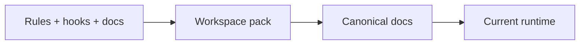

> Status: reference only. This archived instruction bundle is not an authoritative runtime document. Current source-of-truth terminology lives in `README.md`, `SYSTEM_ARCHITECTURE.md`, and `docs/INSTALL_WINDOWS.md`.

판정: **예. 아래는 현재 세트 파일 구조 기준으로 다시 맞춘 1회성 통합 지시문이다.**
근거: 이 프로젝트는 이미 `.cursor/rules`, `.cursor/skills`, `.cursor/agents`, `.cursor/hooks.json`, `AGENTS.md`, `CLAUDE.md`, `README.md`, `docs/*`, 루트 설치 스크립트까지 포함한 Cursor 풀세팅 팩으로 구성되어 있다. 따라서 이전 초안처럼 `guide.md`, `.cursor/cli.json`, `scripts/*` 중심으로 새로 짜기보다, **현재 패키지를 기준선으로 검증·보정**하는 방식이 맞다.
다음행동: 아래 문구를 그대로 Cursor Agent 또는 Codex에 붙여넣고, `C:\Users\jichu\Downloads\mcp_obsidian\` 루트에서 실제 수정까지 진행시켜라.

작업 루트는 `C:\Users\jichu\Downloads\mcp_obsidian\` 이다. 이 경로를 프로젝트 루트로 간주하고, **계획만 쓰지 말고 실제 파일 수정까지 수행**하라.

먼저 루트와 문서 경로의 아래 파일들을 읽고, 이 문서들을 **최상위 계약**으로 사용하라.

- `AGENTS.md`
- `CLAUDE.md`
- `README.md`
- `docs/history/CURSOR_LATEST_NOTES_2026-03-28.md`
- `docs/INSTALL_WINDOWS.md`

위 파일 중 하나라도 없으면 임의 추정하지 말고, 누락 파일명과 영향만 짧게 보고하고 중단하라.

## 목표

이 프로젝트를 **현재 세트 파일 구조 + 최신 Cursor/Codex 작업 방식**에 맞게 검증·보정하라.
핵심 목표는 아래 5개다.

1. 기존 Cursor Rules 체계를 현재 계약에 맞게 유지·보강
2. MCP 연결 샘플/실사용 구성을 현재 Cursor 형식에 맞게 점검
3. Cursor/Codex 공통으로 읽히는 작업 규칙 정리
4. Windows 로컬 설치/실행 흐름 문서와 스크립트 점검
5. 시크릿/민감경로 노출 방지 설정 점검

## 절대 변경 금지

다음 항목은 승인 없이 변경하지 마라.

- auth middleware 동작
- public endpoint shape (`/mcp`, `/healthz`)
- MCP tool names / JSON schema
- memory enum / status enum / sensitivity enum
- vault directory layout / file naming rules
- compatibility wrapper response shape
- 자동 write 범위 확대
- access control 약화
- markdown-first architecture 폐기
- durable storage를 markdown에서 다른 opaque store로 대체

## 반드시 유지할 계약

다음을 그대로 유지하라.

- Obsidian markdown = SSOT
- SQLite = retrieval/index acceleration only
- read-first, write-with-intent
- tool names stable:
  - `search_memory`
  - `save_memory`
  - `get_memory`
  - `list_recent_memories`
  - `update_memory`
  - `search`
  - `fetch`
- relative path는 `/` separator 사용
- memory ID 패턴 유지
- frontmatter key 임의 rename 금지
- 검증 전 완료 선언 금지
- 가장 작은 relevant check부터 실행

## 현재 세트 파일을 기준으로 작업할 것

이 프로젝트는 이미 아래 구조를 가진다. **같은 목적의 파일을 다른 이름으로 중복 생성하지 말고, 아래 파일을 우선 수정/검증**하라.

### Rules
- `.cursor/rules/000-core.mdc`
- `.cursor/rules/010-plan-mode.mdc`
- `.cursor/rules/020-mcp-contracts.mdc`
- `.cursor/rules/030-security-privacy.mdc`
- `.cursor/rules/040-python-quality.mdc`
- `.cursor/rules/050-cursor-ops-2026.mdc`

### Skills
- `.cursor/skills/repo-bootstrap/SKILL.md`
- `.cursor/skills/obsidian-memory-workflow/SKILL.md`
- `.cursor/skills/mcp-contract-review/SKILL.md`
- `.cursor/skills/release-check/SKILL.md`

### Subagents
- `.cursor/agents/planner.md`
- `.cursor/agents/security-auditor.md`
- `.cursor/agents/verifier.md`

### Hooks
- `.cursor/hooks.json`
- `.cursor/hooks/shell_guard.py`
- `.cursor/hooks/shell_log.py`

### MCP / Setup / Docs
- `.cursor/mcp.sample.json`
- `.env.example`
- `install_cursor_fullsetup.ps1`
- `install_cursor_fullsetup.bat`
- `README.md`
- `docs/INSTALL_WINDOWS.md`
- `docs/history/CURSOR_LATEST_NOTES_2026-03-28.md`

## 수행 작업

아래 작업만 수행하라.

### 1) 계약 문서 정합성 점검

`AGENTS.md`, `CLAUDE.md`, `README.md`와 Cursor rules/skills/subagents 내용이 서로 충돌하는지 확인하라.

중점 항목:
- plan mode before changing auth/tool contracts/vault path/persistence behavior
- smallest relevant checks first
- do not claim completion when verification is manual/unconfirmed
- summarize changed files / commands run / pass-fail-manual / assumptions-risks

충돌 시에는 **계약 보존 우선**으로 최소 수정하라.

### 2) Rules 최소 보정

기존 `.cursor/rules/*.mdc`를 유지한 채 필요한 문구만 최소 수정하라.

반드시 반영할 의미:
- markdown-first architecture
- SQLite is accelerator only
- data contracts
- tool contracts
- ask-before-changing list
- security boundaries
- output contract
- verification expectations
- Cursor 2026 운영 메모(과도한 hooks/automation 강제 금지, Windows 안정성 우선)

### 3) MCP 설정 점검

`.cursor/mcp.sample.json`을 현재 Cursor project MCP 형식 기준으로 검토하라.

요구사항:
- server name은 `obsidian-memory-local` 유지
- project-local MCP 기준 유지
- 실제 엔드포인트/실행방식이 현재 repo와 맞는지 확인
- 값 하드코딩 최소화
- 실사용용 `.cursor/mcp.json`이 꼭 필요하면 **샘플을 보존한 채** 추가 생성하라
- `MCP_API_TOKEN`은 환경변수 경유 방식 유지
- comments 넣지 마라

### 4) ignore / secret 노출 방지 점검

현재 `.gitignore`와 `.env.example`가 충분한지 확인하고, 필요 시 최소 보강하라.

최소 점검 항목:
- `.venv/`
- `venv/`
- `__pycache__/`
- `*.pyc`
- `data/*.sqlite3`
- `*.log`
- `.env`
- `.pytest_cache/`
- `.mypy_cache/`
- `.ruff_cache/`
- `dist/`
- `build/`
- `.git/`

추가로 `.cursorignore`가 없으면, **현재 프로젝트에 정말 필요한 경우에만** 추가하라. 추가 시에는 index/context 오염 방지 목적만 반영하고, 기능적으로 필요한 파일까지 막지 마라.

### 5) Windows 실행 흐름 점검

루트 설치 스크립트인 아래 파일을 기준으로 Windows 실행 흐름을 점검하라.

- `install_cursor_fullsetup.ps1`
- `install_cursor_fullsetup.bat`

확인 항목:
- 루트 기준 실행 여부
- `.venv` 생성/활성화 흐름
- `pip install -e .[dev]` 동작 전제
- `.env.example` → `.env` 복사 흐름
- git 초기화 흐름
- pre-commit 설치 흐름

필요 시 최소 수정하되, **루트 설치 스크립트라는 현재 구조는 유지**하라.

### 6) 문서 보강

`README.md`와 `docs/INSTALL_WINDOWS.md`를 우선 사용하라.

필요 시 아래 내용을 보강하라.
- 필요한 파일
- 토큰 설정 방법
- MCP 서버 실행 방법
- Cursor 재시작 필요 여부
- 기본 확인 명령
- known manual checks

이미 문서가 있으면 덮어쓰기보다 최소 수정하라.
새로운 `guide.md`는 만들지 마라.

### 7) Codex/Cursor 공통 운영성 점검

다음을 기준으로 전체 세트를 점검하라.
- Cursor는 `.cursor/rules` + `AGENTS.md`를 함께 읽는 구조를 가정
- CLI와 editor는 MCP 설정을 공유하는 방향을 우선
- rules는 상시 제약, skills는 절차형 워크플로, subagents는 분리 검증 역할을 유지
- 훅은 가벼운 guard/log 용도로만 유지

`.cursor/cli.json`은 **공식 근거를 확인하지 못한 상태에서는 생성하지 마라.**
필요하다고 판단되면 먼저 repo evidence 또는 공식 문서 근거를 찾고, 없으면 `manual`로 남겨라.

## 구현 원칙

- 불필요한 리팩터링 금지
- 확인되지 않은 install/test/lint/format/typecheck command를 임의 작성하지 마라
- repo evidence로 확인된 명령만 사용
- 확인 불가 항목은 `manual`로 명시
- JSON/YAML은 파싱 가능한 상태로 저장
- 파일 수정보다 계약 보존을 우선하라
- 이미 같은 목적 파일이 있으면 덮어쓰기 전에 diff를 보고 최소 수정하라
- 세트 구조를 바꾸지 말고, 현재 패키지를 정리하는 방식으로 진행하라

## 검증

최소한 아래는 실행하라.

1. 생성/수정한 JSON 파일 parse 확인
2. `.cursor/rules/*` 경로 및 파일 존재 확인
3. `.cursor/mcp.sample.json` 또는 추가한 `.cursor/mcp.json` syntax 확인
4. 루트 설치 스크립트 path 및 command syntax 확인
5. repo 내 실제 Python entrypoint 존재 여부 확인
6. `AGENTS.md`, `CLAUDE.md`, `README.md`, `docs/*`와 충돌 여부 확인

추가로,
- test/lint/format command가 repo에 명시돼 있으면 실행
- 없으면 invent하지 말고 `manual` 처리
- persistence/auth/tool contract 변경이 실제로 발생했다면 그 부분은 별도 강조 보고

## Git 규칙

- git repo이면 현재 브랜치에서 작업
- 새 branch 만들지 마라
- 기존 commit amend 금지
- commit이 요구되는 환경일 때만 1회 commit:
  `chore: align Cursor/Codex setup with existing mcp_obsidian pack`
- commit이 불가한 환경이면 이유를 보고하라

## 최종 응답 형식

반드시 아래 순서로만 답하라.

1. What changed
2. Files touched
3. Commands run
4. Verification status (`pass / fail / manual`)
5. Remaining risks / assumptions

## 중요한 운영 규칙

- 애매하면 임의로 확장하지 말고 기존 계약 유지
- 완료처럼 보이게 포장하지 말고 실제 상태만 써라
- 수동 확인이 남아 있으면 반드시 `manual`이라고 써라
- 질문하지 말고, 먼저 repo를 읽고 가능한 범위까지 끝까지 진행하라
