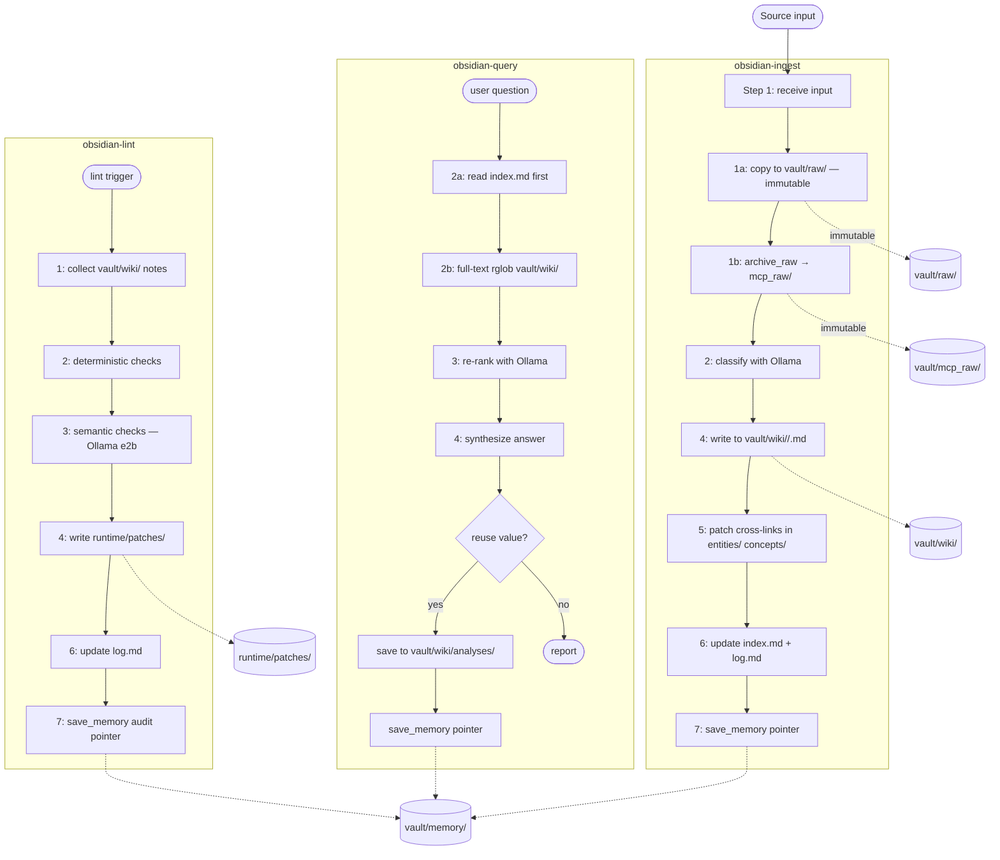

# Storage Routing Reference

Canonical routing rules for the `mcp_obsidian` KB layer (C안 — 2026-04-07).

> **Authoritative source:** `AGENTS.md` §KB Routing Policy and `.cursor/rules/kb-core.mdc`.
> This document is a developer quick-reference. When in conflict, AGENTS.md wins.

---

## Architecture Diagram



---

## Routing Quick Reference

| Artifact | Destination | Write method | Mutable |
|---|---|---|---|
| Raw source copy | `vault/raw/<type>/<slug>.md` | direct file write | **No** |
| Raw archive | `vault/mcp_raw/<src>/<date>/<id>.md` | `archive_raw` MCP | No |
| KB canonical note | `vault/wiki/<category>/<slug>.md` | direct file write | Yes |
| Memory pointer | `vault/memory/<YYYY>/<MM>/<MEM-ID>.md` | `save_memory` MCP | Yes |
| Lint patch plan | `runtime/patches/kb-lint-<date>.json` | direct file write | Yes |
| Audit log | `runtime/audits/<date>.json` | direct file write | Yes |

### vault/raw/ subtrees

| Input type | Path |
|---|---|
| Web article / pasted text | `vault/raw/articles/<slug>.md` |
| PDF or document | `vault/raw/pdf/<slug>.md` |
| Manual note | `vault/raw/notes/<slug>.md` |

### vault/wiki/ subtrees

| Category | Path | Use for |
|---|---|---|
| sources | `vault/wiki/sources/` | ingested source summaries |
| concepts | `vault/wiki/concepts/` | extracted concept definitions |
| entities | `vault/wiki/entities/` | people, orgs, products, systems |
| analyses | `vault/wiki/analyses/` | synthesized answers, comparisons |

---

## save_memory Pointer Template

When a KB workflow calls `save_memory`, the payload must follow this shape:

```python
memory_payload = {
    "title": "KB: <title>",
    "content": (
        "<3-8 line summary of the canonical note>\n\n"
        "See [[wiki/<category>/<slug>]] for full details."
    ),
    "roles": ["fact"],          # "summary" for lint/analysis, "fact" for ingest/query
    "topics": ["<tag1>", "<tag2>"],
    "entities": [],
    "projects": ["mcp_obsidian"],
    "tags": ["kb", "<category>"],
    "raw_refs": ["<mcp_id>"],   # link to archive_raw id; [] if none
}
```

### Required pointer fields

| Field | Required | Notes |
|---|---|---|
| `title` | Yes | Prefix `"KB: "` for wiki pointers |
| `content` | Yes | Summary + `[[wiki/...]]` link. No full note body. |
| `roles` | Yes | `["fact"]` or `["summary"]` or `["audit"]` |
| `topics` | Yes | Tags from the wiki note |
| `tags` | Yes | Must include `"kb"` |
| `raw_refs` | Recommended | Link back to `archive_raw` mcp_id |

### Forbidden in content

- Full canonical wiki note body
- Raw transcript body
- Long-form markdown already stored in `wiki/`

---

## Routing Decision Tree

```
Input arrives →
  ├─ Is it an unmodified original source?
  │     YES → vault/raw/<type>/ (immutable copy)
  │            + archive_raw → vault/mcp_raw/ (indexed archive)
  │
  ├─ Is it a normalized, link-rich knowledge note?
  │     YES → vault/wiki/<category>/<slug>.md (canonical KB)
  │            + save_memory pointer → vault/memory/
  │
  ├─ Is it a reusable synthesized answer?
  │     YES → vault/wiki/analyses/<slug>.md
  │            + save_memory pointer
  │
  ├─ Is it a lint/audit result?
  │     YES → runtime/patches/ (patch plan JSON)
  │            + save_memory audit pointer
  │
  └─ Is it just a retrieval hint or decision record?
        YES → save_memory only (no wiki write needed)
```

---

## Anti-patterns

| Anti-pattern | Why it's wrong | Correct action |
|---|---|---|
| Storing full wiki note in `save_memory.content` | Duplicates canonical KB; creates drift | Store only 3-8 line summary + `[[wiki/...]]` link |
| Writing raw transcript to `vault/wiki/` | Pollutes canonical KB with noise | Use `archive_raw` → `vault/mcp_raw/` |
| Skipping `save_memory` after wiki write | Makes note undiscoverable via `search_memory` | Always register pointer after wiki write |
| Skipping `log.md` update | Breaks audit trail | Append one row to `vault/wiki/log.md` |
| Editing files in `vault/raw/` | Breaks immutability contract | `vault/raw/` is write-once |

---

*Last updated: 2026-04-07 — C안 storage routing formalization*
