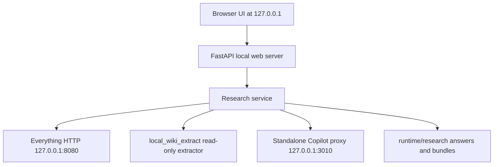
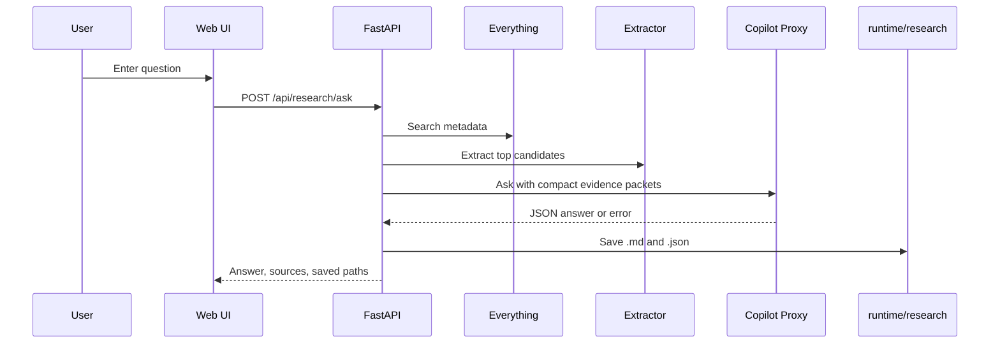
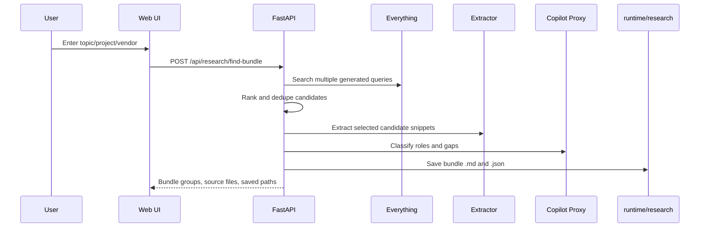

# Local Research Assistant Web UI Implementation Plan

> **Scope lock:** Approach C is selected. Build a local browser UI for `ask` and `find-bundle`. Do not upload to Obsidian/wiki. Do not modify original files.

## 1. Business Review

### 1.1 Problem Definition

Current state:

- The repo already has reusable local-file building blocks:
  - Everything HTTP metadata search in `scripts/local_wiki_everything.py`
  - read-only extraction in `scripts/local_wiki_extract.py`
  - standalone Copilot proxy client in `scripts/local_wiki_copilot.py`
  - candidate ordering and credential hard-stop behavior in `scripts/local_wiki_ingest.py`
- The current `local_research_assistant.md` concept still describes a CLI-first MVP.
- The user has selected **Approach C: local web UI**.

Target state:

- A local-only web app at `http://127.0.0.1:<port>` lets the user ask questions against PC documents.
- The first version supports only:
  - `ask`
  - `find-bundle`
- Results are saved only under `runtime/research/`.
- No Obsidian/wiki write occurs unless the user explicitly approves it in a later request.

### 1.2 Options

| Option | Description | Score | Risk | Cost |
|---|---|---:|---|---:|
| A | Keep CLI-only `ask + find-bundle` | 6/10 | Low, but poorer usability | Low |
| B | Generate static HTML reports from CLI | 7/10 | Medium link/path handling | Medium |
| C | Local FastAPI web UI for `ask + find-bundle` | 9/10 | Medium UI/API scope | Medium |

### 1.3 Recommendation

Choose **Option C**.

Reason:

- The product goal is an interactive local investigation assistant, not a one-shot converter.
- The user needs to inspect candidate files, source paths, snippets, and answer quality before trusting the output.
- Web UI can reuse the existing Python search/extract/Copilot code without changing MCP schemas or Obsidian storage.

Rollback strategy:

- Keep the web UI as a separate script/module.
- Do not alter existing `local_wiki_*` behavior.
- If UI work stalls, the service layer can still be used later by a CLI.

### 1.4 Approval Gate

This plan assumes approval for a local-only web app that:

- binds to loopback only;
- reads file bodies only after search candidates are selected by the app pipeline;
- stores reports under `runtime/research/`;
- calls Copilot only through the local standalone proxy;
- does not write to `vault/wiki`, `vault/memory`, or `vault/mcp_raw`.

Stop before implementation if the user asks to expose the server on LAN/public network, change auth, or write to Obsidian/wiki.

## 2. Missing Content Check

The previous concept covered the high-level idea but was missing these implementation details:

- **Server boundary:** no explicit local web server module was defined.
- **Service boundary:** no shared research service separated from UI routes.
- **API contract:** no request/response schemas for `ask`, `find-bundle`, `health`, or result fetch.
- **UI states:** no loading, partial failure, Copilot failure, no-result, and saved-result states.
- **Port policy:** no default port or port-conflict behavior.
- **Standalone readiness:** no health check gating for `http://127.0.0.1:3010/api/ai/health`.
- **Everything readiness:** no health check gating for `http://127.0.0.1:8080`.
- **Result persistence:** no exact output filenames for web-created answer and bundle artifacts.
- **No-wiki control:** prior documents still mentioned wiki-oriented code and excluded `local web UI`; this must be corrected.
- **Security controls:** no explicit credential hard-stop, loopback-only bind, path display policy, or file mutation ban for the UI.
- **Testing plan:** no unit/API/UI smoke test list.
- **Quality criteria:** no measurable acceptance criteria for answer usefulness and citation coverage.

This plan fills those gaps.

## 3. Engineering Review

### 3.1 Architecture



### 3.2 Runtime Flow: Ask



### 3.3 Runtime Flow: Find Bundle



## 4. File Plan

### 4.1 Create

| File | Type | Purpose |
|---|---|---|
| `scripts/local_research_service.py` | create | Core ask/find-bundle orchestration reusable by API tests |
| `scripts/local_research_web.py` | create | FastAPI app, local routes, static HTML serving |
| `tests/test_local_research_service.py` | create | Unit tests for query planning, ranking, persistence, fallback |
| `tests/test_local_research_web.py` | create | API tests with mocked service dependencies |

### 4.2 Modify

| File | Type | Purpose |
|---|---|---|
| `local_research_assistant.md` | modify | Change MVP from CLI-first to local web UI-first |
| `docs/superpowers/plans/2026-04-16-local-research-assistant-web-ui-implementation.md` | create | This implementation plan |

### 4.3 Reuse Without Modification

| File | Reuse |
|---|---|
| `scripts/local_wiki_everything.py` | loopback Everything HTTP search |
| `scripts/local_wiki_extract.py` | document extraction |
| `scripts/local_wiki_copilot.py` | standalone Copilot proxy client |
| `scripts/local_wiki_ingest.py` | candidate priority ideas and credential hard-stop function |

## 5. API Contract

### 5.1 `GET /`

Serves the local HTML UI.

### 5.2 `GET /api/research/health`

Returns:

```json
{
  "status": "ok",
  "everything": {"status": "ok", "base_url": "http://127.0.0.1:8080"},
  "copilot": {"status": "ok", "base_url": "http://127.0.0.1:3010"},
  "output_root": "runtime/research"
}
```

If Everything or Copilot is unavailable, return `status: "degraded"` with the failing dependency. The UI must show the failure before running a request.

### 5.3 `POST /api/research/ask`

Request:

```json
{
  "question": "TR5 Pre-Op Gantt 최신 파일과 리스크 알려줘",
  "scope": "all",
  "max_candidates": 10,
  "save": true
}
```

Response:

```json
{
  "mode": "ask",
  "question": "...",
  "short_answer": "...",
  "findings": [],
  "sources": [],
  "gaps": [],
  "next_actions": [],
  "saved_markdown": "runtime/research/answers/<timestamp>-answer.md",
  "saved_json": "runtime/research/answers/<timestamp>-answer.json",
  "warnings": []
}
```

### 5.4 `POST /api/research/find-bundle`

Request:

```json
{
  "topic": "Globalmaritime MWS 13차",
  "scope": "all",
  "max_candidates": 20,
  "save": true
}
```

Response:

```json
{
  "mode": "find-bundle",
  "topic": "...",
  "bundle_title": "...",
  "core_files": [],
  "supporting_files": [],
  "duplicates_or_versions": [],
  "missing_or_gap_hints": [],
  "next_actions": [],
  "saved_markdown": "runtime/research/bundles/<timestamp>-bundle.md",
  "saved_json": "runtime/research/bundles/<timestamp>-bundle.json",
  "warnings": []
}
```

## 6. UI Plan

### 6.1 First Screen

The app opens directly into the working interface, not a landing page.

Elements:

- large question/topic input;
- mode toggle: `Ask` / `Find Bundle`;
- scope selector:
  - `All indexed files`
  - `Documents`
  - `Downloads`
  - `HVDC_WORK`
  - custom path text field for later implementation, disabled in MVP if not ready;
- max candidate selector;
- run button;
- dependency status strip for Everything and Copilot.

### 6.2 Result Layout

Show:

- final answer or bundle summary;
- source file table with:
  - filename;
  - full path;
  - extension;
  - size;
  - modified time;
  - reason for inclusion;
- evidence snippets;
- gaps and next actions;
- saved Markdown/JSON paths.

### 6.3 Error States

Required states:

- Everything unavailable;
- Copilot unavailable;
- Copilot returned 422 or non-JSON;
- no matching files;
- extraction failed for a file;
- credential pattern detected and skipped;
- result saved failed.

The UI should keep partial search/extraction results when Copilot fails.

## 7. Service Design

### 7.1 Core Data Types

Use simple dataclasses or Pydantic models:

- `ResearchRequest`
- `ResearchSource`
- `ResearchAnswer`
- `BundleResult`
- `DependencyHealth`

Keep these in `scripts/local_research_service.py` unless the code becomes too large.

### 7.2 Search Query Generation

For MVP:

- split Korean/English question into tokens;
- preserve quoted phrases when present;
- add extension-targeted searches for supported document types;
- prefer current known work roots through ranking, not by hard-coded required paths.

Supported extensions:

```text
.pdf, .docx, .xlsx, .xlsm, .md, .txt, .csv, .json, .log
```

Legacy `.doc` and `.xls` remain limited/skipped unless the existing extractor adds safe support later.

### 7.3 Ranking Rules

Rank by:

- filename token match;
- path token match;
- supported extension priority;
- modified time recency;
- size sanity;
- path quality.

Penalize:

- `.codex`;
- `.cursor`;
- `$Recycle.Bin`;
- `node_modules`;
- `.venv`;
- cache/build folders;
- filename markers such as password, token, secret, private-key.

### 7.4 Extraction Rules

- Extract only top-ranked candidates.
- Cap text per source before sending to Copilot.
- Keep source path and extraction status for every candidate.
- Never modify original files.

### 7.5 Copilot Prompt Rules

Use a research prompt, not the wiki normalization prompt:

```text
You are a local document research assistant.
Answer only from provided file packets.
Separate confirmed findings from assumptions.
Always cite source_path for each finding.
Return JSON only.
```

For `find-bundle`, ask for:

- core files;
- supporting files;
- duplicate/version candidates;
- missing/gap hints;
- next actions.

### 7.6 Fallback Behavior

If Copilot fails:

- return ranked sources and extraction summaries;
- save a partial result with `warnings`;
- do not mark the answer as fully AI-normalized;
- do not retry indefinitely.

## 8. Persistence

Output root:

```text
runtime/research/
```

Create:

```text
runtime/research/answers/
runtime/research/bundles/
```

Do not create or update:

```text
vault/wiki/
vault/memory/
vault/mcp_raw/
```

Answer files:

```text
runtime/research/answers/<timestamp>-answer.md
runtime/research/answers/<timestamp>-answer.json
```

Bundle files:

```text
runtime/research/bundles/<timestamp>-bundle.md
runtime/research/bundles/<timestamp>-bundle.json
```

Markdown report structure:

```markdown
# Local Research Result

## Request

## Short Answer

## Findings

## Sources

## Evidence Snippets

## Gaps

## Next Actions

## Warnings
```

## 9. Security And Locality

Hard rules:

- Bind web server to `127.0.0.1` by default.
- Reject non-loopback Everything URL.
- Reject non-loopback Copilot proxy URL unless a future explicit approval changes this.
- Never print or save Copilot tokens.
- Keep credential-like file content as a hard skip.
- Do not add file download endpoints in the MVP.
- Do not add delete, rename, move, edit, or upload actions.
- Do not expose a public API.

Allowed:

- Display local source paths in the browser.
- Save local Markdown/JSON reports under `runtime/research`.
- Send approved extracted snippets to standalone Copilot proxy with `sensitivity: "internal"`.

## 10. Implementation Tasks

### Task 1: Service Skeleton

Files:

- create `scripts/local_research_service.py`
- create `tests/test_local_research_service.py`

Acceptance criteria:

- `ask_research()` and `find_bundle()` exist.
- Both accept injected search/extract/copilot functions for tests.
- No web server required for unit tests.

Validation:

```powershell
.\.venv\Scripts\python.exe -m pytest tests\test_local_research_service.py -q
```

### Task 2: Query Planning And Ranking

Acceptance criteria:

- Korean/English mixed questions produce multiple useful query tokens.
- Duplicate Everything results are deduped by normalized full path.
- Low-value paths are penalized.
- Supported extension priority is deterministic.

Validation:

```powershell
.\.venv\Scripts\python.exe -m pytest tests\test_local_research_service.py -q
```

### Task 3: Ask Mode

Acceptance criteria:

- Returns `short_answer`, `findings`, `sources`, `gaps`, `next_actions`, and `warnings`.
- Every finding either cites a source path or is marked as an assumption/gap.
- Copilot failure returns partial source-based output.
- Saves `.md` and `.json` when `save=True`.

Validation:

```powershell
.\.venv\Scripts\python.exe -m pytest tests\test_local_research_service.py -q
```

### Task 4: Find-Bundle Mode

Acceptance criteria:

- Groups results into core files, supporting files, duplicate/version candidates, and gap hints.
- Uses source paths and modified times in output.
- Saves `.md` and `.json` when `save=True`.

Validation:

```powershell
.\.venv\Scripts\python.exe -m pytest tests\test_local_research_service.py -q
```

### Task 5: FastAPI Web App

Files:

- create `scripts/local_research_web.py`
- create `tests/test_local_research_web.py`

Routes:

- `GET /`
- `GET /api/research/health`
- `POST /api/research/ask`
- `POST /api/research/find-bundle`

Acceptance criteria:

- App imports without starting a server.
- API tests use `fastapi.testclient.TestClient`.
- Routes return JSON and proper error statuses.
- Static HTML is served without a separate frontend build step.

Validation:

```powershell
.\.venv\Scripts\python.exe -m pytest tests\test_local_research_web.py -q
```

### Task 6: Browser UI

Acceptance criteria:

- First screen is the working interface.
- User can choose `Ask` or `Find Bundle`.
- Shows dependency health.
- Shows loading state.
- Shows result sections and saved paths.
- Shows partial failure warnings.

Validation:

```powershell
.\.venv\Scripts\python.exe -m pytest tests\test_local_research_web.py tests\test_local_research_service.py -q
```

Manual smoke:

```powershell
.\.venv\Scripts\python.exe scripts\local_research_web.py --host 127.0.0.1 --port 8090
```

Open:

```text
http://127.0.0.1:8090
```

### Task 7: Live Local Smoke

Prerequisites:

- Everything HTTP running on `127.0.0.1:8080`
- Standalone Copilot proxy running on `127.0.0.1:3010`
- File download disabled in Everything HTTP settings

Smoke questions:

```text
TR5 Pre-Op Gantt 최신 파일과 리스크 알려줘
Globalmaritime MWS 13차 관련 파일 묶어줘
SIMENSE warehouse 관련 파일 찾아줘
GPTS PackingList FullSet 문서들이 무엇인지 설명해줘
오늘 수정된 HVDC 관련 파일 요약해줘
```

Pass criteria:

- 5 requests complete without crashing.
- At least 3 produce useful source-backed results.
- Every result lists source paths.
- New files appear only under `runtime/research/answers` or `runtime/research/bundles`.
- No new files are written under `vault/wiki`.

## 11. Test Strategy

Focused tests:

```powershell
.\.venv\Scripts\python.exe -m pytest tests\test_local_research_service.py tests\test_local_research_web.py -q
```

Regression tests for reused local-wiki modules:

```powershell
.\.venv\Scripts\python.exe -m pytest tests\test_local_wiki_everything.py tests\test_local_wiki_extract.py tests\test_local_wiki_copilot.py tests\test_local_wiki_ingest.py -q
```

Focused lint:

```powershell
.\.venv\Scripts\python.exe -m ruff check scripts\local_research_service.py scripts\local_research_web.py tests\test_local_research_service.py tests\test_local_research_web.py
```

Focused format check:

```powershell
.\.venv\Scripts\python.exe -m ruff format --check scripts\local_research_service.py scripts\local_research_web.py tests\test_local_research_service.py tests\test_local_research_web.py
```

Known repo-wide caveat:

- Repo-wide ruff and format checks have unrelated existing failures recorded in the local-wiki plan.
- Do not claim repo-wide clean unless those unrelated failures are fixed separately.

## 12. Dispatch And Ownership

Execution mode: **direct lead execution for the plan**, then **split implementation only if explicitly requested**.

Estimated changed files for implementation:

- 2 new script files
- 2 new test files
- 1 documentation update

Coupling risk:

- Medium. The service reuses local-wiki modules but should not modify them initially.

Suggested ownership if parallel work is later requested:

- Worker A: `scripts/local_research_service.py` and service tests.
- Worker B: `scripts/local_research_web.py` and API/UI tests.
- Lead: integration, docs, smoke checks, and no-wiki verification.

## 13. Stop Conditions

Stop and ask before:

- writing to `vault/wiki`, `vault/memory`, or `vault/mcp_raw`;
- exposing the server beyond `127.0.0.1`;
- adding file download endpoints;
- adding delete/rename/move/edit actions;
- changing MCP tool schemas or auth behavior;
- changing Everything settings from code;
- storing or printing tokens.

Stop implementation if:

- Everything HTTP cannot be reached and no mock-only path is requested;
- standalone Copilot health fails during live smoke;
- credential-like content appears in extracted text;
- tests require broad unrelated ruff cleanup.

## 14. Definition Of Done

The web UI MVP is done when:

- `GET /` serves the interface.
- `GET /api/research/health` reports Everything and Copilot status.
- `POST /api/research/ask` returns a source-backed answer or partial source-backed fallback.
- `POST /api/research/find-bundle` returns grouped source-backed file bundles.
- Results save under `runtime/research/answers` and `runtime/research/bundles`.
- No Obsidian/wiki writes occur.
- Focused service/API tests pass.
- Focused ruff and format checks pass.
- A manual browser smoke test completes with at least one `ask` and one `find-bundle` request.

## 15. Next Recommended Step

After this plan is approved, implement with TDD:

1. Write `tests/test_local_research_service.py`.
2. Implement `scripts/local_research_service.py`.
3. Write `tests/test_local_research_web.py`.
4. Implement `scripts/local_research_web.py`.
5. Run focused tests and lint.
6. Start local server and perform a small live smoke.

## 16. Current Implementation Evidence

Implemented files:

- `scripts/local_research_service.py`
- `scripts/local_research_web.py`
- `tests/test_local_research_service.py`
- `tests/test_local_research_web.py`

TDD evidence:

- RED: `.\.venv\Scripts\python.exe -m pytest tests\test_local_research_service.py tests\test_local_research_web.py -q` failed with `ModuleNotFoundError: No module named 'scripts.local_research_service'`.
- GREEN: the same focused service/web tests passed after implementation.
- Regression RED/GREEN: a live `find-bundle` smoke exposed deleted/vanished candidate file handling; `test_find_bundle_keeps_running_when_candidate_disappears` failed first, then passed after extraction exception handling was added.

Verification evidence:

- `.\.venv\Scripts\python.exe -m pytest tests\test_local_wiki_everything.py tests\test_local_wiki_extract.py tests\test_local_wiki_copilot.py tests\test_local_wiki_ingest.py tests\test_local_research_service.py tests\test_local_research_web.py -q` -> PASS, `43 passed`.
- `.\.venv\Scripts\python.exe -m ruff check scripts\local_research_service.py scripts\local_research_web.py tests\test_local_research_service.py tests\test_local_research_web.py` -> PASS.
- `.\.venv\Scripts\python.exe -m ruff format --check scripts\local_research_service.py scripts\local_research_web.py tests\test_local_research_service.py tests\test_local_research_web.py` -> PASS.
- `.\.venv\Scripts\python.exe scripts\local_research_web.py --help` -> PASS.
- `GET http://127.0.0.1:8090/` -> HTTP 200.
- `GET http://127.0.0.1:8090/api/research/health` -> HTTP 200. Current status may be `degraded` when the standalone Copilot proxy is not running.
- `POST /api/research/ask` with `save=false` -> HTTP 200 fallback-safe response.
- `POST /api/research/find-bundle` with `save=false` -> HTTP 200 fallback-safe response.

Current running server:

- URL: `http://127.0.0.1:8090`
- Bind: `127.0.0.1`
- Current observed process owner on port 8090: PID `23448`

Known runtime caveat:

- At the final smoke point, Everything HTTP was reachable but standalone Copilot proxy on `127.0.0.1:3010` was not reachable, so health returned `degraded`. This is expected fallback behavior, not an Obsidian/wiki write.
