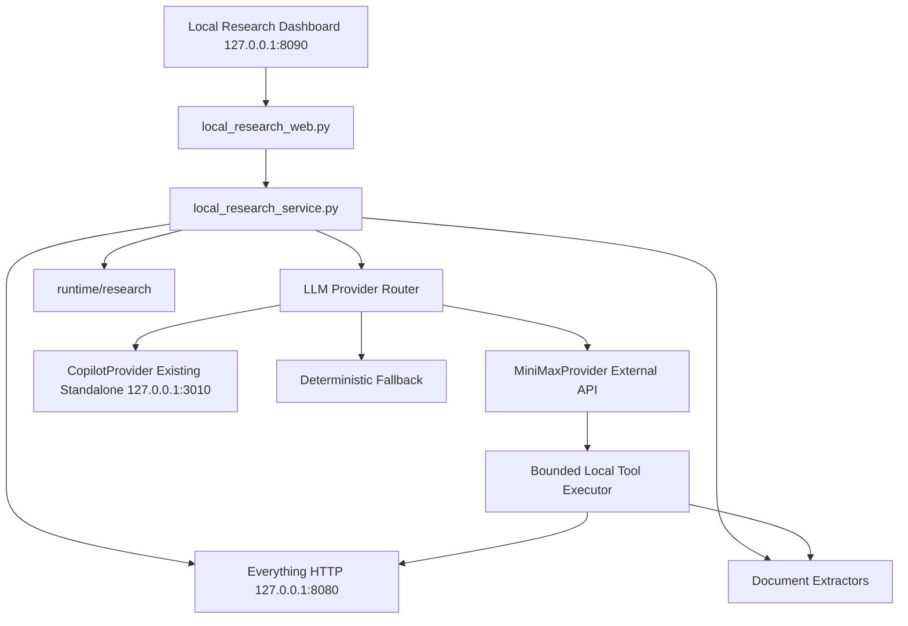
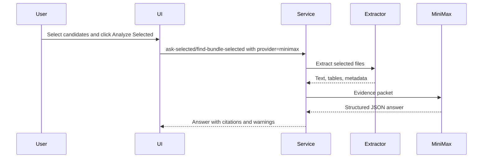
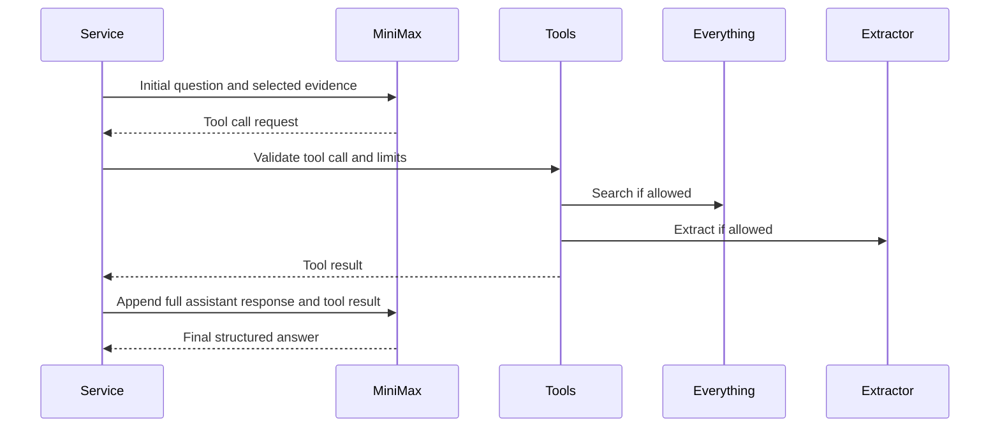

# Local Research Assistant MiniMax M2.7 Provider Plan

## Overview

This plan adds MiniMax M2.7 as a full-power external AI provider for the Local Research Assistant while leaving the existing GitHub Copilot standalone package unchanged.

Current state:

- Local Research Assistant runs at `http://127.0.0.1:8090`.
- Everything HTTP search runs at `http://127.0.0.1:8080`.
- GitHub Copilot standalone proxy runs at `http://127.0.0.1:3010`.
- The dashboard can preview candidates, select files, and analyze selected files.

Target state:

- MiniMax M2.7 becomes the primary high-capability analysis provider.
- Copilot standalone remains available as an unchanged fallback provider.
- The dashboard supports provider selection, long-context analysis, tool-use loops, streaming progress, and document-specialist modes.
- No Obsidian/wiki upload is introduced by this work.

Official MiniMax references used for this plan:

- MiniMax text generation guide: `https://platform.minimax.io/docs/guides/text-generation`
- MiniMax tool use and interleaved thinking guide: `https://platform.minimax.io/docs/guides/text-m2-function-call`
- MiniMax M2.7 coding tools guide: `https://platform.minimax.io/docs/guides/text-ai-coding-tools`

## Goals

- Add `MiniMax-M2.7` and `MiniMax-M2.7-highspeed` as selectable analysis providers.
- Preserve the existing Copilot standalone GitHub version exactly as-is.
- Use MiniMax's long context for selected document analysis.
- Add tool-use support so the model can request controlled local actions through server-side tools.
- Add specialist workflows for invoices, execution packages, document comparison, and evidence-backed Q&A.
- Keep all persistent output under `runtime/research` unless the user explicitly approves a different storage route.
- Keep API keys out of source code, docs, logs, and saved analysis files.

## Scope

### In Scope

- Add a provider abstraction around the current analysis call.
- Add `MiniMaxProvider`.
- Keep `CopilotProvider` as fallback using the existing standalone proxy endpoint.
- Add provider health checks to the research dashboard.
- Add UI provider selection:
  - `Auto`
  - `MiniMax M2.7`
  - `MiniMax M2.7 Highspeed`
  - `Copilot Standalone`
  - `Fallback Only`
- Add MiniMax request configuration through environment variables.
- Add selected-document analysis using MiniMax.
- Add tool-use loop support with a bounded set of local tools.
- Add streaming or progress events for long analysis jobs.
- Add specialist modes:
  - `Ask`
  - `Find Bundle`
  - `Extract Fields`
  - `Compare Documents`
  - `Invoice Audit`
  - `Execution Package Audit`
- Add tests with mocked MiniMax responses.
- Add one manual smoke path for real MiniMax API verification when `MINIMAX_API_KEY` is set.

### Out of Scope

- Modifying the existing `standalone-package-20260311T084247Z-1-001` GitHub Copilot code.
- Replacing Copilot standalone.
- Writing MiniMax results into `vault/wiki`, `vault/memory`, or `vault/mcp_raw`.
- Storing real MiniMax API keys in repository files.
- Public network exposure of the dashboard or provider proxy.
- Building a new vector database.
- Building a permanent background indexing daemon.
- Auto-sending all PC files to an external API.

## Constraints

- `MINIMAX_API_KEY` must be read only from environment variables or a local ignored environment file.
- MiniMax is an external AI API; selected file content may leave the local machine when the provider is used.
- The default server bind remains loopback-only.
- Only user-selected files, or files explicitly requested through approved tool calls, may be sent to MiniMax.
- Tool calls must have hard limits:
  - maximum rounds;
  - maximum files per round;
  - maximum extracted characters per file;
  - maximum total packet size;
  - allowed path roots or explicit candidate-derived paths.
- Existing direct `ask`, `find-bundle`, `ask-selected`, and `find-bundle-selected` routes must stay backward compatible.
- Existing Copilot standalone health and chat behavior must continue to work.

## Provider Configuration

Recommended environment variables:

```powershell
LOCAL_RESEARCH_LLM_PROVIDER=minimax
LOCAL_RESEARCH_ALLOW_EXTERNAL_AI=1
MINIMAX_API_KEY=<set outside repo>
MINIMAX_BASE_URL=https://api.minimax.io/anthropic
MINIMAX_MODEL=MiniMax-M2.7
MINIMAX_FAST_MODEL=MiniMax-M2.7-highspeed
MINIMAX_MAX_TOKENS=8192
MINIMAX_TIMEOUT=300
MINIMAX_ENABLE_TOOL_USE=1
MINIMAX_ENABLE_STREAMING=1
```

Assumption: The international API host is `https://api.minimax.io`; if the account is China-region, configuration can switch to `https://api.minimaxi.com`.

Provider selection behavior:

| Provider Option | Behavior |
|---|---|
| `Auto` | Try MiniMax M2.7, fall back to Copilot, then deterministic fallback |
| `MiniMax M2.7` | Use MiniMax M2.7 only; if unavailable, return clear provider error unless fallback is explicitly allowed |
| `MiniMax M2.7 Highspeed` | Use highspeed model for faster draft or broad scans |
| `Copilot Standalone` | Use the existing `127.0.0.1:3010` provider only |
| `Fallback Only` | Do no external AI call; return deterministic evidence list |

## Architecture



Provider interface:

```text
LLMProvider
  health() -> dict
  analyze(packet, options) -> dict
  analyze_with_tools(packet, tools, options) -> dict
```

Suggested files:

| File | Change Type | Description |
|---|---|---|
| `scripts/local_research_providers.py` | create | Provider interface, MiniMaxProvider, CopilotProvider, fallback routing |
| `scripts/local_research_tools.py` | create | Bounded tool definitions and tool executor |
| `scripts/local_research_service.py` | modify | Replace direct Copilot call with provider router |
| `scripts/local_research_web.py` | modify | Provider selection, health display, specialist modes, streaming/progress hooks |
| `tests/test_local_research_providers.py` | create | MiniMax mock, provider routing, fallback, error handling |
| `tests/test_local_research_tools.py` | create | Tool limit, path guard, extraction guard tests |
| `tests/test_local_research_service.py` | modify | Selected analysis provider tests |
| `tests/test_local_research_web.py` | modify | Provider selection and UI contract tests |
| `docs/superpowers/plans/2026-04-17-local-research-assistant-minimax-m27-provider-plan.md` | modify | Record implementation evidence after verification |

## Data Flow

### Standard Selected Analysis



### Tool-Use Analysis



Important implementation rule:

- Preserve the full MiniMax assistant response required for tool-use continuity in provider memory for the current request.
- Do not expose raw thinking content in the user-facing dashboard unless a later explicit debug mode is approved.

## Tool Use Design

Initial allowed tools:

| Tool | Purpose | Limit |
|---|---|---|
| `everything_search` | Search PC file metadata through Everything | max 5 calls per request, max 20 results per call |
| `extract_file` | Extract text from an approved candidate path | max 10 files per request |
| `extract_table_preview` | Extract workbook sheet names and table preview | max 5 sheets per workbook |
| `compare_selected_files` | Compare already selected or tool-approved files | max 4 files |
| `build_citation` | Normalize source path and excerpt into citation payload | no file reads |

Path guard:

- Tool extraction can read:
  - files already shown in candidate preview;
  - files returned by Everything during the same request;
  - explicitly selected files.
- Tool extraction cannot read:
  - `.git`;
  - `.venv`;
  - `node_modules`;
  - credential-looking paths;
  - unrelated arbitrary paths not produced by the search/candidate flow.

## Specialist Modes

### Extract Fields

Purpose:

- Pull structured fields from selected files.

Output shape:

```json
{
  "document_type": "tax_invoice",
  "fields": [
    {
      "name": "invoice_number",
      "value": "AE70066475",
      "source_path": "...",
      "evidence": "..."
    }
  ],
  "missing_fields": [],
  "warnings": []
}
```

### Invoice Audit

Purpose:

- For files such as `TAX_INVOICE_AE70066475.md`, extract and verify invoice number, supplier, buyer, issue date, taxable amount, VAT, total, currency, and source evidence.

Checks:

- arithmetic consistency;
- duplicate invoice candidates;
- missing amount/date/vendor fields;
- mismatch between invoice and supporting execution documents.

### Execution Package Audit

Purpose:

- Find and classify document sets for execution approval packages.

Checks:

- approval document;
- invoice;
- tax invoice;
- supporting Excel;
- PDF export;
- latest version versus duplicate/old version.

### Compare Documents

Purpose:

- Compare two or more selected files and identify differences.

Checks:

- version changes;
- amount/date/vendor differences;
- missing attachments;
- conflicting statements.

## Phases

### Phase 1: Provider Router Foundation

Goal:

- Introduce provider interfaces without changing visible behavior.

Tasks:

- Create provider abstraction.
- Move current Copilot request logic into `CopilotProvider`.
- Add deterministic `FallbackProvider`.
- Keep existing endpoint responses stable.
- Add mocked provider tests.

Acceptance criteria:

- Existing dashboard still reports Copilot status.
- Existing selected analysis works with Copilot unchanged.
- Focused local research tests pass.

### Phase 2: MiniMax Basic Provider

Goal:

- Add MiniMax M2.7 as a selectable provider for selected analysis.

Tasks:

- Add `MiniMaxProvider`.
- Read `MINIMAX_API_KEY` from environment only.
- Add MiniMax health check.
- Add provider field to API payloads.
- Add provider selector to UI.
- Parse MiniMax structured JSON response.
- Add timeout, retry, and fallback behavior.

Acceptance criteria:

- Mocked MiniMax tests pass without real API key.
- With `MINIMAX_API_KEY` set, manual smoke returns a MiniMax answer.
- Copilot standalone still works unchanged.

### Phase 3: Long-Context Packet Builder

Goal:

- Use the MiniMax context window effectively without sending wasteful payloads.

Tasks:

- Add packet size budget configuration.
- Add file chunking for long documents.
- Add table-aware Excel summaries.
- Add source citation map.
- Add packet shrink retry if MiniMax rejects or times out.

Acceptance criteria:

- Large selected file sets produce bounded packets.
- Every claim in the final answer can include `source_path`.
- Packet builder tests cover oversize and shrink behavior.

### Phase 4: Tool-Use Loop

Goal:

- Let MiniMax request additional search and extraction through controlled local tools.

Tasks:

- Define tool schemas.
- Implement bounded tool executor.
- Preserve MiniMax response history for tool-use continuity.
- Add max-round and max-cost controls.
- Add UI progress display for tool steps.

Acceptance criteria:

- Tool-use mock test shows `search -> extract -> final answer`.
- Unauthorized path extraction is rejected.
- Tool loop stops cleanly after max rounds.

### Phase 5: Specialist Workflows

Goal:

- Add practical business workflows on top of the provider router.

Tasks:

- Add `Extract Fields`.
- Add `Invoice Audit`.
- Add `Execution Package Audit`.
- Add `Compare Documents`.
- Add JSON schemas for each mode.
- Add UI result sections for structured outputs.

Acceptance criteria:

- `TAX_INVOICE_AE70066475.md` style files can be analyzed into invoice fields.
- Comparison mode returns source-backed difference lists.
- Execution package mode returns core/supporting/missing file groups.

### Phase 6: Verification And Documentation

Goal:

- Lock behavior with tests and document operational setup.

Tasks:

- Run focused pytest.
- Run focused ruff check and format check.
- Run MiniMax mock tests.
- Run manual MiniMax smoke only when API key is available.
- Confirm no writes under `vault/wiki`, `vault/memory`, or `vault/mcp_raw`.
- Record evidence in this plan.

Acceptance criteria:

- Tests pass.
- Focused lint and format pass.
- Manual smoke results are documented without exposing secrets.

## Tasks

### Task 1: Add Provider Interface

- Create `scripts/local_research_providers.py`.
- Define provider protocol.
- Add provider result shape.
- Add provider error shape.

### Task 2: Preserve Copilot Provider

- Move existing Copilot request logic into `CopilotProvider`.
- Keep endpoint, model, headers, and response parsing compatible with current behavior.
- Do not edit the standalone package.

### Task 3: Add MiniMax Provider

- Add API client using MiniMax Anthropic-compatible API first.
- Support OpenAI-compatible fallback only if Anthropic-compatible integration is blocked.
- Parse text blocks and structured JSON.
- Keep raw thinking out of UI.

### Task 4: Add Provider Routing

- Add `LOCAL_RESEARCH_LLM_PROVIDER`.
- Add per-request `provider`.
- Add `Auto` routing:
  - MiniMax;
  - Copilot;
  - deterministic fallback.

### Task 5: Add Tool Executor

- Create `scripts/local_research_tools.py`.
- Add tool schemas and limits.
- Add candidate-derived path allowlist.
- Add max rounds and max extracted characters.

### Task 6: Add Dashboard Controls

- Add provider selector.
- Add specialist mode selector.
- Add progress/status panel.
- Show active provider in result metadata.

### Task 7: Add Specialist Output Schemas

- Add schema prompts for:
  - invoice fields;
  - document comparison;
  - execution package audit;
  - generic Q&A;
  - find bundle.

### Task 8: Add Tests

- Unit tests for MiniMax request construction.
- Unit tests for MiniMax response parsing.
- Unit tests for provider fallback.
- Tool executor path guard tests.
- Web API provider selection tests.
- UI contract tests for provider selector and specialist modes.

### Task 9: Manual Smoke

- Start Everything.
- Start Copilot standalone.
- Set `MINIMAX_API_KEY` outside the repo.
- Start dashboard.
- Verify:
  - health shows Everything, MiniMax, and Copilot;
  - selected MiniMax ask returns answer;
  - selected MiniMax find-bundle returns grouped files;
  - Copilot fallback still works;
  - no vault writes occur.

## Risks

- MiniMax API key may be missing, expired, or region-specific.
- MiniMax API cost may grow if large files are sent without packet limits.
- Tool-use loops can become slow if max rounds are too high.
- External API calls may expose selected document content outside the machine.
- MiniMax JSON output can be malformed and require repair or fallback.
- Long-context packets may include irrelevant files if candidate selection is poor.
- Existing Copilot behavior may regress if provider routing is not isolated.

## Mitigations

- Keep MiniMax provider optional and environment-gated.
- Use mock tests so CI and local test runs do not require real API keys.
- Add packet size budgets and shrink retry.
- Send only selected files or tool-approved paths.
- Keep provider output JSON schema strict.
- Preserve Copilot standalone as fallback.
- Keep deterministic fallback as final safety path.
- Document external-AI status in dashboard.

## Review Criteria

- Existing Copilot standalone directory is unchanged.
- MiniMax provider can be disabled without breaking the dashboard.
- API keys are never printed or committed.
- `provider=minimax` uses MiniMax.
- `provider=copilot` uses existing standalone proxy.
- `provider=auto` falls back cleanly.
- Specialist modes return structured, source-backed outputs.
- Tool-use loop respects path and round limits.
- `vault/wiki`, `vault/memory`, and `vault/mcp_raw` remain untouched unless separately approved.

## Deliverables

- Provider architecture implemented in repo scripts.
- MiniMax M2.7 health and analysis path.
- Dashboard provider selector.
- Tool-use loop for controlled local search/extract actions.
- Specialist modes for invoice, execution package, compare, and field extraction.
- Mocked test suite.
- Manual smoke evidence section appended to this plan after implementation.

## Approval Gate

- [ ] Approved to implement Option C in phases.
- [ ] Approved to use MiniMax as an external AI provider for selected document content.
- [ ] Confirmed that Copilot standalone must remain unchanged.
