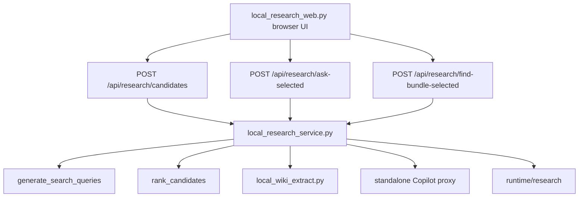

# Local Research Assistant Phase 2 Search Quality + Candidate Review UI Plan

## Overview

Purpose: improve Local Research Assistant Web UI by making Everything search results more accurate and letting the user review candidate files before running Copilot or fallback analysis.

Phase 1 already provides:

- local web UI at `http://127.0.0.1:8090`
- `ask`
- `find-bundle`
- Everything HTTP search
- extraction
- Copilot proxy attempt
- fallback when Copilot is unavailable
- output under `runtime/research`
- no Obsidian/wiki writes

Phase 2 keeps those boundaries and adds a review step between search and analysis.

## Goals

- Improve candidate quality before Copilot sees any evidence packet.
- Reduce noisy candidates such as deleted temp files, `.cursor`, `.codex`, cache, build, and pytest paths.
- Add a UI panel where the user can include or exclude candidate files.
- Keep existing `ask` and `find-bundle` endpoints working.
- Add selected-candidate analysis paths without writing to `vault/wiki`.
- Preserve fallback behavior when Copilot proxy is unavailable.

## Scope

### In Scope

- Improve `generate_search_queries` for mixed Korean/English questions.
- Improve `rank_candidates` with clearer scoring for filename, path, extension, recency, file existence, and low-value paths.
- Add candidate search result objects with stable candidate IDs.
- Add an API to return candidates before analysis.
- Add APIs to analyze selected candidate IDs for `ask` and `find-bundle`.
- Add a candidate review panel to the local web UI.
- Show candidate file path, extension, modified time, ranking score, extraction status, and inclusion checkbox.
- Allow `save=false` and `save=true` flows to continue working.
- Add tests for ranking, candidate ID stability, selected-candidate analysis, and web API validation.
- Update the plan/design docs with Phase 2 status after implementation.

### Out of Scope

- No Obsidian/wiki upload.
- No `vault/wiki`, `vault/memory`, or `vault/mcp_raw` writes.
- No file delete, move, rename, edit, or download endpoint.
- No public/LAN server exposure.
- No change to MCP tool schemas or auth behavior.
- No standalone-package internal changes.
- No new local LLM or Ollama dependency.
- No full text indexing database.
- No HTML report generator beyond the existing web page.
- No new feature modes such as `versions`, `inspect-excel`, `brief-folder`, `compare-documents`, or `audit-evidence` in this phase.

## Constraints

- The web server must bind to loopback only.
- Everything HTTP must stay loopback-only.
- Copilot calls must go through the local standalone proxy only.
- If Copilot proxy is unavailable, the UI must still return search/extraction fallback results.
- Credential-like text remains a hard skip.
- Original files must not be modified.
- The default persistent output remains under `runtime/research`.
- Existing Phase 1 behavior must remain backward-compatible.
- Assumption: the current service files remain `scripts/local_research_service.py` and `scripts/local_research_web.py`.
- Assumption: the current tests remain under `tests/test_local_research_service.py` and `tests/test_local_research_web.py`.

## Phases

### Phase 2.1 Search Planner And Ranking

Improve the candidate search layer before changing the UI.

Expected result:

- better query expansion;
- better candidate scoring;
- clear reasons for why a file is ranked highly or penalized.

### Phase 2.2 Candidate Preview API

Add a route that returns candidates without running Copilot analysis.

Expected result:

- the browser can show a reviewable candidate list;
- no file report is saved during preview unless explicitly requested later.

### Phase 2.3 Selected Candidate Analysis

Add selected-candidate analysis paths.

Expected result:

- the user can choose files first;
- only selected candidates are extracted and sent to Copilot or fallback analysis.

### Phase 2.4 Candidate Review UI

Update the web page so the user can run search, review candidates, and then run analysis.

Expected result:

- the workflow becomes `search candidates -> choose files -> analyze selected`.

### Phase 2.5 Verification And Documentation

Run focused tests and smoke checks, then update docs with implementation evidence.

Expected result:

- focused tests pass;
- focused ruff checks pass;
- local smoke confirms candidate preview and selected analysis.

## Tasks

### Task 1: Add Ranking Tests

- Add tests for phrase/token query generation.
- Add tests that existing files rank above vanished paths.
- Add tests that `.cursor`, `.codex`, cache, build, and pytest temp paths are penalized.
- Add tests that filename matches outrank path-only matches.
- Add tests that supported business document extensions rank predictably.

### Task 2: Implement Search Quality Improvements

- Update `generate_search_queries`.
- Update `rank_candidates`.
- Preserve existing simple call sites.
- Include score and rank reason fields in candidate payloads.

### Task 3: Add Candidate Preview Service

- Add a service method that returns candidates without analysis.
- Include stable candidate IDs.
- Include enough metadata for UI review.
- Do not save output during candidate preview.

### Task 4: Add Candidate Preview API

- Add `POST /api/research/candidates`.
- Request fields:
  - `prompt`
  - `mode`
  - `scope`
  - `max_candidates`
- Response fields:
  - `mode`
  - `prompt`
  - `candidates[]`
  - `warnings[]`

### Task 5: Add Selected Analysis Service Paths

- Add selected-candidate analysis for `ask`.
- Add selected-candidate analysis for `find-bundle`.
- Ensure selected candidate IDs are validated.
- Return clear error when no candidates are selected.

### Task 6: Add Selected Analysis API

- Add `POST /api/research/ask-selected`.
- Add `POST /api/research/find-bundle-selected`.
- Keep existing `POST /api/research/ask` and `POST /api/research/find-bundle` unchanged.

### Task 7: Add Candidate Review UI

- Add a search/preview button.
- Show candidate rows with checkboxes.
- Show rank score and rank reason.
- Show warning badges for skipped or limited extraction.
- Add analyze-selected button.
- Keep direct run behavior available if the implementation can do so without confusing the UI.

### Task 8: Verify And Document

- Run focused service/web tests.
- Run local-wiki regression tests.
- Run focused ruff check and format check.
- Smoke test:
  - `GET /`
  - `POST /api/research/candidates`
  - `POST /api/research/ask-selected`
  - `POST /api/research/find-bundle-selected`
- Confirm no new files under `vault/wiki`.
- Update this plan with implementation evidence after work is complete.

### Implementation Evidence

Recorded on 2026-04-17 after Phase 2 implementation.

Implemented:

- `scripts/local_research_service.py`
  - expanded query generation with adjacent token phrases;
  - ranked candidates with filename/path match, supported extension, low-value path penalty, missing-file status, and recency scoring;
  - added stable preview candidate payloads;
  - added selected-candidate `ask` and `find-bundle` analysis paths;
  - degraded Everything search failures to preview warnings instead of API 500.
- `scripts/local_research_web.py`
  - added `POST /api/research/candidates`;
  - added `POST /api/research/ask-selected`;
  - added `POST /api/research/find-bundle-selected`;
  - added candidate review controls with extension, modified time, score, reason, and status;
  - preserved selected candidate payloads;
  - escaped candidate/source display values;
  - rejected non-loopback HTTP clients at request time as well as CLI bind time.
- `tests/test_local_research_service.py`
  - added candidate preview, stable ID, vanished candidate, search-failure, selected-analysis, recency, and no-wiki-write sentinel coverage.
- `tests/test_local_research_web.py`
  - added candidate API, selected API, UI contract, mode validation, empty-selection validation, and loopback-client rejection coverage.

Verification commands:

```powershell
.\.venv\Scripts\python.exe -m pytest tests\test_local_research_service.py -q
# PASS: 15 tests passed

.\.venv\Scripts\python.exe -m pytest tests\test_local_research_web.py -q
# PASS: 13 tests passed

.\.venv\Scripts\python.exe -m pytest tests\test_local_wiki_everything.py tests\test_local_wiki_extract.py tests\test_local_wiki_copilot.py tests\test_local_wiki_ingest.py tests\test_local_research_service.py tests\test_local_research_web.py -q
# PASS: focused regression passed

.\.venv\Scripts\python.exe -m ruff check scripts\local_research_service.py scripts\local_research_web.py tests\test_local_research_service.py tests\test_local_research_web.py
# PASS: All checks passed

.\.venv\Scripts\python.exe -m ruff format --check scripts\local_research_service.py scripts\local_research_web.py tests\test_local_research_service.py tests\test_local_research_web.py
# PASS: 4 files already formatted
```

Manual smoke on `http://127.0.0.1:8090`:

- `GET /` returned HTTP 200.
- `GET /api/research/health` returned HTTP 200 with degraded dependencies on this machine:
  - Everything probe timed out at the 3 second health timeout;
  - Copilot proxy at `127.0.0.1:3010` was unavailable.
- `POST /api/research/candidates` returned HTTP 200 with 2 candidates for `TR5 PreOp`.
- `POST /api/research/ask-selected` returned HTTP 200 with `save=false`, 1 source, empty `saved_markdown`, and empty `saved_json`.
- `POST /api/research/find-bundle-selected` returned HTTP 200 with `save=false`, 1 source, empty `saved_markdown`, and empty `saved_json`.
- `vault/wiki`, `vault/memory`, and `vault/mcp_raw` file snapshots were unchanged:
  - before counts: `vault/wiki=9`, `vault/memory=0`, `vault/mcp_raw=0`;
  - after counts: `vault/wiki=9`, `vault/memory=0`, `vault/mcp_raw=0`.

Known runtime note:

- The local web server was left running at `http://127.0.0.1:8090` for manual review.
- Copilot unavailable smoke is expected on this machine unless the standalone proxy is started.

## Risks

- Ranking changes may alter existing result order.
- Candidate IDs may become stale if the candidate set is regenerated between preview and analysis.
- UI complexity may grow too quickly if direct run and selected run are both presented poorly.
- Everything may return paths that no longer exist.
- Copilot proxy may be unavailable or return 422.
- Large or malformed documents may fail extraction.
- Source path display is useful but can expose local path details on screen.
- Existing repo-wide ruff debt may still fail outside the focused file set.

## Review Criteria

- Existing `ask` and `find-bundle` APIs still work.
- Candidate preview does not write files.
- Selected analysis uses only selected candidates.
- Each candidate includes path, name, extension, score or rank reason, and status.
- Deleted or inaccessible files do not crash the request.
- Copilot failure still returns fallback results.
- `save=false` writes nothing under `runtime/research`.
- No code path writes to `vault/wiki`, `vault/memory`, or `vault/mcp_raw`.
- Focused tests pass.
- Focused ruff and format checks pass.

## Deliverables

- Updated search/ranking behavior in `scripts/local_research_service.py`.
- Candidate preview and selected-analysis routes in `scripts/local_research_web.py`.
- Candidate review UI in the existing local web page.
- Tests in `tests/test_local_research_service.py`.
- Tests in `tests/test_local_research_web.py`.
- Updated documentation with verification evidence.

## Options

- Option 1: Keep a direct one-click `Run` path next to the candidate review path.
- Option 2: Make candidate review mandatory before Copilot analysis.
- Option 3: Add a small `recommended candidates` auto-select rule while still allowing manual changes.

## mstack-plan Addendum

### Business Review

Current state:

- Phase 1 can answer directly from Everything search results.
- The user cannot review candidates before analysis.
- Copilot quality depends heavily on which candidate files are selected automatically.

Target state:

- The user can preview candidate files, accept or reject them, then analyze only the selected set.
- Search quality improves before any Copilot packet is created.
- Existing direct `ask` and `find-bundle` flows remain available for backward compatibility.

Option comparison:

| Option | Description | Score | Risk | Cost |
|---|---|---:|---|---:|
| 1 | Keep direct run and add review path beside it | 7/10 | UI may feel split | Low |
| 2 | Make candidate review mandatory | 8/10 | More clicks for simple questions | Medium |
| 3 | Auto-select recommended candidates and allow manual edits | 9/10 | Needs stable candidate scoring | Medium |

Recommendation:

- Use **Option 3** for Phase 2.
- It keeps speed for normal use while still giving the user control.
- If ranking quality is not good enough, fall back to Option 2 behavior by requiring manual review before selected analysis.

Approval gate:

- `[ ] Phase 2 implementation approved`
- Do not start implementation until this plan is approved or the user explicitly asks to implement it.

### Engineering Review

Module relationship:



Planned file changes:

| File | Change Type | Description |
|---|---|---|
| `scripts/local_research_service.py` | modify | Add candidate preview, candidate IDs, score reasons, selected-candidate analysis helpers |
| `scripts/local_research_web.py` | modify | Add candidate preview API, selected analysis APIs, candidate review UI |
| `tests/test_local_research_service.py` | modify | Add ranking, candidate preview, stable ID, and selected analysis tests |
| `tests/test_local_research_web.py` | modify | Add API validation and UI contract tests |
| `docs/superpowers/plans/2026-04-17-local-research-assistant-phase-2-search-quality-candidate-review-ui-plan.md` | modify | Record implementation evidence after completion |

Dependency and order:

1. Ranking tests must come before ranking implementation.
2. Candidate preview service depends on ranking output.
3. Selected analysis depends on stable candidate IDs or a submitted candidate payload.
4. Web API depends on service methods.
5. UI depends on web API contract.
6. Documentation evidence comes after verification.

Implementation notes:

- Prefer additive APIs so Phase 1 routes stay compatible.
- Avoid server-side candidate sessions unless necessary; passing selected candidate payloads back to the API is simpler and avoids stale in-memory state.
- Candidate IDs should be deterministic from normalized path plus rank context, not random.
- Candidate preview must not extract full document bodies unless the implementation explicitly needs lightweight status checks.
- Selected analysis may extract only the selected candidates.

Test strategy:

```powershell
.\.venv\Scripts\python.exe -m pytest tests\test_local_research_service.py tests\test_local_research_web.py -q
```

Regression strategy:

```powershell
.\.venv\Scripts\python.exe -m pytest tests\test_local_wiki_everything.py tests\test_local_wiki_extract.py tests\test_local_wiki_copilot.py tests\test_local_wiki_ingest.py tests\test_local_research_service.py tests\test_local_research_web.py -q
```

Focused lint:

```powershell
.\.venv\Scripts\python.exe -m ruff check scripts\local_research_service.py scripts\local_research_web.py tests\test_local_research_service.py tests\test_local_research_web.py
```

Focused format:

```powershell
.\.venv\Scripts\python.exe -m ruff format --check scripts\local_research_service.py scripts\local_research_web.py tests\test_local_research_service.py tests\test_local_research_web.py
```

Manual smoke:

```powershell
.\.venv\Scripts\python.exe scripts\local_research_web.py --host 127.0.0.1 --port 8090
```

Smoke checklist:

- `GET /` returns 200.
- `POST /api/research/candidates` returns reviewable candidates and writes no files.
- Selected candidate analysis with `save=false` writes no files.
- Selected candidate analysis with `save=true` writes only under `runtime/research`.
- No new files are written under `vault/wiki`.
- Copilot unavailable state still returns fallback output.

Risk controls:

- Keep Phase 1 endpoints unchanged.
- Add tests before code changes.
- Keep file operations read-only except report writes under `runtime/research`.
- Reject or penalize vanished, low-value, or secret-looking candidates before selected analysis.
- Report repo-wide ruff debt separately if broad checks fail outside touched files.
