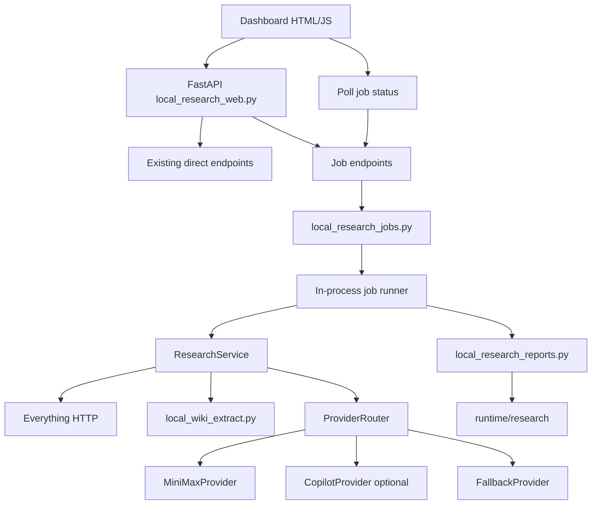

# Local Research Assistant U1 Job and Report Foundation Plan

## Summary

Implement the first upgrade slice from the system upgrade review:

- in-process job/progress pipeline
- polling-based dashboard progress
- cancel support for queued/pre-provider work
- report-first result rendering
- raw JSON retained as debug detail

This plan deliberately does **not** implement the full MiniMax tool-use loop yet. U1 creates the control plane and result presentation layer that U2/U3 will need.

Source review:

- `docs/superpowers/reviews/2026-04-17-local-research-assistant-system-upgrade-review.md`

Current baseline:

- Dashboard: `scripts/local_research_web.py`
- Service: `scripts/local_research_service.py`
- Provider router: `scripts/local_research_providers.py`
- Local tools: `scripts/local_research_tools.py`
- Search: Everything HTTP on loopback
- AI: MiniMax M2.7 through Anthropic-compatible API
- Persistent output: `runtime/research`

Hard boundaries:

- Do not write to `vault/wiki`, `vault/memory`, or `vault/mcp_raw`.
- Do not expose, log, store, or fixture API keys/tokens.
- Keep the dashboard and Everything control plane loopback-only.
- Keep existing direct endpoints backward compatible:
  - `POST /api/research/ask`
  - `POST /api/research/find-bundle`
  - `POST /api/research/ask-selected`
  - `POST /api/research/find-bundle-selected`

## Phase 1: Business Review

### 1.1 Problem Definition

Current state:

- The dashboard can search local files and call MiniMax.
- Long requests still look like a frozen synchronous page.
- The result screen is still JSON-first.
- The user cannot see which stage is slow or whether MiniMax actually contributed until the whole call returns.
- `Use tool loop` remains ahead of actual tool-loop behavior.

Target state:

- User starts a research job and receives a `job_id` immediately.
- Dashboard shows progress through search, ranking, extraction, provider call, validation, and saving.
- User can cancel before expensive provider work begins.
- Result is rendered as a readable report first.
- Raw JSON stays available in a collapsed debug section.
- Direct endpoints continue to work for smoke tests and simple use.

### 1.2 Options

| Option | Description | Score | Risk | Cost |
|---|---|---:|---|---:|
| A | Add report renderer only, keep synchronous requests | 6 | Low | Low |
| B | Add job registry + polling + report renderer | 9 | Medium | Medium |
| C | Add job registry + polling + report renderer + full MiniMax tool-use loop | 7 | High | High |

### 1.3 Recommendation

Recommended option: **B**.

Reason:

- It fixes the main UX problem without touching MiniMax tool-call internals yet.
- It creates the stable job/progress contract needed by U2 search planner and U3 tool loop.
- It keeps the implementation testable and reversible.

Rollback strategy:

- Existing direct endpoints remain untouched as the fallback path.
- If job mode fails, remove or disable the job endpoints and keep direct analysis active.

### 1.4 Approval Gate

- [ ] Phase 1 approved
- [ ] User accepts U1 scope: job/progress pipeline plus report UI only
- [ ] User accepts polling first, WebSocket later

## Phase 2: Engineering Review

### 2.1 Architecture Diagram



### 2.2 New API Contract

#### `POST /api/research/jobs`

Request shape:

```json
{
  "mode": "ask",
  "prompt": "question or topic",
  "selected_candidates": [],
  "scope": "all",
  "max_candidates": 10,
  "save": false,
  "provider": "auto",
  "analysis_mode": "ask",
  "tool_use": false
}
```

Rules:

- `mode` supports `ask` and `find-bundle`.
- If `selected_candidates` is non-empty, route to selected analysis.
- If `selected_candidates` is empty, route to search-based direct analysis.
- `save=false` must not create files.
- Job request validation should reuse existing provider/mode validators where possible.

Response:

```json
{
  "job_id": "jr_...",
  "status": "queued",
  "created_at": "2026-04-17T..."
}
```

#### `GET /api/research/jobs/{job_id}`

Response shape:

```json
{
  "job_id": "jr_...",
  "status": "running",
  "stage": "extracting",
  "progress": 45,
  "message": "Extracting selected files",
  "events": [],
  "result": null,
  "error": ""
}
```

#### `POST /api/research/jobs/{job_id}/cancel`

Response shape:

```json
{
  "job_id": "jr_...",
  "status": "cancel_requested"
}
```

Cancel behavior:

- Must work while `queued`.
- Must work before provider call starts.
- During provider call, mark `cancel_requested`; job may complete if the external call cannot be interrupted safely.
- Final state should be `cancelled` if cancellation happens before provider call.

### 2.3 Progress States

Required states:

- `queued`
- `running`
- `done`
- `failed`
- `cancel_requested`
- `cancelled`

Required stages:

- `queued`
- `searching`
- `ranking`
- `extracting`
- `building_packet`
- `calling_provider`
- `validating_response`
- `saving`
- `rendering_report`
- `done`
- `failed`
- `cancelled`

Progress values:

- 0: queued
- 10: searching
- 25: ranking
- 40: extracting
- 55: building packet
- 65: calling provider
- 80: validating response
- 90: saving/rendering
- 100: done/failed/cancelled

### 2.4 Report Rendering Contract

Create a report renderer that converts existing result payloads into a UI-friendly section structure.

Recommended shape:

```json
{
  "title": "Local Research Result",
  "ai_status": "AI applied via minimax / MiniMax-M2.7",
  "sections": [
    {"title": "Answer", "items": ["..."]},
    {"title": "Key Findings", "items": ["..."]},
    {"title": "Evidence", "items": [{"text": "...", "source_path": "..."}]},
    {"title": "Gaps", "items": ["..."]},
    {"title": "Next Actions", "items": ["..."]},
    {"title": "Sources", "items": [{"path": "..."}]}
  ],
  "debug_json": {}
}
```

Mode-specific additions:

- Invoice Audit:
  - `Invoice Fields`
  - `Missing Fields`
- Find Bundle:
  - `Core Files`
  - `Supporting Files`
  - `Duplicates / Versions`
  - `Missing / Gap Hints`
- Compare Documents:
  - `Differences`
  - `Contradictions`
- Execution Package Audit:
  - `Core Documents`
  - `Supporting Documents`
  - `Missing Documents`

Raw JSON:

- Keep available behind a collapsed `<details>` block in the dashboard.
- Do not remove the raw JSON from API responses.

### 2.5 File Change List

| File | Change Type | Description |
|---|---|---|
| `scripts/local_research_jobs.py` | create | In-process job registry, job state model, cancellation flag, event log |
| `scripts/local_research_reports.py` | create | Convert existing result payloads into report sections |
| `scripts/local_research_web.py` | modify | Add job endpoints, dashboard polling UI, report rendering HTML/JS |
| `scripts/local_research_service.py` | modify | Add optional progress callback hooks around existing flow |
| `tests/test_local_research_jobs.py` | create | Job lifecycle, cancellation, error state tests |
| `tests/test_local_research_reports.py` | create | Report section rendering tests for ask, bundle, invoice audit |
| `tests/test_local_research_web.py` | modify | Job endpoint and dashboard UI tests |
| `tests/test_local_research_service.py` | modify | Progress hook and backward compatibility tests |

### 2.6 Dependencies and Sequencing

Implementation order:

1. Create report renderer and tests.
2. Create job state model and registry tests.
3. Add service progress callback hooks.
4. Add FastAPI job endpoints.
5. Add dashboard polling UI.
6. Run focused tests and regression.

Parallelizable work:

- Report renderer can be built independently.
- Job registry can be built independently.
- UI changes should wait until endpoint shapes are stable.
- Service hook changes should be single-owner because they touch existing orchestration.

Stop conditions:

- Any job path writes to `vault/wiki`, `vault/memory`, or `vault/mcp_raw`.
- Any response or test fixture includes API key/token values.
- Existing direct endpoint tests fail and require a response contract break.
- Job worker introduces unbounded threads/processes.
- Dashboard binds to non-loopback host.

### 2.7 Testing Strategy

Focused U1 tests:

```powershell
.\.venv\Scripts\python.exe -m pytest tests\test_local_research_jobs.py tests\test_local_research_reports.py tests\test_local_research_web.py tests\test_local_research_service.py -q
```

Focused local research suite:

```powershell
.\.venv\Scripts\python.exe -m pytest tests\test_local_research_schemas.py tests\test_local_research_service.py tests\test_local_research_web.py tests\test_local_research_providers.py tests\test_local_research_tools.py tests\test_local_research_jobs.py tests\test_local_research_reports.py -q
```

Regression:

```powershell
.\.venv\Scripts\python.exe -m pytest tests\test_local_wiki_everything.py tests\test_local_wiki_extract.py tests\test_local_wiki_copilot.py tests\test_local_wiki_ingest.py tests\test_local_research_schemas.py tests\test_local_research_service.py tests\test_local_research_web.py tests\test_local_research_providers.py tests\test_local_research_tools.py tests\test_local_research_jobs.py tests\test_local_research_reports.py -q
```

Ruff:

```powershell
.\.venv\Scripts\python.exe -m ruff check scripts\local_research_service.py scripts\local_research_web.py scripts\local_research_providers.py scripts\local_research_tools.py scripts\local_research_schemas.py scripts\local_research_jobs.py scripts\local_research_reports.py tests\test_local_research_service.py tests\test_local_research_web.py tests\test_local_research_providers.py tests\test_local_research_tools.py tests\test_local_research_schemas.py tests\test_local_research_jobs.py tests\test_local_research_reports.py
```

Format:

```powershell
.\.venv\Scripts\python.exe -m ruff format --check scripts\local_research_service.py scripts\local_research_web.py scripts\local_research_providers.py scripts\local_research_tools.py scripts\local_research_schemas.py scripts\local_research_jobs.py scripts\local_research_reports.py tests\test_local_research_service.py tests\test_local_research_web.py tests\test_local_research_providers.py tests\test_local_research_tools.py tests\test_local_research_schemas.py tests\test_local_research_jobs.py tests\test_local_research_reports.py
```

Manual smoke:

```text
GET  /api/research/health
POST /api/research/jobs mode=ask provider=minimax save=false
GET  /api/research/jobs/{job_id}
POST /api/research/jobs/{job_id}/cancel
POST /api/research/ask-selected provider=minimax analysis_mode=invoice-audit save=false
```

### 2.8 Risks and Mitigations

| Risk | Impact | Mitigation |
|---|---|---|
| In-process job registry is lost on server restart | Running jobs disappear | Accept for local MVP; show jobs as runtime-only |
| Thread race in job state updates | Bad progress state | Use lock around state mutation |
| Cancellation cannot interrupt provider request | User expects hard cancel | Document soft cancel during provider call; cancel before provider call |
| Report renderer hides useful raw details | Debugging harder | Keep raw JSON collapsed, not removed |
| UI changes break direct flow | Regression | Keep direct buttons and direct endpoint tests |
| Background worker writes when `save=false` | Privacy issue | Add no-write tests for job path |
| Tool loop checkbox still misleading | User confusion | Show explicit `Tool loop: not active in U1` notice when checked |

## Implementation Tasks

- [x] U1-T1: Create `tests/test_local_research_reports.py`.
- [x] U1-T2: Create `scripts/local_research_reports.py`.
- [x] U1-T3: Add ask/bundle/invoice report section rendering.
- [x] U1-T4: Create `tests/test_local_research_jobs.py`.
- [x] U1-T5: Create `scripts/local_research_jobs.py`.
- [x] U1-T6: Implement `ResearchJob`, `JobRegistry`, and event/progress mutation helpers.
- [x] U1-T7: Add queued/running/done/failed/cancelled lifecycle tests.
- [x] U1-T8: Add cancellation before provider call.
- [x] U1-T9: Add progress callback hooks in `ResearchService`.
- [x] U1-T10: Preserve direct endpoint behavior.
- [x] U1-T11: Add `POST /api/research/jobs`.
- [x] U1-T12: Add `GET /api/research/jobs/{job_id}`.
- [x] U1-T13: Add `POST /api/research/jobs/{job_id}/cancel`.
- [x] U1-T14: Add dashboard polling UI.
- [x] U1-T15: Add report-first dashboard rendering and collapsed debug JSON.
- [x] U1-T16: Add tool-loop inactive notice in U1.
- [x] U1-T17: Add job `save=false` no-write test.
- [x] U1-T18: Run focused U1 tests.
- [x] U1-T19: Run focused local research suite.
- [x] U1-T20: Run regression.
- [x] U1-T21: Run ruff check and format check.
- [x] U1-T22: Run manual dashboard smoke.

## Acceptance Criteria

- `AC-1`: Existing direct endpoints continue to pass current tests.
- `AC-2`: `POST /api/research/jobs` returns a `job_id` immediately.
- `AC-3`: `GET /api/research/jobs/{job_id}` returns status, stage, progress, events, result, and error fields.
- `AC-4`: Job progress reaches `done` with result for a successful request.
- `AC-5`: Job progress reaches `failed` with safe error for a failed request.
- `AC-6`: Cancel before provider call results in `cancelled`.
- `AC-7`: Cancel during provider call is represented as `cancel_requested` or safe final state.
- `AC-8`: `save=false` job path writes no files under `runtime/research`, `vault/wiki`, `vault/memory`, or `vault/mcp_raw`.
- `AC-9`: Report renderer returns sections for ask, find-bundle, and invoice-audit results.
- `AC-10`: Dashboard shows report sections before raw JSON.
- `AC-11`: Raw JSON is still available in a collapsed debug panel.
- `AC-12`: Tool loop checkbox does not imply active tool loop in U1; UI shows an inactive/planned notice.
- `AC-13`: No API key, bearer token, Copilot token, or MiniMax key appears in logs, docs, tests, or responses.
- `AC-14`: Dashboard remains loopback-only.
- `AC-15`: Focused tests, regression, ruff check, and ruff format check pass.

## Open Questions

- Should completed job results be retained only in memory, or also saved under `runtime/research/jobs` when `save=true`?
  - Default for U1: retain in memory; existing service save behavior still controls answer/bundle files.
- Should polling interval be fixed or user-adjustable?
  - Default for U1: fixed 1000 ms.
- Should direct `Run direct` remain visible after job mode is added?
  - Default for U1: yes, keep direct flow for comparison and fallback.

## Verification Evidence

- `.\.venv\Scripts\python.exe -m pytest tests\test_local_research_jobs.py tests\test_local_research_reports.py tests\test_local_research_web.py tests\test_local_research_service.py -q` -> passed.
- `.\.venv\Scripts\python.exe -m pytest tests\test_local_research_schemas.py tests\test_local_research_service.py tests\test_local_research_web.py tests\test_local_research_providers.py tests\test_local_research_tools.py tests\test_local_research_jobs.py tests\test_local_research_reports.py -q` -> passed.
- `.\.venv\Scripts\python.exe -m pytest tests\test_local_wiki_everything.py tests\test_local_wiki_extract.py tests\test_local_wiki_copilot.py tests\test_local_wiki_ingest.py tests\test_local_research_schemas.py tests\test_local_research_service.py tests\test_local_research_web.py tests\test_local_research_providers.py tests\test_local_research_tools.py tests\test_local_research_jobs.py tests\test_local_research_reports.py -q` -> passed.
- `.\.venv\Scripts\python.exe -m ruff check scripts\local_research_service.py scripts\local_research_web.py scripts\local_research_providers.py scripts\local_research_tools.py scripts\local_research_jobs.py scripts\local_research_reports.py tests\test_local_research_service.py tests\test_local_research_web.py tests\test_local_research_providers.py tests\test_local_research_tools.py tests\test_local_research_jobs.py tests\test_local_research_reports.py` -> passed.
- `.\.venv\Scripts\python.exe -m ruff format --check scripts\local_research_service.py scripts\local_research_web.py scripts\local_research_providers.py scripts\local_research_tools.py scripts\local_research_jobs.py scripts\local_research_reports.py tests\test_local_research_service.py tests\test_local_research_web.py tests\test_local_research_providers.py tests\test_local_research_tools.py tests\test_local_research_jobs.py tests\test_local_research_reports.py` -> passed.
- Manual smoke: dashboard restarted at `http://127.0.0.1:8091/`; health returned `Route: ready | Active: minimax | Everything: ok | MiniMax: ok | Copilot: unavailable`; fallback job smoke reached `done` with report and `save=false`.

## Change Log

- 2026-04-17: Initial U1 job/report foundation plan created from system upgrade review.
- 2026-04-17: Implemented U1 job/report foundation and recorded verification evidence.
