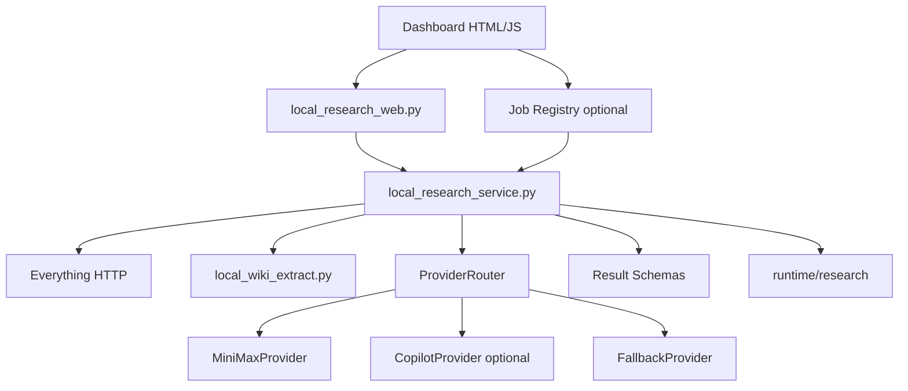

# Local Research Assistant Dashboard Upgrade Plan

## Summary

This plan upgrades the current Local Research Assistant Dashboard into a more stable
and operationally useful local investigation assistant.

Current working baseline:

- Dashboard: `http://127.0.0.1:8091`
- Everything HTTP: `http://127.0.0.1:8080`
- MiniMax provider: available through `MINIMAX_API_KEY`
- Copilot standalone: optional fallback, currently not required for MiniMax operation
- Persistent output: `runtime/research`
- Forbidden write targets for this work: `vault/wiki`, `vault/memory`, `vault/mcp_raw`

External references used for this plan:

- MiniMax Anthropic-compatible API: `https://platform.minimax.io/docs/api-reference/text-anthropic-api`
- FastAPI WebSockets: `https://fastapi.tiangolo.com/reference/websockets/`
- FastAPI BackgroundTasks: `https://fastapi.tiangolo.com/tutorial/background-tasks/`
- FastAPI Middleware: `https://fastapi.tiangolo.com/reference/middleware/`
- Everything HTTP Server: `https://ftp.voidtools.com/en-us/support/everything/http/`
- Pydantic validators: `https://docs.pydantic.dev/latest/concepts/validators/`

## Phase 1: Business Review

### 1.1 Problem Definition

The dashboard can search local files and call MiniMax, but its operational behavior is still rough:

- `Status: degraded` is confusing when MiniMax is healthy but Copilot is off.
- Long analysis requests run as one blocking HTTP request.
- MiniMax output can be valid API output but not valid app schema.
- Candidate ranking is still filename/path-heavy and does not fully use Everything metadata.
- The result screen is JSON-first rather than report-first.
- `Use tool loop` is visible but not yet a complete MiniMax tool-use workflow.

Target state:

- The dashboard clearly shows which dependency is usable and which route will be used.
- MiniMax responses are schema-validated and repaired once when malformed.
- Candidate ranking uses stronger metadata and duplicate grouping.
- Long-running analysis has visible progress and cancel support.
- Tool-use can safely search and extract only approved local files.
- Results are readable as a local investigation report with citations.

### 1.2 Options

| Option | Description | Score | Risk | Cost |
|---|---|---:|---|---:|
| A | Stability Patch only: status, schema validation, JSON repair, ranking v2 | 9 | Low | Low |
| B | Stability Patch + job/progress pipeline | 8 | Medium | Medium |
| C | Full upgrade: stability, jobs, MiniMax tool-use loop, report UI, specialist modes | 7 | High | High |

### 1.3 Recommendation

Recommended path: **Option B in two increments**.

First implement `Phase 2.1 Stability Patch` because it fixes the current user-facing confusion and MiniMax output reliability without changing the architecture. Then implement `Phase 2.2 Job/Progress Pipeline` so longer MiniMax and extraction workflows become observable and cancellable.

Tool-use loop and full report UI should follow only after the stable provider/schema/job foundation is in place.

### 1.4 Approval Gate

- [ ] Phase 1 approved
- [ ] User confirms whether to implement only Phase 2.1 first or Phase 2.1 + Phase 2.2 together

## Phase 2: Engineering Review

### 2.1 Architecture Diagram



### 2.2 Proposed Phases

#### Phase 2.1 Stability Patch

Goal:

Make the existing synchronous dashboard accurate and reliable.

Scope:

- Split dependency health from route readiness.
- Change global status wording from coarse `ok/degraded` to route-aware status.
- Add MiniMax schema validation for `ask` and `find-bundle`.
- Add one JSON repair retry for malformed MiniMax output.
- Add provider error body surfacing without secrets.
- Improve candidate ranking with Everything metadata.
- Keep existing endpoints backward compatible.

Non-goals:

- No WebSocket yet.
- No queue yet.
- No persistent vault writes.
- No full MiniMax tool-use loop yet.

#### Phase 2.2 Job/Progress Pipeline

Goal:

Stop long operations from looking frozen.

Scope:

- Add in-process job registry.
- Add `POST /api/research/jobs`.
- Add `GET /api/research/jobs/{job_id}`.
- Add `POST /api/research/jobs/{job_id}/cancel`.
- Add polling-based progress first.
- Optional WebSocket event stream after polling is stable.

Progress states:

- `queued`
- `searching`
- `ranking`
- `extracting`
- `building_packet`
- `calling_provider`
- `validating_response`
- `saving`
- `done`
- `failed`
- `cancelled`

#### Phase 2.3 Tool-Use Loop

Goal:

Let MiniMax request bounded local search/extraction steps.

Scope:

- Add `MiniMaxProvider.analyze_with_tools`.
- Preserve full assistant content blocks for tool-use continuity.
- Execute only approved tools:
  - `everything_search`
  - `extract_file`
  - `extract_table_preview`
  - `compare_selected_files`
  - `build_citation`
- Enforce max rounds/files/chars/search calls.
- Show tool trace in UI.

#### Phase 2.4 Report UI and Specialist Modes

Goal:

Make results readable and actionable.

Scope:

- Render `Answer`, `Evidence`, `Gaps`, `Next Actions`, and `Sources` as sections.
- Add mode-specific views:
  - `Ask`
  - `Find Bundle`
  - `Extract Fields`
  - `Invoice Audit`
  - `Execution Package Audit`
  - `Compare Documents`
- Keep raw JSON behind a collapsible debug panel.

### 2.3 File Change Plan

| File | Change Type | Description |
|---|---|---|
| `scripts/local_research_web.py` | modify | Status display, route readiness, provider/mode controls, optional job endpoints |
| `scripts/local_research_service.py` | modify | Schema validation, ranking v2 integration, job progress hooks |
| `scripts/local_research_providers.py` | modify | MiniMax JSON repair retry, provider error detail, optional tool-use method |
| `scripts/local_research_tools.py` | modify | Tool loop support and trace payloads |
| `scripts/local_research_schemas.py` | create | Pydantic result schemas for ask, bundle, invoice, compare, execution package |
| `scripts/local_research_jobs.py` | create | In-process job registry and cancellation state |
| `tests/test_local_research_web.py` | modify | Health/status UI and request validation tests |
| `tests/test_local_research_service.py` | modify | Schema validation, ranking, save/no-write tests |
| `tests/test_local_research_providers.py` | modify | JSON repair retry and provider error tests |
| `tests/test_local_research_tools.py` | modify | Tool trace and guard tests |
| `tests/test_local_research_jobs.py` | create | Job lifecycle and cancellation tests |

### 2.4 Dependency and Sequencing

Recommended order:

1. Schema validation models.
2. MiniMax response validation and repair retry.
3. Health/status display cleanup.
4. Candidate ranking v2.
5. Job registry and polling endpoints.
6. UI progress panel.
7. MiniMax tool-use loop.
8. Report-style result rendering.

Parallelizable work:

- Schema models and provider retry tests can be done independently.
- Status UI and ranking v2 can be done independently after current API shape is read.
- Job registry should be single-owner because it touches API/service flow.
- Tool-use loop should wait until schemas and progress trace shape are stable.

Stop conditions:

- Any change attempts to write under `vault/wiki`, `vault/memory`, or `vault/mcp_raw`.
- MiniMax key value appears in logs, tests, docs, or responses.
- Existing `ask`, `find-bundle`, `ask-selected`, or `find-bundle-selected` response compatibility breaks without an explicit migration decision.
- Everything HTTP is no longer loopback-only.

### 2.5 Acceptance Criteria

#### Phase 2.1

- `GET /api/research/health` distinguishes dependency status from active route status.
- Dashboard does not mark the whole app blocked when MiniMax is ok and Copilot is off.
- MiniMax malformed JSON triggers one repair retry.
- MiniMax thinking blocks are not shown or saved.
- `ask` and `find-bundle` outputs are validated against Pydantic schemas.
- Candidate ranking uses Everything path, size, modified time, extension, path penalties, and duplicate grouping.
- `save=false` writes nothing.

#### Phase 2.2

- Job creation returns a `job_id`.
- Job status can be polled.
- Job cancellation works before provider call and during waiting states where possible.
- UI shows progress steps.
- Existing direct endpoints still work.

#### Phase 2.3

- MiniMax can request `everything_search` then `extract_file` in a bounded loop.
- Unauthorized paths are rejected.
- Max rounds/files/chars are enforced.
- Tool trace is visible in the response and UI.

#### Phase 2.4

- Results render as report sections, not only raw JSON.
- Raw JSON remains available for debugging.
- Mode-specific sections display without layout shift.

### 2.6 Test Strategy

Focused tests:

```powershell
.\.venv\Scripts\python.exe -m pytest tests\test_local_research_service.py tests\test_local_research_web.py tests\test_local_research_providers.py tests\test_local_research_tools.py -q
```

Job tests, once created:

```powershell
.\.venv\Scripts\python.exe -m pytest tests\test_local_research_jobs.py -q
```

Focused regression:

```powershell
.\.venv\Scripts\python.exe -m pytest tests\test_local_wiki_everything.py tests\test_local_wiki_extract.py tests\test_local_wiki_copilot.py tests\test_local_wiki_ingest.py tests\test_local_research_service.py tests\test_local_research_web.py tests\test_local_research_providers.py tests\test_local_research_tools.py -q
```

Lint and format:

```powershell
.\.venv\Scripts\python.exe -m ruff check scripts\local_research_service.py scripts\local_research_web.py scripts\local_research_providers.py scripts\local_research_tools.py tests\test_local_research_service.py tests\test_local_research_web.py tests\test_local_research_providers.py tests\test_local_research_tools.py
```

```powershell
.\.venv\Scripts\python.exe -m ruff format --check scripts\local_research_service.py scripts\local_research_web.py scripts\local_research_providers.py scripts\local_research_tools.py tests\test_local_research_service.py tests\test_local_research_web.py tests\test_local_research_providers.py tests\test_local_research_tools.py
```

Manual smoke:

```text
GET  /api/research/health
POST /api/research/candidates
POST /api/research/ask-selected provider=minimax save=false
POST /api/research/find-bundle-selected provider=minimax save=false
```

### 2.7 Risks and Mitigations

| Risk | Impact | Mitigation |
|---|---|---|
| MiniMax returns non-schema JSON | Bad UI or fallback | Pydantic validation plus one repair retry |
| Long requests block browser | User thinks app is frozen | Job registry and progress polling |
| Tool-use reads unsafe path | Security/privacy issue | Existing allowlist/denylist plus tests |
| Candidate ranking favors low-value temp files | Poor answers | Path penalties and duplicate grouping |
| Copilot off makes app look broken | User confusion | Route-aware status instead of global degraded |
| External AI cost grows | Cost risk | Packet estimate and shrink limits |

### 2.8 Security and Privacy

- Never print or store `MINIMAX_API_KEY`.
- Never send arbitrary local paths to MiniMax.
- External AI content must come only from selected or tool-approved files.
- Dashboard remains loopback-only.
- No writes to `vault/wiki`, `vault/memory`, or `vault/mcp_raw`.
- Saved outputs remain under `runtime/research`.
- Raw thinking content from MiniMax is not displayed or persisted.

## Implementation Recommendation

Start with **Phase 2.1 Stability Patch** only.

Reason:

- It fixes current user-visible issues without introducing queue/tool-loop complexity.
- It gives a stable response contract for later job and tool-use work.
- It keeps the diff small and testable.

Suggested next instruction:

```text
Implement Phase 2.1 Stability Patch from docs/superpowers/plans/DASHBOARDUPGRADE.MD
```

## Change Log

- 2026-04-17: Rebuilt plan from external documentation review and current repository state.
