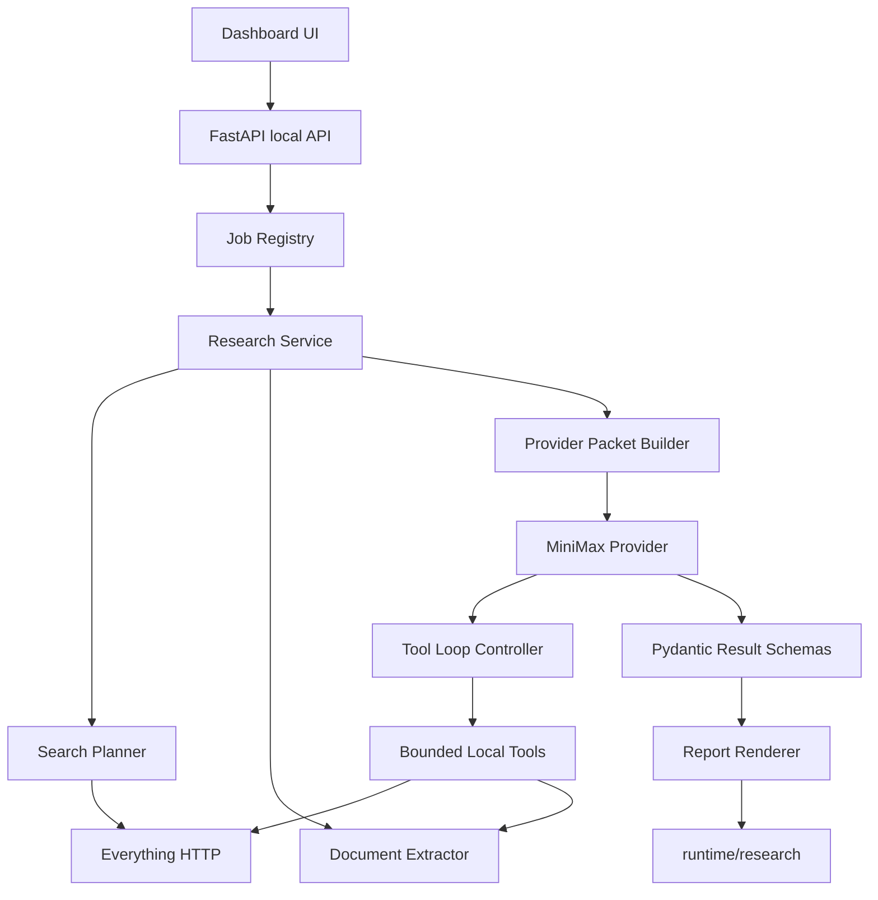

# Local Research Assistant System Upgrade Review

## Summary

This review proposes the next system upgrade after the Phase 2.1 dashboard stability patch.

Current system baseline:

- Local dashboard: `scripts/local_research_web.py`
- Core service: `scripts/local_research_service.py`
- Provider router: `scripts/local_research_providers.py`
- Bounded local tools: `scripts/local_research_tools.py`
- Search source: Everything HTTP on loopback
- AI provider: MiniMax M2.7 through Anthropic-compatible API
- Persistent output: `runtime/research`
- Forbidden write targets: `vault/wiki`, `vault/memory`, `vault/mcp_raw`

Main finding:

The system now calls MiniMax, but it is still mostly a synchronous "search -> extract -> ask once" application. To make the API worth using, the next upgrade should make MiniMax operate as a controlled local investigation agent: it should be able to request more searches, extract additional approved files, keep a tool trace, and produce a report-first answer with source-backed sections.

Recommended next path:

1. Phase 2.2: Job/progress pipeline plus report-first UI.
2. Phase 2.3: True MiniMax tool-use loop with full assistant response preservation.
3. Phase 2.4: Long-context packet builder, prompt caching, and query/ranking refinement.

## Parallel Search Log

The external review used parallel search lanes:

- Lane A: MiniMax M2.7 Anthropic-compatible API, tool use, thinking blocks, prompt caching.
- Lane B: Everything HTTP query parameters, metadata columns, sort options, and HTTP exposure risks.
- Lane C: FastAPI background tasks and WebSocket/progress patterns.
- Lane D: Pydantic validation patterns for strict response contracts.

Primary references:

- MiniMax Anthropic-compatible API: https://platform.minimax.io/docs/api-reference/text-anthropic-api
- MiniMax Tool Use & Interleaved Thinking: https://platform.minimax.io/docs/guides/text-m2-function-call
- MiniMax Explicit Prompt Caching: https://platform.minimax.io/docs/api-reference/anthropic-api-compatible-cache
- MiniMax API Overview: https://platform.minimax.io/docs/api-reference/api-overview
- Everything HTTP: https://ftp.voidtools.com/en-us/support/everything/http/
- Everything INI HTTP settings: https://www.voidtools.com/support/everything/ini/
- FastAPI BackgroundTasks: https://fastapi.tiangolo.com/tutorial/background-tasks/
- FastAPI WebSockets: https://fastapi.tiangolo.com/advanced/websockets/
- Pydantic validators: https://docs.pydantic.dev/latest/concepts/validators/

## Current Gap Review

### Gap 1: MiniMax is used as a single-shot answerer, not an investigation agent

Current behavior:

- The service builds one packet from selected or searched files.
- MiniMax receives that packet once.
- If the packet is weak or the first candidates are not enough, MiniMax cannot ask the local system to search more.

External evidence:

- MiniMax M2.7 supports tool calls through the Anthropic-compatible interface.
- MiniMax docs emphasize that for multi-turn tool conversations, the full assistant response content should be preserved in message history, including thinking/text/tool_use blocks.
- The current app intentionally strips thinking from final user output, which is correct for UI safety, but a true tool loop must preserve full blocks internally for continuity.

Upgrade idea:

Add `MiniMaxProvider.analyze_with_tools()`:

- Send Anthropic-compatible `tools` definitions.
- Accept `tool_use` content blocks.
- Execute only bounded local tools:
  - `everything_search`
  - `extract_file`
  - `extract_table_preview`
  - `compare_selected_files`
  - `build_citation`
- Append the full assistant content block internally.
- Append tool_result blocks.
- Repeat until final text JSON or max rounds.
- Persist only sanitized text result and tool trace; never persist raw thinking.

Why this matters:

This is the first upgrade that makes the API service clearly useful. The model can ask for missing local evidence rather than only summarizing the first packet.

### Gap 2: Long requests still look frozen

Current behavior:

- Direct requests are synchronous.
- UI text changes to "Running..." or "Running selected candidates..." and then waits.
- No step visibility, no cancel, no partial trace.

External evidence:

- FastAPI `BackgroundTasks` is suitable for small background work after a response.
- FastAPI WebSockets can send and receive text/JSON events and support disconnection handling.
- For this local-only app, polling is simpler and safer than WebSocket as a first implementation.

Upgrade idea:

Add a local in-process job registry:

- `POST /api/research/jobs`
- `GET /api/research/jobs/{job_id}`
- `POST /api/research/jobs/{job_id}/cancel`
- Optional later: `/ws/research/jobs/{job_id}` or SSE stream.

Progress states:

- `queued`
- `searching`
- `ranking`
- `extracting`
- `building_packet`
- `calling_provider`
- `tool_calling`
- `validating_response`
- `saving`
- `done`
- `failed`
- `cancelled`

UI:

- Show current step.
- Show selected files and extracted character budget.
- Show tool trace as it grows.
- Show final report once done.

Why this matters:

This turns long MiniMax/API work from a black box into an inspectable local workflow.

### Gap 3: Search is metadata-aware but not query-strategy-aware

Current behavior:

- Query generation is simple token and pair expansion.
- Ranking uses filename/path/extension/modified/size/path penalties.
- Duplicate/version grouping is annotation-only.

External evidence:

- Everything HTTP supports JSON output, offset/count, path search, regex, whole word, path/size/date_modified columns, and sort by name/path/date_modified/size.
- Everything HTTP can expose all indexed files and downloaded file content if file download is enabled, so this app must keep loopback-only access and file download disabled.

Upgrade idea:

Add a two-stage search planner:

1. Candidate discovery:
   - broad filename query
   - path-aware query
   - extension-filtered query
   - recent-date query
   - exact phrase query
2. Candidate reranking:
   - match score
   - extension fit by task type
   - directory trust score
   - recency
   - size
   - duplicate/version relationship
   - extraction success
   - MiniMax evidence usefulness score, optional and bounded

Everything query parameters to use more deliberately:

- `json=1`
- `path_column=1`
- `size_column=1`
- `date_modified_column=1`
- `sort=date_modified` for freshness searches
- `sort=size` for bundle completeness checks
- `path=1` for project/folder constrained searches
- `regex=1` only for controlled generated queries

Why this matters:

The answer quality depends more on candidate quality than on the model. Better search planning reduces cost and makes MiniMax useful with fewer calls.

### Gap 4: Report UI is still JSON-first

Current behavior:

- UI shows the answer header, an AI/fallback status, raw JSON, and sources.
- Useful for debugging, poor for daily work.

Upgrade idea:

Render report sections first:

- Answer
- Key Findings
- Evidence Table
- Gaps / Unknowns
- Recommended Next Actions
- Source Files
- Tool Trace
- Raw JSON debug panel, collapsed by default

Mode-specific sections:

- Invoice Audit:
  - invoice number
  - issue date
  - supplier
  - buyer
  - amount
  - VAT
  - total
  - currency
  - missing fields
- Execution Package Audit:
  - core documents
  - supporting documents
  - duplicate/version group
  - missing document checklist
- Compare Documents:
  - changed fields
  - contradictions
  - same/older/newer version hints
- Find Bundle:
  - primary file
  - supporting files
  - older versions
  - missing likely attachments

Why this matters:

The user should immediately see what the AI did, not parse JSON.

### Gap 5: Long-context and cost controls are still primitive

Current behavior:

- The packet builder caps text per file.
- It does not yet use provider-specific context strategy, caching, or content hierarchy.

External evidence:

- MiniMax M2.7 context window is documented as 204,800 tokens.
- MiniMax Anthropic-compatible prompt caching can cache system prompts, text messages, tools, and tool results.
- Prompt caching docs recommend stable reusable content near the front of the prompt and cache breakpoints on reusable blocks.

Upgrade idea:

Add a provider-aware packet builder:

- `PacketBudget(provider, mode)`:
  - small direct answer
  - selected document deep read
  - bundle audit
  - compare documents
  - tool loop
- Put stable system rules, tool definitions, and schemas in cacheable blocks.
- Keep volatile question and selected files separate.
- Store usage metadata from provider response where available:
  - input tokens
  - output tokens
  - cache read tokens
  - cache creation tokens
- Display estimated cost/size in UI before calling provider.

Why this matters:

With a large context model, the danger is sending too much irrelevant material. The system needs a visible budget and a predictable packet strategy.

## Options

### Option A: Progress + Report UI First

Scope:

- Add job registry.
- Add polling endpoints.
- Add report renderer.
- Keep MiniMax call single-shot.

Pros:

- Fastest visible UX improvement.
- Low provider risk.
- Easier to test.

Cons:

- AI still cannot search/extract more evidence by itself.

Use when:

- The immediate pain is that the UI feels frozen and hard to read.

### Option B: True Tool-Use Agent First

Scope:

- Implement `analyze_with_tools`.
- Preserve full assistant content internally.
- Execute bounded local tools.
- Return sanitized final answer and trace.

Pros:

- Biggest quality improvement.
- Makes the API service useful as a PC investigation assistant.
- Uses MiniMax M2.7's documented strengths.

Cons:

- Higher complexity.
- Needs strong guardrails and tests.
- Still needs progress UI soon after.

Use when:

- The immediate pain is answer quality and poor evidence gathering.

### Option C: Full Phase 2.2 + 2.3 Combined

Scope:

- Job/progress pipeline.
- Report UI.
- Tool-use loop.
- Search planner and packet budget.

Pros:

- Best final user experience.
- Coherent architecture.

Cons:

- Higher regression risk.
- More files and more coordination.

Use when:

- The user wants a single large upgrade and accepts a staged validation plan.

## Recommendation

Recommended path: **Option C as a staged implementation**, not one uncontrolled patch.

Implementation order:

1. Job/progress foundation and report renderer.
2. Search planner/ranking v3.
3. MiniMax tool-use loop.
4. Long-context packet builder and prompt caching.
5. Manual smoke with real documents.

Reason:

- Job/progress is the control plane.
- Report UI is the user-facing layer.
- Tool-use needs both of those to be understandable.
- Prompt caching and long-context optimization are useful only after tool traces and packet shapes are stable.

## Proposed Architecture



## Proposed Implementation Phases

### Phase U1: Job and Report Foundation

Files:

- `scripts/local_research_jobs.py`
- `scripts/local_research_web.py`
- `scripts/local_research_service.py`
- `tests/test_local_research_jobs.py`
- `tests/test_local_research_web.py`

Deliverables:

- Create in-memory job registry.
- Add job endpoints.
- Add progress states.
- Add report renderer.
- Keep direct endpoints working.

Acceptance:

- Starting a job returns `job_id`.
- Polling returns progress and final result.
- Cancel before provider call works.
- Report UI shows sections before raw JSON.

### Phase U2: Search Planner and Ranking v3

Files:

- `scripts/local_research_search.py`
- `scripts/local_research_service.py`
- `tests/test_local_research_search.py`
- `tests/test_local_research_service.py`

Deliverables:

- Generate task-aware query plans.
- Use Everything metadata columns consistently.
- Add folder trust and low-value penalties.
- Add duplicate/version grouping object.
- Add extracted-text usefulness scoring.

Acceptance:

- Temp/cache/test artifacts are demoted or excluded.
- Relevant real project files outrank generated test files.
- Query plan is visible in result/debug trace.

### Phase U3: MiniMax Tool-Use Loop

Files:

- `scripts/local_research_providers.py`
- `scripts/local_research_tools.py`
- `tests/test_local_research_providers.py`
- `tests/test_local_research_tools.py`

Deliverables:

- Define Anthropic `tools` payload.
- Preserve full assistant response internally.
- Execute bounded tool calls.
- Return sanitized final result and trace.
- Do not expose or save thinking blocks.

Acceptance:

- MiniMax can request `everything_search` then `extract_file`.
- Unauthorized paths are rejected.
- Max rounds/files/chars are enforced.
- Tool trace records accepted and rejected calls.

### Phase U4: Long-Context Packet Builder and Prompt Caching

Files:

- `scripts/local_research_packets.py`
- `scripts/local_research_providers.py`
- `tests/test_local_research_packets.py`
- `tests/test_local_research_providers.py`

Deliverables:

- Provider-specific budgets.
- Cacheable system/schema/tool blocks.
- Usage metadata parsing.
- UI cost/size summary.

Acceptance:

- Packet builder returns deterministic packet sections.
- Large selected files are ordered and truncated predictably.
- Usage metadata is captured without secrets.

## Review Findings

### Finding 1: The `Use tool loop` checkbox is currently ahead of implementation

Severity: High.

The UI exposes tool-loop intent, but provider logic still uses a direct call path. This causes user expectation mismatch. Either hide it until U3 or implement U3 next.

Recommendation:

- Keep the checkbox visible only if it changes behavior.
- If tool loop is unavailable, show `Tool loop: planned, not active`.

### Finding 2: The report view should be built before richer AI features

Severity: Medium.

Raw JSON is useful for debugging but weak for actual document work. New AI fields will be wasted unless the UI renders them.

Recommendation:

- Implement report renderer in U1.
- Preserve raw JSON as collapsible debug.

### Finding 3: Tool-use must preserve full assistant content internally

Severity: High.

MiniMax documentation is explicit that multi-turn tool calls require full assistant content history, including thinking/text/tool_use blocks. Current safety behavior strips thinking for output, which should remain true, but the internal tool loop must keep full content in memory during the request.

Recommendation:

- Separate `provider_internal_messages` from `user_visible_result`.
- Add tests proving thinking is never persisted or shown.

### Finding 4: Everything HTTP is powerful but remains a local exposure surface

Severity: High.

Everything HTTP can search indexed files and can download files if file downloading is enabled.

Recommendation:

- Keep loopback-only checks.
- Keep file download disabled.
- Add a health warning if Everything appears bound beyond loopback, where detectable.
- Never use Everything HTTP as the body extraction mechanism; keep extraction in controlled local Python code.

### Finding 5: Prompt caching can reduce cost later, but should not be first

Severity: Low for immediate UX, medium for long-context cost.

Caching is useful only after the prompt structure stabilizes. Premature caching will make debugging harder.

Recommendation:

- Add caching in U4 after schemas, tools, and packet sections are stable.

## Security Guardrails

Non-negotiable:

- No secrets in logs, responses, docs, fixtures, or saved results.
- No writes to `vault/wiki`, `vault/memory`, or `vault/mcp_raw`.
- Everything and dashboard remain loopback-only.
- Tool executor reads only selected, previewed, or same-request Everything results.
- Deny `.git`, `.venv`, `node_modules`, `.codex`, `.cursor`, credential-looking paths.
- MiniMax thinking content can be held transiently during a tool loop but must not be user-facing or persisted.

## Validation Plan

Focused tests:

```powershell
.\.venv\Scripts\python.exe -m pytest tests\test_local_research_jobs.py tests\test_local_research_search.py tests\test_local_research_packets.py tests\test_local_research_service.py tests\test_local_research_web.py tests\test_local_research_providers.py tests\test_local_research_tools.py -q
```

Regression:

```powershell
.\.venv\Scripts\python.exe -m pytest tests\test_local_wiki_everything.py tests\test_local_wiki_extract.py tests\test_local_wiki_copilot.py tests\test_local_wiki_ingest.py tests\test_local_research_schemas.py tests\test_local_research_service.py tests\test_local_research_web.py tests\test_local_research_providers.py tests\test_local_research_tools.py -q
```

Lint:

```powershell
.\.venv\Scripts\python.exe -m ruff check scripts\local_research_service.py scripts\local_research_web.py scripts\local_research_providers.py scripts\local_research_tools.py scripts\local_research_schemas.py tests\test_local_research_service.py tests\test_local_research_web.py tests\test_local_research_providers.py tests\test_local_research_tools.py tests\test_local_research_schemas.py
```

Format:

```powershell
.\.venv\Scripts\python.exe -m ruff format --check scripts\local_research_service.py scripts\local_research_web.py scripts\local_research_providers.py scripts\local_research_tools.py scripts\local_research_schemas.py tests\test_local_research_service.py tests\test_local_research_web.py tests\test_local_research_providers.py tests\test_local_research_tools.py tests\test_local_research_schemas.py
```

Manual smoke:

```text
GET  /api/research/health
POST /api/research/candidates
POST /api/research/jobs provider=minimax tool_use=true save=false
GET  /api/research/jobs/{job_id}
POST /api/research/ask-selected provider=minimax analysis_mode=invoice-audit save=false
```

## Open Decisions

1. Tool loop visibility:
   - Option A: hide until implemented.
   - Option B: keep visible with inactive warning.
   - Recommendation: Option B.

2. Progress transport:
   - Option A: polling only.
   - Option B: WebSocket.
   - Option C: polling first, WebSocket later.
   - Recommendation: Option C.

3. Search strategy:
   - Option A: improve current ranking only.
   - Option B: add explicit query planner.
   - Recommendation: Option B.

4. Prompt caching:
   - Option A: implement immediately.
   - Option B: wait until U4.
   - Recommendation: Option B.

## Changelog

- 2026-04-17: Initial review created from external documentation search and current repository inspection.
