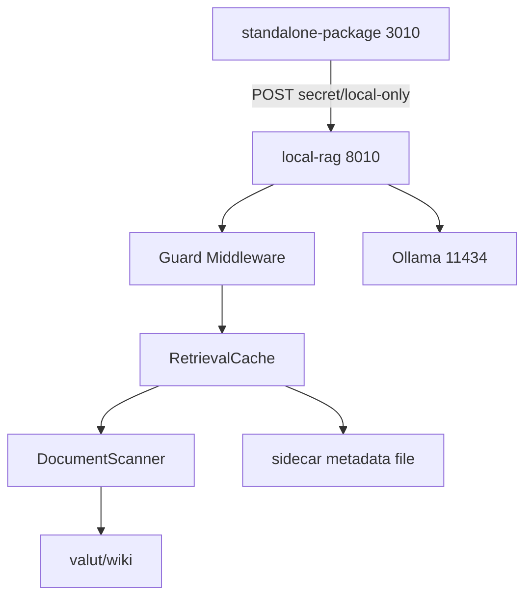

# local-rag Cache And Guard Design

Date: 2026-04-08
Status: Draft for review
Scope: `C:\Users\jichu\Downloads\local-rag` next-step design only

## 1. Goal

현재 `local-rag`는 `standalone-package`의 local-only route를 정상 지원하지만, 다음 문제가 남아 있다.

- 요청마다 `LOCAL_RAG_DOCS_DIR` 전체를 다시 스캔해 비용이 커질 수 있다.
- `POST /api/internal/ai/chat-local`는 현재 무인증이다.
- 캐시 확장 여지는 필요하지만, 지금 당장 SQLite를 넣기에는 범위가 크다.

목표는 다음 세 가지를 동시에 만족하는 것이다.

1. 검색 정확도를 해치지 않으면서 재스캔 비용을 줄인다.
2. 최소 보호 원칙으로 internal chat endpoint를 잠근다.
3. 미래에 SQLite 캐시로 교체 가능한 구조를 만든다.

## 2. Confirmed Constraints

- `local-rag`는 sibling 서비스로 유지한다.
- `standalone-package`는 계속 HTTP client로만 `local-rag`를 호출한다.
- 최소 보호 원칙을 따른다.
  - `POST /api/internal/ai/chat-local`만 `shared secret` 적용
  - `GET /health`는 공개 유지
- 캐시는 보수적으로 동작해야 한다.
  - stale risk를 낮춘다.
  - 정답 저장이 아니라 문서 스캔 비용 절감에 집중한다.
- 저장 방식은 장기적으로 SQLite까지 열어둘 수 있어야 한다.

## 3. Approaches Considered

### Option A — Memory-only cache

- 문서 스캔 결과를 프로세스 메모리에만 저장한다.
- 장점: 가장 단순하고 구현이 빠르다.
- 단점: 재시작 시 캐시 손실, cold start 비용 반복, 장기 확장성 약함.

### Option B — Memory cache + sidecar metadata file

- 메모리 캐시를 기본으로 쓰고, 문서 메타와 검색용 축약 텍스트를 sidecar 파일에 저장한다.
- 장점: 재시작 후에도 재스캔 비용을 줄일 수 있고, SQLite로의 미래 교체가 쉽다.
- 단점: 메모리-only보다 구현이 조금 더 복잡하다.

### Option C — SQLite cache immediately

- 문서 메타와 검색용 인덱스를 SQLite에 저장한다.
- 장점: 장기 확장성은 가장 좋다.
- 단점: 현재 범위 대비 과하고, 파일 락/스키마/운영 복잡도가 커진다.

## 4. Recommendation

추천은 Option B다.

- 현재 요구는 "정확도 저하 없이 보수적 캐시"다.
- sidecar 파일은 메모리-only보다 운영 효율이 좋고, immediate SQLite보다 단순하다.
- `RetrievalCache` 인터페이스만 잘 분리하면, 나중에 sidecar 구현을 SQLite로 바꾸기 쉽다.

롤백은 간단하다.

- sidecar 캐시만 끄고 full rescan으로 복귀한다.
- shared secret만 끄고 기존 local-only route로 되돌린다.

## 5. Target Architecture

### 5.1 Components

#### `GuardMiddleware`

- applies only to `POST /api/internal/ai/chat-local`
- validates shared secret from request header
- returns `401` on missing/invalid token
- does not log token values

#### `DocumentScanner`

- scans `LOCAL_RAG_DOCS_DIR`
- collects `relative_path`, `mtime`, `size`
- reads changed files only
- ignores unreadable or invalid markdown files

#### `RetrievalCache`

- in-memory active cache for current process
- sidecar-backed metadata persistence for restart recovery
- stores:
  - file metadata
  - normalized search text
  - snippet seed
- does not store authoritative document truth

#### `SearchExecutor`

- performs lexical top-N retrieval from cached search text
- returns `sources[]` with:
  - `file`
  - `score`
  - `source_path` as relative path only
  - `snippet`

## 6. Cache Design

### 6.1 Cache Units

Per-file entry:

- `relative_path`
- `mtime`
- `size`
- optional `content_hash`
- `search_text`
- `snippet_seed`

Per-query entry:

- normalized query
- top-N result references
- very short TTL only

### 6.2 Invalidation Rules

File cache:

- no TTL-based trust
- invalidated by file change detection
- changed = `mtime` or `size` mismatch
- deleted file = remove cache entry
- unreadable file = skip and do not poison whole request

Query cache:

- short TTL only, around `30-60s`
- invalidated when underlying file index changes

### 6.3 Sidecar File Scope

The sidecar file stores:

- document metadata
- search-ready normalized text
- snippet seed

The sidecar file must not store:

- full authoritative source of truth
- absolute local paths in returned API payloads
- secrets or request bodies

### 6.4 Failure Behavior

- broken sidecar file: discard and rebuild
- unreadable markdown file: skip and continue
- sidecar unavailable: continue with memory cache or full rescan

## 7. Security Design

### 7.1 Protected Surface

Protected:

- `POST /api/internal/ai/chat-local`

Public:

- `GET /health`

### 7.2 Shared Secret Contract

Recommended header:

- `x-local-rag-token: <secret>`

Behavior:

- missing token -> `401`
- invalid token -> `401`
- token value never appears in logs or API responses

### 7.3 Binding Policy

Default local operation:

- host: `127.0.0.1`
- port: `8010`

Public binding:

- only by explicit operator choice
- when bound beyond loopback, shared secret is required

### 7.4 Error Contract

Maintain current response style:

- successful chat returns:
  - `text`
  - `model`
  - `provider`
  - `sources`
  - `riskFlags`
  - `latencyMs`

Failure cases:

- invalid secret -> `401`
- upstream unavailable -> `503`
- malformed upstream payload -> `502`

### 7.5 Data Exposure Rules

- `sources.source_path` remains relative only
- no absolute filesystem paths in public payloads
- no raw exception text from sensitive paths

## 8. Testing Strategy

### 8.1 Unit Tests

- cache hit and miss
- changed files only are rescanned
- deleted files are evicted
- unreadable files are skipped
- invalid or missing token returns `401`
- relative path only is returned in `sources`

### 8.2 Integration Tests

- `GET /health`
- `POST /api/internal/ai/chat-local` with valid token
- same request with invalid token
- document changed -> next request reflects updated retrieval

### 8.3 Regression Tests

- `standalone-package` secret route still resolves to `route: local`
- `standalone-package` still receives retrieval `sources[]`
- `mcp_obsidian -> local-rag -> standalone-package` health chain remains green

## 9. Rollout Plan

1. introduce `RetrievalCache` interface
2. add sidecar metadata implementation
3. wire guarded `POST /api/internal/ai/chat-local`
4. update `README.md`, `.env.example`, run scripts
5. update `standalone-package` to send shared secret header
6. rerun direct local-rag checks
7. rerun standalone local-only checks

## 10. Risks And Mitigations

### Performance

Risk:

- lexical retrieval still has quality and scale limits

Mitigation:

- cache only scanning/index cost first
- keep rerank as future phase

### Security

Risk:

- minimal protection leaves `/health` publicly callable

Mitigation:

- keep health lightweight
- restrict token requirement to chat path only

### Complexity

Risk:

- introducing SQLite too early expands scope

Mitigation:

- hide persistence behind cache interface
- start with sidecar metadata file only

## 11. Non-Goals

- no vector database in this phase
- no semantic reranker in this phase
- no durable storage role for `local-rag`
- no changes to `mcp_obsidian` MCP contracts
- no broad auth redesign for `standalone-package`

## 12. Implementation Readiness

This design is intentionally scoped for a single implementation plan:

- one service: `local-rag`
- one adjacent integration touchpoint: `standalone-package` request header wiring
- one performance concern: retrieval scan caching
- one security concern: minimal POST guard

No unresolved placeholder remains. SQLite is an explicit future swap target, not a current implementation requirement.
