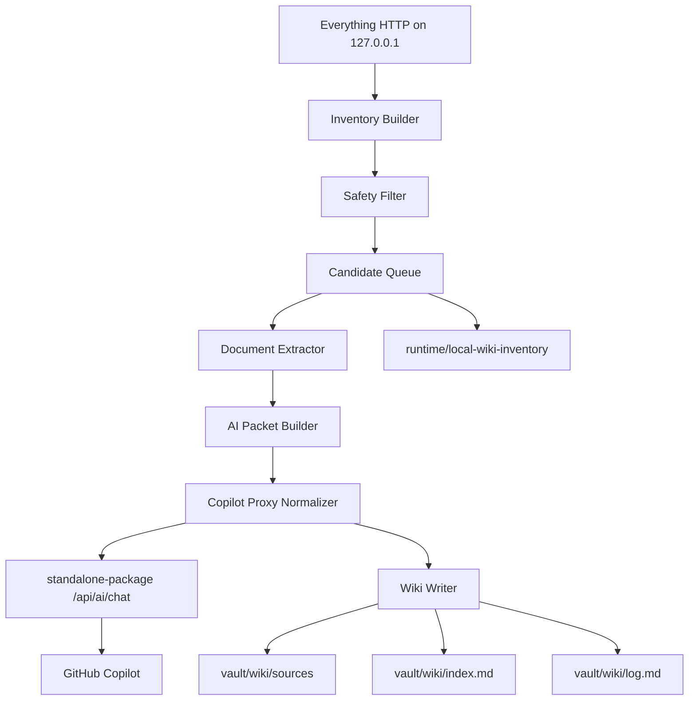

# Local Computer Knowledge Wiki Design

Date: 2026-04-16
Status: Revised for standalone-package Copilot proxy normalization
Scope: Design only for a repo-local test wiki at `C:\Users\SAMSUNG\Downloads\mcp_obsi-main\vault\wiki`

## 1. Goal

Build a local-computer knowledge wiki from files already present on the user's Windows machine.

The system should use Everything HTTP to discover candidate files across the local computer, safely filter and inventory those files, extract supported document content, normalize it through the `standalone-package` Copilot proxy, and write draft canonical knowledge notes into the repo-local test wiki.

The first implementation target is not a public search service. It is a local orchestration workflow for building a test Obsidian-style wiki, with external AI normalization allowed only through the local `standalone-package` proxy after user approval.

## 2. Confirmed User Choices

- Search/discovery target: local computer files.
- Discovery integration: Everything HTTP first; SDK/IPC remains a future provider option.
- Final knowledge destination: `vault/wiki` inside this repository.
- Ingest mode: PC-wide automatic discovery with safety filters, not unrestricted content ingestion.
- Normalization mode: external AI is allowed only through `standalone-package` and its `/api/ai/chat` Copilot proxy.
- Local LLM mode: Ollama, `local-rag`, LM Studio, llama.cpp, and other local inference engines are out of scope for this computer.
- Privacy posture: the user approves sending selected personal or business-sensitive extracted file packets to external AI through the standalone proxy. Credential-like material remains a hard stop, and the standalone proxy's own DLP and routing rules still apply.
- Supported extensions:
  - `.pdf`
  - `.docx`, `.doc`
  - `.xlsx`, `.xls`, `.xlsm`
  - `.md`, `.txt`, `.csv`, `.json`, `.log`

## 3. Repository Constraints

- Markdown in the vault remains the source of truth.
- `vault/wiki` is the canonical knowledge layer for this test workflow.
- `memory` must store only compact pointers if used later, not full document bodies.
- `mcp_raw` is for raw evidence archives and must not be treated as the wiki corpus.
- Existing storage policy prefers:
  - `vault/wiki/sources` for ingested source summaries
  - `vault/wiki/concepts` for durable concepts
  - `vault/wiki/entities` for people, organizations, systems, and products
  - `vault/wiki/analyses` for synthesized analyses
  - `vault/wiki/index.md` and `vault/wiki/log.md` for navigation and audit trail

## 4. External Integration Evidence

Everything official documentation supports an HTTP interface with JSON results and query parameters such as `search`, `count`, `json`, `path_column`, `size_column`, `date_modified_column`, `sort`, and `ascending`.

Everything official documentation also warns that the HTTP server can expose indexed files and folders for search and download. Therefore the design treats Everything HTTP as a local-only dependency and requires file download to be disabled in Everything settings.

Everything SDK/IPC is a valid long-term alternative because the official SDK provides DLL and Lib interfaces over IPC. It is deferred because Node native bindings and Windows DLL packaging add avoidable complexity for the first implementation.

The provided `standalone-package-20260311T084247Z-1-001\standalone-package` exposes `POST /api/ai/chat` and `GET /api/ai/health`, uses GitHub Copilot credentials, exchanges Copilot runtime tokens, and enforces DLP, routing, CORS, and token authentication. Its default model is `github-copilot/gpt-5-mini`. Requests with `sensitivity: "secret"` are routed to local-only inference, which is not available in this package, so Copilot normalization must use `sensitivity: "internal"`.

## 5. Design Summary

```text
Everything HTTP
  -> PC-wide candidate discovery
  -> metadata-only inventory
  -> exclusion and allow rules
  -> candidate queue
  -> document extraction
  -> standalone-package Copilot proxy normalization
  -> vault/wiki/sources draft notes
  -> vault/wiki/index.md and vault/wiki/log.md
```

The workflow is automatic in discovery and candidate preparation, but conservative in content ingestion. Files are not modified. Files that fail safety checks are skipped with an audit reason.

## 6. Architecture



### 6.1 `EverythingSearchProvider`

Responsibility:

- Query Everything HTTP.
- Return file metadata only.
- Normalize result shape for the rest of the pipeline.
- Hide Everything-specific query parameters behind an interface that can later be backed by SDK/IPC.

Provider contract:

```ts
type EverythingSearchProvider = {
  search(input: {
    query: string;
    limit: number;
    sort?: "name" | "path" | "date_modified" | "size";
    ascending?: boolean;
  }): Promise<FileCandidate[]>;
};
```

Candidate shape:

```ts
type FileCandidate = {
  name: string;
  path: string;
  extension: string;
  size?: number;
  modifiedAt?: string;
  source: "everything-http";
};
```

### 6.2 `InventoryBuilder`

Responsibility:

- Run broad Everything searches for supported document extensions.
- Save metadata snapshots under `runtime/local-wiki-inventory`.
- Avoid reading document bodies.
- Target per-file status model:
  - `discovered`
  - `excluded`
  - `queued`
  - `ingested`
  - `failed`

Current implementation note: `scripts/local_wiki_inventory.py` writes `queued` and `excluded` inventory entries only. Post-ingest inventory status updates to `ingested` or `failed` are deferred; ingest results are currently reported by `scripts/local_wiki_ingest.py` and wiki/log writes.

The inventory is operational state, not canonical knowledge.

### 6.3 `SafetyFilter`

Responsibility:

- Exclude high-risk folders.
- Exclude high-risk filenames.
- Enforce size limits.
- Enforce extension support.
- Detect likely credentials before wiki writing.
- Do not use ordinary personal or business-sensitive content as a local-wiki skip reason after explicit user approval; only credential-like material is a repo-local hard stop.

Default excluded paths:

- `C:\Windows`
- `C:\Program Files`
- `C:\Program Files (x86)`
- `C:\Users\SAMSUNG\AppData`
- `.git`
- `node_modules`
- `.venv`
- `dist`
- `build`
- `.cache`
- browser profile folders
- authentication, token, key, and secret folders

Default priority include roots:

- `C:\Users\SAMSUNG\Downloads`
- `C:\Users\SAMSUNG\Documents`
- `C:\Users\SAMSUNG\Desktop`
- `C:\Users\SAMSUNG\OneDrive`
- `C:\Users\SAMSUNG\Downloads\mcp_obsi-main`

PC-wide discovery may list files outside these roots. Priority-root ordering is a design target; the current `classify_candidate()` implementation applies exclusion, size, and extension filters, then preserves Everything result order.

### 6.4 `DocumentExtractor`

Responsibility:

- Read selected or queued files in read-only mode.
- Extract text and structured summaries.
- Return bounded context for AI normalization.
- Record unsupported or failed extraction without stopping the batch.

Support levels:

| Extension | First-pass behavior |
| --- | --- |
| `.md`, `.txt`, `.log` | Read text with encoding fallback and size limits |
| `.csv` | Read headers and sampled rows, preserve delimiter evidence |
| `.json` | Parse JSON when possible, otherwise treat as text |
| `.pdf` | Extract text PDF content; mark scanned/OCR-only PDFs as limited |
| `.docx` | Extract paragraphs and tables |
| `.xlsx`, `.xlsm` | Extract workbook metadata, sheet names, headers, sampled rows; never execute macros |
| `.doc`, `.xls` | Limited support; skip or mark conversion needed unless a safe extractor is available |

### 6.5 `CopilotProxyNormalizer`

Responsibility:

- Build a bounded AI packet from extracted content.
- Send the packet to `standalone-package` `POST /api/ai/chat`.
- Convert the Copilot response into a wiki-ready normalized JSON object.
- Produce title, summary, topics, entities, projects, tags, and key facts.
- Keep output concise enough for a source summary note.
- Avoid full raw dumps by default; use bounded excerpts and compact structure hints.
- Fall back to deterministic normalization when the proxy is unavailable, blocked by DLP, rate-limited, or returns invalid JSON.
- Default Copilot packet profile is compact: excerpt is capped at 4,000 characters and structure hints are capped at 10 lines.
- Serialize the Copilot user packet as compact JSON, not pretty-printed JSON, to reduce request size.

Current packet contract:

- `source_path`
- `source_ext`
- `extraction_status`
- `extraction_reason`
- `text_length`
- `excerpt`
- `structure_hints`

Richer table/schema summaries and additional source metadata are deferred enhancements.

Standalone request defaults:

```json
{
  "model": "github-copilot/gpt-5-mini",
  "sensitivity": "internal",
  "messages": [
    {
      "role": "system",
      "content": "Return JSON only for local file wiki normalization."
    },
    {
      "role": "user",
      "content": "{...bounded normalization packet...}"
    }
  ]
}
```

Rules:

- Do not use `sensitivity: "secret"` for Copilot normalization because the current standalone package routes `secret` to local-only inference and has no local runner.
- Use `MYAGENT_PROXY_ALLOW_SANITIZED_TO_COPILOT=1` for performance mode when the user has approved external AI handling of personal or sensitive content.
- Keep high and critical DLP behavior under standalone control. Private keys, bearer tokens, password assignments, and other hard-blocked material must be skipped or manually handled.
- Validate model output as JSON before passing it to `WikiWriter`.
- Current audit behavior records note write results and Copilot fallback reasons in `IngestResult.reason`. The Copilot client returns route/model/DLP/usage metadata when available, but persisting that detailed metadata into wiki frontmatter or `vault/wiki/log.md` is pending.

Expected output:

```json
{
  "title": "Example Source Title",
  "summary": "Concise Korean summary.",
  "key_facts": ["Fact one"],
  "extracted_structure": ["Sheet names, headings, sections, or schema summary"],
  "topics": ["local-file"],
  "entities": [],
  "projects": [],
  "tags": ["local-wiki", "auto-ingest"],
  "confidence": "medium"
}
```

### 6.6 `WikiWriter`

Responsibility:

- Create `vault/wiki` if it does not exist.
- Create required subfolders if they do not exist.
- Write source notes under `vault/wiki/sources`.
- Update `vault/wiki/index.md`.
- Append audit rows to `vault/wiki/log.md`.

First-pass notes are always `status: draft`.

## 7. Wiki Note Contract

File path:

```text
vault/wiki/sources/<slug>.md
```

Frontmatter:

```yaml
---
type: local_file_knowledge
status: draft
title: Example Source Title
source_path: "C:\\Users\\SAMSUNG\\Documents\\example.pdf"
source_ext: ".pdf"
source_size: 123456
source_modified_at: "2026-04-15T10:20:00"
extraction_status: ok
ingested_at: "2026-04-16"
topics:
  - example
entities: []
projects: []
tags:
  - local-wiki
  - auto-ingest
---
```

Body:

```markdown
# Example Source Title

## Summary

Short summary of the local file.

## Key Facts

- Fact with source grounding.

## Extracted Structure

- File type, sheet names, headings, or major sections.

## Source

- Path: `C:\Users\SAMSUNG\Documents\example.pdf`
- Extraction status: `ok`
```

## 8. Safety Rules

- Everything HTTP must be treated as loopback-only.
- Everything HTTP file download must be disabled.
- `/api/files/*` routes in `standalone-package`, if added, must be disabled in public mode.
- AI normalization must call Copilot only through `standalone-package`, not directly from the ingest script.
- Local LLM providers are not used on this computer.
- Copilot normalization requests must use `sensitivity: "internal"` unless the standalone routing policy changes later.
- Performance mode may set `MYAGENT_PROXY_ALLOW_SANITIZED_TO_COPILOT=1` after explicit user approval.
- File bodies are read only after filters pass.
- Source files are never modified.
- `.xlsm` macros are never executed.
- Target behavior: standalone high or critical DLP blocks should stop Copilot normalization for that file.
- Current behavior: the ingest code catches standalone request failures, including `422`, and falls back to deterministic normalization while recording the fallback reason. Separately, repo-local `local_wiki_has_credential_pattern()` still skips token/password-like extracted text before wiki writing.
- Secrets, tokens, private keys, password assignments, and high-entropy credentials must not be written into wiki notes.
- Personal identifiers, business notes, internal budgets, and similar non-credential sensitive content may be sent to the standalone Copilot proxy in performance mode after explicit user approval.
- Large files are sampled or skipped rather than fully dumped into AI context.
- Generated wiki notes must not include full document bodies by default.
- Every skip and failure must be logged with a reason.

## 9. Output Paths

Required test wiki paths:

```text
vault/wiki/index.md
vault/wiki/log.md
vault/wiki/sources/
vault/wiki/concepts/
vault/wiki/entities/
vault/wiki/analyses/
```

Operational paths:

```text
runtime/local-wiki-inventory/
runtime/local-wiki-inventory/latest.json
runtime/local-wiki-inventory/runs/<timestamp>.json
```

## 10. Acceptance Criteria

1. The workflow can create the repo-local `vault/wiki` tree when missing.
2. The workflow can query Everything HTTP and produce a metadata-only inventory.
3. The workflow excludes high-risk folders and high-risk filenames by default.
4. The workflow can ingest at least one safe file from each fully supported group:
   - text or markdown
   - CSV or JSON
   - PDF text document
   - DOCX
   - XLSX or XLSM without macro execution
5. Each ingested file creates one draft note under `vault/wiki/sources`.
6. Each draft note includes normalized frontmatter arrays for `topics`, `entities`, `projects`, and `tags`.
7. `vault/wiki/index.md` and `vault/wiki/log.md` are updated.
8. Unsupported `.doc`, `.xls`, and OCR-only PDFs are skipped or marked as limited with an audit reason.
9. No raw full document body is duplicated into `memory`.
10. No source file is modified.
11. When Copilot normalization is enabled, the workflow calls `standalone-package` `/api/ai/chat` with `sensitivity: "internal"` and records fallback reason in `IngestResult.reason` when fallback occurs. Route, model, DLP status, and usage persistence into wiki/log output is deferred.
12. If Copilot normalization fails or returns invalid JSON, deterministic normalization still produces a draft note or a clear skip reason.

Current validation status:

- Implemented and tested: text/markdown, CSV/JSON, XLSX/XLSM metadata extraction without macro execution, deterministic ingest, Copilot packet/client parsing, and Copilot fallback.
- Implemented and tested: Copilot mode prefers cleaner extensions before PDF in this order: `.md/.txt`, `.csv/.json/.log`, `.docx`, `.xlsx/.xlsm`, `.pdf`.
- Implemented and tested: Copilot mode pushes low-value tool/trash paths such as `.codex`, `.cursor`, and `$Recycle.Bin` behind normal document candidates.
- Implemented and tested: Copilot dry-run continues to the next candidate after a Copilot fallback and returns the first candidate that actually normalizes through Copilot; if every candidate falls back, fallback dry-run results are returned.
- Latest focused verification: `tests/test_local_wiki_copilot.py` plus `tests/test_local_wiki_ingest.py` pass with 21 tests.
- Latest standalone smoke: `GET /api/ai/health` returned HTTP 200 and `scripts/local_wiki_ingest.py --normalizer copilot --dry-run --limit 1` completed without fallback for `C:\HVDC_WORK\REPORTS\기성\GM202603\260412_UAE HVDC_(Globalmaritime)_MWS 기성(13차) 집행의 건.docx` with reason `would write wiki note; normalizer=copilot`.
- Implemented but not fully covered by live fixture tests: real PDF and DOCX extraction paths.
- Deferred: post-ingest inventory status updates and detailed Copilot route/model/DLP/usage persistence into wiki/log output.

## 11. Validation Commands

Initial repository checks:

```powershell
.\.venv\Scripts\python.exe -m pytest -q
.\.venv\Scripts\python.exe -m ruff check .
.\.venv\Scripts\python.exe -m ruff format --check .
```

Targeted workflow checks to add during implementation:

```powershell
.\.venv\Scripts\python.exe scripts\local_wiki_inventory.py --dry-run
.\.venv\Scripts\python.exe scripts\local_wiki_ingest.py --dry-run --limit 5
.\.venv\Scripts\python.exe scripts\local_wiki_ingest.py --limit 1
```

Standalone proxy checks when Copilot normalization is enabled:

```powershell
cd C:\Users\SAMSUNG\Downloads\mcp_obsi-main\standalone-package-20260311T084247Z-1-001\standalone-package
$env:CI="true"; pnpm install --frozen-lockfile
node dist\cli.js token --json
node dist\cli.js serve --host 127.0.0.1 --port 3010
Invoke-WebRequest -UseBasicParsing -Uri "http://127.0.0.1:3010/api/ai/health" -TimeoutSec 5
```

Do not print the token returned by `node dist\cli.js token --json`. `pnpm token` maps to the package-manager registry command in this environment and is not the verified standalone runtime-token path.

Copilot normalization smoke request should use:

```json
{
  "model": "github-copilot/gpt-5-mini",
  "sensitivity": "internal",
  "messages": [
    { "role": "user", "content": "Return JSON only: {\"title\":\"Ping\",\"summary\":\"pong\"}" }
  ]
}
```

Manual verification:

- Confirm Everything HTTP is bound to localhost.
- Confirm Everything file download is disabled.
- Open `vault/wiki/sources` and inspect generated notes.
- Confirm `vault/wiki/log.md` contains the ingest run.

## 12. Stop Conditions

Stop the ingest run if any of the following occurs:

- Everything HTTP is reachable from a non-loopback address.
- Standalone proxy routes a normalization request to `local` because the request used `secret` or an incompatible DLP policy.
- Standalone proxy repeatedly returns DLP or validation blocks, such as `422`, for the extracted packet after packet shrinking or manual review.
- The workflow attempts to write outside `vault/wiki` or `runtime/local-wiki-inventory`.
- More than the configured failure threshold is reached.
- Any source file modification is detected.
- The wiki writer cannot update `index.md` or `log.md` safely.

## 13. Deferred Work

- Everything SDK/IPC provider.
- Full OCR for scanned PDFs.
- Safe conversion for `.doc` and `.xls`.
- Obsidian memory pointer registration through `save_memory`.
- Promotion workflow from `sources` to `concepts`, `entities`, and `analyses`.
- Duplicate clustering and cross-note link generation.
- Visual review UI for candidate queue approval.
- Local LLM normalization through Ollama, `local-rag`, LM Studio, or llama.cpp.

## 14. Implementation Defaults

The first implementation should be script-first, not server-route-first.

Default scripts:

```text
scripts/local_wiki_inventory.py
scripts/local_wiki_ingest.py
scripts/local_wiki_copilot.py
```

Default Everything HTTP configuration:

- Read `EVERYTHING_HTTP_BASE_URL` from the environment.
- If it is unset, default to `http://127.0.0.1:8080`.
- Refuse non-loopback hosts unless the user explicitly changes the design later.
- Do not add public `standalone-package` routes in the first implementation.

Default standalone Copilot configuration:

- Use the existing standalone package at `standalone-package-20260311T084247Z-1-001\standalone-package`.
- Default endpoint: `http://127.0.0.1:3010/api/ai/chat`.
- Default model: `github-copilot/gpt-5-mini`.
- Default sensitivity: `internal`.
- Recommended performance setting after user approval: `MYAGENT_PROXY_ALLOW_SANITIZED_TO_COPILOT=1`.
- Refuse `secret` sensitivity because it requires a local runner that is intentionally unavailable.
- Warm the Copilot runtime token before large ingest runs with `node dist\cli.js token --json`; do not print the token value.
- Keep `MYAGENT_HOME` on a writable local path so token cache reuse works.

Default size limits:

| File group | Limit |
| --- | --- |
| `.md`, `.txt`, `.csv`, `.json` | 5 MB |
| `.log` | 2 MB, sampled around relevant terms when possible |
| `.pdf`, `.docx` | 20 MB |
| `.xlsx`, `.xlsm` | 20 MB or 25 sheets, whichever is reached first |
| `.doc`, `.xls` | skipped by default |

Default extraction dependencies:

- Use existing `openpyxl` and `pandas` where spreadsheet support is needed.
- Add PDF and DOCX extraction dependencies only in the implementation plan after checking the repo dependency policy.
- Do not use Windows COM automation in the first implementation.

Default note filename:

```text
<slug>-<short-source-path-hash>.md
```

The hash avoids collisions while keeping note names human-readable.
