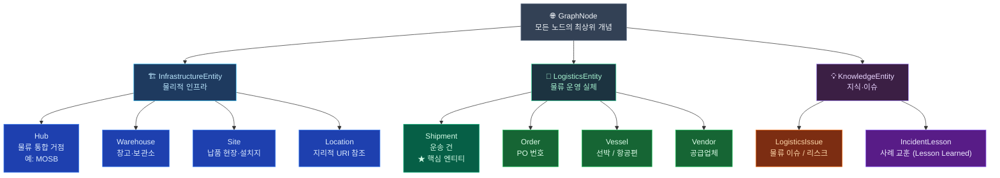
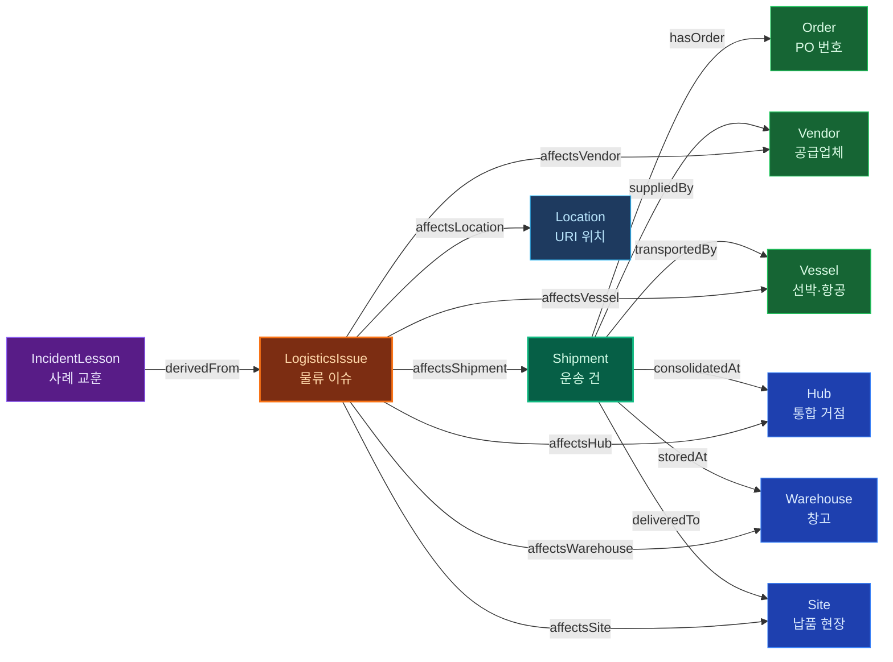
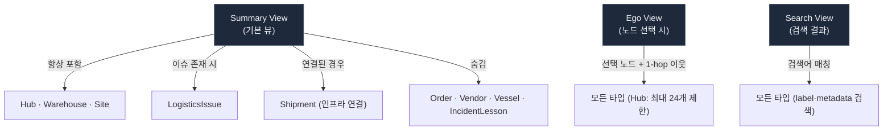

# KG Dashboard — Node Type Ontology

> 소스 기준: `scripts/build_dashboard_graph_data.py`, `kg-dashboard/src/utils/graph-model.ts`, `kg-dashboard/src/types/graph.ts`

---

## 1. 개념 계층 (상위 → 하위)

---

## 2. 운영 관계 그래프 (엣지 레이블 포함)

---

## 3. 노드 타입 상세 표

| 타입 | 카테고리 | Excel 소스 컬럼 | 관계 (엣지) | 대시보드 역할 |
|---|---|---|---|---|
| **Shipment** | LogisticsEntity | `SHIP NO.` | 모든 엣지의 출발점 | Summary·Ego·Search 모든 뷰 노출 |
| **Order** | LogisticsEntity | `PO No.` | ← hasOrder | Ego·Search·Ontology 필터 시 노출 |
| **Vendor** | LogisticsEntity | `VENDOR` | ← suppliedBy | Ego·Search·Ontology 필터 시 노출 |
| **Vessel** | LogisticsEntity | `VESSEL NAME/ FLIGHT No.` | ← transportedBy | Ego·Search·Ontology 필터 시 노출 |
| **Hub** | InfrastructureEntity | `MOSB` (고정값 "MOSB") | ← consolidatedAt | Summary 뷰 포함, HOTSPOTS KPI 산정 |
| **Warehouse** | InfrastructureEntity | `WAREHOUSE_COLUMNS` 목록 | ← storedAt | Summary 뷰 포함 |
| **Site** | InfrastructureEntity | `SITE_COLUMNS` 목록 | ← deliveredTo | Summary 뷰 포함 |
| **Location** | InfrastructureEntity | 이슈 태그 URI | ← affectsLocation | 이슈 연결 시에만 등장 |
| **LogisticsIssue** | KnowledgeEntity | 메모리 노트 frontmatter | → 모든 인프라/운영 노드 | Summary 뷰 ISSUES KPI |
| **IncidentLesson** | KnowledgeEntity | 메모리 노트 (class: IncidentLesson) | → LogisticsIssue | 기본 뷰 숨김, Lesson 필터 시 노출 |

---

## 4. 대시보드 뷰별 노출 규칙

---

## 5. 동적 속성

| 속성 | 대상 타입 | 조건 | 설명 |
|---|---|---|---|
| `isHubNode` (동적) | Hub | `degree >= 200` | 타입 무관, 연결 수 기준으로 Hub 식별 |
| `collapsedShipmentCount` | Hub | Ego 뷰에서 접힌 경우 | 그룹화된 Shipment 수 표시 |
| `collapsedVesselCount` | Hub | Ego 뷰에서 접힌 경우 | 그룹화된 Vessel 수 표시 |
| `collapsedVendorCount` | Hub | Ego 뷰에서 접힌 경우 | 그룹화된 Vendor 수 표시 |
| `analysisPath` | LogisticsIssue · IncidentLesson | 분석 노트 연결 시 | 볼트 내 분석 파일 경로 |

---

> 문서 생성: 2026-04-14  
> 소스 파일: `scripts/build_dashboard_graph_data.py` · `kg-dashboard/src/utils/graph-model.ts`
