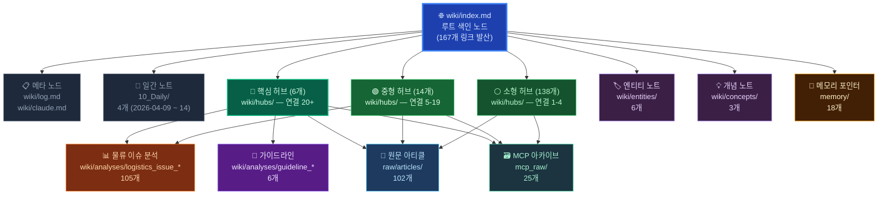
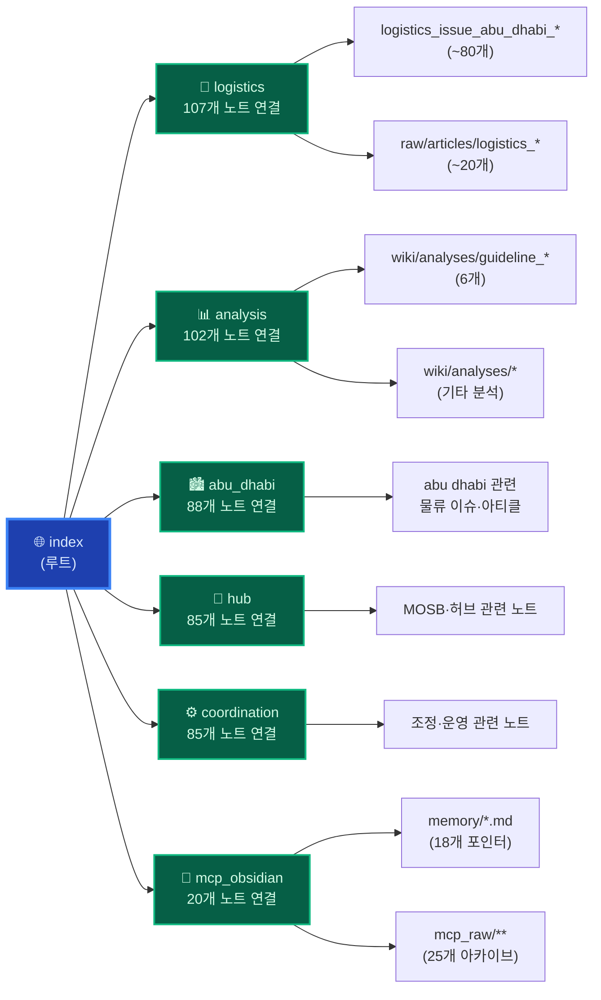
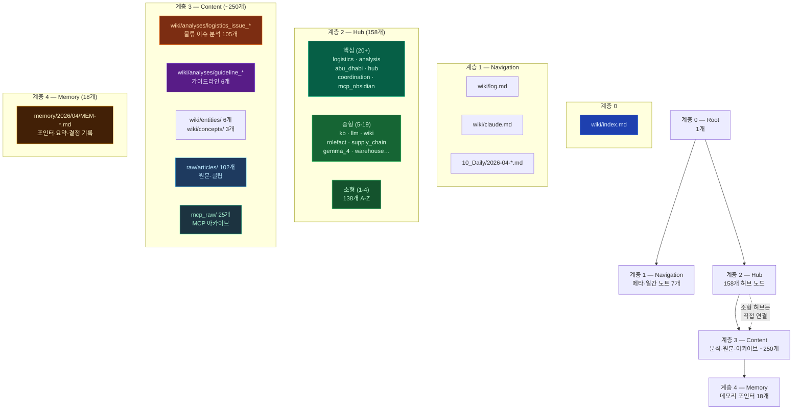
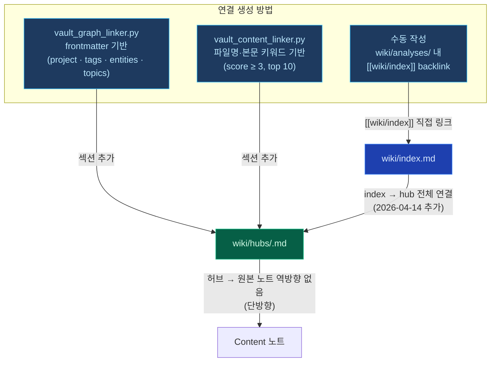

# Obsidian Vault — 그래프 계층 구조 문서

> 기준 날짜: 2026-04-14  
> 볼트 경로: `C:\Users\SAMSUNG\Documents\Vault`  
> 총 노트: ~560개 | 허브: 158개 | 분석: 115개 | 원문: 102개

---

## 1. 전체 계층 구조 (Top-Down)

---

## 2. 핵심 허브 연결 상세 (상위 6개)

---

## 3. 노드 타입 계층 정의

---

## 4. 링크 방향 및 연결 규칙

---

## 5. 폴더 구조 요약표

| 계층 | 경로 | 노트 수 | 역할 | 연결 방향 |
|---|---|---|---|---|
| **0 — Root** | `wiki/index.md` | 1 | 전체 색인, 모든 허브로 발산 | → 허브 158개 |
| **1 — Navigation** | `wiki/log.md`, `wiki/claude.md`, `10_Daily/` | 7 | 메타·일간 기록 | ← index |
| **2 — Hub (핵심)** | `wiki/hubs/` (note_count ≥ 20) | 6 | 대형 클러스터 앵커 | ↔ Content |
| **2 — Hub (중형)** | `wiki/hubs/` (5 ≤ count < 20) | 14 | 중형 토픽 집결 | ↔ Content |
| **2 — Hub (소형)** | `wiki/hubs/` (count < 5) | 138 | 단일 토픽 연결 | → Content |
| **3 — Analysis** | `wiki/analyses/logistics_issue_*` | 105 | 물류 이슈 분석 노트 | ← 허브 · → index |
| **3 — Guideline** | `wiki/analyses/guideline_*` | 6 | 가이드라인 문서 | ← 허브 · → index |
| **3 — Entity/Concept** | `wiki/entities/`, `wiki/concepts/` | 9 | 엔티티·개념 정의 | ← 허브 |
| **3 — Article** | `raw/articles/` | 102 | 원문·웹클립 | ← 허브 |
| **3 — Archive** | `mcp_raw/` | 25 | MCP 대화 아카이브 | ← 허브 |
| **4 — Memory** | `memory/2026/04/` | 18 | MCP 메모리 포인터 | ← mcp_obsidian 허브 |

---

## 6. 그래프 뷰 노드 크기 해석

Obsidian 그래프 뷰에서 노드 크기 = 백링크(연결) 수 기준:

| 노드 크기 | 해당 노드 | 연결 수 |
|---|---|---|
| **초대형** | `wiki/hubs/logistics` | 107+ |
| **대형** | `wiki/hubs/analysis`, `abu_dhabi`, `hub`, `coordination` | 85-102 |
| **중형** | `wiki/index.md` | 167 (outlink 기준) |
| **소형** | 나머지 허브·콘텐츠 노트 | 1-20 |

> **Note**: `index.md`는 outlink(발신 링크) 167개이나 backlink(수신)는 46개.  
> 허브 노드들이 `index`를 역링크하지 않아 그래프 뷰에서 index 노드 크기가 작게 표시될 수 있음.

---

> 생성: 2026-04-14  
> 관련 스크립트: `scripts/vault_graph_linker.py` · `scripts/vault_content_linker.py` · `scripts/vault_dedup.py`  
> 관련 문서: `kg-dashboard/node-type-ontology.md` · `kg-dashboard/그래프 TTL 자료 생성 관련 파일.md`
