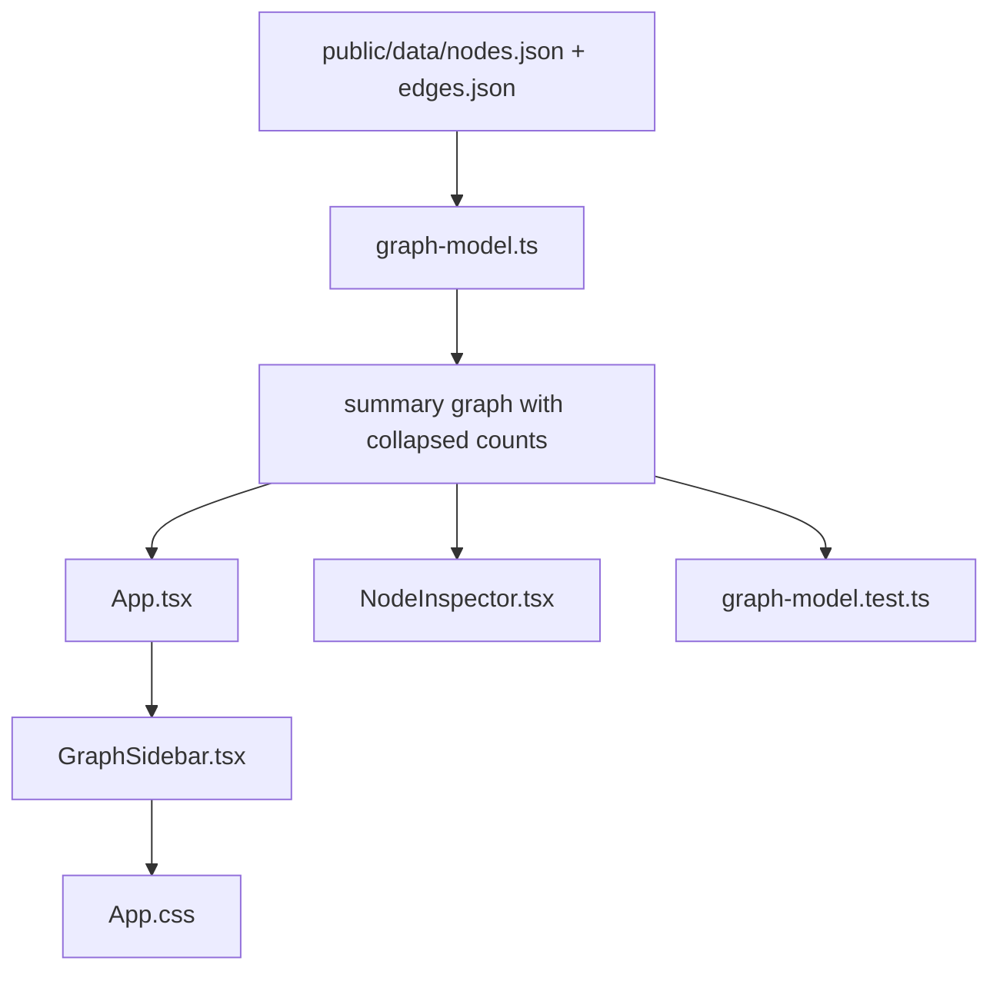

# kg-dashboard Next-Step Plan 2026-04-10

기준:
- `kg-dashboard/plan-2026-04-10.md`
- 현재 Option A 프로토타입 구현 상태
- 현재 세션에서 확인한 `public/data/*.json` 데이터 계약

범위:
- 이번 문서는 "다음 구현 순서"를 고정하기 위한 승인용 계획이다.
- 구현은 포함하지 않는다.

가정:
- 현재 summary 뷰는 `Hub summary`만 화면에 노출한다.
- 현재 `Site`와 `Warehouse`도 같은 방식의 collapsed shipment count를 계산할 수 있다.
- 현재 `nodes.json`에는 정규화된 date/time 필드가 없다.
- 현재 워크스페이스에는 `vault/knowledge_graph.ttl`이 없다.

## Phase 1: Business Review

### 1.1 문제 정의

현재 상태 vs 목표 상태:
현재 `kg-dashboard`는 `Hub summary`로 MOSB의 숨겨진 shipment 수를 보여 줄 수 있지만, 같은 수준의 숨김 수치를 `Site`와 `Warehouse`에는 아직 노출하지 않는다. 목표 상태는 사용자가 summary 화면에서 핵심 인프라 전체의 숨김 물량을 바로 읽을 수 있게 하거나, 아니면 UI 확장을 멈추고 timeline 기능에 필요한 날짜 데이터 계약부터 먼저 정리하는 것이다.

영향 범위:
- 현재 summary에서 숨김 집계를 바로 확장 가능한 인프라 노드: `Hub 1`, `Site 4`, `Warehouse 10`
- 현재 세션 확인 결과, `Site / Warehouse`도 collapsed count가 계산됨
- 현재 세션 확인 결과, `nodes.json`의 정규화된 `date/time` 필드는 `0개`
- 현재 세션 확인 결과, `vault/knowledge_graph.ttl`은 워크스페이스에 없음

### 1.2 제안 옵션

| 옵션 | 설명 | 공수(일) | 리스크 | 비용(AED) |
|------|------|---------|--------|----------|
| A | `Hub summary`를 `Site / Warehouse`까지 확장한다. summary 화면에서 핵심 인프라 전체의 숨김 shipment/vessel/vendor 수를 읽게 만든다. | 0.5 ~ 1 | 낮음 | 0 |
| B | UI 확장은 여기서 멈추고 `timeline filter`를 위한 날짜 정규화 계약부터 잡는다. `ttl -> json` 파이프라인과 `nodes.json` 스키마를 먼저 바꾼다. | 2 ~ 3 | 중간 | 0 |

### 1.3 추천 & 근거

추천 옵션:
옵션 A

추천 이유:
- `Site / Warehouse` collapsed count는 현재 데이터만으로 바로 계산된다.
- `timeline filter`는 현재 `nodes.json`에 날짜 필드가 없어서 UI보다 데이터 계약 변경이 먼저다.
- 지금 단계에서는 UI 사용성을 더 빠르게 올리는 편이 안전하다.

롤백 전략:
`Site / Warehouse` 확장 후 화면이 너무 장황해지면, summary 카드를 `top N infra`만 보이도록 줄이고 나머지는 inspector로 보낸다.

### 1.4 승인 요청

- [x] Phase 1 승인 (`2026-04-10` 사용자 승인)

## Phase 2: Engineering Review

### 2.1 Mermaid 다이어그램

### 2.2 파일 변경 목록

| 파일 | 변경 유형 | 설명 |
|------|----------|------|
| `kg-dashboard/src/utils/graph-model.ts` | modify | `Hub`뿐 아니라 `Site`, `Warehouse`에도 collapsed shipment/vessel/vendor count를 일관되게 붙인다. |
| `kg-dashboard/src/App.tsx` | modify | summary 뷰에서 `Hub summary` 대신 `collapsed infra summary`를 내려 주고, type별 정렬 또는 top N 제한 규칙을 적용한다. |
| `kg-dashboard/src/components/GraphSidebar.tsx` | modify | 현재 `Hub summary` 블록을 `Infra summary` 블록으로 일반화하고 `Hub / Site / Warehouse`를 함께 표시한다. |
| `kg-dashboard/src/components/NodeInspector.tsx` | modify | 선택 노드가 `Site`, `Warehouse`일 때도 collapsed count를 같은 형식으로 보여 준다. |
| `kg-dashboard/src/App.css` | modify | summary 카드 수가 늘어날 때 패널 길이와 모바일 레이아웃이 무너지지 않도록 스타일을 보강한다. |
| `kg-dashboard/src/utils/graph-model.test.ts` | modify | `Site / Warehouse`에 대해 collapsed count가 계산되고 정렬 규칙이 유지되는지 테스트를 추가한다. |

이번 단계에서 제외:
- `kg-dashboard/src/components/GraphView.tsx`
- `scripts/build_knowledge_graph.py`
- `scripts/ttl_to_json.py`
- `tests/test_ttl_to_json.py`

제외 이유:
- 그래프 렌더러나 데이터 파이프라인을 건드리지 않아도 `Site / Warehouse` 확장은 현재 summary 메타만으로 처리 가능하다.

### 2.3 의존성 & 순서

1. `graph-model.ts`를 먼저 확장한다.
공유 모듈이다. 여기서 `Hub / Site / Warehouse` 공통 collapsed count 계약을 고정한다.

2. `graph-model.test.ts`를 바로 갱신한다.
공유 모듈이 바뀌는 순간 기대 동작을 테스트로 고정해 이후 UI 작업이 흔들리지 않게 한다.

3. `App.tsx`에서 summary 데이터 shape를 바꾼다.
현재 `hubSummaries`를 `infraSummaries`로 일반화하고 `type`, `label`, `shipment/vessel/vendor count`를 내려 준다.

4. `GraphSidebar.tsx`를 일반화한다.
현재 `Hub summary` 블록 제목, badge, 카드 표시 형식을 `Infra summary` 기준으로 바꾼다.

5. `NodeInspector.tsx`와 `App.css`를 정리한다.
선택 노드 상세와 스타일이 새 summary 범위와 맞는지 마무리한다.

병렬 작업 가능 경로:
- 경로 A: `graph-model.ts` + `graph-model.test.ts`
- 경로 B: `App.tsx` + `GraphSidebar.tsx`
- 경로 C: `NodeInspector.tsx` + `App.css`

공유 모듈 승인 지점:
- `graph-model.ts`의 summary 메타 shape가 정해진 뒤에만 `App.tsx`와 `GraphSidebar.tsx`를 붙인다.

### 2.4 테스트 전략

단위 테스트:
- `graph-model.test.ts`
- `Hub`, `Site`, `Warehouse` 각각에 대해 collapsed shipment/vessel/vendor count가 계산되는지 확인
- summary 확장 후에도 `buildSearchView()`와 `buildEgoView()`가 영향을 받지 않는지 확인
- `top N` 또는 정렬 규칙이 있다면 그 순서가 유지되는지 확인

통합 테스트:
- `npm run build`
- `npm run lint`
- `npm run test`

수동 검증:
- summary 화면에서 `Hub / Site / Warehouse` 카드가 함께 보이는지 확인
- 카드 수가 늘어도 모바일 레이아웃이 깨지지 않는지 확인
- `Site` 또는 `Warehouse`를 선택했을 때 inspector에 같은 collapsed count가 보이는지 확인
- 검색 또는 ego view로 들어갔을 때 summary 전용 카드가 오염되지 않는지 확인

기존 테스트 중 깨질 가능성이 있는 것:
- 현재 `graph-model.test.ts`는 `Hub` 중심 collapsed count만 기대할 수 있으므로 새 케이스 추가 시 기존 기대값을 함께 갱신해야 한다.

검증 명령:
- `npm run build`
- `npm run lint`
- `npm run test`

### 2.5 리스크 & 완화

성능 리스크:
- `Site / Warehouse`까지 summary 카드가 늘어나면 사이드바가 길어져 스캔 효율이 떨어질 수 있다.
- 완화: shipment count 기준 `top N`만 먼저 노출하고 나머지는 접거나 inspector에서 확인하게 한다.

호환성 리스크:
- summary 메타를 모든 infra 타입에 붙이면 `search`나 `ego`에서도 같은 메타가 남아 UI가 지저분해질 수 있다.
- 완화: collapsed summary 표시는 summary 뷰에서만 노출하고, 다른 뷰에서는 기존 표시를 유지한다.

데이터 계약 리스크:
- 현재 데이터에서는 `Shipment`만 크게 집계되고 `Vessel / Vendor`는 대부분 `0`일 수 있다.
- 완화: `0`값도 그대로 보여 주되, 이후 데이터 파이프라인이 바뀌면 같은 필드를 재사용할 수 있게 계약은 유지한다.

범위 리스크:
- `timeline filter`를 같이 묶으면 즉시 UI 작업에서 파이프라인 작업으로 범위가 바뀐다.
- 완화: 이번 단계는 `collapsed infra summary`로 한정하고, `timeline`은 별도 계획으로 유지한다.
