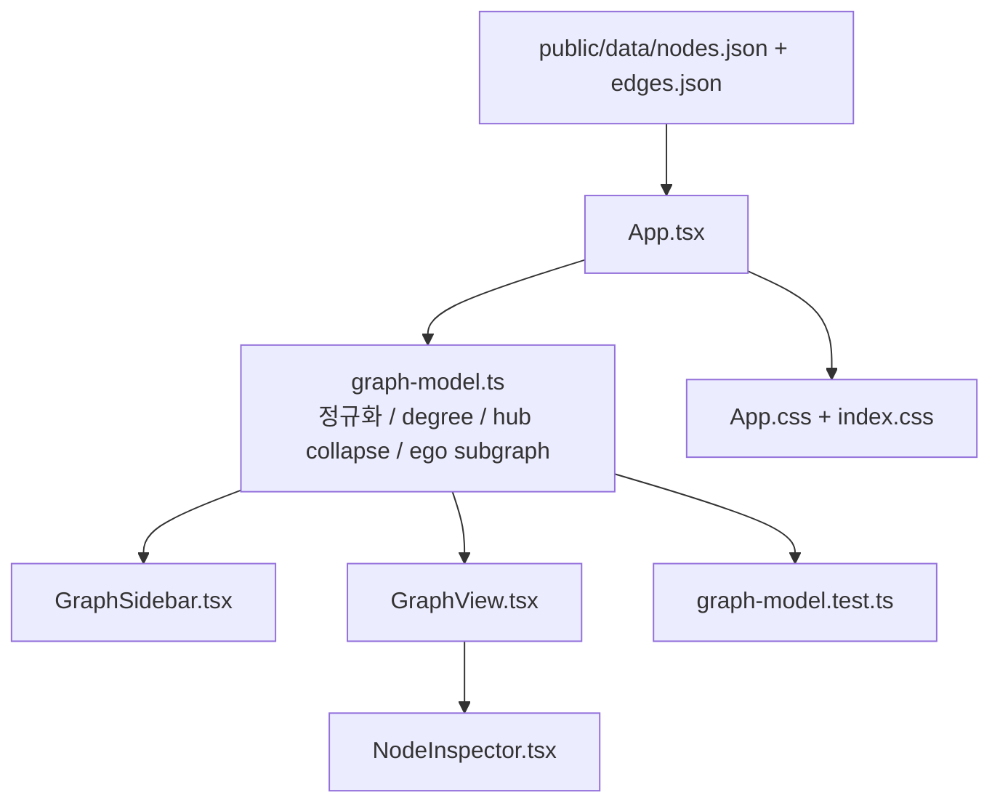

# kg-dashboard Plan 2026-04-10

기준 문서:
- `docs/superpowers/specs/2026-04-09-kg-visualization-design.md`
- `kg-dashboard/plan.md`
- 2026-04-10 공식 문서 기반 기술 벤치마크 결과

범위:
- 이번 계획은 `kg-dashboard` 프론트엔드와 정적 그래프 자산 사용 방식을 다룬다.
- 루트 Python 파이프라인의 상세 변경은 승인 후 Phase 2에서 연결한다.

가정:
- 현재 `kg-dashboard/public/data/nodes.json`, `edges.json`가 1차 데이터 소스로 유지된다.
- 현재 판단은 같은 세션에서 확인한 데이터 밀도와 공식 문서 기준 capability benchmark를 바탕으로 한다.
- Cosmograph 상용 사용 조건은 별도 라이선스 검토가 필요하다.
- 현재 워크스페이스에는 `vault/knowledge_graph.ttl`이 없으므로, 이번 Phase 2 1차안은 프론트엔드 UX 재설계에 집중하고 TTL 재생성 파이프라인 변경은 별도 승인 지점으로 둔다.

## Phase 1: Business Review

### 1.1 문제 정의

현재 상태 vs 목표 상태:
현재 `kg-dashboard`는 1,365개 노드와 16,094개 엣지를 한 화면에 바로 렌더링하는 Cytoscape 프로토타입인데, 허브 노드 degree가 890~955까지 올라가서 기본 진입 화면이 hairball로 무너진다. 목표 상태는 기본 진입을 검색 중심 또는 요약 중심으로 바꾸고, 허브 축약과 서브그래프 탐색을 통해 실제로 읽히는 대시보드를 만드는 것이다.

영향 범위:
- 현재 데이터 규모: 1,365 nodes / 16,094 edges / 평균 degree 23.58
- 주요 허브 degree: `MOSB 955`, `DSV_Indoor 895`, `MIR 893`, `SHU 893`, `DAS 890`
- 현재 품질 상태: `npm run build` 실패 3건, `npm run lint` 실패 7건
- 현재 UX 문제: 전체 그래프 기본 진입, 글로벌 force layout 재실행, 허브 노드 비축약, 클러스터 요약 부재

### 1.2 제안 옵션

| 옵션 | 설명 | 공수(일) | 리스크 | 비용(AED) |
|------|------|---------|--------|----------|
| A | `Cytoscape.js`를 유지하고 기본 진입을 검색/요약 중심으로 바꾼다. 허브 collapse, ego/subgraph 보기, preset 좌표, 줌 단계별 라벨 정책을 먼저 도입한다. | 3 | 낮음 | 0 |
| B | `G6 5.x`로 마이그레이션한다. Minimap, Timebar, EdgeBundling, OptimizeViewportTransform 같은 내장 기능을 이용해 대시보드를 다시 구성한다. | 5 | 중간 | 0 |
| C | `Cosmograph` 기반 분석형 대시보드로 재구성한다. GPU layout, clustering, histogram, timeline, cross-filter를 활용해 탐색형 UI로 전환한다. | 6 | 높음 | TBD |

### 1.3 추천 & 근거

추천 옵션:
옵션 A

추천 이유:
- 현재 그래프 크기는 Cytoscape.js 2025 WebGL preview가 다루는 예시 규모와 거의 같아서, 당장 엔진 교체보다 기본 진입 UX와 허브 축약이 더 큰 병목이다.
- 현재 코드와 데이터 계약을 가장 적게 흔들면서도 사용성 개선 효과를 가장 빨리 확인할 수 있다.
- 옵션 A 결과가 부족할 때만 옵션 B로 넘어가면 마이그레이션 비용을 통제할 수 있다.

롤백 전략:
허브 collapse와 search-first 진입을 적용한 뒤에도 대표 시나리오 3개가 여전히 읽히지 않으면, `public/data` 계약은 유지한 채 `G6 5.x` 래퍼로 교체한다.

### 1.4 승인 요청

- [x] Phase 1 승인 (`2026-04-10` 사용자 승인)

## Phase 2: Engineering Review

### 2.1 Mermaid 다이어그램

### 2.2 파일 변경 목록

| 파일 | 변경 유형 | 설명 |
|------|----------|------|
| `kg-dashboard/package.json` | modify | `test` 스크립트와 `vitest` 의존성을 추가해 그래프 변환 로직을 자동 검증한다. |
| `kg-dashboard/src/App.tsx` | modify | 전체 그래프 기본 진입을 제거하고 `summary / issue / search / ego` 뷰 모드를 관리한다. |
| `kg-dashboard/src/components/GraphView.tsx` | modify | 타입 오류를 정리하고, 전역 force layout 재실행 대신 안정된 뷰 렌더링과 선택 상태를 담당한다. |
| `kg-dashboard/src/main.tsx` | modify | 현재 빌드 오류를 만드는 불필요한 `StrictMode` import를 제거하고 엔트리 포인트를 정리한다. |
| `kg-dashboard/src/App.css` | modify | Vite 템플릿 CSS를 대시보드 전용 레이아웃과 패널 스타일로 교체한다. |
| `kg-dashboard/src/index.css` | modify | 템플릿 전역 스타일을 제거하고 전체 화면 레이아웃, 색 변수, 타이포그래피를 대시보드 기준으로 정리한다. |
| `kg-dashboard/src/types/graph.ts` | create | `node`, `edge`, `view mode`, `selection`, `summary` 타입을 분리해 `any`를 제거한다. |
| `kg-dashboard/src/utils/graph-model.ts` | create | adjacency index, degree map, hub 판정, summary graph, ego subgraph 계산을 한곳에 모은다. |
| `kg-dashboard/src/utils/graph-model.test.ts` | create | 허브 collapse, degree 계산, search-first 파생 뷰가 기대대로 동작하는지 검증한다. |
| `kg-dashboard/src/components/GraphSidebar.tsx` | create | 검색 진입, 허브 제외 토글, 이슈 전용 토글, 뷰 모드 전환 UI를 분리한다. |
| `kg-dashboard/src/components/NodeInspector.tsx` | create | 선택 노드 상세와 `obsidian://` 원본 링크를 별도 패널로 분리한다. |

파일 충돌 확인:
- 새 파일명 `src/types/graph.ts`, `src/utils/graph-model.ts`, `src/utils/graph-model.test.ts`, `src/components/GraphSidebar.tsx`, `src/components/NodeInspector.tsx`는 현재 디렉터리에서 충돌하지 않는다.

이번 1차안에서 제외:
- `scripts/build_knowledge_graph.py`
- `scripts/ttl_to_json.py`
- `tests/test_ttl_to_json.py`

제외 이유:
- 현재 세션 기준으로 `vault/knowledge_graph.ttl`이 워크스페이스에 없어서, 파이프라인 변경까지 한 번에 묶으면 범위가 불필요하게 커진다.

### 2.3 의존성 & 순서

1. `src/types/graph.ts`와 `src/utils/graph-model.ts`를 먼저 만든다.
공유 모듈이다. `App.tsx`, `GraphView.tsx`, `GraphSidebar.tsx`, `NodeInspector.tsx`가 모두 이 경로를 참조하게 된다.

2. `package.json`에 `vitest`와 `test` 스크립트를 추가한다.
공유 모듈이 생긴 뒤 바로 `graph-model.test.ts`를 붙여 자동 검증 경로를 확보한다.

3. `src/App.tsx`를 summary-first 또는 search-first 진입 구조로 바꾼다.
이 단계에서 기존 전체 그래프 기본 진입을 제거한다.

4. `src/components/GraphSidebar.tsx`, `src/components/NodeInspector.tsx`를 추가한다.
UI 분리를 먼저 끝내야 `GraphView.tsx`가 렌더러 역할에 집중할 수 있다.

5. `src/components/GraphView.tsx`를 안정화한다.
전역 force layout 반복을 줄이고, 선택된 서브그래프만 렌더링하는 경로를 붙인다.

6. `src/App.css`, `src/index.css`, `src/main.tsx`를 정리한다.
빌드 오류 제거와 템플릿 제거를 마지막 정리 단계로 묶는다.

병렬 작업 가능 경로:
- 경로 A: `types/graph.ts` + `utils/graph-model.ts` + `graph-model.test.ts`
- 경로 B: `GraphSidebar.tsx` + `NodeInspector.tsx` + CSS 시안
- 경로 C: `App.tsx` + `GraphView.tsx` 통합

공유 모듈 승인 지점:
- `src/utils/graph-model.ts`의 데이터 계약은 나머지 UI가 모두 의존하므로, 이 파일 형태가 정해진 뒤에 병렬 작업을 붙인다.

### 2.4 테스트 전략

단위 테스트:
- `graph-model.test.ts`
- `computeDegrees()`가 주요 허브 degree를 올바르게 계산하는지 확인
- `buildSummaryView()`가 초기 진입에서 전체 그래프 대신 축약된 노드 집합을 반환하는지 확인
- `buildEgoView()`가 `MOSB`, `DSV_Indoor`, `MIR` 같은 허브 선택 시 1-hop 또는 제한된 2-hop 서브그래프를 반환하는지 확인
- `applySearch()`가 검색 결과와 연관 이웃만 남기는지 확인

통합 테스트:
- 현재 저장소에는 프론트엔드 브라우저 테스트 프레임워크가 없다.
- 이번 1차안은 `npm run build`, `npm run lint`, `npm run test`와 수동 검증으로 통합 수준을 대신한다.

수동 검증:
- 초기 화면이 전체 그래프가 아니라 `summary` 또는 `search-first empty state`로 열리는지 확인
- `MOSB`, `DSV_Indoor`, `MIR` 검색 후 ego view가 읽을 수 있는 수준으로 줄어드는지 확인
- `focusIssue` 또는 허브 제외 토글에서 visible node/edge 수가 의미 있게 감소하는지 확인
- `LogisticsIssue` 선택 시 `obsidian://` 링크가 계속 보이는지 확인

기존 테스트 중 깨질 가능성이 있는 것:
- 루트의 `tests/test_ttl_to_json.py`는 이번 1차 범위에서 직접 바꾸지 않으므로 영향 가능성은 낮다.
- 다만 `package.json` 변경으로 프론트엔드 개발 워크플로가 바뀌므로 `npm install` 재실행이 필요할 수 있다.

검증 명령:
- `npm run lint`
- `npm run build`
- `npm run test`

### 2.5 리스크 & 완화

성능 리스크:
- 검색 입력이나 토글 변경마다 전체 `edges`를 반복 스캔하면 UX가 다시 느려질 수 있다.
- 완화: `graph-model.ts`에서 adjacency map과 degree map을 1회 계산하고, UI는 파생 결과만 읽는다.

호환성 리스크:
- Cytoscape WebGL preview는 공식 문서 기준으로도 preview 성격이 남아 있다.
- 완화: 이번 1차안은 WebGL 의존 없이 데이터 축소와 진입 UX 개선을 먼저 적용하고, WebGL은 선택 옵션으로만 둔다.

데이터 계약 리스크:
- 현재 워크스페이스에 `vault/knowledge_graph.ttl`이 없어 TTL 재생성 경로를 이 턴에서 검증할 수 없다.
- 완화: 이번 단계는 `public/data/*.json` 계약을 고정하고, 파이프라인 보강은 별도 승인으로 분리한다.

보안 리스크:
- `obsidian://` 링크를 node id 문자열 조작에만 의존하면 잘못된 파일 경로가 열릴 수 있다.
- 완화: `NodeInspector.tsx`에서 issue slug 파생 규칙을 한곳에 모으고, `LogisticsIssue`일 때만 링크를 노출한다.

## Coordinator Input Packet

objective:
- 전체 그래프 기본 진입을 제거하고, 실제로 읽히는 검색 중심 그래프 탐색 경험을 만든다.

non-negotiables:
- `kg-dashboard/public/data/*.json` 계약은 1차 유지
- `obsidian://` 원본 링크 동작 유지
- `npm run build`와 `npm run lint`를 복구
- 초기 화면에서 전체 그래프를 그대로 노출하지 않음
- 허브 노드는 집계 또는 collapse 없이 기본 화면에 전개하지 않음

acceptance criteria:
- 초기 화면은 전체 그래프가 아니라 `cluster summary`, `issue-only summary`, 또는 `search-first empty state` 중 하나로 시작한다.
- `MOSB`, `DSV_Indoor`, `MIR` 기준으로 선택 노드 ego/subgraph 보기가 동작한다.
- degree 200 이상 허브는 기본 화면에서 접히거나 집계된다.
- 필터 변경 시 매번 전체 force layout을 다시 돌리지 않는다.
- 확대 수준에 따라 라벨 노출 정책이 달라진다.

option set:
- Option A: Cytoscape 유지 + UX 재설계
- Option B: G6 5.x 마이그레이션
- Option C: Cosmograph 분석형 전환

required evidence:
- 변경 후 초기 화면 스크린샷
- `MOSB`, `DSV_Indoor`, `MIR` 선택 시 before/after 비교
- `npm run build`
- `npm run lint`
- 허브 collapse와 search-first 동작 영상 또는 캡처

test expectations:
- 수동 테스트: 전체 진입, 이슈 전용 진입, 검색 후 ego view
- 정적 검증: build, lint
- 데이터 검증: visible node/edge 수가 초기 화면에서 의미 있게 축소되는지 확인

pipeline-coordinator 추천 조건:
- Option A 프로토타입 이후에도 성능과 가독성 사이의 트레이드오프가 남거나, Option B/C 전환 여부를 별도 점수화해야 할 때
