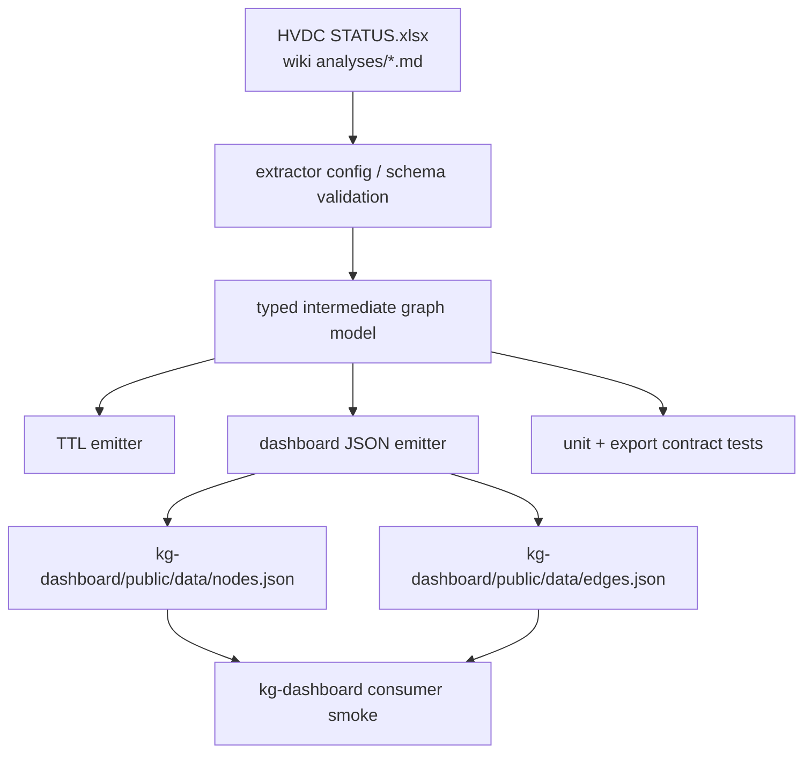

# kg-dashboard Data Extraction Rebuild Plan

Derived from the current `kg-dashboard/public/data` snapshot, `scripts/build_knowledge_graph.py`, `scripts/ttl_to_json.py`, the current dashboard consumer contract, and multi-lane analysis run on 2026-04-12.

This document scopes the rebuild of the data extraction logic that feeds:
- `kg-dashboard/public/data/nodes.json`
- `kg-dashboard/public/data/edges.json`

The immediate goal is to rebuild extraction logic, not to redesign the dashboard UI again.

Because the user explicitly requested planning, dispatch, orchestrated analysis, and independent verification in one turn, this document includes both Phase 1 and Phase 2 in one pass.

---

## Phase 1 — Business Review

### 1.1 문제 정의

**현재 상태**: `public/data` 산출물은 현재 `scripts/build_knowledge_graph.py`와 `scripts/ttl_to_json.py`의 느슨한 2단계 조합으로 만들어진다. 첫 번째 스크립트는 Excel과 wiki markdown를 하드코딩된 열 이름과 태그 규칙으로 읽어 TTL을 만들고, 두 번째 스크립트는 TTL을 다시 읽어 ad hoc JSON으로 평탄화한다. 이 과정에서 label/type/evidence가 손실되고, 정렬/ID/검증 규칙도 약하다. 대시보드는 이 JSON 배열을 그대로 읽기 때문에 산출물 drift가 바로 UI 문제로 이어진다.

**목표 상태**: 하나의 canonical extraction path가 source inputs를 읽고, typed intermediate graph model을 만든 뒤, deterministic TTL과 deterministic `nodes.json` / `edges.json`를 같은 규칙으로 출력한다. 입력 검증, JSON contract 검증, consumer smoke 검증이 붙어 `public/data` drift를 CI에서 막을 수 있어야 한다.

**영향 범위**:
- 현재 산출물 규모: `nodes.json = 1290`, `edges.json = 16025`
- 현재 node type 분포: `Shipment 890`, `Vessel 282`, `Vendor 42`, `Order 39`, `LogisticsIssue 13`, `Hub 1`, `Site 4`, `Warehouse 10`, `Unknown 1`, `rdf-schema#Class 8`
- 현재 리스크:
  - source schema가 코드에 하드코딩됨
  - JSON contract가 버전/manifest 없이 배열 2개에만 의존
  - `ttl_to_json.py` output ordering이 안정적이지 않음
  - `tests/test_ttl_to_json.py`는 happy path만 보고 contract drift를 못 막음

### 1.2 제안 옵션

| 옵션 | 설명 | 공수(일) | 리스크 | 비용(AED) |
|------|------|---------|--------|----------|
| A | 현 구조를 유지하고 `build_knowledge_graph.py` + `ttl_to_json.py`만 보강한다. 입력 검증과 deterministic sorting만 추가한다. | 1.5 | source ownership이 여전히 둘로 갈라져 drift가 남을 수 있다 | 0 |
| B | canonical extractor 모듈을 새로 두고 typed intermediate model을 만든 뒤, TTL/JSON emit를 한 경로에서 같이 생성한다. 현재 dashboard는 그대로 `nodes.json` / `edges.json`를 읽게 유지한다. | 3 | 중간 | 0 |
| C | extractor rebuild와 함께 dashboard consumer contract도 wrapper/manifest 기반으로 바꾼다. `schemaVersion`, `nodes`, `edges`, `provenance`를 가진 새 문서 포맷으로 전환한다. | 4.5 | 높음 | 0 |

### 1.3 추천 & 근거

**옵션 B 추천**: 지금 가장 큰 문제는 대시보드보다 extraction path가 분리돼 있다는 점이다. 옵션 A는 빨리 끝나지만 책임 경계가 계속 흐리고, 옵션 C는 프런트엔드까지 같이 흔들어 범위가 커진다. 옵션 B는 추출 경로를 다시 세우면서도 현재 dashboard consumer를 깨지 않는 가장 안정적인 재설계다.

**롤백**: 새 extractor는 기존 `scripts/build_knowledge_graph.py` / `scripts/ttl_to_json.py`를 바로 지우지 않고 병행 도입한다. 새 경로가 검증을 통과한 뒤에만 기존 경로를 deprecated 처리한다.

- [ ] **Phase 1 승인**

---

## Phase 2 — Engineering Review

### 2.1 Mermaid 다이어그램

### 2.2 파일 변경 목록

| 파일 | 변경 유형 | 설명 |
|------|----------|------|
| `scripts/build_knowledge_graph.py` | modify | legacy orchestration wrapper로 축소하거나 새 extractor 진입점으로 전환한다 |
| `scripts/ttl_to_json.py` | modify | pure deterministic renderer로 축소하거나 deprecated wrapper로 바꾼다 |
| `scripts/build_dashboard_graph_data.py` | create | canonical extractor entrypoint. source read → validation → typed graph → TTL/JSON emit를 한 번에 담당 |
| `tests/test_ttl_to_json.py` | modify | 단순 file existence test에서 JSON contract assertions를 추가한다 |
| `tests/test_dashboard_graph_export.py` | create | end-to-end fixture 기반 export test. source input → nodes/edges shape → referential integrity까지 확인 |
| `kg-dashboard/public/data/nodes.json` | regenerate | 새 extractor 결과로 재생성한다 |
| `kg-dashboard/public/data/edges.json` | regenerate | 새 extractor 결과로 재생성한다 |
| `README.md` | optional modify | kg-dashboard data pipeline 설명이 실제 extractor 경로와 맞도록 짧게 갱신한다 |

`create` 파일은 현재 이름과 충돌하지 않는다. `scripts/build_dashboard_graph_data.py`와 `tests/test_dashboard_graph_export.py`는 새 역할이 분명하고 기존 파일과 책임이 겹치지 않는다.

### 2.3 의존성 & 순서

1. **Step 0 — Consumer contract freeze**
   - `kg-dashboard/src/types/graph.ts`와 `App.tsx`가 현재 실제로 요구하는 최소 contract를 고정한다:
     - node: `data.id`, `data.label`, `data.type`, optional `rdf-schema#label`
     - edge: `data.source`, `data.target`, optional `data.label`
   - 이번 라운드에서는 dashboard consumer shape를 바꾸지 않는다.

2. **Step 1 — Source validation layer**
   - Excel required columns와 wiki frontmatter required keys를 명시한 validator를 먼저 만든다.
   - 여기서 실패하면 TTL/JSON emit 이전에 중단한다.

3. **Step 2 — Typed intermediate graph model**
   - `Shipment`, `Order`, `Vendor`, `Vessel`, `Hub`, `Warehouse`, `Site`, `LogisticsIssue`를 typed record로 정리한다.
   - source-specific string munging은 이 단계 이전에서 끝낸다.

4. **Step 3 — Emitters**
   - 같은 intermediate graph로 TTL과 dashboard JSON을 같이 생성한다.
   - JSON emitter는 stable sorting과 canonical edge keys를 갖는다.

5. **Step 4 — Contract tests**
   - parser fixture test와 export integration test를 붙인다.
   - `kg-dashboard` consumer smoke는 기존 npm test/lint/build로 유지한다.

6. **Step 5 — Artifact regeneration**
   - `kg-dashboard/public/data/*.json`를 새 extractor로 다시 생성한다.
   - old vs new count/type delta를 보고 문서화한다.

### 2.4 테스트 전략

- **단위 테스트**
  - `tests/test_ttl_to_json.py`
    - literal property extraction
    - URI edge extraction
    - node `type` extraction
    - deterministic output ordering
  - 새 `tests/test_dashboard_graph_export.py`
    - fixture Excel/markdown input
    - required node keys 존재
    - required edge keys 존재
    - dangling edge 0건
    - unexpected `Unknown` type 발생 여부

- **통합 테스트**
  - 새 extractor를 실행해 `kg-dashboard/public/data/nodes.json` / `edges.json` 생성
  - `kg-dashboard` consumer smoke:
    - `npm test`
    - `npm run lint`
    - `npm run build`

- **회귀 체크**
  - node/edge count delta
  - node type 분포 비교
  - edge label top distribution 비교
  - `LogisticsIssue` enrichment count 비교

- **검증 명령**
  - `.venv\Scripts\python.exe -m pytest tests/test_ttl_to_json.py -q`
  - `.venv\Scripts\python.exe -m pytest tests/test_dashboard_graph_export.py -q`
  - `npm test`
  - `npm run lint`
  - `npm run build`

### 2.5 리스크 & 완화

| 리스크 | 영역 | 완화 |
|---|---|---|
| 현재 dashboard consumer가 flat array만 기대해서 wrapper/manifest 전환 시 UI가 같이 깨질 수 있다 | 호환성 | 이번 라운드는 `nodes.json` / `edges.json` flat arrays를 유지한다 |
| source Excel column drift가 extractor를 자주 깨뜨릴 수 있다 | 입력 안정성 | required column validator와 clear error report를 먼저 만든다 |
| wiki note frontmatter parsing이 regex 기반이라 slug/title/tag drift가 생긴다 | 의미 손실 | markdown parsing을 frontmatter-aware helper로 분리하고 required key check를 붙인다 |
| deterministic sorting이 없으면 artifact diff가 noisy해진다 | 운영 품질 | node/edge sort key를 명시적으로 고정한다 |
| `Unknown` node type가 계속 섞이면 summary/search weighting이 흔들린다 | consumer 품질 | export test에서 `Unknown` 허용 범위를 명시하고 초과 시 실패시킨다 |

### 2.6 Dispatch Recommendation

- **chosen mode**: lead-led split with parallel explorers, then local implementation
- **file count estimate**: 6 to 8 files
- **coupling risk**: medium
  - source validation, typed model, and emitters are shared
  - `kg-dashboard/public/data` artifacts are generated outputs and should not be hand-edited
- **ownership split when implementation starts**
  - Lead: canonical extractor entrypoint + emitted contract
  - Worker 1: source validation + wiki/excel normalization
  - Worker 2: tests + consumer contract assertions
- **validation steps**
  - Python export tests
  - regenerated artifact diff check
  - dashboard npm smoke checks
- **rollback risk**
  - moderate
  - generated JSON can drift visibly; regenerate and revert in one commit if needed

### 2.7 Coordinator Input Packet

objective:
- rebuild the data extraction logic feeding `kg-dashboard/public/data` so the export is deterministic, validated, and consumer-safe

non-negotiables:
- keep current dashboard consumer working during this rebuild
- no silent contract drift in `nodes.json` / `edges.json`
- no dangling edges
- one canonical extractor path must own TTL and JSON generation

acceptance criteria:
- source validation exists for required Excel columns and markdown frontmatter
- exported nodes all include `data.id`, `data.label`, `data.type`
- exported edges all include `data.source`, `data.target`
- generated JSON is deterministic between runs on the same input
- root pytest and `kg-dashboard` npm checks both pass

option set:
- A: harden existing 2-step scripts
- B: canonical extractor with typed intermediate model (recommended)
- C: rebuild extractor and change dashboard contract together

required evidence:
- before/after node and edge counts
- node type histogram before/after
- test output for export contract tests
- dashboard npm verification output

test expectations:
- fixture-backed export test
- contract-level assertions
- dashboard consumer smoke remains green
