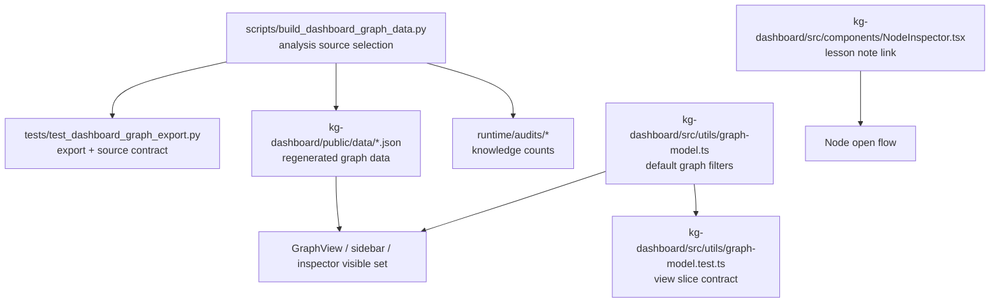

# kg-dashboard Graph Visibility Alignment Plan

기준:
- 현재 `kg-dashboard/` 구현 상태
- `scripts/build_dashboard_graph_data.py`
- `runtime/audits/hvdc_ttl_source_audit.json`
- `runtime/audits/hvdc_ttl_mapping_audit.json`
- 현재 세션에서 확인한 `kg-dashboard/src/utils/graph-model.ts` 필터 로직

이 문서는 "새 TTL/JSON 산출물은 갱신되었는데 대시보드에서 기존 그래프와 거의 같아 보이는 문제"만 다룬다.
기존 `kg-dashboard/plan.md`와 `kg-dashboard/plan-2026-04-12-ui-rule-alignment.md`는 유지한다.
실제 구현은 현재 워크스페이스에서 완료되었다. 아래 Phase 1/2는 원래 계획 기준을 유지하고, 맨 아래 `Execution Update (2026-04-12)`는 현재 구현 기준을 기록한다.

---

## Phase 1: Business Review

### 1.1 문제 정의

현재 상태 vs 목표 상태:
현재 대시보드는 새 exporter 결과를 읽고 있지만, 기본 화면이 `Hub`, `Site`, `Warehouse`, `LogisticsIssue`만 중심으로 남기도록 필터되어 있어 `IncidentLesson`과 `relatedToLesson` 연결이 거의 보이지 않는다. 목표 상태는 새 shipment-centric graph에서 추가된 lesson 계층과 위치 기반 연결이 기본 탐색 흐름에서 실제로 드러나고, 외부 분석 문서도 기본 데이터 추출 경로에 포함되어 guide/rule/lesson 계층이 기대치에 맞게 반영되는 상태다.

영향 범위:
- 현재 산출물에는 `IncidentLesson` 노드 5개와 `relatedToLesson` 엣지 5개가 존재한다.
- 현재 소스 감사 결과는 `loaded_shipments = 893`, `loaded_notes = 13`이다.
- 현재 매핑 감사 결과는 `guides = 0`, `rules = 0`, `lessons = 13`, `patterns = 0`이다.
- 외부 분석 문서 폴더 `C:\Users\jichu\Downloads\valut\wiki\analyses`에는 현재 `.md` 파일 115개가 있다.
- 현재 exporter 기본 경로는 `vault/wiki/analyses`라서, 승인된 외부 분석 폴더가 기본 경로에 반영되지 않는다.

### 1.2 제안 옵션

| 옵션 | 설명 | 공수(일) | 리스크 | 비용(AED) |
|------|------|---------|--------|----------|
| A | UI 필터만 조정한다. `IncidentLesson`과 lesson edge를 기본 view에 노출한다. | 0.5 | 화면은 달라지지만 guide/rule 소스 누락은 그대로 남는다 | 0 |
| B | UI 필터 조정과 exporter 소스 경로 정리를 같이 한다. 기본 분석 문서 경로는 외부 `C:\Users\jichu\Downloads\valut\wiki\analyses`를 먼저 읽고, 없을 때만 repo-local `vault/wiki/analyses`로 fallback한다. audit와 contract test도 같이 보강한다. | 1 | 기존 repo-local 분석 폴더만 기대하던 실행과 결과 차이가 날 수 있다 | 0 |
| C | lesson, guide, rule 전용 패널과 별도 탐색 모드를 추가한다. Graph view, sidebar, inspector를 모두 knowledge-first로 재설계한다. | 2.5 | 범위가 커져서 현재 "왜 안 보이느냐" 문제를 닫기 전에 UI churn이 커진다 | 0 |

### 1.3 추천 & 근거

추천 옵션:
옵션 B

추천 이유:
- 현재 문제는 화면 필터와 데이터 소스 경로가 같이 어긋나 있어, UI만 고치면 절반만 해결된다.
- 옵션 B는 "보이게 만들기"와 "실제로 더 많이 읽게 만들기"를 같이 닫는다.
- 옵션 C는 다음 단계 후보로는 좋지만, 이번 라운드의 핵심 문제를 해결하는 최소 범위를 넘는다.

롤백 전략:
새 기본 분석 경로와 view filter는 각각 분리 커밋으로 두고, 외부 경로 우선순위가 문제를 만들면 exporter 경로 변경만 되돌린다.

- [x] Phase 1 승인

---

## Phase 2: Engineering Review

### 2.1 Mermaid 다이어그램

### 2.2 파일 변경 목록

| 파일 | 변경 유형 | 설명 |
|------|----------|------|
| `scripts/build_dashboard_graph_data.py` | modify | 기본 분석 문서 경로를 외부 `C:\Users\jichu\Downloads\valut\wiki\analyses` 우선, 없을 때 repo-local `vault/wiki/analyses` fallback으로 고정하고, source audit에 실제 사용 경로를 기록한다 |
| `tests/test_dashboard_graph_export.py` | modify | 분석 경로 선택, lesson edge export, legacy id alignment, audit path/count contract, analysis note metadata export를 추가한다 |
| `runtime/audits/hvdc_ttl_source_audit.json` | regenerate | 새 기본 분석 경로 기준 source audit를 다시 생성한다 |
| `runtime/audits/hvdc_ttl_mapping_audit.json` | regenerate | knowledge count 변화가 반영되도록 다시 생성한다 |
| `kg-dashboard/public/data/nodes.json` | regenerate | exporter 재실행 결과를 반영한다 |
| `kg-dashboard/public/data/edges.json` | regenerate | exporter 재실행 결과를 반영한다 |
| `kg-dashboard/src/utils/graph-model.ts` | modify | 기본 summary/issues view에서는 `LogisticsIssue`와 연결된 infra anchor에 붙은 `IncidentLesson`만 남기고, `ego` view에서는 선택 노드에 직접 연결된 `IncidentLesson`만 남기도록 kept node/edge 규칙을 조정한다 |
| `kg-dashboard/src/utils/graph-model.test.ts` | modify | summary/issues/ego view가 issue-context lesson만 남기고 과밀해지지 않는 규칙을 테스트로 고정한다 |
| `kg-dashboard/src/components/NodeInspector.tsx` | modify | exporter가 넣은 analysis note metadata를 사용해 `IncidentLesson`과 `LogisticsIssue` 모두 올바른 Obsidian vault/file 경로를 열 수 있게 inspector 링크 규칙을 보강한다 |

`create` 파일은 계획하지 않는다. 이번 라운드는 기존 exporter, audit, graph slice, inspector만 수정한다.

### 2.3 의존성 & 순서

1. **Step 1 - exporter 경로 규칙 고정**
   - `scripts/build_dashboard_graph_data.py`에서 외부 analyses 우선, repo-local fallback 규칙을 고정한다.
   - 실제 사용 경로를 source audit에 남긴다.

2. **Step 2 - contract test 보강**
   - `tests/test_dashboard_graph_export.py`에 새 경로 선택, lesson export, audit 기록, analysis note metadata assertion을 추가한다.
   - exporter 변경 전에 실패하는지 확인한다.

3. **Step 3 - graph data 재생성**
   - exporter를 다시 실행해 `public/data/*.json`과 audit 파일을 갱신한다.

4. **Step 4 - dashboard slice 조정**
   - `kg-dashboard/src/utils/graph-model.ts`에서 default summary/issues 흐름은 `LogisticsIssue`와 연결된 infra anchor에 붙은 `IncidentLesson`만 남기도록 조정한다.
   - `ego` 흐름은 선택 노드에 직접 연결된 `IncidentLesson`만 남기도록 조정한다.
   - `kg-dashboard/src/utils/graph-model.test.ts`로 이 규칙을 고정한다.

5. **Step 5 - inspector 연결 보강**
   - `kg-dashboard/src/components/NodeInspector.tsx`에서 id slug 하드코딩 대신 exporter가 넣은 analysis note metadata를 사용하도록 링크 규칙을 바꾼다.

6. **Step 6 - package verification**
   - `pytest`의 exporter 계약 테스트
   - `npm test`
   - `npm run lint`
   - `npm run build`
   - 로컬 브라우저에서 graph 화면 확인

병렬 가능 구간:
- exporter 경로 규칙과 dashboard slice 초안은 병렬로 준비할 수 있다.
- 하지만 exporter contract test와 artifact 재생성은 경로 규칙이 먼저 고정되어야 한다.
- inspector 링크 보강은 graph slice 작업과 병렬로 준비할 수 있다.

공유 모듈:
- `scripts/build_dashboard_graph_data.py`
- `kg-dashboard/src/utils/graph-model.ts`

### 2.4 테스트 전략

- **단위 테스트**
  - `tests/test_dashboard_graph_export.py`
  - 목표: 기본 분석 경로 선택, lesson edge export, legacy id alignment, audit path/count 반영, analysis note metadata 반영

- **UI slice 테스트**
  - `kg-dashboard/src/utils/graph-model.test.ts`
  - 목표: summary/issues/ego view가 모든 lesson을 다 풀지 않으면서도 issue-context lesson과 선택 노드 직결 lesson은 숨기지 않는지 고정

- **통합 테스트**
  - `.venv\Scripts\python.exe -m pytest tests/test_dashboard_graph_export.py`
  - `npm test`
  - `npm run lint`
  - `npm run build`

- **수동 확인**
  - 로컬 dashboard 실행 후 default view에서 lesson 관련 변화가 실제로 보이는지 확인
  - issue 노드와 연결된 infra anchor 주변의 lesson만 보이는지 확인
  - issue node와 lesson node 클릭 시 exporter가 선택한 실제 analyses vault/file 경로가 inspector에서 열리는지 확인

- **깨질 수 있는 기존 경로**
  - 외부 analyses 폴더가 없는 환경에서 repo-local fallback이 정상 동작하는지
  - legacy dashboard id 매핑
  - `LogisticsIssue` 중심 요약 카드 수치

### 2.5 리스크 & 완화

- **호환성 리스크**
  - 외부 `valut/wiki/analyses`를 기본 우선순위로 두면 repo-local 데이터만 기대하던 실행이 달라질 수 있다.
  - 완화: 명시적 경로 override를 유지하고, source audit에 실제 사용 경로를 남긴다.

- **시각 혼잡 리스크**
  - lesson 계층을 기본 view에 바로 드러내면 graph가 더 복잡해 보일 수 있다.
  - 완화: 모든 lesson을 풀지 말고 issue-context infra anchor 또는 selected-node-neighbor 기준으로 제한한다.

- **검증 누락 리스크**
  - exporter만 바꾸고 UI filter를 그대로 두면 다시 "바뀐 게 안 보인다" 상태가 남는다.
  - 완화: Python exporter contract와 TypeScript graph slice test를 분리해서 검증한다.

---

## Execution Update (2026-04-12)

### 3.1 Completed scope

| Area | Planned state | Implemented state |
|------|---------------|-------------------|
| Analysis source selection | external analyses path should be preferred, repo-local only as fallback | `C:\Users\jichu\Downloads\valut\wiki\analyses` is selected first; fallback was not used |
| Source audit | record actual source choice and counts | audit emits source fields, including `loaded_notes = 115` and `analyses_dir_fallback_used = false` |
| Node export | expose lesson and issue metadata for downstream links | `analysisPath` and `analysisVault` are emitted on issue and lesson nodes |
| Lesson visibility | show issue-context lessons in summary/issues and direct lessons in ego | the graph slices now follow that split |
| Inspector links | resolve Obsidian links from exported metadata | NodeInspector now uses metadata-driven encoded Obsidian links |
| Export CLI behavior | regenerate JSON/audits deterministically | `__main__` defaults to JSON/audit regeneration without TTL emission; explicit TTL output remains available from the function |

### 3.2 Actual changed files

- `scripts/build_dashboard_graph_data.py`
- `tests/test_dashboard_graph_export.py`
- `kg-dashboard/src/utils/graph-model.ts`
- `kg-dashboard/src/utils/graph-model.test.ts`
- `kg-dashboard/src/components/NodeInspector.tsx`
- `runtime/audits/hvdc_ttl_source_audit.json`
- `runtime/audits/hvdc_ttl_mapping_audit.json`
- `kg-dashboard/public/data/nodes.json`
- `kg-dashboard/public/data/edges.json`

### 3.3 Verification results

- `.venv\Scripts\python.exe -m pytest tests/test_dashboard_graph_export.py -q` -> `5 passed`
- `.venv\Scripts\python.exe scripts/build_dashboard_graph_data.py` -> pass
- `cd kg-dashboard; npm test` -> `18 passed`
- `cd kg-dashboard; npm run lint` -> pass
- `cd kg-dashboard; npm run build` -> pass
- Browser preview at `http://127.0.0.1:4175/` returned HTTP 200. Issues view showed 216 visible nodes; Summary view showed 227 visible nodes.

### 3.4 Accepted implementation notes / deviations

- The workspace path spelling is `valut`, not `vault`; the plan now records the actual selected analysis root.
- The export CLI now skips TTL emission by default in `__main__` by passing `ttl_path=None`.
- The exporter still supports explicit TTL output when the function is called with a TTL path.
- The browser counts show Summary retains a slightly larger visible set than Issues, which is consistent with the slice split recorded above.
